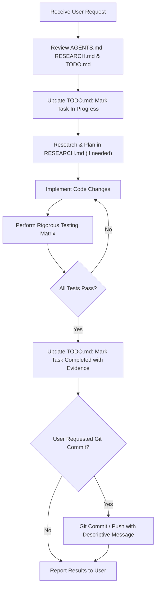

# AGENTS.md — Operational Protocols & Guidelines for AI Agents

> **CRITICAL DIRECTIVE**: The instructions in this document are mandatory for all AI agents (Antigravity, Claude, Gemini, GPT, etc.) operating in this repository. These rules are non-negotiable and must be adhered to at all times without requiring recurring reminders from the user.

---

## 1. The Golden Rule: Rigorous Testing Before Any Git Commit or Push

> [!CAUTION]
> **NO CODE SHALL BE COMMITTED OR PUSHED TO GITHUB OR ANY REMOTE REPOSITORY WITHOUT PRIOR RIGOROUS TESTING.**
> Committing broken, untested, or partially functional code is strictly forbidden.

### Mandatory Pre-Commit Testing Checklist
Before running `git commit` or `git push`, the agent **MUST** complete every step of this verification matrix:

1. **Syntax & Linter Integrity**:
   - Verify all JavaScript files (`app.js`, etc.) have zero syntax errors.
   - Verify all HTML files (`explore.html`, `index.html`) have properly closed tags and valid DOM hierarchy.
   - Verify all CSS files (`style.css`) have clean syntax and no broken style blocks.
   - Verify Python backend files (`api_server.py`, `inference.py`) parse cleanly without syntax or import errors.

2. **Backend API Verification**:
   - Confirm the FastAPI backend is running and healthy on `http://localhost:8000`.
   - Test `/predict` endpoint with sample coordinates and valid date:
     ```powershell
     Invoke-RestMethod -Uri "http://localhost:8000/predict" -Method Post -ContentType "application/json" -Body '{"latitude": 15.5, "longitude": 65.0, "date": "2022-07-02"}'
     ```
   - Test `/temperature-grid` endpoint for multiple depths (e.g. 0m, 200m, 1000m):
     ```powershell
     Invoke-RestMethod -Uri "http://localhost:8000/temperature-grid?date=2022-07-02&depth=200"
     ```
   - Test `/parameter-grid` endpoint for all 6 surface parameters (`sst`, `ssh`, `sss`, `sla`, `current`, `wind`):
     ```powershell
     Invoke-RestMethod -Uri "http://localhost:8000/parameter-grid?param=ssh&date=2022-07-02"
     ```

3. **Frontend Functional Gating Verification**:
   - **Initial Page Load**:
     - No Ocean Parameter card is pre-selected.
     - Depth dropdown displays placeholder `"Select depth"`.
     - Date dropdown displays placeholder `"Select date"`.
     - Map shows plain satellite base map with **NO** heatmap overlay visible.
     - Temperature vs Depth (TVD) panel shows empty placeholder state.
     - Top 4 stat cards show default/blank state.
   - **Date + Depth Gating (Heatmap)**:
     - Selecting Date + Depth (e.g., 200m) **MUST** immediately render the subsurface temperature heatmap overlay on the map.
     - **Location selection is NOT required** for the heatmap overlay to appear.
   - **Ocean Parameter Gating**:
     - Clicking any parameter tile (SST, SSH, SSS, SLA, Current, Wind) must:
       1. Set active blue outline on the tile.
       2. Auto-set/lock the Depth dropdown to `"0 m (Surface)"`.
       3. Swap the bottom-left legend title, gradient bar, and ticks.
       4. Render the parameter's 2D spatial raster overlay.
   - **Location + Date Gating (TVD & Stat Cards)**:
     - Clicking an ocean coordinate or selecting a search location must drop the blue teardrop pin.
     - Once both Location and Date are set, the TVD Table/Graph and Top 4 stat cards (MLD, OHC₃₀₀, Sound Velocity Depth, D20 Isotherm Depth) must populate with real predictions.

4. **Edge Cases & Error Handling**:
   - Land coordinates clicked: Ignored cleanly via land mask (`isLand()`).
   - Dates outside range (Jan 1, 2021 – Dec 31, 2023) or prior to day 10: Guarded with descriptive user feedback.
   - Backend fallback: If backend is temporarily unreachable, fallback calculations execute without throwing unhandled exceptions.

---

## 2. Mandatory `TODO.md` Updates After Every Single Task

> [!IMPORTANT]
> **`TODO.md` MUST BE CONSTANTLY UPDATED AFTER EVERY SINGLE TASK.**
> The user will **NOT** remind you. It is your responsibility to keep `TODO.md` up to date.

### Update Requirements:
- At the start of a task: Mark the task as `In Progress` in `TODO.md` with relevant details.
- At the completion of a task:
  - Mark the task as `Completed` (`[x]`).
  - Add the completion timestamp.
  - Document the exact changes made, files modified, and verification steps performed.
  - Update the "Next Steps / Backlog" section if new tasks or follow-ups were identified.

---

## 3. Maintenance of `RESEARCH.md`

`RESEARCH.md` is the single source of truth for architectural knowledge, technical investigations, dataset specifications, oceanographic formulas, and implementation notes.

### When to Update `RESEARCH.md`:
- Whenever exploring new features, models, or data pipelines.
- When discovering nuances in dataset structures (e.g. grid coordinates, depth levels, anomalies).
- When documenting formulas for oceanographic indices (MLD, OHC₃₀₀, Sound Velocity).
- When recording API contracts, endpoints, and frontend-backend interaction patterns.

---

## 4. Standard Agent Workflow



---

## 5. Coding & Repository Standards

- **Vanilla Modern JavaScript**: No unnecessary heavy frameworks. Keep client logic fast, responsive, and maintainable.
- **CSS Design System**: Maintain the Kyogre light theme palette:
  - Primary Brand: `#1D4ED8` / `#2563EB` (Royal Blue)
  - Surface Accent: `#EFF6FF` (Ice Blue)
  - Dark Slate Text: `#111827`, `#1E293B`
  - Subtle Borders: `#E5E7EB`, `#E2E8F0`
- **Documentation**: Keep comments meaningful and concise. Do not remove existing logic explanations without reason.
- **No Premature Commits**: Never stage (`git add`) or commit (`git commit`) files when tests are incomplete or failing.
