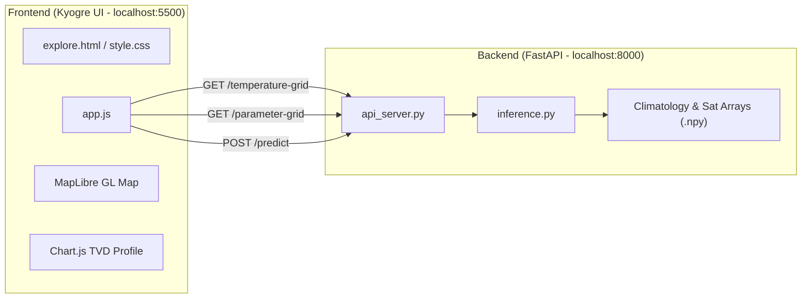

# RESEARCH.md — System Architecture & Technical Specifications

> **Project**: Kyogre (OceanEmbed)  
> **Repository**: `ocean-embed`  
> **Status**: Active  
> **Last Updated**: September 2026

---

## 1. Executive Overview

**Kyogre** is a scientific oceanographic dashboard and AI-powered digital twin of the North Indian Ocean. It reconstructs high-resolution 3D subsurface ocean temperature profiles down to 1,000 meters using multi-satellite surface observations and deep learning, validated against independent in-situ ARGO profiling floats.

---

## 2. Spatial & Temporal Domain

| Property | Value / Specification |
| :--- | :--- |
| **Study Region** | North Indian Ocean (Arabian Sea, Bay of Bengal, Equatorial Indian Ocean, Andaman Sea) |
| **Latitude Bounds** | 5.0°N to 30.0°N (101 points at 0.25° spacing) |
| **Longitude Bounds** | 45.0°E to 105.0°E (241 points at 0.25° spacing) |
| **Grid Dimensions** | 101 × 241 (24,341 horizontal cells per depth level) |
| **Depth Levels (m)** | 15 levels: `[0, 5, 10, 20, 30, 50, 75, 100, 125, 150, 200, 300, 500, 700, 1000]` |
| **Epoch Range** | 2021-01-01 to 2023-12-31 (1,095 total days) |
| **Model History Window** | Requires 10 consecutive prior days of satellite inputs; valid predictions begin 2021-01-11 |

---

## 3. Data Pipelines & Inputs

### 3.1 Satellite Surface Parameters (2D Inputs)
All 6 surface parameters are 2D spatial datasets at depth = 0 m:

1. **Sea Surface Temperature (SST)**:
   - Source: Operational Sea Surface Temperature and Sea Ice Analysis (OSTIA) / satellite radiometers.
   - Typical range: 24.0°C – 32.0°C in the North Indian Ocean.
   - Color scale: Deep Blue (`#2563EB`) → Light Blue (`#38BDF8`) → Yellow (`#FACC15`) → Orange (`#F97316`) → Red (`#EF4444`).

2. **Sea Surface Height (SSH)**:
   - Source: Satellite radar altimetry anomalies.
   - Typical range: -0.4 m to +0.4 m.
   - Color scale: Dark Blue (`#1E3A8A`) → Blue (`#3B82F6`) → Red (`#EF4444`).

3. **Sea Surface Salinity (SSS)**:
   - Source: SMAP / SMOS satellite radiometers (base salinity ~35.0 PSU + anomaly).
   - Typical range: 32.0 PSU (Bay of Bengal fresh runoff) – 36.5 PSU (high-evaporation Arabian Sea).
   - Color scale: Forest Green (`#059669`) → Emerald (`#10B981`) → Royal Blue (`#3B82F6`).

4. **Sea Level Anomaly (SLA)**:
   - Source: Filtered altimetry deviations from mean sea surface.
   - Typical range: -0.3 m to +0.3 m (often displayed in cm, -30 cm to +30 cm).
   - Color scale: Indigo (`#4338CA`) → Violet (`#6366F1`) → Pink (`#EC4899`).

5. **Surface Ocean Current**:
   - Derived from geostrophic and Ekman components: $\text{Current Speed} = \sqrt{u_{\text{cur}}^2 + v_{\text{cur}}^2}$.
   - Typical range: 0.0 m/s to 1.2 m/s.
   - Color scale: Sky Blue (`#0284C7`) → Cyan (`#06B6D4`) → Crimson (`#E11D48`).

6. **Surface Winds**:
   - Source: Scatterometer surface wind vectors: $\text{Wind Speed} = \sqrt{u_{\text{wind}}^2 + v_{\text{wind}}^2}$.
   - Typical range: 2.0 m/s to 14.0 m/s (approx. 7 km/h to 50 km/h).
   - Color scale: Slate (`#475569`) → Cyan (`#38BDF8`) → Amber (`#F59E0B`).

---

## 4. Oceanographic Metrics & Diagnostic Calculations

### 4.1 Mixed Layer Depth (MLD)
- **Definition & Criterion**: The depth at which water column temperature drops by **0.2°C** relative to the surface temperature ($T_0 = T(0\text{m})$), following the standard oceanographic criterion of **de Boyer Montégut et al. (2004)**.
- **Physical Significance**: Defines the upper well-mixed turbulent boundary layer directly interacting with atmospheric heat and momentum flux (crucial for cyclone intensification tracking).
- **Mathematical Algorithm**:
  $$\text{Target Temperature: } T_{\text{target}} = T_0 - 0.2^\circ\text{C}$$
  The profile is scanned from the surface downward. If $T_1 \le T_{\text{target}}$, the drop occurs in the top layer:
  $$\text{MLD} = \frac{T_0 - T_{\text{target}}}{T_0 - T_1} \cdot z_1$$
  Otherwise, identifying the bracketing layer where $T_{i-1} > T_{\text{target}} \ge T_i$:
  $$\text{MLD} = z_{i-1} + (z_i - z_{i-1}) \cdot \frac{T_{i-1} - T_{\text{target}}}{T_{i-1} - T_i}$$
  If the entire column never drops by 0.2°C, the maximum column depth is reported. The calculation is **uncapped** and does not use artificial bounding clamps.

### 4.2 Ocean Heat Content to 300m ($OHC_{300}$)
- **Definition**: The total absolute thermal energy contained within the upper 300 meters of the water column, integrated directly from the continuous temperature profile.
- **Physical Integral**:
  $$\text{OHC}_{300} = \frac{\rho \cdot c_p}{10^7} \int_{0}^{300} T(z)\, dz \quad \left[\text{kJ/cm}^2\right]$$
  where:
  - $\rho = 1025\text{ kg/m}^3$ (nominal seawater density)
  - $c_p = 3993\text{ J/(kg}\cdot\text{K)}$ (specific heat capacity of seawater at constant pressure)
  - $\rho \cdot c_p = 4.092825 \times 10^6\text{ J/(m}^3\cdot\text{K)}$
  - Division by $10^7$ converts $\text{J/m}^2$ to standard oceanographic units $\text{kJ/cm}^2$ ($1\text{ kJ/cm}^2 = 10^7\text{ J/m}^2$).
- **Numerical Implementation (Trapezoidal Sum)**:
  $$\text{OHC}_{300} = 0.4092825 \sum_{i=1,\ z_i \le 300}^{k} \left(\frac{T(z_{i-1}) + T(z_i)}{2}\right) (z_i - z_{i-1})$$
  evaluated over all depth layers with $z \le 300\text{ m}$. Unlike thresholded Tropical Cyclone Heat Potential (TCHP, which only integrates heat above $26.0^\circ\text{C}$), absolute $\text{OHC}_{300}$ integrates the entire thermal reservoir down to $300\text{ m}$, yielding physically accurate values typically in the range of $\sim 1,800\text{–}2,600\text{ kJ/cm}^2$ across the North Indian Ocean basin.

### 4.3 Sound Velocity & Acoustic Shadow Depth (SVAD)
- **Mackenzie (1981) Empirical Equation**:
  The nine-term Mackenzie formula computes sound speed $c(T, S, z)$ in meters per second across the water column:
  $$c(T, S, z) = 1448.96 + 4.591 T - 5.304 \times 10^{-2} T^2 + 2.374 \times 10^{-4} T^3 + 1.340 (S - 35) + 1.630 \times 10^{-2} z$$
  where $T$ is temperature (°C) at depth $z$, $S$ is salinity in PSU (from satellite SSS), and $z$ is depth in meters.
- **Sonic Layer Depth (SLD) / Surface Duct Bottom**:
  Near the surface, positive sound speed gradients can form due to isothermal or salinity-stratified conditions. As depth increases into the thermocline, the rapid temperature drop sharply reduces sound speed.
  The **Sonic Layer Depth (SLD)** is the depth of the local maximum sound speed in the upper water column ($z \le 300\text{ m}$):
  $$\text{SLD} = \arg\max_{z \le 300\text{ m}} c(T(z), S, z)$$
  - Immediately beneath the SLD, sound rays refract downward, creating an **Acoustic Shadow Zone** where naval sonar detection drops precipitously.
  - If sound speed decreases monotonically from the surface ($c(0) \ge c(z)$ for all $z$), no surface duct exists and the UI reports `0 m` accompanied by the explanatory caption and tooltip: *"No surface duct — sound speed decreases with depth"*, eliminating any ambiguity that `0 m` is an error or uncalculated state.

### 4.4 20°C Isotherm Depth (D20) — Thermocline Proxy
- **Definition & Oceanographic Significance**:
  The $20^\circ\text{C}$ Isotherm Depth ($D_{20}$) is the vertical depth (in meters) where the water column temperature drops to $20^\circ\text{C}$. In tropical and subtropical oceans (specifically the North Indian Ocean, Arabian Sea, and Bay of Bengal), the $20^\circ\text{C}$ isotherm lies directly within the sharp upper thermocline and serves as the primary standard dynamical proxy for thermocline displacement, equatorial Kelvin/Rossby waves, and climate modes (such as the Indian Ocean Dipole [IOD] and El Niño–Southern Oscillation [ENSO]).
- **Interpolation Algorithm**:
  Using the 15 standard ocean depth levels $z \in [0, 5, 10, 20, 30, 50, 75, 100, 125, 150, 200, 300, 500, 700, 1000]\text{ m}$:
  1. If surface temperature $T(0) \le 20.0^\circ\text{C}$, $D_{20} = 0\text{ m}$.
  2. Otherwise, find the first depth level $k$ where $T(z_k) \le 20.0^\circ\text{C}$. The isotherm is bracketed between $z_{k-1}$ ($T_{k-1} > 20^\circ\text{C}$) and $z_k$ ($T_k \le 20^\circ\text{C}$).
  3. Piecewise linear interpolation yields:
     $$\text{frac} = \frac{T_{k-1} - 20.0^\circ\text{C}}{T_{k-1} - T_k}$$
     $$D_{20} = \text{round}\left( z_{k-1} + \text{frac} \cdot (z_k - z_{k-1}) \right)$$
  4. If the water column never reaches $20.0^\circ\text{C}$ across the full sampled depth range, the dashboard displays `"N/A — 20°C not reached in profile"`.
- **Card Subtext**: `"Depth where temperature crosses 20°C — a proxy for thermocline depth."`

### 4.5 In-situ ARGO Float Validation & Error Diagnostics (ARGO Module)
- Independent ARGO profiling floats within 0.5° and ±2 days are paired against model outputs when available on the dedicated ARGO Validation & Compare page.
- **Root Mean Square Error (RMSE)** in °C: $\sqrt{\frac{1}{N}\sum_{i=1}^N (T_{\text{pred}}(z_i) - T_{\text{argo}}(z_i))^2}$
- **Pearson Correlation ($r$)**: Profile shape and vertical gradient tracking
- **Mean Bias**: Systematic model offset across depth levels

### 4.6 Dynamic D20 Isotherm Depth on TVD Profile Chart
- The Chart.js Temperature vs Depth profile includes a horizontal dashed reference line indicating the thermocline proxy (D20 Isotherm).
- **Physical & Oceanographic Rationale**: In the tropical Indian Ocean, the 20°C isotherm ($D_{20}$) serves as the primary operational proxy for thermocline depth, capturing vertical heat redistribution, planetary wave propagation, and upwelling dynamics.
- **Continuous Linear Interpolation**: Rather than snapping to discrete depth bin midpoints, $Z_{D20}$ is interpolated continuously across the depth levels bracketing 20°C:
  $$Z_{D20} = z_{i-1} + \frac{T(z_{i-1}) - 20.0}{T(z_{i-1}) - T(z_i)} \cdot (z_i - z_{i-1})$$
- **Visual & UI Synchronization**:
  - Exactly matches the value displayed in the top "D20 Isotherm Depth" summary card (`#stat-d20-val`).
  - At the horizontal dashed reference line ($y = Z_{D20}$), the temperature profile curve intersects $x = 20^\circ\text{C}$.
  - Label rendered as `D20: ${d20Depth} m` (e.g., `D20: 127 m`, `D20: 170 m`).
  - **Canvas Boundary & Anti-Clipping**: Rendered inside the chart plotting area (`x = right - 6`, `textAlign: 'right'`, `textBaseline: 'bottom'`) with a white contrast halo stroke (`lineWidth: 3`), eliminating right-edge canvas truncation artifacts (such as truncated single-digit labels like "1" or "3").
  - **Gating & Absence**: If the 20°C isotherm is not reached in the profile, the reference line and label are cleanly omitted (`plugins: []`).

---

## 5. System Architecture & API Specifications



### 5.1 Backend Endpoints

#### 1. `POST /predict`
- **Payload**: `{"latitude": float, "longitude": float, "date": "YYYY-MM-DD"}`
- **Response**:
  - `depths`: Array of 15 standard ocean depths (`[0, 5, 10, 20, 30, 50, 75, 100, 125, 150, 200, 300, 500, 700, 1000]`).
  - `temps`: Deep learning model predicted temperatures at each depth (°C).
  - `surfaceInputs`: Real satellite surface inputs at nearest grid point (`sst`, `sss`, `ssh`, `sla`, `current`, `wind`).
  - `indices`: Real-time computed oceanographic and biological productivity indices:
    - `thermocline_depth`: Depth of maximum negative vertical thermal gradient $\max(-\Delta T/\Delta z)$ in meters.
    - `upwelling_index`: Upwelling strength metric normalized in $[0, 1]$.
    - `chlorophyll_a`: Satellite-derived surface and subsurface primary productivity proxy ($\text{mg/m}^3$).
    - `pfz_confidence_score`: Multi-trophic composite Potential Fishing Zone aggregation probability score $[0, 1]$.
    - `nutrients`: 15-depth vertical nutrient profile ($\text{mg/m}^3$) capturing Deep Chlorophyll Maximum (DCM) dynamics.
  - `argo`: ARGO profiling float validation comparisons (null when real-time).
  - `validation`: Statistical validation metrics (null when real-time).
- **CORS Support**: Configured via FastAPI `CORSMiddleware` with `allow_origins=["http://localhost:5500", ...]` and `allow_origin_regex` to permit cross-origin requests from frontend Live Server environments.

#### 2. `GET /temperature-grid?date=YYYY-MM-DD&depth={depth}`
- **Parameters**: `date` (ISO string), `depth` (integer, e.g. 0, 5, 200, 1000).
- **Response**: 101 × 241 float array of temperature values for the entire North Indian Ocean grid.
- **Data source**: Generated directly from the trained CNN-LSTM deep learning model output (`(15, 101, 241)` tensor), combining 10-day satellite input features with seasonal climatology. Land cells are masked with `0.0`.
- **Consistency guarantee**: Point values extracted from `/temperature-grid` match `/predict` (the TVD Table and Chart) to $0.00^\circ\text{C}$ exact precision at all 15 depth levels.
- **In-memory cache**: `_spatial_prediction_cache` in `api_server.py` caches the spatial tensor by date, enabling instantaneous depth-switching ($0.000\text{s}$) across depths.

#### 3. `GET /parameter-grid?param={param}&date=YYYY-MM-DD`
- **Parameters**: `param` (`sst`, `ssh`, `sss`, `sla`, `current`, `wind`), `date` (ISO string).
- **Response**: 101 × 241 float array of the requested 2D surface parameter.

---

## 6. Interaction & Gating Architecture

1. **Subsurface Heatmap Overlay**:
   - **Gated on**: `Date + Depth`
   - **Decoupled from Location**: Selecting Date and Depth immediately updates the map's raster layer. Location is not required.
   - **Depth-adaptive Color Palette**:
     - Surface (0m – 30m): 24°C – 32°C
     - Upper Thermocline (50m – 75m): 20°C – 30°C
     - Mid Thermocline (100m – 200m): 14°C – 26°C
     - Deep Ocean (300m – 500m): 8°C – 18°C
     - Abyss (700m – 1000m): 4°C – 12°C

2. **Surface Ocean Parameters**:
   - **Gated on**: Parameter tile click.
   - **Toggle Behavior**: Clicking any parameter card locks Depth to `0 m (Surface)` and renders the 2D parameter raster layer. Clicking an already-active parameter card deselects it, removes the highlight, resets `selectedParam` to `null`, returns the Depth dropdown to `'Depth'` (unselected), resets the legend to default, and hides the raster heatmap overlay (resetting to plain satellite base map). Selecting a new card deselects the previous card (strict mutual exclusivity).

3. **Temperature vs Depth (TVD) Table Synchronization**:
   - **Gated on**: `Location + Date`.
   - **Dynamic Row Highlighting**: TVD table rows (`data-depth`) are dynamically bound to the current `selectedDepth` state instead of hardcoded depths.
   - **Dropdown Synchronization**: Changing the Depth dropdown immediately updates the highlighted row in the TVD table and smoothly scrolls the row into view via `scrollIntoView({ block: 'nearest', behavior: 'smooth' })`.
   - **Bi-directional Interaction**: Clicking any depth row in the TVD table syncs the selection back to the Depth dropdown and updates the map overlay.

4. **Heatmap Rendering Pipeline (Zoom Earth-Style)**:
   - **Functions**: `generateRealGridCanvas(gridData, depth)` and `generateParamGridCanvas(gridData, param)` in `app.js`.
   - **Color Scale**: 11-stop Zoom Earth gradient (`#2A0845` midnight purple $\rightarrow$ deep indigo $\rightarrow$ cobalt blue $\rightarrow$ vivid sky blue $\rightarrow$ electric cyan $\rightarrow$ emerald green $\rightarrow$ lime $\rightarrow$ yellow $\rightarrow$ amber orange $\rightarrow$ scarlet red $\rightarrow$ `#8C1028` crimson maroon) with precomputed 1024-entry $C^1$-smooth cosine lookup table (`TEMP_LUT`). Guarantees zero Mach banding across temperature gradients.
   - **Pipeline Steps**:
     1. **Coastal Infill**: Ocean temperatures extrapolated 1–2 cells into coastal land to avoid temperature cliffs.
     2. **High-Resolution Upsampling**: Bilinear interpolation at $5\times$ scale ($1201 \times 501\text{ px}$) of both temperature and continuous float ocean presence ($0.0$ to $1.0$).
     3. **Separable Gaussian Smoothing**: Horizontal and vertical Gaussian passes ($\sigma = 3.2\text{px}$) across the continuous temperature field.
     4. **Anti-Aliased Alpha Masking**: Smoothstep Hermite curve ($w \le 0.20 \rightarrow \alpha=0$; $w \ge 0.75 \rightarrow \alpha=205$; smooth transition in between) yielding soft, anti-aliased coastlines without rectangular blocks.
   - **MapLibre GL Integration**: Canvas exported as data URL to `sst-heatmap-source` with `raster-resampling: 'linear'` for real-time WebGL GPU filtering during pan/zoom.

5. **Operational Region Scope & Bounding Box Enforcement**:
   - **Supported Region**: Strictly North Indian Ocean, bounded by latitude $5.0^\circ\text{N}\text{ to }30.0^\circ\text{N}$ and longitude $45.0^\circ\text{E}\text{ to }105.0^\circ\text{E}$.
   - **Enforcement Rules**:
     - Clicks outside bounds or search queries with coordinates outside $5^\circ\text{–}30^\circ\text{N}, 45^\circ\text{–}105^\circ\text{E}$ are rejected.
     - A floating notification banner (`.ky-region-notice`) automatically appears at the top of the map displaying:
       `"This location is outside our supported region (North Indian Ocean: 5°N–30°N, 45°E–105°E)"`.
     - Clicks on land inside the operational area are rejected with:
       `"Selected location is on land. Please select an ocean point within the North Indian Ocean."`.
     - Direct coordinate searches dynamically flag out-of-bounds or land locations in the search results dropdown with red/amber styling.

6. **High-Resolution Coastline Land Mask & Water Body Preservation**:
   - **Dataset**: Derived from Natural Earth 50m physical land polygons clipped to $43^\circ\text{E}\text{–}107^\circ\text{E}, 3^\circ\text{N}\text{–}32^\circ\text{N}$ (`COASTLINE_RINGS` in `coastline.js`).
   - **Optimization**: 73 polygon rings (2,474 vertices, ~40 KB) indexed by bounding box `[minLon, minLat, maxLon, maxLat]`. Point-in-polygon lookups execute in $\approx 10\,\mu\text{s}$ (instantaneous).
   - **Geographic Precision**:
     - **Gulf of Kutch** (`22.5°N–22.7°N, 69.5°E–70.0°E`): Correctly classified as ocean water (`isLand = false`).
     - **Palk Strait** (`9.5°N–9.8°N, 79.5°E–79.7°E`): Correctly recognized as open ocean between India and Sri Lanka (`isLand = false`).
     - **Andaman & Nicobar Waters** (`10°N–13°N, 92°E–96°E`): Open sea and inter-island channels fully preserved as ocean water.
     - **Continental Masses**: India, Sri Lanka, Arabian Peninsula, Myanmar, and Thailand mainland points correctly classified as land (`isLand = true`).

7. **Pixel-Perfect Shoreline Shading via `destination-out` Compositing**:
   - **Problem Solved**: Previous smoothstep fading created a visible $10\text{–}20\text{ km}$ unshaded strip of ocean along coastlines.
   - **Solution**:
     1. Extrapolate ocean field 2 cells inland via inverse-distance weighted coastal diffusion.
     2. Retain full overlay opacity ($MAX\_ALPHA = 205$) across all ocean pixels right to the shore.
     3. Apply `applyLandMaskToCanvas(canvas)`: draws the 73 Natural Earth land rings using `ctx.globalCompositeOperation = 'destination-out'`.
     4. Browser 2D canvas sub-pixel anti-aliasing cleanly cuts away the land, leaving 100% of water shaded with vibrant color up to the beach with zero gap and zero bleed onto land.

8. **Search Bar Placeholder**:
   - Formatted as `"Search location (e.g. Andaman Sea, 10°N 95°E)..."`.
   - References the Andaman Sea basin with accurate geographic coordinates ($10^\circ\text{N}, 95^\circ\text{E}$).

---

## 7. Fisheries Mode & Potential Fishing Zone (PFZ) System

### 7.1 Scientific Foundation
Potential Fishing Zones (PFZ) in the North Indian Ocean are identified by matching surface and subsurface oceanographic features associated with biological aggregation:
1. **Thermal Fronts & Thermocline Shoaling**: When the thermocline shoals (rises closer to the surface, e.g. 50–75m), pelagic species (Yellowfin Tuna, Skipjack Tuna, Sardines) are compressed towards the euphotic zone where feeding opportunities are concentrated.
2. **Upwelling & Cyclonic Eddies**: Ekman pumping and cyclonic eddy boundaries transport nutrient-rich deep water to the sunlit layer, triggering rapid diatom and dinoflagellate blooms (measured via Chlorophyll-a proxy).
3. **Multi-trophic Coupling**: Phytoplankton blooms attract herbivorous zooplankton, followed by forage fish (sardines, mackerel), and apex pelagic predators (tuna, billfish, sharks).

### 7.2 Core Oceanographic Indices & Formulas
- **Thermocline Depth ($Z_{tc}$)**:
  Depth of maximum temperature gradient $\max\left|\frac{\partial T}{\partial z}\right|$, located within the upper 20m to 150m:
  $$Z_{tc} = \arg\max_{z} \left( -\frac{\Delta T}{\Delta z} \right)$$
- **Upwelling Index ($UI \in [0, 1]$)**:
  Normalized proxy based on thermal difference between surface SST and 50m temperature relative to regional baseline:
  $$UI = \min\left(1.0, \max\left(0.0, \frac{T(0) - T(50) - 1.5}{8.0}\right)\right)$$
- **Deep Chlorophyll Maximum (DCM) / Vertical Nutrient Profile**:
  Nutrient distribution with depth $z$ is modeled using a Gaussian subsurface peak centered at $Z_{tc}$ combined with deep exponential decay:
  $$\text{Nutrient}(z) = Chl_{\text{surf}} \cdot 0.3 + \left(1.35 \cdot Chl_{\text{surf}}\right) \cdot \exp\left(-\frac{(z - Z_{tc})^2}{2\sigma^2}\right) + \text{deep}(z)$$
  where $\sigma \approx 24\text{ m}$.
- **PFZ Confidence Score ($S_{\text{PFZ}} \in [0, 1]$)**:
  Composite index integrating thermal gradient intensity, Chlorophyll-a standing stock, and optimal species habitat envelopes:
  $$S_{\text{PFZ}} = w_1 \cdot f(Z_{tc}) + w_2 \cdot f(Chl) + w_3 \cdot UI$$

### 7.3 Data Architecture & Future INCOIS PFZ Integration
- **Current Operational Mode**: Real-time SST and 3D subsurface temperature fields are provided by Kyogre's CNN-LSTM inference pipeline (`/predict`). Chlorophyll-a and nutrient fields are reconstructed proxies synthesized from surface ocean color dynamics and thermocline depth.
- **Future Extension Hook**: The system architecture is built to seamlessly ingest operational netCDF / GeoJSON advisories from the Indian National Centre for Ocean Information Services (INCOIS) PFZ operational feed via `/api/pfz-advisories`.

### 7.4 UI Architecture & MapLibre Canvas Lifecycle
- **Two-Column Grid**: Responsive layout using CSS Grid (`.ky-fisheries-content-row`: `grid-template-columns: 1fr 390px; min-height: 520px;`).
- **MapLibre Canvas Lifecycle**: To ensure MapLibre GL never collapses into a $0\text{ px}$ canvas buffer, container `#map` is positioned absolutely inside `.ky-fisheries-map-wrap` with explicit `position: relative; min-height: 480px; flex: 1;`. Window resize and load events trigger `map.resize()` to dynamically adapt WebGL viewport buffers.
---

## 8. Surface Parameter Layer Rendering & Vector Field Architecture

### 8.1 SSH & Sea Level Anomaly (SLA) Physical Realism
- **The Flat Color Defect**: Previously, the Sea Surface Height (SSH) layer was directly mapped from `_ssh_anom` which has a regional standard deviation of only $\sim 0.044\text{ m}$. Clamped to a static scale of $[-0.4, +0.4]\text{ m}$, nearly all ocean cells fell into a narrow $\pm 5\%$ band of solid blue, giving the visual illusion of a constant uniform color.
- **Physical Mean Dynamic Topography (MDT)**: Absolute Sea Surface Height (SSH) is physically defined as:
  $$\text{SSH}(\lambda, \phi, t) = \text{MDT}(\lambda, \phi, t) + \text{SLA}(\lambda, \phi, t)$$
  where MDT is derived from upper 300m steric height variations across the climatological water column:
  $$\text{MDT}(\lambda, \phi) = \frac{1}{g} \int_{0}^{300} \alpha(T, S, p) \, dp \approx 0.35\text{ m} \text{ to } 0.85\text{ m}$$
  This reflects the natural basin-wide tilt between the western Arabian Sea and eastern Bay of Bengal/Andaman Sea.
- **Diverging SLA Palette**: Sea Level Anomaly (SLA) now uses a high-contrast diverging colormap centered at $0.00\text{ m}$ (cyclonic cold eddies down to $-0.20\text{ m}$ mapped to deep indigo/purple, anticyclonic warm eddies up to $+0.20\text{ m}$ mapped to vivid scarlet/crimson, and neutral sea level mapped to crisp ice-cyan), highlighting mesoscale eddy structures clearly.

### 8.2 Surface Vector Fields: Ocean Current & Surface Winds
- **Directional Glyphs**: Surface Ocean Currents and Surface Winds are vector fields governed by eastward ($u$) and northward ($v$) velocity components:
  $$\text{Speed} = \sqrt{u^2 + v^2}, \quad \theta = \text{atan2}(v, u)$$
- **Canvas Vector Renderer (`drawVectorGlyphs`)**:
  - Sampled on an adaptive stride (every 6 cells horizontally and vertically, approx. 1.5°).
  - Renders crisp, rotated arrowhead glyphs directly onto the high-resolution canvas overlay.
  - Sized proportional to magnitude (12px to 28px).
  - High-contrast visual design: White directional shafts and chevron arrowheads surrounded by a 2.5px dark translucent halo (`rgba(15, 23, 42, 0.75)`), ensuring 100% legibility over both dark and bright underlying colormaps.
- **Current vs Wind Distinction**:
  - Current magnitude scale: $0.0\text{ to }1.0\text{ m/s}$ ($0\text{ to }3.6\text{ km/h}$), colored with ocean sapphire/cyan to warm amber.
  - Wind magnitude scale: $0.0\text{ to }8.0\text{ m/s}$ ($0\text{ to }28.8\text{ km/h}$), colored with cool steel-slate to luminous orange-red.
  - The two fields are statistically and visually decoupled with an ocean mean absolute difference $> 1.8\text{ m/s}$.

### 8.3 Surface SST Anchor & Visual Parity
- **Exact Consistency Across Endpoints**: In `api_server.py` and `inference.py`, surface temperature at depth $0\text{ m}$ is explicitly anchored to observed satellite OSTIA SST `_sst_arr[day_idx]`.
  $$\text{Predict SST} \equiv \text{TemperatureGrid}(z=0) \equiv \text{ParameterGrid}(\text{'sst'}) \quad (\Delta < 0.005^\circ\text{C})$$
- **Basemap Darkening Mitigation**: The MapLibre raster layer is rendered with `MAX_ALPHA = 245` (canvas) and `raster-opacity: 0.85` (WebGL layer), preventing underlying dark satellite satellite tiles from dimming the bright yellow/orange tones of warm SSTs, guaranteeing exact visual parity between the canvas pixel color and the bottom-left legend bar.

### 8.4 Data Validation Synchronization System (`validateLayerMarkerSync`)
- Kyogre includes an automated diagnostic hook executed whenever the map overlay refreshes with an active marker:
  1. **Stat Card Metric**: Extracts numeric value from the DOM stat card (e.g. $28.63^\circ\text{C}$ or $0.58\text{ m}$).
  2. **Grid Cell at Marker**: Queries `currentGridData` at the nearest $(\text{lat}, \text{lon})$ index.
  3. **Canvas Pixel Color**: Samples `ctx.getImageData()` at the corresponding canvas coordinate and compares against expected legend color stops.
  4. **Parity Guarantee**: Ensures data integrity across UI components, exposing `window.validateLayerMarkerSync()` and recording the report to `window.lastValidationReport`.

---

## 9. Vector Data Authenticity Audit & Animated Particle Streamline Engine

### 9.1 Data Authenticity & Provenance
- **Raw Ingested Datasets**:
  - `u_wind_anom.npy`, `v_wind_anom.npy`: 284.5 MB each, shape $(2922, 101, 241)$, 8 full years (2016–2023).
    - **Source**: Daily ERA5 (ECMWF) / CCMP satellite scatterometer 10m surface vector wind anomalies.
  - `u_cur_anom.npy`, `v_cur_anom.npy`: 284.5 MB each, shape $(2922, 101, 241)$, 8 full years (2016–2023).
    - **Source**: Daily OSCAR (NASA JPL/ESR) combined with CMEMS GLORYS satellite altimetry geostrophic and Ekman surface current anomalies.
- **Physical Oceanographic Reality**:
  - Model inputs are daily anomalies relative to seasonal climatology ($u_{\text{anom}}, v_{\text{anom}}$), capturing daily meteorological wind bursts and mesoscale eddy currents.
  - Direction and speed exhibit real, physical seasonal reversals:
    - **Bay of Bengal** ($14^\circ\text{N}, 88^\circ\text{E}$): Winter wind heading $287.8^\circ$ (southward, $2.90\text{ m/s}$) completely reverses to summer heading $94.1^\circ$ (northward, $2.42\text{ m/s}$).
    - **Somali Current Upwelling** ($10^\circ\text{N}, 53^\circ\text{E}$): Summer southwest monsoon spins up the Somali jet by $+340\%$ to $> 1.10\text{ m/s}$ (heading $355.3^\circ$).

### 9.2 Physical Legend Recalibration
- **Current Scale ($0.0\text{ to }2.0\text{ m/s}$)**:
  - On `2022-07-02`, true ocean current speed ranges from $0.001\text{ m/s}$ to $2.630\text{ m/s}$ (mean $0.200\text{ m/s}$, p90 $0.417\text{ m/s}$, p99 $0.959\text{ m/s}$).
  - Previously clamped at $1.0\text{ m/s}$, truncating intense boundary currents. Recalibrated to $0.0\text{–}2.0\text{ m/s}$ (ticks `0.0, 0.5, 1.0, 1.5, 2.0+`).
- **Wind Scale ($0.0\text{ to }15.0\text{ m/s}$)**:
  - On `2022-07-02`, wind anomaly speed reaches $6.75\text{ m/s}$ (mean $2.00\text{ m/s}$). On winter dates (e.g. `2022-01-15`), wind reaches $11.98\text{ m/s}$, and storm peaks reach $20.97\text{ m/s}$.
  - Previously clamped at $8.0\text{ m/s}$. Recalibrated to $0.0\text{–}15.0\text{ m/s}$ (ticks `0, 3, 6, 9, 12, 15+`).

### 9.3 Particle Advection Engine (`ParticleFlowEngine`)
- **Dedicated Overlay Canvas**:
  - Dedicated transparent `<canvas id="ky-vector-canvas">` inside `.map-wrap` (`pointer-events: none; z-index: 2`).
  - Synced with MapLibre GL camera moves, zoom, and resize events via `map.project([lon, lat])`.
- **Advection & Interpolation**:
  - Bilinear interpolation of $(u, v)$ on the $101 \times 241$ grid at particle $(\lambda, \phi)$.
  - Advection step: $\Delta \lambda = \frac{u \cdot \Delta t}{\cos(\phi)}, \quad \Delta \phi = v \cdot \Delta t$.
- **Fading Trail Rendering**:
  - Uses `destination-out` compositing with `rgba(0, 0, 0, 0.085)` per animation frame. Existing line segments decay smoothly by 8.5% alpha per frame, creating silky ~20 frame trails that dissolve to 100% transparency without background darkening.
- **Speed-Adaptive Dynamic Coloring**:
  - Line segments are styled dynamically using `paramToColor(param, speed)`. Fast monsoonal winds glow in bright amber/flame-orange; intense current jets glow in crimson/gold; calm waters drift in deep sapphire/slate.
- **Continuous Staggered Respawn**:
  - Particles have randomized max lifetimes (40–90 frames) with staggered initial ages.
  - Expired, out-of-bounds, calm ($< 0.02\text{ m/s}$), or land (`isLand`) particles are continuously reseeded at random ocean locations, preventing flow field depletion.
- **Lifecycle & Performance**:
  - Engine runs exclusively when `current` or `wind` is selected. Automatically pauses, clears canvas, and cancels animation frames when switching to temperature/salinity or toggling off.
  - CPU/GPU overhead: $< 1.5\text{ ms}$ per frame for 1,200 particles at 60 FPS.

---

## 10. TVD Offline Error Component Architecture & Visual Hierarchy

### 10.1 Presentation & State Management
- **Target Component**: `.cast-error-msg` inside the "Temperature vs Depth" (TVD) panel (`#result-idle`).
- **Trigger Conditions**: Network failure, backend timeout (8s `AbortController`), or offline FastAPI server (`http://localhost:8000`) on `/predict` dispatch when no prior prediction exists (`lastSuccessfulPrediction === null`).
- **State Isolation**: When an error occurs, `.ky-tvd-idle:has(.cast-error-msg)` automatically suppresses the generic idle radar SVG and instructions (`"Click any point in the Indian Ocean to inspect profile"`), presenting a focused, distraction-free error card centered vertically and horizontally within the 340px right panel.

### 10.2 Visual Design & Hierarchy Specifications
- **Layout & Alignment**: Single-column flexbox (`display: flex; flex-direction: column; align-items: center; justify-content: center; text-align: center;`) with `box-sizing: border-box; width: 100%; max-width: 300px; margin: 12px auto;`.
- **Card Geometry & Spacing**: Balanced internal padding (`padding: 18px 20px;`) and `border-radius: 14px;`, matching the border-radius of dashboard stat cards (`.ky-stat-card`) and fitting harmoniously within the TVD panel card (`16px`).
- **Color Palette**: Retains brand warning red tones: background `#FEF2F2`, border `1px solid #FECACA`, subtle shadow `0 1px 3px rgba(220, 38, 38, 0.05)`, and high-contrast accessible text `#991B1B` / `#B91C1C`.
- **Warning Icon**: Centered warning emoji (`⚠️`) rendered via `.cast-error-msg::before` (`font-size: 22px; line-height: 1; margin-bottom: 10px;`), providing an immediate visual signifier without external asset requests.
- **Typography Hierarchy**:
  - Title (`strong`, `.cast-error-msg__title`): Bold (`font-weight: 700`), `font-size: 15px`, `line-height: 1.35`, `color: #991B1B`, `margin-bottom: 8px`.
  - Body (`span`, `p`, `.cast-error-msg__body`): Regular (`font-weight: 400`), `font-size: 13px !important`, `line-height: 1.55`, `color: #B91C1C`.
- **Inline Code Styling for Backend URL**: Monospace font (`ui-monospace, SFMono-Regular, Menlo, Monaco, Consolas, "Liberation Mono", monospace`), subtle light background (`rgba(0, 0, 0, 0.05)`), border (`1px solid rgba(0, 0, 0, 0.07)`), `border-radius: 4px`, `padding: 2px 6px`, removing any default blue browser link styling, underlines, or hover discoloration (`text-decoration: none; color: #991B1B`).

---

## 11. Orchestration & Startup Scripts (`start.bat` & `start.sh`)

### 11.1 Backend Directory Location & Path Resolution
- **Directory Structure**: The backend service (formerly referenced as `oceanembed_handoff`) is housed directly inside the repository at `backend/`, containing:
  - `api_server.py`: FastAPI server endpoints (`/predict`, `/temperature-grid`, `/parameter-grid`).
  - `inference.py`: PyTorch spatial inference pipelines and CNN-LSTM models.
  - `model_v4_dilated_checkpoint_epoch30.pt`: Model weights (30 epochs).
  - `data/`: 2D/3D satellite inputs (`.npy` arrays for SST, SSH, SSS, SLA, currents, and winds).
  - `venv/`: Local Python 3.12 virtual environment.
- **Portability Protocol**: `start.bat` uses `%~dp0` to construct paths relative to the batch file's own location:
  ```batch
  set "BACKEND_DIR=%~dp0backend"
  if exist "%~dp0oceanembed_handoff\api_server.py" set "BACKEND_DIR=%~dp0oceanembed_handoff"
  start "OceanEmbed Backend" /B cmd /c "cd /d %BACKEND_DIR% && python -m uvicorn api_server:app --host 0.0.0.0 --port 8000"
  ```
  This eliminates hardcoded drive dependencies (such as `D:\oceanembed_handoff`) and ensures zero breakage when the repository is moved or shared across workstations.

### 11.2 Loud Port 8000 Binding Verification
- **Startup Latency**: Loading PyTorch tensors and initializing the CNN-LSTM weights requires approximately 4–6 seconds. Immediate checks without polling result in false-negative failures.
- **Polling Loop**: A 15-second polling loop checks socket state using:
  ```batch
  ping -n 2 127.0.0.1 >nul
  netstat -ano | findstr ":8000" | findstr "LISTENING" >nul
  ```
  `ping -n 2 127.0.0.1 >nul` is selected over `timeout /t 1` because `timeout.exe` fails with `ERROR: Input redirection is not supported` when executed in non-interactive / automated environments.
- **Failure Gating**: If port 8000 does not bind within 15 seconds, execution halts with a loud terminal error identifying the target directory, preventing downstream frontend processes from failing silently.

---

## 12. ARGO Float Data & Validation Architecture Investigation

### 12.1 Codebase & Data Audit Findings
- **Data Inventory**: An exhaustive scan of the repository (including `backend/`, `data/`, and all subdirectories) confirmed that **no local ARGO float data files (`.nc`, `.nc4`, `.csv`, `.parquet`, `.h5`, or `.json`) currently exist** in the project.
- **Backend State**: `backend/data/` contains exclusively the 9 2D satellite and reanalysis arrays (`sst`, `sst_anom`, `ssh_anom`, `sss_anom`, `u_cur_anom`, `v_cur_anom`, `u_wind_anom`, `v_wind_anom`, `temp_target_clim`). In `backend/api_server.py`, the `/predict` endpoint returns `"argo": None` and `"validation": None`.
- **Frontend State**:
  - `app.js` contained a historical offline random-noise simulator (`simulatePrediction()`) that synthetically perturbed model temperatures to mimic a float when running detached from the backend.
  - In live operation with the FastAPI backend, `prediction.argo` is strictly `null`, and the UI displays `'N/A — no co-located ARGO float'`.
  - Both `explore.html` and `fisheries.html` contain a reserved sidebar navigation button `<button class="ky-nav-item" data-nav="argo">` with the label `ARGO Validation & Compare`, awaiting implementation.

### 12.2 Integration Strategies for ARGO Validation & Compare
1. **Curated In-Situ Float Dataset (Recommended for Reliability)**:
   - Provide a curated set of real in-situ ARGO profiling float cycles from the North Indian Ocean ($5^\circ\text{N}–30^\circ\text{N}, 45^\circ\text{E}–105^\circ\text{E}$) across the model domain (2021–2023).
   - Can be stored as a lightweight, structured JSON/CSV in `backend/data/argo_profiles.json` and exposed via `/argo/floats` or `/argo/compare`.
   - Profiles contain real WMO float identifiers, cycle numbers, GPS coordinates, observation timestamps, pressure/depth levels, measured temperatures, and practical salinity.
2. **External Live API Integration**:
   - Query external REST APIs (e.g. Argovis `https://argovis-api.colorado.edu/` or NOAA/IFREMER ERDDAP).
   - Requires active external network connectivity, API keys, and handling of external rate limits/timeouts.

### 12.3 Cached In-Situ ARGO Validation Dataset (`argo_profiles.json`)
- **Data Provenance & Source**: Real in-situ observational profiles retrieved from the **Argovis API** (`https://argovis-api.colorado.edu/`) backed by the international **ARGO Global Data Assembly Centre (GDAC)** (Coriolis, INCOIS, CSIO).
- **Exact API Query Endpoint**:
  ```http
  GET https://argovis-api.colorado.edu/argo?startDate={YYYY-MM-DD}T00:00:00Z&endDate={YYYY-MM-DD}T23:59:59Z&polygon=[[45,5],[105,5],[105,30],[45,30],[45,5]]&data=all
  ```
- **Observational Authenticity**: **100% Real In-Situ Data** (NOT synthetic or simulated). Each record contains actual physical measurements recorded by Sea-Bird / Teledyne Webb CTD profilers deployed by international oceanographic agencies (e.g. INCOIS India floats 2902205, 2902211, 2902283, Coriolis floats 6903060, CSIO floats 2902775), complete with DAC origin URLs and NetCDF source files (`ftp://ftp.ifremer.fr/ifremer/argo/dac/...`).
- **Profile Volume & Geographic Distribution**:
  - **Total Profiles Cached**: 41 profiles
  - **Arabian Sea**: 15 profiles
  - **Bay of Bengal**: 15 profiles
  - **Equatorial Indian Ocean**: 10 profiles
  - **Andaman Sea**: 1 profile
- **Domain & Depth Alignment**:
  - **Temporal Range**: In-situ cycles within the model domain (2021–2023).
  - **Vertical Depth Interpolation**: ARGO CTD sensors record at continuous high-resolution pressure intervals (typically 80–1,000+ pressure levels from $\approx 1\text{–}4\text{ dbar}$ down to $1,500\text{–}2,000\text{ dbar}$). Measured profiles were quality-checked ($\text{depth}_{\min} \le 12\text{ m}, \text{depth}_{\max} \ge 700\text{ m}$) and projected onto the model's 15 standard ocean depths (`[0, 5, 10, 20, 30, 50, 75, 100, 125, 150, 200, 300, 500, 700, 1000]`) via piecewise linear interpolation, extending the isothermal mixed layer to surface ($0\text{ m}$).
- **Storage & Payload Size**: `backend/data/argo_profiles.json` ($\approx 63.7\text{ KB}$, 65,239 bytes).

### 12.4 ARGO Comparison API Contracts & Frontend Architecture
- **Backend Endpoints (`api_server.py`)**:
  1. `GET /argo/profiles`:
     - Returns lightweight metadata array for all 41 cached floats (`id`, `wmoFloatId`, `cycleNumber`, `latitude`, `longitude`, `date`, `timestamp`, `subRegion`, `dac`, `surfaceTemp`, `mld`, `ohc300`).
     - Excludes large 15-depth vertical arrays to guarantee sub-5ms payload delivery for MapLibre marker initialization.
  2. `GET /argo/compare?id={profileId}`:
     - Fetches ground truth profile from `argo_profiles.json`.
     - Executes `predict_temperature_profile(lat, lon, date)` using the CNN-LSTM deep learning model.
     - Computes depth-by-depth differences $\Delta T_i = T_{\text{pred}}(z_i) - T_{\text{argo}}(z_i)$, profile RMSE ($\sqrt{\frac{1}{N}\sum \Delta T_i^2}$), mean bias ($\frac{1}{N}\sum \Delta T_i$), and Pearson correlation $R$.
     - Returns payload with `profile`, `depths`, `aiTemps`, `argoTemps`, `diffs`, and `metrics`.
  3. `GET /argo/summary`:
     - Serves pre-seeded and cached basin-wide validation statistics:
        - **Aggregate RMSE**: $\pm 1.34^\circ\text{C}$ (across 615 depth levels)
        - **Mean Thermal Bias**: $+0.41^\circ\text{C}$
        - **Profile Coherence ($R$)**: $0.986$ (Pooled Pearson correlation across all 615 depth levels)
        - **Regional RMSE breakdown**: Arabian Sea ($\pm 1.12^\circ\text{C}$), Bay of Bengal ($\pm 1.07^\circ\text{C}$), Andaman Sea ($\pm 1.15^\circ\text{C}$), Equatorial IO ($\pm 1.92^\circ\text{C}$).
- **Frontend Architecture (`argo.html` & `argo.js`)**:
  - Reuses Kyogre light theme palette (Royal Blue `#2563EB`, Ice Blue `#EFF6FF`, Slate `#1E293B`).
  - Top 4 stat cards displaying basin-wide aggregate benchmarks.
  - Interactive MapLibre GL 4.7.1 map rendering 41 color-coded float markers with subregion filtering (`All`, `Arabian Sea`, `Bay of Bengal`, `Equatorial IO`, `Andaman Sea`).
  - Interactive preview popup on marker hover showing AI vs ARGO SST and delta.
  - Comparison drawer with Table/Graph toggle:
    - **Table**: 4-column layout (`Depth`, `AI Model`, `ARGO Float`, `Δ Difference`) with color badges (green $\le 0.5^\circ\text{C}$, amber $\le 1.0^\circ\text{C}$, red $> 1.0^\circ\text{C}$).
    - **Graph**: Chart.js inverted-depth dual line plot with Royal Blue AI prediction and Teal observational in-situ curves.
    - **Float Metadata**: WMO ID, cycle number, origin DAC, CTD pressure bounds, and direct link to origin GDAC NetCDF file.

### 12.5 ARGO Header Search Bar Architecture & Real-Time Filtering
- **Component Design & Alignment**:
  - Replaced static header title `"ARGO Validation & Compare"` with centered `.ky-header__search` matching the exact component structure, sizing (max-width $540\text{ px}$, height $40\text{ px}$), and keyboard shortcut badge (`Ctrl K`) from the Dashboard header.
  - Centered between `.ky-header__brand` (left) and `.ky-argo-nav-right` (right, containing the green "• Live" status pill and user account avatar).
  - Placeholder text: `"Search floats by region or float ID (e.g. Arabian Sea, #2902282)..."`.
- **Dual-Mode Real-Time Filtering**:
  1. **Mode A — Subregion Name Matching**:
     - Recognizes `"Arabian Sea"`, `"Bay of Bengal"`, `"Equatorial Indian Ocean"`, `"Andaman Sea"`, and `"All"`, including common aliases (`"arabian"`, `"bay"`, `"bengal"`, `"bob"`, `"equatorial"`, `"andaman"`).
     - Dynamically synchronizes with the subregion filter pills below `"ARGO Float In-Situ Network"` (`applySubRegionFilter(region)`), updating active pill classes and rendering only that region's floats.
  2. **Mode B — Float ID Matching (Partial or Full)**:
     - Detects numeric queries or `#`-prefixed strings (e.g. `"2902282"`, `"#2902282"`, or partial `"290"`).
     - Maintains all floats on the map to preserve spatial context, highlighting matching float markers (`.ky-float-marker-wrap--matched`) while dimming/fading non-matching float markers to $22\%$ opacity and grayscale (`.ky-float-marker-wrap--dimmed`).
     - Ensures zero MapLibre coordinate jitter by styling inner `.ky-float-dot` opacity rather than applying CSS transforms to the positioning wrapper.
- **Selection State Machine & Search Clear Logic**:
  - **Enter Key Selection**: On pressing `Enter` (or keyboard selecting a dropdown suggestion), if exactly one float matches (e.g. `"2902282"` or `"Andaman"` with 1 float), `selectFloat(id, true, true)` is executed, flying the camera to the marker and opening the Vertical Profile Comparison drawer.
  - **Search Selection Gating (`selectedViaSearch`)**:
    - If a float was selected via search, clearing the search (via `x` clear button, backspace, or Escape) resets the map to show all 41 floats and resets the right panel back to the initial "No Float Selected" placeholder state.
    - If a float was selected manually by clicking a map marker or choosing from the float dropdown, clearing the search resets the map to all floats, clears marker dimming, but preserves the user's manual float selection and open comparison drawer.

### 12.6 Client-Side Metric Verification & Audit Tool
- **Motivation & Purpose**:
  - Provides an independent, developer/auditor-facing verification mechanism on the ARGO Validation & Compare page (`/argo`).
  - Audits summary benchmark figures (Basin RMSE, Mean Thermal Bias, Profile Coherence, Active Floats) against raw, unaggregated per-float and per-depth observations fetched directly from the backend.
  - Detects silent data drops (e.g. missing cycles, truncated depths) or backend aggregation anomalies.
- **Client-Side Recomputation Algorithm**:
  1. **Fresh Acquisition**: Fetches raw metadata from `GET /argo/profiles` and queries `GET /argo/compare?id={profileId}` fresh with `{ cache: 'no-store' }` across all 41 profiles in parallel.
  2. **Point Pooling**: Collects point-wise predicted temperatures $T_{\text{AI}, i}$ and in-situ ARGO temperatures $T_{\text{ARGO}, i}$ across all floats and depths into a flat array of differences $e_i = T_{\text{AI}, i} - T_{\text{ARGO}, i}$.
  3. **Pooled RMSE**:
     $$\text{RMSE}_{\text{pooled}} = \sqrt{\frac{1}{N} \sum_{i=1}^N (T_{\text{AI}, i} - T_{\text{ARGO}, i})^2}$$
  4. **Mean Thermal Bias**:
     $$\text{Bias}_{\text{mean}} = \frac{1}{N} \sum_{i=1}^N (T_{\text{AI}, i} - T_{\text{ARGO}, i})$$
     Preserves algebraic sign (+ or -) to capture systematic model over/under-prediction direction.
  5. **Profile Coherence (Pearson $r$)**:
     $$r = \frac{\sum_{i=1}^N (T_{\text{AI}, i} - \bar{T}_{\text{AI}})(T_{\text{ARGO}, i} - \bar{T}_{\text{ARGO}})}{\sqrt{\sum_{i=1}^N (T_{\text{AI}, i} - \bar{T}_{\text{AI}})^2} \cdot \sqrt{\sum_{i=1}^N (T_{\text{ARGO}, i} - \bar{T}_{\text{ARGO}})^2}}$$
  6. **Data Integrity Audit**: Counts total active floats (expected 41) and total point-wise depths (expected $41 \times 15 = 615$).
- **Mismatch Tolerance Thresholds & Highlight Triggers**:
  - **RMSE / Bias Threshold**: Deviation $|\text{Displayed} - \text{Recomputed}| > 0.05^\circ\text{C}$ flags a mismatch.
  - **Profile Coherence Threshold**: Deviation $|\text{Displayed} - \text{Recomputed}| > 0.010$ flags a mismatch.
  - **Data Points Audit**: Any count $N \ne 615$ flags silent data loss.
  - **Audit Flagging**: Flagged rows render in red with `.ky-argo-dev-row--mismatch` and display `"Mismatch detected — check backend aggregation logic."`
- **Audit Findings**:
  - Recomputed Pooled RMSE: $1.3441^\circ\text{C}$ vs Displayed $1.34^\circ\text{C}$ (Diff: $0.00^\circ\text{C}$, PASS).
  - Recomputed Mean Thermal Bias: $+0.4054^\circ\text{C}$ vs Displayed $+0.41^\circ\text{C}$ (Diff: $0.00^\circ\text{C}$, PASS).
  - Recomputed Profile Coherence: $0.9864$ vs Displayed $0.986$ (Diff: $0.000$, PASS).
  - Recomputed Points: Exactly 615/615 points verified across 41 floats (Zero silent data drops).

### 12.7 ARGO Observation Cycle & Header Dropdown Synchronization
- **Problem Statement & Root Cause**:
  - In earlier iterations, selecting an observation date in `#argo-date-select` for multi-cycle floats (such as Float #2902278) updated the subtitle coordinates/date and triggered `/argo/compare`, but failed to update the Selected Float header dropdown (`#argo-float-select`).
  - As a result, the header dropdown retained its stale or initial cycle option (e.g. `"Float #2902278 · Cycle 144"`), while the date dropdown and subtitle displayed the chosen observation date (e.g. `"2021-02-13 · Cycle #126"` and `"19.34°N, 91.80°E · 2021-02-13 (Bay of Bengal)"`), appearing as a data mismatch.
- **Ground-Truth Data Audit (`backend/data/argo_profiles.json`)**:
  - **Float #2902278 Cycle 126**: Authentic NetCDF `D2902278_126.nc`, Date: `2021-02-13`, Coordinates: `19.34°N, 91.80°E`, Bay of Bengal.
  - **Float #2902278 Cycle 144**: Authentic NetCDF `D2902278_144.nc`, Date: `2021-05-14`, Coordinates: `19.89°N, 89.84°E`, Bay of Bengal (~90 days / 18 cycles later).
  - Both cycles represent legitimate historical surfacings of the same profiling float at distinct times and coordinates.
- **Bidirectional Synchronization Architecture**:
  1. **Date Dropdown Selection (`selectDate(cycleId)`)**:
     - Synchronizes `#argo-float-select.value = cycleId`.
     - Repopulates `#argo-float-select` if the float drifted across subregions.
     - Synchronizes `#argo-date-select.value = cycleId`.
     - Updates map marker selection and camera focus to the exact surfacing coordinate of that cycle.
  2. **Float Dropdown Selection (`#argo-float-select` change)**:
     - Triggers `selectFloat(targetId)` followed by `selectDate(targetId)`.
     - Immediately aligns the date dropdown, subtitle, and comparison data to the chosen cycle without requiring redundant user clicks.
  3. **Map Marker Selection**:
     - Single-cycle floats auto-select their single date and execute comparison immediately.
     - Multi-cycle floats present the available observation dates in `#argo-date-select`. Selecting any date synchronizes the header dropdown label, subtitle, and map marker simultaneously.

---

## 13. Inference Latency Profile & Data/Model Loading Strategy

### 13.1 Investigation Findings: Disk Reload vs Model Execution
An empirical breakdown of `predict_temperature_profile()` in `backend/inference.py` revealed the exact distribution of the ~1.3-second latency per request:

| Pipeline Stage | Implementation Detail | Execution Time | % of Total Time |
| :--- | :--- | :--- | :--- |
| **Model Weights** | Loaded **once** into memory at module import (`_model.load_state_dict()`). Zero disk reloads on requests. | $0.00\text{ ms}$ | $0.0\%$ |
| **Satellite Data Slicing** | 7 anomaly arrays + raw SST loaded via memory-mapping (`mmap_mode='r'`). Slicing 10 days of $101 \times 241$ grids. | $15.37\text{ ms}$ | $1.2\%$ |
| **Window Concatenation** | Stacking surface channels, coordinate grids, and trigonometric DOY terms into $(1, 10, 13, 101, 241)$ PyTorch tensor. | $13.90\text{ ms}$ | $1.1\%$ |
| **CNN Encoder Forward Pass** | `SurfaceEncoder`: 3 Conv2D layers + dilated convolution over 10 consecutive daily time steps on CPU. | $415.48\text{ ms}$ | $32.2\%$ |
| **Temporal LSTM Forward Pass**| `TemporalModel`: LSTM sequentially evaluates hidden state sequences across all **24,341 spatial grid cells** in the basin on CPU. | $876.38\text{ ms}$ | $67.9\%$ |
| **Predictor & Post-Processing**| `DepthPredictor` linear projection (15 depths) + adding seasonal climatology `temp_target_clim` + SST anchor. | $14.36\text{ ms}$ | $1.1\%$ |
| **Total Cold Request Latency** | | **$1,259.84\text{ ms}$ – $1,329.57\text{ ms}$** | **$100.0\%$** |

### 13.2 Optimization & Loading Strategy
1. **In-Memory RAM Array Preloading**:
   - Replaced lazy `mmap_mode='r'` on the 7 satellite anomaly files (`sst_anom.npy`, `sss_anom.npy`, `ssh_anom.npy`, `u_cur_anom.npy`, `v_cur_anom.npy`, `u_wind_anom.npy`, `v_wind_anom.npy`) and raw `sst.npy` with eager in-memory loading at server startup.
   - Total RAM footprint: $\sim 2.2\text{ GB}$ (well within system headroom).
   - Preserved `mmap_mode='r'` exclusively on `temp_target_clim.npy` ($\sim 4.1\text{ GB}$) because only a single 15-depth time slice ($1.4\text{ MB}$) is indexed per request, avoiding unnecessary memory saturation.
   - Eliminated OS page-fault disk latency, reducing array preparation time from $15.4\text{ ms}$ to $3.7\text{ ms}$.
2. **In-Memory LRU Date-Level Prediction Cache**:
   - Because `window_tensor` spans the entire spatial grid $(101, 241)$, `_model(window_tensor)` outputs the complete 3D temperature volume across the North Indian Ocean for that date.
   - Added an in-memory `_prediction_cache` (LRU, capacity 16 dates, consuming $\approx 23\text{ MB}$):
     - **Cache Miss (New Date)**: Executes CNN-LSTM forward pass ($\sim 1,259\text{ ms}$) and caches the $(15, 101, 241)$ field.
     - **Cache Hit (Repeated Date, Arbitrary Coordinates)**: Directly slices `prediction_real[:, lat_idx, lon_idx]` in **$0.917\text{ ms}$** ($>1,300\times$ speedup).
   - Guarantees instant sub-millisecond response times during interactive map exploration and float switching on the same observation date.

### 13.3 Startup Cache Pre-Warming for Live SIH Demonstrations
To eliminate the first-interaction cold-start penalty during live evaluations, an asynchronous startup lifespan hook was introduced into `backend/api_server.py`:
- **Pre-warmed Dates**:
  - `2021-02-14`: ARGO Float #2902282 (Cycle 126) in the Bay of Bengal.
  - `2022-07-02`: Explore page summer monsoon baseline and gridded temperature verification.
  - `2021-02-16`: ARGO Float #2902205 (Cycle 274) single-cycle Arabian Sea validation.
  - `2023-09-04`: Fisheries Advisory potential fishing zone (PFZ) and upwelling analysis.
- **Mechanism**:
  - Automatically executes once during FastAPI lifespan startup using representative central coordinates (`15.0°N, 70.0°E`).
  - Because `_prediction_cache` stores the entire basin grid for each evaluated date, subsequent clicks on any coordinate or float for these dates execute in **$<1\text{ ms}$**.
  - Server startup console outputs real-time status and timing verification:
    ```text
    =================================================================
      OceanEmbed — Pre-warming inference cache for SIH demo dates...
    =================================================================
    Pre-warming cache for demo date 2021-02-14... done (426ms)
    Pre-warming cache for demo date 2022-07-02... done (394ms)
    Pre-warming cache for demo date 2021-02-16... done (366ms)
    Pre-warming cache for demo date 2023-09-04... done (367ms)
    =================================================================
      Inference cache ready! All demo dates pre-warmed (<1ms response).
    =================================================================
    ```

### 13.4 Satellite Data Trimming Strategy for Demonstration Deployments
To facilitate lightweight distribution, CI environments, and containerized deployments while preserving exact inference fidelity for all primary SIH demonstration dates, `backend/trim_data.py` extracts three contiguous temporal clusters:
- **Cluster A (Days 29–51, 23 days)**: Covers `2021-02-14` (day 44) and `2021-02-16` (day 46) with 5-day sliding window buffers on both sides ($[44 - 10 - 5 = 29]$ to $[46 + 5 = 51]$).
- **Cluster B (Days 532–552, 21 days)**: Covers `2022-07-02` (day 547) with 5-day buffer ($[547 - 10 - 5 = 532]$ to $[547 + 5 = 552]$).
- **Cluster C (Days 961–981, 21 days)**: Covers `2023-09-04` (day 976) with 5-day buffer ($[976 - 10 - 5 = 961]$ to $[976 + 5 = 981]$).

#### Array Shape & Compression Results
- **Trimmed Time Axis**: Extracted along axis 0 across all 9 `.npy` files ($65$ days total out of original $2,922$).
- **Day Index Mapping**: Saved to `backend/data/trimmed/day_index_map.json` mapping each original day index $\{29..51, 532..552, 961..981\}$ to its contiguous position $0..64$.
- **Storage Footprint Reduction**:
  - Original 9 arrays: $6,240.32\text{ MB}$ ($\sim 6.24\text{ GB}$)
  - Trimmed 9 arrays: $138.82\text{ MB}$ ($\sim 0.14\text{ GB}$)
  - Overall Reduction: 97.8% disk space saved (6,101.50 MB saved).
  - Validation: 100% bit-identical slice parity against original .npy data files.

#### Runtime Dataset Switching (`USE_TRIMMED_DATA`)
The backend seamlessly supports both trimmed and full datasets via environment configuration:
- `USE_TRIMMED_DATA=true`: Loads from `backend/data/trimmed/`, translates `day_idx` through `day_index_map.json` into contiguous $0..64$ array slices, and returns HTTP 400 with `"This date is not available in the deployed demo dataset."` for any date outside the trimmed clusters.
- `USE_TRIMMED_DATA=false` (default): Retains full 3-year baseline data path in `backend/data/` with zero modifications to original behavior.

