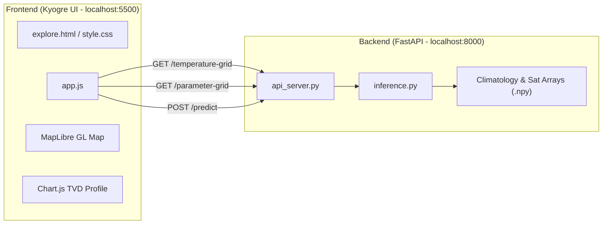

# RESEARCH.md — System Architecture & Technical Specifications

> **Project**: Kyogre (OceanEmbed)  
> **Repository**: `ocean-embed`  
> **Status**: Active  
> **Last Updated**: September 2026

---

## 1. Executive Overview

**Kyogre** is a scientific oceanographic dashboard and AI-powered digital twin of the North Indian Ocean. It reconstructs high-resolution 3D subsurface ocean temperature profiles down to 1,000 meters using multi-satellite surface observations and deep learning, validated against independent in-situ ARGO profiling floats.

---

## 2. Spatial & Temporal Domain

| Property | Value / Specification |
| :--- | :--- |
| **Study Region** | North Indian Ocean (Arabian Sea, Bay of Bengal, Equatorial Indian Ocean, Andaman Sea) |
| **Latitude Bounds** | 5.0°N to 30.0°N (101 points at 0.25° spacing) |
| **Longitude Bounds** | 45.0°E to 105.0°E (241 points at 0.25° spacing) |
| **Grid Dimensions** | 101 × 241 (24,341 horizontal cells per depth level) |
| **Depth Levels (m)** | 15 levels: `[0, 5, 10, 20, 30, 50, 75, 100, 125, 150, 200, 300, 500, 700, 1000]` |
| **Epoch Range** | 2021-01-01 to 2023-12-31 (1,095 total days) |
| **Model History Window** | Requires 10 consecutive prior days of satellite inputs; valid predictions begin 2021-01-11 |

---

## 3. Data Pipelines & Inputs

### 3.1 Satellite Surface Parameters (2D Inputs)
All 6 surface parameters are 2D spatial datasets at depth = 0 m:

1. **Sea Surface Temperature (SST)**:
   - Source: Operational Sea Surface Temperature and Sea Ice Analysis (OSTIA) / satellite radiometers.
   - Typical range: 24.0°C – 32.0°C in the North Indian Ocean.
   - Color scale: Deep Blue (`#2563EB`) → Light Blue (`#38BDF8`) → Yellow (`#FACC15`) → Orange (`#F97316`) → Red (`#EF4444`).

2. **Sea Surface Height (SSH)**:
   - Source: Satellite radar altimetry anomalies.
   - Typical range: -0.4 m to +0.4 m.
   - Color scale: Dark Blue (`#1E3A8A`) → Blue (`#3B82F6`) → Red (`#EF4444`).

3. **Sea Surface Salinity (SSS)**:
   - Source: SMAP / SMOS satellite radiometers (base salinity ~35.0 PSU + anomaly).
   - Typical range: 32.0 PSU (Bay of Bengal fresh runoff) – 36.5 PSU (high-evaporation Arabian Sea).
   - Color scale: Forest Green (`#059669`) → Emerald (`#10B981`) → Royal Blue (`#3B82F6`).

4. **Sea Level Anomaly (SLA)**:
   - Source: Filtered altimetry deviations from mean sea surface.
   - Typical range: -0.3 m to +0.3 m (often displayed in cm, -30 cm to +30 cm).
   - Color scale: Indigo (`#4338CA`) → Violet (`#6366F1`) → Pink (`#EC4899`).

5. **Surface Ocean Current**:
   - Derived from geostrophic and Ekman components: $\text{Current Speed} = \sqrt{u_{\text{cur}}^2 + v_{\text{cur}}^2}$.
   - Typical range: 0.0 m/s to 1.2 m/s.
   - Color scale: Sky Blue (`#0284C7`) → Cyan (`#06B6D4`) → Crimson (`#E11D48`).

6. **Surface Winds**:
   - Source: Scatterometer surface wind vectors: $\text{Wind Speed} = \sqrt{u_{\text{wind}}^2 + v_{\text{wind}}^2}$.
   - Typical range: 2.0 m/s to 14.0 m/s (approx. 7 km/h to 50 km/h).
   - Color scale: Slate (`#475569`) → Cyan (`#38BDF8`) → Amber (`#F59E0B`).

---

## 4. Oceanographic Metrics & Diagnostic Calculations

### 4.1 Mixed Layer Depth (MLD)
- **Definition**: The depth at which the water column temperature drops by **0.2°C** relative to the surface temperature ($T(0)$).
- **Physical Significance**: Defines the upper well-mixed turbulent boundary layer directly interacting with the atmosphere (crucial for cyclone intensification tracking).
- **Algorithm**:
  $$\text{Target } T_{\text{mld}} = T_0 - 0.2^\circ\text{C}$$
  Linear interpolation is performed between the two depth levels flanking $T_{\text{mld}}$.

### 4.2 Ocean Heat Content to 300m ($OHC_{300}$)
- **Formula**:
  $$\text{OHC}_{300} = \rho \cdot C_p \int_{0}^{300} \max(0, T(z) - T_{\text{ref}})\, dz$$
  where $\rho \approx 1025\text{ kg/m}^3$, $C_p \approx 3993\text{ J/(kg}\cdot\text{K)}$, and $T_{\text{ref}} = 12^\circ\text{C}$ or $26^\circ\text{C}$.
- **Unit**: $\text{kJ/cm}^2$ (standard tropical cyclone heat potential unit).
- **Typical Value**: 65 to 90 $\text{kJ/cm}^2$ in the tropical Indian Ocean.

### 4.3 Sound Velocity & Acoustic Shadow Depth (SVAD)
- **Physical Significance**: Sound speed in seawater depends on temperature, salinity, and pressure:
  $$c \approx 1449.2 + 4.6T - 0.055T^2 + 0.00029T^3 + (1.34 - 0.01T)(S - 35) + 0.016z$$
  The acoustic shadow zone or deep sound channel axis (SOFAR) represents critical acoustic refraction layers for naval sonar and underwater communications.

### 4.4 In-situ ARGO Float Validation
- Independent ARGO profiling floats within 0.5° and ±2 days are paired against model outputs.
- Metrics reported:
  - **Root Mean Square Error (RMSE)** in °C: $\sqrt{\frac{1}{N}\sum (T_{\text{pred}} - T_{\text{argo}})^2}$
  - **Pearson Correlation ($r$)**: Profile coherence and vertical gradient tracking
  - **Mean Bias**: Systematic model offset across depth levels

---

## 5. System Architecture & API Specifications

### 5.1 Backend Endpoints

#### 1. `POST /predict`
- **Payload**: `{"latitude": float, "longitude": float, "date": "YYYY-MM-DD"}`
- **Response**: Full 15-depth temperature predictions, surface inputs at nearest grid point, ARGO validation metrics.

#### 2. `GET /temperature-grid?date=YYYY-MM-DD&depth={depth}`
- **Parameters**: `date` (ISO string), `depth` (integer, e.g. 0, 5, 200, 1000).
- **Response**: 101 × 241 float array of temperature values for the entire North Indian Ocean grid.

#### 3. `GET /parameter-grid?param={param}&date=YYYY-MM-DD`
- **Parameters**: `param` (`sst`, `ssh`, `sss`, `sla`, `current`, `wind`), `date` (ISO string).
- **Response**: 101 × 241 float array of the requested 2D surface parameter.

---

## 6. Interaction & Gating Architecture

1. **Subsurface Heatmap Overlay**:
   - **Gated on**: `Date + Depth`
   - **Decoupled from Location**: Selecting Date and Depth immediately updates the map's raster layer. Location is not required.
   - **Depth-adaptive Color Palette**:
     - Surface (0m – 30m): 24°C – 32°C
     - Upper Thermocline (50m – 75m): 20°C – 30°C
     - Mid Thermocline (100m – 200m): 14°C – 26°C
     - Deep Ocean (300m – 500m): 8°C – 18°C
     - Abyss (700m – 1000m): 4°C – 12°C

2. **Surface Ocean Parameters**:
   - **Gated on**: Parameter tile click.
   - **Behavior**: Clicking any parameter card automatically locks Depth to `0 m (Surface)` and renders the 2D parameter raster layer with its designated color scale and legend.

3. **Temperature vs Depth (TVD) & Stat Cards**:
   - **Gated on**: `Location + Date`.
   - Displays empty state until an ocean coordinate is selected on the map or searched.
