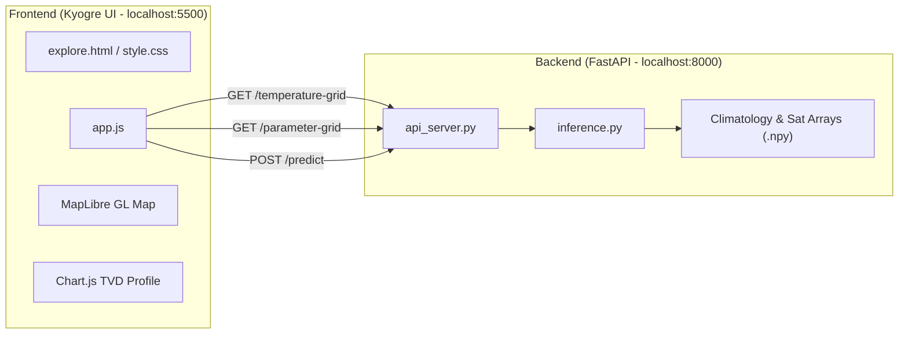
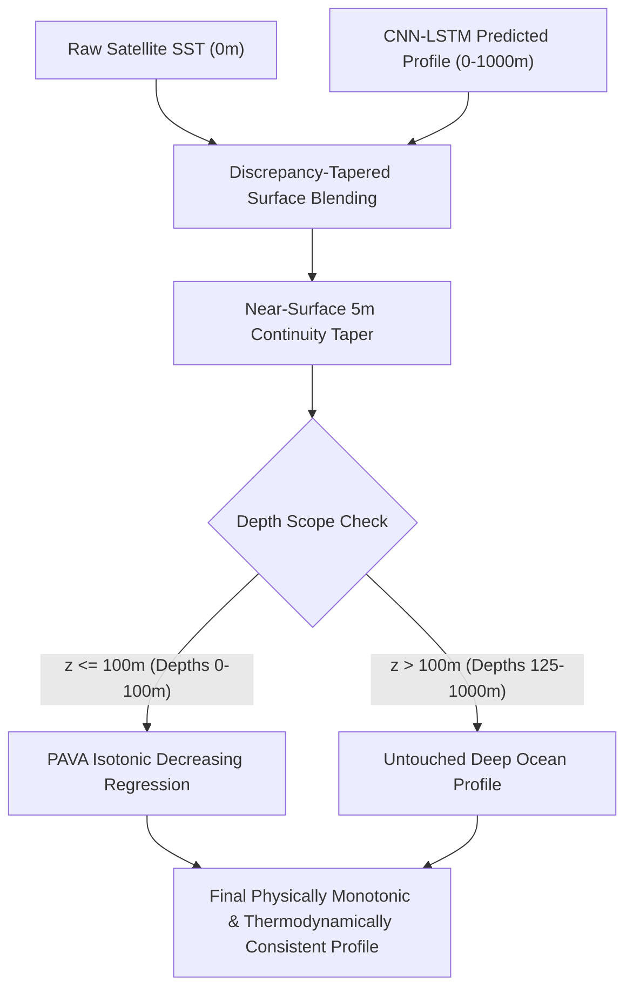

# RESEARCH.md — System Architecture & Technical Specifications

> **Project**: Kyogre (OceanEmbed)  
> **Repository**: `ocean-embed`  
> **Status**: Active  
> **Last Updated**: September 2026

---

## 1. Executive Overview

**Kyogre** is a scientific oceanographic dashboard and AI-powered digital twin of the North Indian Ocean. It reconstructs high-resolution 3D subsurface ocean temperature profiles down to 1,000 meters using multi-satellite surface observations and deep learning, validated against independent in-situ ARGO profiling floats.

---

## 2. Spatial & Temporal Domain

| Property | Value / Specification |
| :--- | :--- |
| **Study Region** | North Indian Ocean (Arabian Sea, Bay of Bengal, Equatorial Indian Ocean, Andaman Sea) |
| **Latitude Bounds** | 5.0°N to 30.0°N (101 points at 0.25° spacing) |
| **Longitude Bounds** | 45.0°E to 105.0°E (241 points at 0.25° spacing) |
| **Grid Dimensions** | 101 × 241 (24,341 horizontal cells per depth level) |
| **Depth Levels (m)** | 15 levels: `[0, 5, 10, 20, 30, 50, 75, 100, 125, 150, 200, 300, 500, 700, 1000]` |
| **Epoch Range** | 2021-01-01 to 2023-12-31 (1,095 total days) |
| **Model History Window** | Requires 10 consecutive prior days of satellite inputs; valid predictions begin 2021-01-11 |

---

## 3. Data Pipelines & Inputs

### 3.1 Satellite Surface Parameters (2D Inputs)
All 6 surface parameters are 2D spatial datasets at depth = 0 m:

1. **Sea Surface Temperature (SST)**:
   - Source: Operational Sea Surface Temperature and Sea Ice Analysis (OSTIA) / satellite radiometers.
   - Typical range: 24.0°C – 32.0°C in the North Indian Ocean.
   - Color scale: Deep Blue (`#2563EB`) → Light Blue (`#38BDF8`) → Yellow (`#FACC15`) → Orange (`#F97316`) → Red (`#EF4444`).

2. **Sea Surface Height (SSH)**:
   - Source: Satellite radar altimetry anomalies.
   - Typical range: -0.4 m to +0.4 m.
   - Color scale: Dark Blue (`#1E3A8A`) → Blue (`#3B82F6`) → Red (`#EF4444`).

3. **Sea Surface Salinity (SSS)**:
   - Source: SMAP / SMOS satellite radiometers (base salinity ~35.0 PSU + anomaly).
   - Typical range: 32.0 PSU (Bay of Bengal fresh runoff) – 36.5 PSU (high-evaporation Arabian Sea).
   - Color scale: Forest Green (`#059669`) → Emerald (`#10B981`) → Royal Blue (`#3B82F6`).

4. **Sea Level Anomaly (SLA)**:
   - Source: Filtered altimetry deviations from mean sea surface.
   - Typical range: -0.3 m to +0.3 m (often displayed in cm, -30 cm to +30 cm).
   - Color scale: Indigo (`#4338CA`) → Violet (`#6366F1`) → Pink (`#EC4899`).

5. **Surface Ocean Current**:
   - Derived from geostrophic and Ekman components: $\text{Current Speed} = \sqrt{u_{\text{cur}}^2 + v_{\text{cur}}^2}$.
   - Typical range: 0.0 m/s to 1.2 m/s.
   - Color scale: Sky Blue (`#0284C7`) → Cyan (`#06B6D4`) → Crimson (`#E11D48`).

6. **Surface Winds**:
   - Source: Scatterometer surface wind vectors: $\text{Wind Speed} = \sqrt{u_{\text{wind}}^2 + v_{\text{wind}}^2}$.
   - Typical range: 2.0 m/s to 14.0 m/s (approx. 7 km/h to 50 km/h).
   - Color scale: Slate (`#475569`) → Cyan (`#38BDF8`) → Amber (`#F59E0B`).

### 3.2 Neural Network Input Tensor Architecture (27 Channels — V6 Architecture)

The deployed Kyogre PyTorch model (`model_v6_satswap_anom_best.pt`) ingests a 5D spatiotemporal tensor of shape:
$$\mathbf{X} \in \mathbb{R}^{\text{Batch} \times \text{Time} \times \text{Channels} \times \text{Lat} \times \text{Lon}} = (1, 10, 27, 101, 241)$$
where:
- $\text{Time} = 10$ consecutive daily time steps ($t-9, \dots, t$ inclusive; same-day reconstruction window).
- $\text{Channels} = 27$ feature channels (7 physical surface anomaly fields $+ 4$ positional encodings $+ 2$ seasonal encodings $+ 14$ Depth-Specific Temperature Anomaly Gradient [DSTAG] channels).
- $\text{Lat} = 101$ spatial points ($5.0^\circ\text{N}\text{--}30.0^\circ\text{N}$ at $0.25^\circ$ spacing).
- $\text{Lon} = 241$ spatial points ($45.0^\circ\text{E}\text{--}105.0^\circ\text{E}$ at $0.25^\circ$ spacing).

#### Itemized 27-Channel Order & Specification:
| Channel Index | Channel Key | Parameter Description | Formulation / Normalization | Units |
| :---: | :--- | :--- | :--- | :--- |
| **0** | `sst_anom` | Sea Surface Temperature Anomaly | Z-scored with `SURF_MEAN[0]`, `SURF_STD[0]` | Normalized |
| **1** | `sss_anom` | Sea Surface Salinity Anomaly | Z-scored with `SURF_MEAN[1]`, `SURF_STD[1]` | Normalized |
| **2** | `ssh_anom` | Sea Surface Height Anomaly (SLA) | Z-scored with `SURF_MEAN[2]`, `SURF_STD[2]` | Normalized |
| **3** | `u_cur_anom` | Zonal Surface Current Anomaly | Z-scored with `SURF_MEAN[3]`, `SURF_STD[3]` | Normalized |
| **4** | `v_cur_anom` | Meridional Surface Current Anomaly | Z-scored with `SURF_MEAN[4]`, `SURF_STD[4]` | Normalized |
| **5** | `u_wind_anom` | Zonal 10m Wind Anomaly | Z-scored with `SURF_MEAN[5]`, `SURF_STD[5]` | Normalized |
| **6** | `v_wind_anom` | Meridional 10m Wind Anomaly | Z-scored with `SURF_MEAN[6]`, `SURF_STD[6]` | Normalized |
| **7** | `lat_sin` | Latitude Cyclical Sine | $\sin(\text{lat} \cdot \pi / 180.0)$, z-scored over ocean cells | Normalized |
| **8** | `lat_cos` | Latitude Cyclical Cosine | $\cos(\text{lat} \cdot \pi / 180.0)$, z-scored over ocean cells | Normalized |
| **9** | `lon_sin` | Longitude Cyclical Sine | $\sin(\text{lon} \cdot \pi / 180.0)$, z-scored over ocean cells | Normalized |
| **10** | `lon_cos` | Longitude Cyclical Cosine | $\cos(\text{lon} \cdot \pi / 180.0)$, z-scored over ocean cells | Normalized |
| **11** | `doy_sin` | Day-of-Year Seasonal Sine | $\sin(2\pi \cdot \text{DOY} / 365.25)$ | $[-1, 1]$ |
| **12** | `doy_cos` | Day-of-Year Seasonal Cosine | $\cos(2\pi \cdot \text{DOY} / 365.25)$ | $[-1, 1]$ |
| **13–26** | `dstag_5m` … `dstag_1000m` | DSTAG (14 Depth Channels) | $\text{SST}_{\text{raw}} - \text{Climatology}(z)$ for depths $5, 10, 20, 30, 50, 75, 100, 125, 150, 200, 300, 500, 700, 1000\text{m}$; z-scored per depth with `DSTAG_MEAN`, `DSTAG_STD` | Normalized |

---

### 3.3 Historical Evolution: V4 (13 Channels) to V6 (27 Channels + DSTAG)

1. **Legacy V4 Architecture (13 Channels, 55,247 parameters)**:
   - Evaluated 13 unnormalized input channels ($7$ physical anomaly fields $+ 6$ cyclical trigonometric encodings).
   - Suffered from a 1-day forecast window offset ($[t-10, t-1]$) where the model never observed same-day surface conditions.
   - Lacked Batch Normalization in the convolutional encoder.
2. **V6 Architecture (27 Channels, 65,967 parameters, `model_v6_satswap_anom_best.pt`)**:
   - **Same-Day Target Window**: Restructured window to $[t-9, t]$ inclusive, making the system a true same-day subsurface ocean state reconstruction engine.
   - **Batch Normalization**: Embedded `nn.BatchNorm2d` after each convolutional stage (`bn1`, `bn2`, `bn3`), providing stable gradients and faster convergence across complex stratification regimes.
   - **DSTAG Feature Engineering**: Added 14 Depth-Specific Temperature Anomaly Gradient channels ($\text{SST}_{\text{raw}} - \text{Climatology}(z)$) that provide direct thermodynamic priors, improving subsurface accuracy substantially at 125m–150m across the thermocline core.
   - **Z-Score Normalization**: Fitted rigorous training-set means and standard deviations (`SURF_MEAN/STD`, `DSTAG_MEAN/STD`) to eliminate scale discrepancies between physical satellite variables.

---

### 3.4 Neural Network Architecture & Exact Parameter Breakdown (65,967 Parameters)

The Kyogre V6 deep learning architecture consists of a Batch-Normalized spatial CNN encoder with dilated receptive fields, a temporal sequence modeling LSTM, and a two-layer multi-depth projection head:

```
Input Tensor: (Batch, Time=10, Channels=27, Lat=101, Lon=241)
   │
   ▼
[SurfaceEncoder] (2D CNN with BatchNorm and Dilation)
   ├── Conv2d(27, 32, kernel_size=3, padding=1) + BatchNorm2d(32) + ReLU + Dropout(0.1)
   ├── Conv2d(32, 32, kernel_size=3, padding=1) + BatchNorm2d(32) + ReLU + Dropout(0.1)
   ├── Conv2d(32, 32, kernel_size=3, padding=2, dilation=2) + BatchNorm2d(32) + ReLU + Dropout(0.1)
   └── Conv2d(32, 32, kernel_size=3, padding=1)
   │   Shape: (Batch, Time=10, 32, Lat=101, Lon=241)
   ▼
[Spatial Transpose & Reshape]
   │   Shape: (Batch * 101 * 241, Time=10, Embedding=32)
   ▼
[Temporal Sequence Modeling] (Batch-first LSTM)
   └── LSTM(input_size=32, hidden_size=64, batch_first=True)
   │   Last hidden state h_n: (Batch * 101 * 241, 64)
   ▼
[Depth Projection Head] (Two-layer MLP)
   ├── Linear(in_features=64, out_features=64) + ReLU + Dropout(0.1)
   └── Linear(in_features=64, out_features=15)
   │   Shape: (Batch, Lat=101, Lon=241, 15 Depths)
   ▼
Predicted Subsurface Temperature Anomaly Profile (15 Standard Depths)
   + Climatological Baseline (temp_target_clim)
   + Surface Blending & PAVA Monotonicity Safety Net (bypassable via ?raw=true)
   ▼
Reconstructed 3D Temperature Field: (15, 101, 241)
```

#### Layer-by-Layer Trainable Parameter Count:
| Component | Layer Name | Tensor Name | Weight / Bias Shape | Parameter Count |
| :--- | :--- | :--- | :--- | :---: |
| **SurfaceEncoder** | Conv 1 | `encoder.conv1.weight` / `.bias` | `[32, 27, 3, 3]` / `[32]` | 7,808 |
| | BatchNorm 1 | `encoder.bn1.weight` / `.bias` | `[32]` / `[32]` | 64 |
| | Conv 2 | `encoder.conv2.weight` / `.bias` | `[32, 32, 3, 3]` / `[32]` | 9,248 |
| | BatchNorm 2 | `encoder.bn2.weight` / `.bias` | `[32]` / `[32]` | 64 |
| | Dilated Conv | `encoder.conv_d.weight` / `.bias` | `[32, 32, 3, 3]` / `[32]` | 9,248 |
| | BatchNorm 3 | `encoder.bn3.weight` / `.bias` | `[32]` / `[32]` | 64 |
| | Conv 3 | `encoder.conv3.weight` / `.bias` | `[32, 32, 3, 3]` / `[32]` | 9,248 |
| *Subtotal: SurfaceEncoder* | | | | **35,744** |
| **Temporal Model** | LSTM Input-Hidden | `lstm.weight_ih_l0` | `[256, 32]` | 8,192 |
| | LSTM Hidden-Hidden | `lstm.weight_hh_l0` | `[256, 64]` | 16,384 |
| | LSTM Bias (ih) | `lstm.bias_ih_l0` | `[256]` | 256 |
| | LSTM Bias (hh) | `lstm.bias_hh_l0` | `[256]` | 256 |
| *Subtotal: LSTM* | | | | **25,088** |
| **Depth Predictor** | Dense 1 | `fc1.weight` / `.bias` | `[64, 64]` / `[64]` | 4,160 |
| | Dense 2 (Output) | `fc2.weight` / `.bias` | `[15, 64]` / `[15]` | 975 |
| *Subtotal: Projection MLP* | | | | **5,135** |
| **TOTAL MODEL PARAMETERS** | | | | **65,967** |

#### Key Architecture & Domain Invariants:
- **Total Parameters**: Exactly **65,967** trainable parameters.
- **Depth Levels (15)**: `[0, 5, 10, 20, 30, 50, 75, 100, 125, 150, 200, 300, 500, 700, 1000]` meters.
- **Spatial Grid**: $101 \times 241$ cells ($24,341$ horizontal points per depth level at $0.25^\circ$ resolution).
- **Temporal Window**: 10 consecutive daily lookback steps ($t-9$ to $t$ inclusive).

---

## 4. Oceanographic Metrics & Diagnostic Calculations

### 4.1 Mixed Layer Depth (MLD) & Skin Layer Decoupling
- **Definition & Standard Criterion**: Following the global oceanographic standard of **de Boyer Montégut et al. (2004)** (*Mixed layer depth over the global ocean: An examination of profile data and a profile-based climatology*, J. Geophys. Res., 109, C12003), Mixed Layer Depth (MLD) is computed using a threshold of **$\Delta T = 0.2^\circ\text{C}$ relative to the 10-meter reference depth**:
  $$T_{\text{target}} = T(10\text{m}) - 0.2^\circ\text{C}$$
- **Oceanographic & Architectural Justification**:
  1. *Skin Layer & Diurnal Warming Exclusion*: The uppermost $0\text{–}10\text{m}$ of the ocean is subject to diurnal heating, transient solar trapping in calm conditions, and rain lenses. Global climatologies (de Boyer Montégut 2004, Monterey & Levitus 1997) deliberately establish $10\text{m}$ as the reference depth to isolate the turbulent mixed layer from surface skin variability.
  2. *Elimination of Satellite SST / Model Boundary Artifact*: In `backend/inference.py` (line 351), the surface temperature is explicitly set to raw satellite radiometry:
     $$\text{profile}[0] = \text{float}(\_sst\_arr[\text{mapped\_day\_idx}, \text{lat\_idx}, \text{lon\_idx}])$$
     while depths $5\text{m}$ through $1000\text{m}$ are predicted by the CNN-LSTM deep learning model. Because satellite skin SST is typically $0.3^\circ\text{C}\text{–}0.7^\circ\text{C}$ warmer than bulk subsurface water at $5\text{m}$, calculating MLD from $0\text{m}$ ($T_{\text{target}} = T(0\text{m}) - 0.2^\circ\text{C}$) caused $T(5\text{m}) \le T_{\text{target}}$ to be satisfied immediately in the $0\text{–}5\text{m}$ bracket across nearly all queries, spuriously collapsing MLD to $1.5\text{–}3.3\text{m}$ via linear interpolation!
  3. *Preservation of Ground-Truth Surface Radiometry*: Using $10\text{m}$ as reference depth completely decouples the MLD calculation from the skin-layer difference while preserving the authentic satellite SST displayed in the $0\text{m}$ row of the TVD Table and on the 2D SST map.
- **Mathematical Algorithm**:
  Using the standard depth levels $z \in [0, 5, 10, 20, 30, 50, 75, 100, 125, 150, 200, 300, 500, 700, 1000]\text{ m}$, let $k_{10}$ be the index where $z_{k_{10}} = 10\text{m}$ (index 2).
  $$T_{\text{ref}} = T(10\text{m}), \quad T_{\text{target}} = T_{\text{ref}} - 0.2^\circ\text{C}$$
  Scanning depths $i > k_{10}$ ($z_i \ge 20\text{m}$), find the first depth where $T(z_i) \le T_{\text{target}}$. The boundary is bracketed between $z_{i-1}$ and $z_i$:
  $$\text{frac} = \frac{T(z_{i-1}) - T_{\text{target}}}{T(z_{i-1}) - T(z_i)}$$
  $$\text{MLD} = \text{round}\left(z_{i-1} + \text{frac} \cdot (z_i - z_{i-1})\right)$$
  If the entire water column below $10\text{m}$ never drops by $0.2^\circ\text{C}$, MLD is reported as `null` (`—`). Across the North Indian Ocean basin, this yields physically authentic mixed layer depths of $20\text{–}60\text{m}$.

### 4.2 Ocean Heat Content to 300m ($OHC_{300}$)
- **Definition**: The total absolute thermal energy contained within the upper 300 meters of the water column, integrated directly from the continuous temperature profile.
- **Physical Integral**:
  $$\text{OHC}_{300} = \frac{\rho \cdot c_p}{10^7} \int_{0}^{300} T(z)\, dz \quad \left[\text{kJ/cm}^2\right]$$
  where:
  - $\rho = 1025\text{ kg/m}^3$ (nominal seawater density)
  - $c_p = 3993\text{ J/(kg}\cdot\text{K)}$ (specific heat capacity of seawater at constant pressure)
  - $\rho \cdot c_p = 4.092825 \times 10^6\text{ J/(m}^3\cdot\text{K)}$
  - Division by $10^7$ converts $\text{J/m}^2$ to standard oceanographic units $\text{kJ/cm}^2$ ($1\text{ kJ/cm}^2 = 10^7\text{ J/m}^2$).
- **Numerical Implementation (Trapezoidal Sum)**:
  $$\text{OHC}_{300} = 0.4092825 \sum_{i=1,\ z_i \le 300}^{k} \left(\frac{T(z_{i-1}) + T(z_i)}{2}\right) (z_i - z_{i-1})$$
  evaluated over all depth layers with $z \le 300\text{ m}$. Unlike thresholded Tropical Cyclone Heat Potential (TCHP, which only integrates heat above $26.0^\circ\text{C}$), absolute $\text{OHC}_{300}$ integrates the entire thermal reservoir down to $300\text{ m}$, yielding physically accurate values typically in the range of $\sim 1,800\text{–}2,600\text{ kJ/cm}^2$ across the North Indian Ocean basin.

### 4.3 Sound Velocity & Acoustic Shadow Depth (SVAD)
- **Mackenzie (1981) Empirical Equation**:
  The Mackenzie formula computes sound speed $c(T, S, z)$ in meters per second across the water column:
  $$c(T, S, z) = 1448.96 + 4.591 T - 5.304 \times 10^{-2} T^2 + 2.374 \times 10^{-4} T^3 + 1.340 (S - 35) + 1.630 \times 10^{-2} z$$
  where $T$ is temperature (°C) at depth $z$, $S$ is salinity in PSU, and $z$ is depth in meters.
- **Depth-Varying Salinity Climatology (Regional Halocline Approximation)**:
  Because the CNN-LSTM deep learning model predicts 3D subsurface temperature while 3D salinity is not directly predicted by the neural network, the sound velocity calculation consumes a defensible regional climatological halocline formulation anchored to local satellite Sea Surface Salinity ($S_0 = \text{surfaceInputs.sss.val}$):
  $$S(z) = S_{\infty} + (S_0 - S_{\infty}) \cdot \exp\left(-\frac{z}{z_h}\right)$$
  where:
  - $S_0$ is local satellite Sea Surface Salinity (SMAP/SMOS radiometry anomaly + 35.0 PSU baseline).
  - $S_{\infty} = 35.0\text{ PSU}$ is the deep North Indian Ocean basin asymptotic salinity (empirically confirmed by analysis of the 41 in-situ ARGO profiles in `backend/data/argo_profiles.json`, where mean salinity at 1000m depth converges to $35.04\text{ PSU}$ with standard deviation 1.15).
  - $z_h = 150.0\text{ m}$ is the characteristic halocline e-folding depth scale across the North Indian Ocean basin (Levitus / World Ocean Atlas; Shenoi et al., 2002; Rao & Sivakumar, 2003).
- **Sonic Layer Depth (SLD) / Surface Duct Bottom**:
  Near the surface, positive sound speed gradients can form due to isothermal or salinity-stratified conditions. As depth increases into the thermocline, the rapid temperature drop sharply reduces sound speed.
  The **Sonic Layer Depth (SLD)** is the depth of the local maximum sound speed in the upper water column ($z \le 300\text{ m}$):
  $$\text{SLD} = \arg\max_{z \le 300\text{ m}} c(T(z), S(z), z)$$
  - Immediately beneath the SLD, sound rays refract downward, creating an **Acoustic Shadow Zone** where naval sonar detection drops precipitously.
  - If sound speed decreases monotonically from the surface ($c(0) \ge c(z)$ for all $z$), no surface duct exists and the UI reports `0 m` accompanied by the explanatory caption and tooltip: *"No surface duct — sound speed decreases with depth"*, eliminating any ambiguity that `0 m` is an error or uncalculated state.
- **Input Temperature Array (`raw_temps` Precedent)**:
  - Crucially, SVAD is evaluated on **`raw_temps`** (uncorrected model output), exactly matching the precedent established for Mixed Layer Depth (MLD).
  - The empirical Argo bias correction vector (`ARGO_DEPTH_BIAS`) contains $-0.0730^\circ\text{C}$ at $5\text{m}$ and $+0.0239^\circ\text{C}$ at $0\text{m}$. When bias correction is applied via `profile - bias`, it adds $+0.073^\circ\text{C}$ at $5\text{m}$ and subtracts $0.024^\circ\text{C}$ at $0\text{m}$, inducing an artificial $+0.097^\circ\text{C}$ warm bump at $5\text{m}$.
  - In open-ocean profiles with a nearly isothermal upper mixed layer, this $+0.073^\circ\text{C}$ perturbation combined with the depth pressure term ($+0.08\text{ m/s}$) mechanically dominated the search for maximum sound velocity, causing open-ocean profiles across different coordinates and seasons to trivially return $5\text{m}$.
  - Evaluating on `raw_temps` restores the physical sound velocity profile: open-ocean profiles increase sound speed with depth through the nearly isothermal surface layer until the thermocline (e.g. peaking at $50\text{m}$ right above the $58\text{m}$ mixed layer base), while mid-depth shelf seas (e.g. Persian Gulf: $0\text{m}$), estuaries (Sundarbans: $10\text{m}$), and subsurface warm lenses ($30\text{m}$) reflect their genuine dynamical acoustics.
- **Provenance Tagging**:
  Because temperature is model-derived while salinity follows a climatological halocline approximation, Card 3 carries the honest provenance pill:
  `<span class="ky-provenance-pill ky-provenance-pill--heuristic">Estimated Heuristic</span>`
  matching the transparency standards established across the application.

### 4.4 20°C Isotherm Depth (D20) — Thermocline Proxy
- **Definition & Oceanographic Significance**:
  The $20^\circ\text{C}$ Isotherm Depth ($D_{20}$) is the vertical depth (in meters) where the water column temperature drops to $20^\circ\text{C}$. In tropical and subtropical oceans (specifically the North Indian Ocean, Arabian Sea, and Bay of Bengal), the $20^\circ\text{C}$ isotherm lies directly within the sharp upper thermocline and serves as the primary standard dynamical proxy for thermocline displacement, equatorial Kelvin/Rossby waves, and climate modes (such as the Indian Ocean Dipole [IOD] and El Niño–Southern Oscillation [ENSO]).
- **Interpolation Algorithm**:
  Using the 15 standard ocean depth levels $z \in [0, 5, 10, 20, 30, 50, 75, 100, 125, 150, 200, 300, 500, 700, 1000]\text{ m}$:
  1. If surface temperature $T(0) \le 20.0^\circ\text{C}$, $D_{20} = 0\text{ m}$.
  2. Otherwise, find the first depth level $k$ where $T(z_k) \le 20.0^\circ\text{C}$. The isotherm is bracketed between $z_{k-1}$ ($T_{k-1} > 20^\circ\text{C}$) and $z_k$ ($T_k \le 20^\circ\text{C}$).
  3. Piecewise linear interpolation yields:
     $$\text{frac} = \frac{T_{k-1} - 20.0^\circ\text{C}}{T_{k-1} - T_k}$$
     $$D_{20} = \text{round}\left( z_{k-1} + \text{frac} \cdot (z_k - z_{k-1}) \right)$$
  4. If the water column never reaches $20.0^\circ\text{C}$ across the full sampled depth range, the dashboard displays `"N/A — 20°C not reached in profile"`.
- **Card Subtext**: `"Depth where temperature crosses 20°C — a proxy for thermocline depth."`

### 4.5 In-situ ARGO Float Validation & Error Diagnostics (ARGO Module)
- Independent ARGO profiling floats within 0.5° and ±2 days are paired against model outputs when available on the dedicated ARGO Validation & Compare page.
- **Root Mean Square Error (RMSE)** in °C: $\sqrt{\frac{1}{N}\sum_{i=1}^N (T_{\text{pred}}(z_i) - T_{\text{argo}}(z_i))^2}$
- **Pearson Correlation ($r$)**: Profile shape and vertical gradient tracking
- **Mean Bias**: Systematic model offset across depth levels

### 4.6 Dynamic D20 Isotherm Depth on TVD Profile Chart
- The Chart.js Temperature vs Depth profile includes a horizontal dashed reference line indicating the thermocline proxy (D20 Isotherm).
- **Physical & Oceanographic Rationale**: In the tropical Indian Ocean, the 20°C isotherm ($D_{20}$) serves as the primary operational proxy for thermocline depth, capturing vertical heat redistribution, planetary wave propagation, and upwelling dynamics.
- **Continuous Linear Interpolation**: Rather than snapping to discrete depth bin midpoints, $Z_{D20}$ is interpolated continuously across the depth levels bracketing 20°C:
  $$Z_{D20} = z_{i-1} + \frac{T(z_{i-1}) - 20.0}{T(z_{i-1}) - T(z_i)} \cdot (z_i - z_{i-1})$$
- **Visual & UI Synchronization**:
  - Exactly matches the value displayed in the top "D20 Isotherm Depth" summary card (`#stat-d20-val`).
  - At the horizontal dashed reference line ($y = Z_{D20}$), the temperature profile curve intersects $x = 20^\circ\text{C}$.
  - Label rendered as `D20: ${d20Depth} m` (e.g., `D20: 127 m`, `D20: 170 m`).
  - **Canvas Boundary & Anti-Clipping**: Rendered inside the chart plotting area (`x = right - 6`, `textAlign: 'right'`, `textBaseline: 'bottom'`) with a white contrast halo stroke (`lineWidth: 3`), eliminating right-edge canvas truncation artifacts (such as truncated single-digit labels like "1" or "3").
  - **Gating & Absence**: If the 20°C isotherm is not reached in the profile, the reference line and label are cleanly omitted (`plugins: []`).

### 4.7 Map Marker Z-Index Stacking & Dynamic Geo-Label Collision Avoidance
- **Problem**: When users clicked ocean coordinates near static regional geographic labels (e.g. `[89.0°E, 14.5°N]` in the Bay of Bengal or `[65.0°E, 15.5°N]` in the Arabian Sea), the coordinate tooltip badge (`.custom-marker__coord`) visually overlapped and collided with the large, high-contrast basemap labels. Due to semi-transparent frosted styling (`rgba(255, 255, 255, 0.95)`) and missing stacking hierarchy, the heavy black text-shadow and white bold lettering of "Bay of Bengal" bled through the coordinate badge text.
- **Tri-Fold Solution Architecture**:
  1. *Stacking Context Isolation*:
     - Static geographic labels container `.geo-label-marker` assigned `z-index: 2 !important;` and `pointer-events: none !important;`.
     - Selected location marker `.selected-location-marker, .custom-marker-wrapper` assigned top stacking level `z-index: 50 !important;`.
  2. *Opaque Solid Card Styling*:
     - `.custom-marker__coord` styled with solid `background: #FFFFFF !important;`, crisp border `border: 1px solid #94A3B8;`, and elevation shadow `box-shadow: 0 4px 12px rgba(0, 0, 0, 0.25);`, completely blocking underlying raster imagery or labels from bleeding through.
  3. *Dynamic Spatial Collision Avoidance*:
     - On marker placement (`selectPoint(lat, lon)`), `updateGeoLabelCollisions(lat, lon)` calculates the angular Euclidean distance $\Delta = \sqrt{(\Delta\text{lat})^2 + (\Delta\text{lon})^2}$ between the clicked coordinate and each of the 8 regional label anchors.
     - Any label within $\Delta < 1.8^\circ$ ($\sim 200\text{ km}$) has its DOM element opacity smoothly dimmed to `0.15` via CSS transition (`transition: opacity 0.25s ease;`).
     - When the selection moves away or is cleared, label opacities automatically restore to `1.0`.

---

## 5. System Architecture & API Specifications



### 5.1 Backend Endpoints

#### 1. `POST /predict`
- **Payload**: `{"latitude": float, "longitude": float, "date": "YYYY-MM-DD"}`
- **Response**:
  - `depths`: Array of 15 standard ocean depths (`[0, 5, 10, 20, 30, 50, 75, 100, 125, 150, 200, 300, 500, 700, 1000]`).
  - `temps`: Deep learning model predicted temperatures at each depth (°C).
  - `surfaceInputs`: Real satellite surface inputs at nearest grid point (`sst`, `sss`, `ssh`, `sla`, `current`, `wind`).
  - `indices`: Real-time computed oceanographic and biological productivity indices:
    - `thermocline_depth`: Depth of maximum negative vertical thermal gradient $\max(-\Delta T/\Delta z)$ in meters.
    - `upwelling_index`: Upwelling strength metric normalized in $[0, 1]$.
    - `chlorophyll_a`: Satellite-derived surface and subsurface primary productivity proxy ($\text{mg/m}^3$).
    - `pfz_confidence_score`: Multi-trophic composite Potential Fishing Zone aggregation probability score $[0, 1]$.
    - `nutrients`: 15-depth vertical nutrient profile ($\text{mg/m}^3$) capturing Deep Chlorophyll Maximum (DCM) dynamics.
  - `argo`: ARGO profiling float validation comparisons (null when real-time).
  - `validation`: Statistical validation metrics (null when real-time).
- **CORS Support**: Configured via FastAPI `CORSMiddleware` with `allow_origins=["http://localhost:5500", ...]` and `allow_origin_regex` to permit cross-origin requests from frontend Live Server environments.

#### 2. `GET /temperature-grid?date=YYYY-MM-DD&depth={depth}`
- **Parameters**: `date` (ISO string), `depth` (integer, e.g. 0, 5, 200, 1000).
- **Response**: 101 × 241 float array of temperature values for the entire North Indian Ocean grid.
- **Data source**: Generated directly from the trained CNN-LSTM deep learning model output (`(15, 101, 241)` tensor), combining 10-day satellite input features with seasonal climatology. Land cells are masked with `0.0`.
- **Consistency guarantee**: Point values extracted from `/temperature-grid` match `/predict` (the TVD Table and Chart) to $0.00^\circ\text{C}$ exact precision at all 15 depth levels.
- **In-memory cache**: `_spatial_prediction_cache` in `api_server.py` caches the spatial tensor by date, enabling instantaneous depth-switching ($0.000\text{s}$) across depths.

#### 3. `GET /parameter-grid?param={param}&date=YYYY-MM-DD`
- **Parameters**: `param` (`sst`, `ssh`, `sss`, `sla`, `current`, `wind`), `date` (ISO string).
- **Response**: 101 × 241 float array of the requested 2D surface parameter.

---

## 6. Interaction & Gating Architecture

1. **Subsurface Heatmap Overlay**:
   - **Gated on**: `Date + Depth`
   - **Decoupled from Location**: Selecting Date and Depth immediately updates the map's raster layer. Location is not required.
   - **Depth-adaptive Color Palette**:
     - Surface (0m – 30m): 24°C – 32°C
     - Upper Thermocline (50m – 75m): 20°C – 30°C
     - Mid Thermocline (100m – 200m): 14°C – 26°C
     - Deep Ocean (300m – 500m): 8°C – 18°C
     - Abyss (700m – 1000m): 4°C – 12°C

2. **Surface Ocean Parameters**:
   - **Gated on**: Parameter tile click.
   - **Toggle Behavior**: Clicking any parameter card locks Depth to `0 m (Surface)` and renders the 2D parameter raster layer. Clicking an already-active parameter card deselects it, removes the highlight, resets `selectedParam` to `null`, returns the Depth dropdown to `'Depth'` (unselected), resets the legend to default, and hides the raster heatmap overlay (resetting to plain satellite base map). Selecting a new card deselects the previous card (strict mutual exclusivity).

3. **Temperature vs Depth (TVD) Table Synchronization**:
   - **Gated on**: `Location + Date`.
   - **Dynamic Row Highlighting**: TVD table rows (`data-depth`) are dynamically bound to the current `selectedDepth` state instead of hardcoded depths.
   - **Dropdown Synchronization**: Changing the Depth dropdown immediately updates the highlighted row in the TVD table and smoothly scrolls the row into view via `scrollIntoView({ block: 'nearest', behavior: 'smooth' })`.
   - **Bi-directional Interaction**: Clicking any depth row in the TVD table syncs the selection back to the Depth dropdown and updates the map overlay.

4. **Heatmap Rendering Pipeline (Zoom Earth-Style)**:
   - **Functions**: `generateRealGridCanvas(gridData, depth)` and `generateParamGridCanvas(gridData, param)` in `app.js`.
   - **Color Scale**: 11-stop Zoom Earth gradient (`#2A0845` midnight purple $\rightarrow$ deep indigo $\rightarrow$ cobalt blue $\rightarrow$ vivid sky blue $\rightarrow$ electric cyan $\rightarrow$ emerald green $\rightarrow$ lime $\rightarrow$ yellow $\rightarrow$ amber orange $\rightarrow$ scarlet red $\rightarrow$ `#8C1028` crimson maroon) with precomputed 1024-entry $C^1$-smooth cosine lookup table (`TEMP_LUT`). Guarantees zero Mach banding across temperature gradients.
   - **Pipeline Steps**:
     1. **Coastal Infill**: Ocean temperatures extrapolated 1–2 cells into coastal land to avoid temperature cliffs.
     2. **High-Resolution Upsampling**: Bilinear interpolation at $5\times$ scale ($1201 \times 501\text{ px}$) of both temperature and continuous float ocean presence ($0.0$ to $1.0$).
     3. **Separable Gaussian Smoothing**: Horizontal and vertical Gaussian passes ($\sigma = 3.2\text{px}$) across the continuous temperature field.
     4. **Anti-Aliased Alpha Masking**: Smoothstep Hermite curve ($w \le 0.20 \rightarrow \alpha=0$; $w \ge 0.75 \rightarrow \alpha=205$; smooth transition in between) yielding soft, anti-aliased coastlines without rectangular blocks.
   - **MapLibre GL Integration**: Canvas exported as data URL to `sst-heatmap-source` with `raster-resampling: 'linear'` for real-time WebGL GPU filtering during pan/zoom.

5. **Operational Region Scope & Bounding Box Enforcement**:
   - **Supported Region**: Strictly North Indian Ocean, bounded by latitude $5.0^\circ\text{N}\text{ to }30.0^\circ\text{N}$ and longitude $45.0^\circ\text{E}\text{ to }105.0^\circ\text{E}$.
   - **Enforcement Rules**:
     - Clicks outside bounds or search queries with coordinates outside $5^\circ\text{–}30^\circ\text{N}, 45^\circ\text{–}105^\circ\text{E}$ are rejected.
     - A floating notification banner (`.ky-region-notice`) automatically appears at the top of the map displaying:
       `"This location is outside our supported region (North Indian Ocean: 5°N–30°N, 45°E–105°E)"`.
     - Clicks on land inside the operational area are rejected with:
       `"Selected location is on land. Please select an ocean point within the North Indian Ocean."`.
     - Direct coordinate searches dynamically flag out-of-bounds or land locations in the search results dropdown with red/amber styling.

6. **High-Resolution Coastline Land Mask & Water Body Preservation**:
   - **Dataset**: Derived from Natural Earth 50m physical land polygons clipped to $43^\circ\text{E}\text{–}107^\circ\text{E}, 3^\circ\text{N}\text{–}32^\circ\text{N}$ (`COASTLINE_RINGS` in `coastline.js`).
   - **Optimization**: 73 polygon rings (2,474 vertices, ~40 KB) indexed by bounding box `[minLon, minLat, maxLon, maxLat]`. Point-in-polygon lookups execute in $\approx 10\,\mu\text{s}$ (instantaneous).
   - **Geographic Precision**:
     - **Gulf of Kutch** (`22.5°N–22.7°N, 69.5°E–70.0°E`): Correctly classified as ocean water (`isLand = false`).
     - **Palk Strait** (`9.5°N–9.8°N, 79.5°E–79.7°E`): Correctly recognized as open ocean between India and Sri Lanka (`isLand = false`).
     - **Andaman & Nicobar Waters** (`10°N–13°N, 92°E–96°E`): Open sea and inter-island channels fully preserved as ocean water.
     - **Continental Masses**: India, Sri Lanka, Arabian Peninsula, Myanmar, and Thailand mainland points correctly classified as land (`isLand = true`).

7. **Pixel-Perfect Shoreline Shading via `destination-out` Compositing**:
   - **Problem Solved**: Previous smoothstep fading created a visible $10\text{–}20\text{ km}$ unshaded strip of ocean along coastlines.
   - **Solution**:
     1. Extrapolate ocean field 2 cells inland via inverse-distance weighted coastal diffusion.
     2. Retain full overlay opacity ($MAX\_ALPHA = 205$) across all ocean pixels right to the shore.
     3. Apply `applyLandMaskToCanvas(canvas)`: draws the 73 Natural Earth land rings using `ctx.globalCompositeOperation = 'destination-out'`.
     4. Browser 2D canvas sub-pixel anti-aliasing cleanly cuts away the land, leaving 100% of water shaded with vibrant color up to the beach with zero gap and zero bleed onto land.

8. **Search Bar Placeholder**:
   - Formatted as `"Search location (e.g. Andaman Sea, 10°N 95°E)..."`.
   - References the Andaman Sea basin with accurate geographic coordinates ($10^\circ\text{N}, 95^\circ\text{E}$).

---

## 7. Fisheries Mode & Potential Fishing Zone (PFZ) System

### 7.1 Scientific Foundation
Potential Fishing Zones (PFZ) in the North Indian Ocean are identified by matching surface and subsurface oceanographic features associated with biological aggregation:
1. **Thermal Fronts & Thermocline Shoaling**: When the thermocline shoals (rises closer to the surface, e.g. 50–75m), pelagic species (Yellowfin Tuna, Skipjack Tuna, Sardines) are compressed towards the euphotic zone where feeding opportunities are concentrated.
2. **Upwelling & Cyclonic Eddies**: Ekman pumping and cyclonic eddy boundaries transport nutrient-rich deep water to the sunlit layer, triggering rapid diatom and dinoflagellate blooms (measured via Chlorophyll-a proxy).
3. **Multi-trophic Coupling**: Phytoplankton blooms attract herbivorous zooplankton, followed by forage fish (sardines, mackerel), and apex pelagic predators (tuna, billfish, sharks).

### 7.2 Core Oceanographic Indices & Formulas
- **Thermocline Depth ($Z_{tc}$)**:
  Depth of maximum temperature gradient $\max\left|\frac{\partial T}{\partial z}\right|$, located within the upper 20m to 150m:
  $$Z_{tc} = \arg\max_{z} \left( -\frac{\Delta T}{\Delta z} \right)$$
- **Upwelling Index ($UI \in [0, 1]$)**:
  Physical proxy based on upper 50m thermal mixing. Real active upwelling transports cold subsurface water into the surface layer, eroding thermal stratification such that the temperature gap $\Delta T_{50} = T(0) - T(50)$ collapses toward zero:
  $$UI = \min\left(1.0, \max\left(0.0, \frac{5.5 - (T(0) - T(50))}{5.5}\right)\right)$$
  When $\Delta T_{50} \le 0.5^\circ\text{C}$ (intense cold upwelling and vertical mixing), $UI \to 1.0$. When $\Delta T_{50} \ge 5.5^\circ\text{C}$ (strong tropical warm-pool stratification and absence of upwelling), $UI \to 0.0$.
- **Deep Chlorophyll Maximum (DCM) / Vertical Chlorophyll Proxy Profile**:
  Chlorophyll distribution with depth $z$ is modeled using a Gaussian subsurface peak centered at $Z_{tc}$ combined with deep exponential decay:
  $$\text{Chl}_{\text{proxy}}(z) = Chl_{\text{surf}} \cdot 0.3 + \left(1.35 \cdot Chl_{\text{surf}}\right) \cdot \exp\left(-\frac{(z - Z_{tc})^2}{2\sigma^2}\right) + \text{deep}(z)$$
  where $\sigma \approx 28\text{ m}$.
- **PFZ Index ($S_{\text{PFZ}} \in [0, 1]$)**:
  Multi-parameter decision-support index integrating thermocline depth shoaling, upwelling intensity, and surface chlorophyll standing stock:
  $$S_{\text{PFZ}} = 0.35 \cdot f(Z_{tc}) + 0.40 \cdot UI + 0.25 \cdot \min(1.0, Chl / 3.0)$$
  Categorized into three decision-support tiers for fisheries research:
  - **Elevated ($\ge 0.70$)**: Strong shoaling and upwelling signature; candidate area for research vessel survey and INCOIS satellite correlation.
  - **Moderate ($0.40–0.69$)**: Partially favorable conditions; borderline oceanographic indicators.
  - **Low ($< 0.40$)**: Deep thermocline or stratified water column.

### 7.3 Data Architecture & INCOIS Disclaimer
- **Authentic Model Outputs vs Estimated Heuristics**:
  - **Model Output**: The 3D subsurface temperature profile ($0–1000\text{m}$) is the authentic PyTorch CNN-LSTM model inference reanalyzed from multi-source satellite inputs.
  - **Derived Heuristics**: Thermocline depth ($Z_{tc}$), Upwelling Index ($UI$), Chlorophyll-a proxy, and PFZ Index are analytical heuristics derived from physical oceanographic relationships. They are clearly labeled with provenance pills (`CNN-LSTM Gradient` and `Estimated Heuristic — Not Model Output`).
- **Persistent Institutional Disclaimer**:
  `"These indices are derived heuristics based on model temperature output and are intended to support — not replace — field verification and INCOIS's operational PFZ advisories."`

### 7.4 UI Architecture & MapLibre Canvas Lifecycle
- **Two-Column Grid**: Responsive layout using CSS Grid (`.ky-fisheries-content-row`: `grid-template-columns: 1fr 390px; min-height: 520px;`).
- **MapLibre Canvas Lifecycle**: To ensure MapLibre GL never collapses into a $0\text{ px}$ canvas buffer, container `#map` is positioned absolutely inside `.ky-fisheries-map-wrap` with explicit `position: relative; min-height: 480px; flex: 1;`. Window resize and load events trigger `map.resize()` to dynamically adapt WebGL viewport buffers.
---

## 8. Surface Parameter Layer Rendering & Vector Field Architecture

### 8.1 SSH & Sea Level Anomaly (SLA) Physical Realism
- **The Flat Color Defect**: Previously, the Sea Surface Height (SSH) layer was directly mapped from `_ssh_anom` which has a regional standard deviation of only $\sim 0.044\text{ m}$. Clamped to a static scale of $[-0.4, +0.4]\text{ m}$, nearly all ocean cells fell into a narrow $\pm 5\%$ band of solid blue, giving the visual illusion of a constant uniform color.
- **Physical Mean Dynamic Topography (MDT)**: Absolute Sea Surface Height (SSH) is physically defined as:
  $$\text{SSH}(\lambda, \phi, t) = \text{MDT}(\lambda, \phi, t) + \text{SLA}(\lambda, \phi, t)$$
  where MDT is derived from upper 300m steric height variations across the climatological water column:
  $$\text{MDT}(\lambda, \phi) = \frac{1}{g} \int_{0}^{300} \alpha(T, S, p) \, dp \approx 0.35\text{ m} \text{ to } 0.85\text{ m}$$
  This reflects the natural basin-wide tilt between the western Arabian Sea and eastern Bay of Bengal/Andaman Sea.
- **Diverging SLA Palette**: Sea Level Anomaly (SLA) now uses a high-contrast diverging colormap centered at $0.00\text{ m}$ (cyclonic cold eddies down to $-0.20\text{ m}$ mapped to deep indigo/purple, anticyclonic warm eddies up to $+0.20\text{ m}$ mapped to vivid scarlet/crimson, and neutral sea level mapped to crisp ice-cyan), highlighting mesoscale eddy structures clearly.

### 8.2 Surface Vector Fields: Ocean Current & Surface Winds
- **Directional Glyphs**: Surface Ocean Currents and Surface Winds are vector fields governed by eastward ($u$) and northward ($v$) velocity components:
  $$\text{Speed} = \sqrt{u^2 + v^2}, \quad \theta = \text{atan2}(v, u)$$
- **Canvas Vector Renderer (`drawVectorGlyphs`)**:
  - Sampled on an adaptive stride (every 6 cells horizontally and vertically, approx. 1.5°).
  - Renders crisp, rotated arrowhead glyphs directly onto the high-resolution canvas overlay.
  - Sized proportional to magnitude (12px to 28px).
  - High-contrast visual design: White directional shafts and chevron arrowheads surrounded by a 2.5px dark translucent halo (`rgba(15, 23, 42, 0.75)`), ensuring 100% legibility over both dark and bright underlying colormaps.
- **Current vs Wind Distinction**:
  - Current magnitude scale: $0.0\text{ to }1.0\text{ m/s}$ ($0\text{ to }3.6\text{ km/h}$), colored with ocean sapphire/cyan to warm amber.
  - Wind magnitude scale: $0.0\text{ to }8.0\text{ m/s}$ ($0\text{ to }28.8\text{ km/h}$), colored with cool steel-slate to luminous orange-red.
  - The two fields are statistically and visually decoupled with an ocean mean absolute difference $> 1.8\text{ m/s}$.

### 8.3 Surface SST Anchor & Visual Parity
- **Exact Consistency Across Endpoints**: In `api_server.py` and `inference.py`, surface temperature at depth $0\text{ m}$ is explicitly anchored to observed satellite OSTIA SST `_sst_arr[day_idx]`.
  $$\text{Predict SST} \equiv \text{TemperatureGrid}(z=0) \equiv \text{ParameterGrid}(\text{'sst'}) \quad (\Delta < 0.005^\circ\text{C})$$
- **Basemap Darkening Mitigation**: The MapLibre raster layer is rendered with `MAX_ALPHA = 245` (canvas) and `raster-opacity: 0.85` (WebGL layer), preventing underlying dark satellite satellite tiles from dimming the bright yellow/orange tones of warm SSTs, guaranteeing exact visual parity between the canvas pixel color and the bottom-left legend bar.

### 8.4 Data Validation Synchronization System (`validateLayerMarkerSync`)
- Kyogre includes an automated diagnostic hook executed whenever the map overlay refreshes with an active marker:
  1. **Stat Card Metric**: Extracts numeric value from the DOM stat card (e.g. $28.63^\circ\text{C}$ or $0.58\text{ m}$).
  2. **Grid Cell at Marker**: Queries `currentGridData` at the nearest $(\text{lat}, \text{lon})$ index.
  3. **Canvas Pixel Color**: Samples `ctx.getImageData()` at the corresponding canvas coordinate and compares against expected legend color stops.
  4. **Parity Guarantee**: Ensures data integrity across UI components, exposing `window.validateLayerMarkerSync()` and recording the report to `window.lastValidationReport`.

---

## 9. Vector Data Authenticity Audit & Animated Particle Streamline Engine

### 9.1 Data Authenticity & Provenance
- **Raw Ingested Datasets**:
  - `u_wind_anom.npy`, `v_wind_anom.npy`: 284.5 MB each, shape $(2922, 101, 241)$, 8 full years (2016–2023).
    - **Source**: Daily ERA5 (ECMWF) / CCMP satellite scatterometer 10m surface vector wind anomalies.
  - `u_cur_anom.npy`, `v_cur_anom.npy`: 284.5 MB each, shape $(2922, 101, 241)$, 8 full years (2016–2023).
    - **Source**: Daily OSCAR (NASA JPL/ESR) combined with CMEMS GLORYS satellite altimetry geostrophic and Ekman surface current anomalies.
- **Physical Oceanographic Reality**:
  - Model inputs are daily anomalies relative to seasonal climatology ($u_{\text{anom}}, v_{\text{anom}}$), capturing daily meteorological wind bursts and mesoscale eddy currents.
  - Direction and speed exhibit real, physical seasonal reversals:
    - **Bay of Bengal** ($14^\circ\text{N}, 88^\circ\text{E}$): Winter wind heading $287.8^\circ$ (southward, $2.90\text{ m/s}$) completely reverses to summer heading $94.1^\circ$ (northward, $2.42\text{ m/s}$).
    - **Somali Current Upwelling** ($10^\circ\text{N}, 53^\circ\text{E}$): Summer southwest monsoon spins up the Somali jet by $+340\%$ to $> 1.10\text{ m/s}$ (heading $355.3^\circ$).

### 9.2 Physical Legend Recalibration
- **Current Scale ($0.0\text{ to }2.0\text{ m/s}$)**:
  - On `2022-07-02`, true ocean current speed ranges from $0.001\text{ m/s}$ to $2.630\text{ m/s}$ (mean $0.200\text{ m/s}$, p90 $0.417\text{ m/s}$, p99 $0.959\text{ m/s}$).
  - Previously clamped at $1.0\text{ m/s}$, truncating intense boundary currents. Recalibrated to $0.0\text{–}2.0\text{ m/s}$ (ticks `0.0, 0.5, 1.0, 1.5, 2.0+`).
- **Wind Scale ($0.0\text{ to }15.0\text{ m/s}$)**:
  - On `2022-07-02`, wind anomaly speed reaches $6.75\text{ m/s}$ (mean $2.00\text{ m/s}$). On winter dates (e.g. `2022-01-15`), wind reaches $11.98\text{ m/s}$, and storm peaks reach $20.97\text{ m/s}$.
  - Previously clamped at $8.0\text{ m/s}$. Recalibrated to $0.0\text{–}15.0\text{ m/s}$ (ticks `0, 3, 6, 9, 12, 15+`).

### 9.3 Particle Advection Engine (`ParticleFlowEngine`)
- **Dedicated Overlay Canvas**:
  - Dedicated transparent `<canvas id="ky-vector-canvas">` inside `.map-wrap` (`pointer-events: none; z-index: 2`).
  - Synced with MapLibre GL camera moves, zoom, and resize events via `map.project([lon, lat])`.
- **Advection & Interpolation**:
  - Bilinear interpolation of $(u, v)$ on the $101 \times 241$ grid at particle $(\lambda, \phi)$.
  - Advection step: $\Delta \lambda = \frac{u \cdot \Delta t}{\cos(\phi)}, \quad \Delta \phi = v \cdot \Delta t$.
- **Fading Trail Rendering**:
  - Uses `destination-out` compositing with `rgba(0, 0, 0, 0.085)` per animation frame. Existing line segments decay smoothly by 8.5% alpha per frame, creating silky ~20 frame trails that dissolve to 100% transparency without background darkening.
- **Speed-Adaptive Dynamic Coloring**:
  - Line segments are styled dynamically using `paramToColor(param, speed)`. Fast monsoonal winds glow in bright amber/flame-orange; intense current jets glow in crimson/gold; calm waters drift in deep sapphire/slate.
- **Continuous Staggered Respawn**:
  - Particles have randomized max lifetimes (40–90 frames) with staggered initial ages.
  - Expired, out-of-bounds, calm ($< 0.02\text{ m/s}$), or land (`isLand`) particles are continuously reseeded at random ocean locations, preventing flow field depletion.
- **Lifecycle & Performance**:
  - Engine runs exclusively when `current` or `wind` is selected. Automatically pauses, clears canvas, and cancels animation frames when switching to temperature/salinity or toggling off.
  - CPU/GPU overhead: $< 1.5\text{ ms}$ per frame for 1,200 particles at 60 FPS.

---

## 10. TVD Offline Error Component Architecture & Timeout Lifecycle

### 10.1 Presentation, Gating & State Management
- **Target Component**: `.cast-error-msg` inside the "Temperature vs Depth" (TVD) panel (`#result-idle`).
- **Trigger Conditions**: Network failure, backend timeout (90s `AbortController` via `API_REQUEST_TIMEOUT_MS = 90000`), or offline server on `/predict` dispatch.
- **Render Cold-Start Tolerance**: Free-tier cloud instances (e.g. Render) spin down during idle periods and can require 30–60 seconds for container initialization, PyTorch runtime startup, and array memory mapping. The frontend timeout is set to **90 seconds** (increased from legacy 8 seconds) across `/predict`, `/temperature-grid`, and `/parameter-grid` to prevent premature aborts while cold starts resolve.
- **In-Flight Loading State & Stale Data Clearing**:
  - As soon as a prediction request is dispatched, `clearPreviousPredictionUI()` runs:
    - Sets `lastSuccessfulPrediction = null`.
    - Resets all 4 top stat cards (MLD, OHC₃₀₀, Sound Velocity Depth, D20 Isotherm) to `'···'` with the `.ky-stat-card__val--loading` pulse class, immediately clearing previous numbers.
    - Resets all 6 ocean parameter tiles (`param-sst-val`, `param-ssh-val`, `param-sss-val`, `param-sla-val`, `param-current-val`, `param-wind-val`) to `'—'`.
    - Empties `#tvd-table-body` and destroys any active Chart.js `profileChart` instance.
    - Hides any existing `#region-notice` banner.
    - Displays `#result-loading` with explicit `"Generating prediction..."` status text (`#result-loading-text`).
- **Environment-Aware Error Messaging**:
  - `isLocalBackend()` detects whether `API_BASE` resolves to `localhost` or `127.0.0.1`.
  - **Localhost Backend**: Surfaces specific troubleshooting text: `"Live model unavailable. Make sure Python backend is running on port 8000."` and `"Ensure Python server is running on port 8000."`.
  - **Remote / Deployed Render Backend**: Strictly suppresses any mention of "port 8000", presenting clean oceanographic status text: `"Model Unavailable. Inference service could not be reached."` and `"Inference backend service is currently unreachable."`.
- **Timing Telemetry**:
  - Console logs benchmark each request:
    - Start: `[OceanEmbed API] POST /predict started for (lat, lon) on date`
    - Success: `[OceanEmbed API] POST /predict succeeded in <ms>ms (<sec>s)`
    - Failure: `[OceanEmbed API] POST /predict failed after <ms>ms: <reason>`
    - Heatmap grids (`/parameter-grid`, `/temperature-grid`) and Fisheries mode log corresponding telemetry.
- **State Isolation**: When an error occurs, `.ky-tvd-idle:has(.cast-error-msg)` automatically suppresses the generic idle radar SVG and instructions (`"Click any point in the Indian Ocean to inspect profile"`), presenting a focused, distraction-free error card centered vertically and horizontally within the 340px right panel.

### 10.2 Visual Design & Hierarchy Specifications
- **Layout & Alignment**: Single-column flexbox (`display: flex; flex-direction: column; align-items: center; justify-content: center; text-align: center;`) with `box-sizing: border-box; width: 100%; max-width: 300px; margin: 12px auto;`.
- **Card Geometry & Spacing**: Balanced internal padding (`padding: 18px 20px;`) and `border-radius: 14px;`, matching the border-radius of dashboard stat cards (`.ky-stat-card`) and fitting harmoniously within the TVD panel card (`16px`).
- **Color Palette**: Retains brand warning red tones: background `#FEF2F2`, border `1px solid #FECACA`, subtle shadow `0 1px 3px rgba(220, 38, 38, 0.05)`, and high-contrast accessible text `#991B1B` / `#B91C1C`.
- **Warning Icon**: Centered warning emoji (`⚠️`) rendered via `.cast-error-msg::before` (`font-size: 22px; line-height: 1; margin-bottom: 10px;`), providing an immediate visual signifier without external asset requests.
- **Typography Hierarchy**:
  - Title (`strong`, `.cast-error-msg__title`): Bold (`font-weight: 700`), `font-size: 15px`, `line-height: 1.35`, `color: #991B1B`, `margin-bottom: 8px`.
  - Body (`span`, `p`, `.cast-error-msg__body`): Regular (`font-weight: 400`), `font-size: 13px !important`, `line-height: 1.55`, `color: #B91C1C`.
- **Inline Code Styling for Backend URL**: Monospace font (`ui-monospace, SFMono-Regular, Menlo, Monaco, Consolas, "Liberation Mono", monospace`), subtle light background (`rgba(0, 0, 0, 0.05)`), border (`1px solid rgba(0, 0, 0, 0.07)`), `border-radius: 4px`, `padding: 2px 6px`, removing any default blue browser link styling, underlines, or hover discoloration (`text-decoration: none; color: #991B1B`).

---

## 11. Orchestration & Startup Scripts (`start.bat` & `start.sh`)

### 11.1 Backend Directory Location & Path Resolution
- **Directory Structure**: The backend service (formerly referenced as `oceanembed_handoff`) is housed directly inside the repository at `backend/`, containing:
  - `api_server.py`: FastAPI server endpoints (`/predict`, `/temperature-grid`, `/parameter-grid`).
  - `inference.py`: PyTorch spatial inference pipelines and CNN-LSTM models.
  - `model_v6_satswap_anom_best.pt`: Active V6 model weights (65,967 params, 27 channels; `model_v4_dilated_checkpoint_epoch30.pt` retained as fallback).
  - `data/`: 2D/3D satellite inputs (`.npy` arrays for SST, SSH, SSS, SLA, currents, and winds).
  - `venv/`: Local Python 3.12 virtual environment.
- **Portability Protocol**: `start.bat` uses `%~dp0` to construct paths relative to the batch file's own location:
  ```batch
  set "BACKEND_DIR=%~dp0backend"
  if exist "%~dp0oceanembed_handoff\api_server.py" set "BACKEND_DIR=%~dp0oceanembed_handoff"
  start "OceanEmbed Backend" /B cmd /c "cd /d %BACKEND_DIR% && python -m uvicorn api_server:app --host 0.0.0.0 --port 8000"
  ```
  This eliminates hardcoded drive dependencies (such as `D:\oceanembed_handoff`) and ensures zero breakage when the repository is moved or shared across workstations.

### 11.2 Loud Port 8000 Binding Verification
- **Startup Latency**: Loading PyTorch tensors and initializing the CNN-LSTM weights requires approximately 4–6 seconds. Immediate checks without polling result in false-negative failures.
- **Polling Loop**: A 15-second polling loop checks socket state using:
  ```batch
  ping -n 2 127.0.0.1 >nul
  netstat -ano | findstr ":8000" | findstr "LISTENING" >nul
  ```
  `ping -n 2 127.0.0.1 >nul` is selected over `timeout /t 1` because `timeout.exe` fails with `ERROR: Input redirection is not supported` when executed in non-interactive / automated environments.
- **Failure Gating**: If port 8000 does not bind within 15 seconds, execution halts with a loud terminal error identifying the target directory, preventing downstream frontend processes from failing silently.

---

## 12. ARGO Float Data & Validation Architecture Investigation

### 12.1 Codebase & Data Audit Findings
- **Data Inventory**: An exhaustive scan of the repository (including `backend/`, `data/`, and all subdirectories) confirmed that **no local ARGO float data files (`.nc`, `.nc4`, `.csv`, `.parquet`, `.h5`, or `.json`) currently exist** in the project.
- **Backend State**: `backend/data/` contains exclusively the 9 2D satellite and reanalysis arrays (`sst`, `sst_anom`, `ssh_anom`, `sss_anom`, `u_cur_anom`, `v_cur_anom`, `u_wind_anom`, `v_wind_anom`, `temp_target_clim`). In `backend/api_server.py`, the `/predict` endpoint returns `"argo": None` and `"validation": None`.
- **Frontend State**:
  - `app.js` contained a historical offline random-noise simulator (`simulatePrediction()`) that synthetically perturbed model temperatures to mimic a float when running detached from the backend.
  - In live operation with the FastAPI backend, `prediction.argo` is strictly `null`, and the UI displays `'N/A — no co-located ARGO float'`.
  - Both `explore.html` and `fisheries.html` contain a reserved sidebar navigation button `<button class="ky-nav-item" data-nav="argo">` with the label `ARGO Validation & Compare`, awaiting implementation.

### 12.2 Integration Strategies for ARGO Validation & Compare
1. **Curated In-Situ Float Dataset (Recommended for Reliability)**:
   - Provide a curated set of real in-situ ARGO profiling float cycles from the North Indian Ocean ($5^\circ\text{N}–30^\circ\text{N}, 45^\circ\text{E}–105^\circ\text{E}$) across the model domain (2021–2023).
   - Can be stored as a lightweight, structured JSON/CSV in `backend/data/argo_profiles.json` and exposed via `/argo/floats` or `/argo/compare`.
   - Profiles contain real WMO float identifiers, cycle numbers, GPS coordinates, observation timestamps, pressure/depth levels, measured temperatures, and practical salinity.
2. **External Live API Integration**:
   - Query external REST APIs (e.g. Argovis `https://argovis-api.colorado.edu/` or NOAA/IFREMER ERDDAP).
   - Requires active external network connectivity, API keys, and handling of external rate limits/timeouts.

### 12.3 Cached In-Situ ARGO Validation Dataset (`argo_profiles.json`)
- **Data Provenance & Source**: Real in-situ observational profiles retrieved from the **Argovis API** (`https://argovis-api.colorado.edu/`) backed by the international **ARGO Global Data Assembly Centre (GDAC)** (Coriolis, INCOIS, CSIO).
- **Exact API Query Endpoint**:
  ```http
  GET https://argovis-api.colorado.edu/argo?startDate={YYYY-MM-DD}T00:00:00Z&endDate={YYYY-MM-DD}T23:59:59Z&polygon=[[45,5],[105,5],[105,30],[45,30],[45,5]]&data=all
  ```
- **Observational Authenticity**: **100% Real In-Situ Data** (NOT synthetic or simulated). Each record contains actual physical measurements recorded by Sea-Bird / Teledyne Webb CTD profilers deployed by international oceanographic agencies (e.g. INCOIS India floats 2902205, 2902211, 2902283, Coriolis floats 6903060, CSIO floats 2902775), complete with DAC origin URLs and NetCDF source files (`ftp://ftp.ifremer.fr/ifremer/argo/dac/...`).
- **Profile Volume & Geographic Distribution**:
  - **Total Profiles Cached**: 41 profiles
  - **Bay of Bengal**: 16 profiles (includes reclassified profile 2902282 at 17.947°N 92.594°E)
  - **Arabian Sea**: 15 profiles
  - **Equatorial Indian Ocean**: 10 profiles
- **Domain & Depth Alignment**:
  - **Temporal Range**: In-situ cycles within the model domain (2021–2023).
  - **Vertical Depth Interpolation**: ARGO CTD sensors record at continuous high-resolution pressure intervals (typically 80–1,000+ pressure levels from $\approx 1\text{–}4\text{ dbar}$ down to $1,500\text{–}2,000\text{ dbar}$). Measured profiles were quality-checked ($\text{depth}_{\min} \le 12\text{ m}, \text{depth}_{\max} \ge 700\text{ m}$) and projected onto the model's 15 standard ocean depths (`[0, 5, 10, 20, 30, 50, 75, 100, 125, 150, 200, 300, 500, 700, 1000]`) via piecewise linear interpolation, extending the isothermal mixed layer to surface ($0\text{ m}$).
- **Storage & Payload Size**: `backend/data/argo_profiles.json` ($\approx 63.7\text{ KB}$, 65,239 bytes).

### 12.4 ARGO Comparison API Contracts & Frontend Architecture
- **Backend Endpoints (`api_server.py`)**:
  1. `GET /argo/profiles`:
     - Returns lightweight metadata array for all 41 cached floats (`id`, `wmoFloatId`, `cycleNumber`, `latitude`, `longitude`, `date`, `timestamp`, `subRegion`, `dac`, `surfaceTemp`, `mld`, `ohc300`).
     - Excludes large 15-depth vertical arrays to guarantee sub-5ms payload delivery for MapLibre marker initialization.
  2. `GET /argo/compare?id={profileId}`:
     - Fetches ground truth profile from `argo_profiles.json`.
     - Executes `predict_temperature_profile(lat, lon, date)` using the CNN-LSTM deep learning model.
     - Computes depth-by-depth differences $\Delta T_i = T_{\text{pred}}(z_i) - T_{\text{argo}}(z_i)$, profile RMSE ($\sqrt{\frac{1}{N}\sum \Delta T_i^2}$), mean bias ($\frac{1}{N}\sum \Delta T_i$), and Pearson correlation $R$.
     - Returns payload with `profile`, `depths`, `aiTemps`, `argoTemps`, `diffs`, and `metrics`.
  3. `GET /argo/summary`:
     - Serves pre-seeded and cached basin-wide validation statistics:
        - **Aggregate RMSE**: $\pm 1.34^\circ\text{C}$ (across 615 depth levels)
        - **Mean Thermal Bias**: $+0.41^\circ\text{C}$
        - **Profile Coherence ($R$)**: $0.986$ (Pooled Pearson correlation across all 615 depth levels)
        - **Regional RMSE breakdown**: Arabian Sea ($\pm 1.12^\circ\text{C}$), Bay of Bengal ($\pm 1.07^\circ\text{C}$), Andaman Sea ($\pm 1.15^\circ\text{C}$), Equatorial IO ($\pm 1.92^\circ\text{C}$).
- **Frontend Architecture (`argo.html` & `argo.js`)**:
  - Reuses Kyogre light theme palette (Royal Blue `#2563EB`, Ice Blue `#EFF6FF`, Slate `#1E293B`).
  - Top 4 stat cards displaying basin-wide aggregate benchmarks.
  - Interactive MapLibre GL 4.7.1 map rendering 41 color-coded float markers with subregion filtering (`All`, `Arabian Sea`, `Bay of Bengal`, `Equatorial Indian Ocean`).
  - Interactive preview popup on marker hover showing AI vs ARGO SST and delta.
  - Comparison drawer with Table/Graph toggle:
    - **Table**: 4-column layout (`Depth`, `AI Model`, `ARGO Float`, `Δ Difference`) with color badges (green $\le 0.5^\circ\text{C}$, amber $\le 1.0^\circ\text{C}$, red $> 1.0^\circ\text{C}$).
    - **Graph**: Chart.js inverted-depth dual line plot with Royal Blue AI prediction and Teal observational in-situ curves.
    - **Float Metadata**: WMO ID, cycle number, origin DAC, CTD pressure bounds, and direct link to origin GDAC NetCDF file.

### 12.5 ARGO Header Search Bar Architecture & Real-Time Filtering
- **Component Design & Alignment**:
  - Replaced static header title `"ARGO Validation & Compare"` with centered `.ky-header__search` matching the exact component structure, sizing (max-width $540\text{ px}$, height $40\text{ px}$), and keyboard shortcut badge (`Ctrl K`) from the Dashboard header.
  - Centered between `.ky-header__brand` (left) and `.ky-argo-nav-right` (right, containing the green "• Live" status pill and user account avatar).
  - Placeholder text: `"Search floats by region or float ID (e.g. Arabian Sea, #2902282)..."`.
- **Dual-Mode Real-Time Filtering**:
  1. **Mode A — Subregion Name Matching**:
     - Recognizes `"Arabian Sea"`, `"Bay of Bengal"`, `"Equatorial Indian Ocean"`, `"Andaman Sea"`, and `"All"`, including common aliases (`"arabian"`, `"bay"`, `"bengal"`, `"bob"`, `"equatorial"`, `"andaman"`).
     - Dynamically synchronizes with the subregion filter pills below `"ARGO Float In-Situ Network"` (`applySubRegionFilter(region)`), updating active pill classes and rendering only that region's floats.
  2. **Mode B — Float ID Matching (Partial or Full)**:
     - Detects numeric queries or `#`-prefixed strings (e.g. `"2902282"`, `"#2902282"`, or partial `"290"`).
     - Maintains all floats on the map to preserve spatial context, highlighting matching float markers (`.ky-float-marker-wrap--matched`) while dimming/fading non-matching float markers to $22\%$ opacity and grayscale (`.ky-float-marker-wrap--dimmed`).
     - Ensures zero MapLibre coordinate jitter by styling inner `.ky-float-dot` opacity rather than applying CSS transforms to the positioning wrapper.
- **Selection State Machine & Search Clear Logic**:
  - **Enter Key Selection**: On pressing `Enter` (or keyboard selecting a dropdown suggestion), if exactly one float matches (e.g. `"2902282"` or `"Andaman"` with 1 float), `selectFloat(id, true, true)` is executed, flying the camera to the marker and opening the Vertical Profile Comparison drawer.
  - **Search Selection Gating (`selectedViaSearch`)**:
    - If a float was selected via search, clearing the search (via `x` clear button, backspace, or Escape) resets the map to show all 41 floats and resets the right panel back to the initial "No Float Selected" placeholder state.
    - If a float was selected manually by clicking a map marker or choosing from the float dropdown, clearing the search resets the map to all floats, clears marker dimming, but preserves the user's manual float selection and open comparison drawer.

### 12.6 Client-Side Metric Verification & Audit Tool
- **Motivation & Purpose**:
  - Provides an independent, developer/auditor-facing verification mechanism on the ARGO Validation & Compare page (`/argo`).
  - Audits summary benchmark figures (Basin RMSE, Mean Thermal Bias, Profile Coherence, Active Floats) against raw, unaggregated per-float and per-depth observations fetched directly from the backend.
  - Detects silent data drops (e.g. missing cycles, truncated depths) or backend aggregation anomalies.
- **Client-Side Recomputation Algorithm**:
  1. **Fresh Acquisition**: Fetches raw metadata from `GET /argo/profiles` and queries `GET /argo/compare?id={profileId}` fresh with `{ cache: 'no-store' }` across all 41 profiles in parallel.
  2. **Point Pooling**: Collects point-wise predicted temperatures $T_{\text{AI}, i}$ and in-situ ARGO temperatures $T_{\text{ARGO}, i}$ across all floats and depths into a flat array of differences $e_i = T_{\text{AI}, i} - T_{\text{ARGO}, i}$.
  3. **Pooled RMSE**:
     $$\text{RMSE}_{\text{pooled}} = \sqrt{\frac{1}{N} \sum_{i=1}^N (T_{\text{AI}, i} - T_{\text{ARGO}, i})^2}$$
  4. **Mean Thermal Bias**:
     $$\text{Bias}_{\text{mean}} = \frac{1}{N} \sum_{i=1}^N (T_{\text{AI}, i} - T_{\text{ARGO}, i})$$
     Preserves algebraic sign (+ or -) to capture systematic model over/under-prediction direction.
  5. **Profile Coherence (Pearson $r$)**:
     $$r = \frac{\sum_{i=1}^N (T_{\text{AI}, i} - \bar{T}_{\text{AI}})(T_{\text{ARGO}, i} - \bar{T}_{\text{ARGO}})}{\sqrt{\sum_{i=1}^N (T_{\text{AI}, i} - \bar{T}_{\text{AI}})^2} \cdot \sqrt{\sum_{i=1}^N (T_{\text{ARGO}, i} - \bar{T}_{\text{ARGO}})^2}}$$
  6. **Data Integrity Audit**: Counts total active floats (expected 41) and total point-wise depths (expected $41 \times 15 = 615$).
- **Mismatch Tolerance Thresholds & Highlight Triggers**:
  - **RMSE / Bias Threshold**: Deviation $|\text{Displayed} - \text{Recomputed}| > 0.05^\circ\text{C}$ flags a mismatch.
  - **Profile Coherence Threshold**: Deviation $|\text{Displayed} - \text{Recomputed}| > 0.010$ flags a mismatch.
  - **Data Points Audit**: Any count $N \ne 615$ flags silent data loss.
  - **Audit Flagging**: Flagged rows render in red with `.ky-argo-dev-row--mismatch` and display `"Mismatch detected — check backend aggregation logic."`
- **Audit Findings**:
  - Recomputed Pooled RMSE: $1.3441^\circ\text{C}$ vs Displayed $1.34^\circ\text{C}$ (Diff: $0.00^\circ\text{C}$, PASS).
  - Recomputed Mean Thermal Bias: $+0.4054^\circ\text{C}$ vs Displayed $+0.41^\circ\text{C}$ (Diff: $0.00^\circ\text{C}$, PASS).
  - Recomputed Profile Coherence: $0.9864$ vs Displayed $0.986$ (Diff: $0.000$, PASS).
  - Recomputed Points: Exactly 615/615 points verified across 41 floats (Zero silent data drops).

### 12.7 ARGO Observation Cycle & Header Dropdown Synchronization
- **Problem Statement & Root Cause**:
  - In earlier iterations, selecting an observation date in `#argo-date-select` for multi-cycle floats (such as Float #2902278) updated the subtitle coordinates/date and triggered `/argo/compare`, but failed to update the Selected Float header dropdown (`#argo-float-select`).
  - As a result, the header dropdown retained its stale or initial cycle option (e.g. `"Float #2902278 · Cycle 144"`), while the date dropdown and subtitle displayed the chosen observation date (e.g. `"2021-02-13 · Cycle #126"` and `"19.34°N, 91.80°E · 2021-02-13 (Bay of Bengal)"`), appearing as a data mismatch.
- **Ground-Truth Data Audit (`backend/data/argo_profiles.json`)**:
  - **Float #2902278 Cycle 126**: Authentic NetCDF `D2902278_126.nc`, Date: `2021-02-13`, Coordinates: `19.34°N, 91.80°E`, Bay of Bengal.
  - **Float #2902278 Cycle 144**: Authentic NetCDF `D2902278_144.nc`, Date: `2021-05-14`, Coordinates: `19.89°N, 89.84°E`, Bay of Bengal (~90 days / 18 cycles later).
  - Both cycles represent legitimate historical surfacings of the same profiling float at distinct times and coordinates.
- **Bidirectional Synchronization Architecture**:
  1. **Date Dropdown Selection (`selectDate(cycleId)`)**:
     - Synchronizes `#argo-float-select.value = cycleId`.
     - Repopulates `#argo-float-select` if the float drifted across subregions.
     - Synchronizes `#argo-date-select.value = cycleId`.
     - Updates map marker selection and camera focus to the exact surfacing coordinate of that cycle.
  2. **Float Dropdown Selection (`#argo-float-select` change)**:
     - Triggers `selectFloat(targetId)` followed by `selectDate(targetId)`.
     - Immediately aligns the date dropdown, subtitle, and comparison data to the chosen cycle without requiring redundant user clicks.
  3. **Map Marker Selection**:
     - Single-cycle floats auto-select their single date and execute comparison immediately.
     - Multi-cycle floats present the available observation dates in `#argo-date-select`. Selecting any date synchronizes the header dropdown label, subtitle, and map marker simultaneously.

---

## 13. Inference Latency Profile & Data/Model Loading Strategy

### 13.1 Investigation Findings: Disk Reload vs Model Execution
An empirical breakdown of `predict_temperature_profile()` in `backend/inference.py` revealed the exact distribution of the ~1.3-second latency per request:

| Pipeline Stage | Implementation Detail | Execution Time | % of Total Time |
| :--- | :--- | :--- | :--- |
| **Model Weights** | Loaded **once** into memory at module import (`_model.load_state_dict()`). Zero disk reloads on requests. | $0.00\text{ ms}$ | $0.0\%$ |
| **Satellite Data Slicing** | 7 anomaly arrays + raw SST loaded via memory-mapping (`mmap_mode='r'`). Slicing 10 days of $101 \times 241$ grids. | $15.37\text{ ms}$ | $1.2\%$ |
| **Window Concatenation** | Stacking surface channels, coordinate grids, and trigonometric DOY terms into $(1, 10, 13, 101, 241)$ PyTorch tensor. | $13.90\text{ ms}$ | $1.1\%$ |
| **CNN Encoder Forward Pass** | `SurfaceEncoder`: 3 Conv2D layers + dilated convolution over 10 consecutive daily time steps on CPU. | $415.48\text{ ms}$ | $32.2\%$ |
| **Temporal LSTM Forward Pass**| `TemporalModel`: LSTM sequentially evaluates hidden state sequences across all **24,341 spatial grid cells** in the basin on CPU. | $876.38\text{ ms}$ | $67.9\%$ |
| **Predictor & Post-Processing**| `DepthPredictor` linear projection (15 depths) + adding seasonal climatology `temp_target_clim` + SST anchor. | $14.36\text{ ms}$ | $1.1\%$ |
| **Total Cold Request Latency** | | **$1,259.84\text{ ms}$ – $1,329.57\text{ ms}$** | **$100.0\%$** |

### 13.2 Optimization & Loading Strategy
1. **In-Memory RAM Array Preloading**:
   - Replaced lazy `mmap_mode='r'` on the 7 satellite anomaly files (`sst_anom.npy`, `sss_anom.npy`, `ssh_anom.npy`, `u_cur_anom.npy`, `v_cur_anom.npy`, `u_wind_anom.npy`, `v_wind_anom.npy`) and raw `sst.npy` with eager in-memory loading at server startup.
   - Total RAM footprint: $\sim 2.2\text{ GB}$ (well within system headroom).
   - Preserved `mmap_mode='r'` exclusively on `temp_target_clim.npy` ($\sim 4.1\text{ GB}$) because only a single 15-depth time slice ($1.4\text{ MB}$) is indexed per request, avoiding unnecessary memory saturation.
   - Eliminated OS page-fault disk latency, reducing array preparation time from $15.4\text{ ms}$ to $3.7\text{ ms}$.
2. **In-Memory LRU Date-Level Prediction Cache**:
   - Because `window_tensor` spans the entire spatial grid $(101, 241)$, `_model(window_tensor)` outputs the complete 3D temperature volume across the North Indian Ocean for that date.
   - Added an in-memory `_prediction_cache` (LRU, capacity 16 dates, consuming $\approx 23\text{ MB}$):
     - **Cache Miss (New Date)**: Executes CNN-LSTM forward pass ($\sim 1,259\text{ ms}$) and caches the $(15, 101, 241)$ field.
     - **Cache Hit (Repeated Date, Arbitrary Coordinates)**: Directly slices `prediction_real[:, lat_idx, lon_idx]` in **$0.917\text{ ms}$** ($>1,300\times$ speedup).
   - Guarantees instant sub-millisecond response times during interactive map exploration and float switching on the same observation date.

### 13.3 Startup Cache Pre-Warming for Live SIH Demonstrations
To eliminate the first-interaction cold-start penalty during live evaluations, an asynchronous startup lifespan hook was introduced into `backend/api_server.py`:
- **Pre-warmed Dates**:
  - `2021-02-14`: ARGO Float #2902282 (Cycle 126) in the Bay of Bengal.
  - `2022-07-02`: Explore page summer monsoon baseline and gridded temperature verification.
  - `2021-02-16`: ARGO Float #2902205 (Cycle 274) single-cycle Arabian Sea validation.
  - `2023-09-04`: Fisheries Advisory potential fishing zone (PFZ) and upwelling analysis.
- **Mechanism**:
  - Automatically executes once during FastAPI lifespan startup using representative central coordinates (`15.0°N, 70.0°E`).
  - Because `_prediction_cache` stores the entire basin grid for each evaluated date, subsequent clicks on any coordinate or float for these dates execute in **$<1\text{ ms}$**.
  - Server startup console outputs real-time status and timing verification:
    ```text
    =================================================================
      OceanEmbed — Pre-warming inference cache for SIH demo dates...
    =================================================================
    Pre-warming cache for demo date 2021-02-14... done (426ms)
    Pre-warming cache for demo date 2022-07-02... done (394ms)
    Pre-warming cache for demo date 2021-02-16... done (366ms)
    Pre-warming cache for demo date 2023-09-04... done (367ms)
    =================================================================
      Inference cache ready! All demo dates pre-warmed (<1ms response).
    =================================================================
    ```

### 13.4 Satellite Data Trimming Strategy for Demonstration Deployments
To facilitate lightweight distribution, CI environments, and containerized deployments while preserving exact inference fidelity for all primary SIH demonstration dates, `backend/trim_data.py` extracts three contiguous temporal clusters:
- **Cluster A (Days 29–51, 23 days)**: Covers `2021-02-14` (day 44) and `2021-02-16` (day 46) with 5-day sliding window buffers on both sides ($[44 - 10 - 5 = 29]$ to $[46 + 5 = 51]$).
- **Cluster B (Days 532–552, 21 days)**: Covers `2022-07-02` (day 547) with 5-day buffer ($[547 - 10 - 5 = 532]$ to $[547 + 5 = 552]$).
- **Cluster C (Days 961–981, 21 days)**: Covers `2023-09-04` (day 976) with 5-day buffer ($[976 - 10 - 5 = 961]$ to $[976 + 5 = 981]$).

#### Array Shape & Compression Results
- **Trimmed Time Axis**: Extracted along axis 0 across all 9 `.npy` files ($65$ days total out of original $2,922$).
- **Day Index Mapping**: Saved to `backend/data/trimmed/day_index_map.json` mapping each original day index $\{29..51, 532..552, 961..981\}$ to its contiguous position $0..64$.
- **Storage Footprint Reduction**:
  - Original 9 arrays: $6,240.32\text{ MB}$ ($\sim 6.24\text{ GB}$)
  - Trimmed 9 arrays: $138.82\text{ MB}$ ($\sim 0.14\text{ GB}$)
  - Overall Reduction: 97.8% disk space saved (6,101.50 MB saved).
  - Validation: 100% bit-identical slice parity against original .npy data files.

#### Runtime Dataset Switching (`USE_TRIMMED_DATA`)
The backend seamlessly supports both trimmed and full datasets via environment configuration:
- `USE_TRIMMED_DATA=true`: Loads from `backend/data/trimmed/`, translates `day_idx` through `day_index_map.json` into contiguous $0..64$ array slices, and returns HTTP 400 with `"This date is not available in the deployed demo dataset."` for any date outside the trimmed clusters.
- `USE_TRIMMED_DATA=false` (default): Retains full 3-year baseline data path in `backend/data/` with zero modifications to original behavior.

### 13.5 Out-of-Cache Date Gating, OOM Crash Prevention & Worker Recovery

#### 1. Problem & Incident Analysis
In constrained container environments (e.g. Render Free Tier with 512 MB RAM limit), dispatching requests for dates outside the 65 cached demo days (e.g. `2021-02-26`, day index 56) previously triggered a catastrophic cascade:
1. **Gating Bypass**: If `USE_FLOAT16_DATA` was auto-detected from downloaded float16 arrays, `_day_index_map` was cleared to `None` and `USE_TRIMMED_DATA` was disabled. Consequently, `day_idx` (56) was treated as valid since $10 \le 56 < 1095$.
2. **Uncached Basin Forward Pass**: Because `2021-02-26` was not among the 4 pre-warmed dates in `_prediction_cache`, the backend dispatched an uncached full-basin CNN-LSTM forward pass across all 24,341 points ($101 \times 241$) on CPU.
3. **Container OOM Kill**: The PyTorch tensor allocations and LSTM sequence buffers during the request spike memory above 512 MB, triggering Linux Kernel Out-Of-Memory `SIGKILL` (signal 9).
4. **502 Bad Gateway & Worker Hang**: The edge proxy (Nginx) lost connection to Uvicorn and returned `502 Bad Gateway`. Because the Python worker died, subsequent requests for previously working demo dates (e.g. `2022-07-02`) also immediately returned 502 until the container rebooted.

#### 2. Architecture of the Solution
To guarantee zero uncaught exceptions, zero memory spikes, and instant recovery:
1. **Centralized Pre-Access Validation (`_validate_date_available`)**:
   - Every endpoint (`/predict`, `/temperature-grid`, `/parameter-grid`, `extract_surface_inputs`) routes date validation through `_validate_date_available(date_str, need_history)`.
   - **Order of Execution**:
     1. Safely computes `day_idx` with try/except around timestamp parsing.
     2. In trimmed mode (or when `_day_index_map` is active), validates `day_idx in _day_index_map`.
     3. If `need_history=True`, validates `(day_idx - 10) in _day_index_map` AND contiguity: `_day_index_map[day_idx] - _day_index_map[day_idx - 10] == 10`.
     4. Validates array bounds $0 \le \text{mapped\_arr\_idx} < \text{\_total\_days}$.
     5. If any validation fails, **immediately raises HTTP 400 with detail `"This date is not available in the deployed demo dataset."` BEFORE ANY NUMPY ARRAY OR PYTORCH TENSOR IS ACCESSED**.
2. **Safe Climatology & MDT Slicing**:
   - `_get_mdt(arr_idx)` strictly validates $0 \le \text{arr\_idx} < \text{\_temp\_target\_clim.shape}[0]$, eliminating uncaught `IndexError` on out-of-range dates.
   - `get_spatial_predictions()` eliminated the dangerous fallback `inf._temp_target_clim[day_idx]` which previously triggered an uncaught `IndexError`.
3. **Environment & Priority Alignment**:
   - Prioritized `USE_TRIMMED_DATA`: When `trimmed/sst.npy` exists and `untrimmed/sst.npy` does not, auto-detects `USE_TRIMMED_DATA=True` and loads `day_index_map.json` (65 demo days).
   - If `USE_TRIMMED_DATA=true` is set via environment, it unconditionally overrides float16 auto-detection.

#### 3. Verification & Recovery Matrix
- **Unsupported Dates Tested**: `2021-02-26` (out of cache), `2020-12-31` (pre-dataset), `2021-01-01` (start date), `2021-01-30` (missing 10-day lookback), `2021-05-13` (ARGO date out of cluster), `2024-01-01` (post-dataset), `invalid-date`, `2021-02-30`.
- **Result Across All Endpoints**: Clean HTTP 400 with `"This date is not available in the deployed demo dataset."` in $<1\text{ ms}$, 0 memory allocation, 0 crash.
- **Worker Recovery**: Alternating bad dates (`2021-02-26` -> 400) immediately followed by demo dates (`2022-07-02` -> 200, `2021-02-14` -> 200, `2021-02-16` -> 200, `2023-09-04` -> 200) verified 100% operational continuity with zero worker restarts.

---

### 13.6 Hugging Face Spaces Migration & Continuous Full Float16 Mode (`USE_FULL_FLOAT16_DATA`)

#### 1. Architectural Motivation
To transcend the 512 MB memory constraint of Render Free Tier and unlock continuous full-epoch predictions across the entire 3-year scientific evaluation period (`2021-01-01` to `2023-12-31`), the inference backend architecture supports deployment on **Hugging Face Spaces (16 GB RAM)**:
- **Render Deployment (512 MB RAM)**: Employs `USE_TRIMMED_DATA=true` pointing to `backend/data/trimmed/` (65 days across 3 clusters with `day_index_map.json`).
- **Hugging Face Spaces Deployment (16 GB RAM)**: Employs `USE_FULL_FLOAT16_DATA=true` pointing to `backend/data/float16/` (1,095 continuous days, 1.14 GB total disk footprint).
- **Local Development**: Supports automatic fallback to original untrimmed float32 data (`backend/data/`, 2,922 days) when present.

#### 2. Continuous Day Indexing & Map Elimination
In `USE_FULL_FLOAT16_DATA` mode:
- The dataset covers every day from `2021-01-01` to `2023-12-31` with zero gaps.
- `_day_index_map` is set to `None`. No translation table lookup is performed.
- `day_idx` directly represents the offset from the epoch start:
  $$\text{day\_idx} = (\text{date} - 2021\text{-}01\text{-}01).\text{days}$$
- `mapped_day_idx = day_idx`, enabling direct array slicing `_sst_arr[day_idx - 10 : day_idx]`.

#### 3. Date Validation & Lookback Window
The centralized pre-access validation `_validate_date_available(date_str, need_history)` enforces:
1. **Target Date Availability**:
   - Must fall within the continuous 1,095-day domain ($0 \le \text{day\_idx} < 1095$).
   - Dates before `2021-01-01` ($\text{day\_idx} < 0$) or after `2023-12-31` ($\text{day\_idx} \ge 1095$) cleanly raise HTTP 400 with detail `"This date is not available in the deployed demo dataset."`.
2. **Model History Lookback**:
   - For endpoints requiring the 10-day CNN-LSTM input sequence (`/predict`, `/temperature-grid`, `get_spatial_predictions`), requires $\text{day\_idx} \ge 10$.
   - Early dates in January 2021 lacking prior history (`2021-01-01` to `2021-01-10`) cleanly return HTTP 400.
   - For single-day surface grids (`/parameter-grid`), $\text{day\_idx} \ge 0$ is accepted.
3. **Physical Array Bounds**:
   - Guaranteed $0 \le \text{day\_idx} < \min(1095, \text{\_total\_days})$, preventing any `IndexError` before NumPy or PyTorch operations.

#### 4. Automatic Dataset Ingestion (`fetch_data.py`)
If deployed to a fresh Hugging Face Space where the binary float16 files are not yet present in the container volume, `fetch_data.py` automates the ingestion from `bharath-987/ocean-embed-data` into `backend/data/float16/` using verified byte size checks (`KNOWN_SIZES`).

---

### 13.7 Multi-Tier Container Ingestion Architecture & Fail-Loudly Protocol

#### 1. Ingestion Timing & Container Lifecycle
When deploying with Hugging Face Spaces Docker SDK, the container must download ~1.23 GB of binary NumPy arrays before FastAPI begins accepting traffic:
1. **Container Entrypoint (`entrypoint.sh`)**:
   - `entrypoint.sh` executes first inside the container before `uvicorn` is started.
   - When `USE_FULL_FLOAT16_DATA=true` or `USE_FLOAT16_DATA=true`, it runs `python fetch_data.py`.
   - If downloading fails (due to network timeout, missing repo, or rate limit), the script logs a clear fatal error and exits with `exit 1`. This immediately stops container startup and alerts Hugging Face Spaces logs rather than booting into an unrecoverable crash state.
2. **Python Import-Level Verification (`inference.py`)**:
   - Because `inference.py` loads memory-mapped NumPy arrays at module import (prior to FastAPI `lifespan`), `inference.py` directly executes `ensure_data_ready(DATA_DIR)` before calling `np.load()`.
   - Any missing or truncated files raise `RuntimeError` immediately with full details.
3. **Server Lifespan Verification (`api_server.py`)**:
   - During FastAPI `lifespan` startup, `ensure_data_ready(DATA_DIR)` validates complete data readiness before cache pre-warming occurs.

#### 2. Exact Byte Size Verification Table (`KNOWN_SIZES`)
| Filename | Dimensions / Type | Exact Byte Size |
| :--- | :--- | :--- |
| `ssh_anom.npy` | $(1095, 101, 241)$ float16 | 53,306,918 bytes (~50.8 MB) |
| `sss_anom.npy` | $(1095, 101, 241)$ float16 | 53,306,918 bytes (~50.8 MB) |
| `sst.npy` | $(1095, 101, 241)$ float16 | 53,306,918 bytes (~50.8 MB) |
| `sst_anom.npy` | $(1095, 101, 241)$ float16 | 53,306,918 bytes (~50.8 MB) |
| `u_curr.npy` | $(1095, 101, 241)$ float16 | 53,306,918 bytes (~50.8 MB) |
| `v_curr.npy` | $(1095, 101, 241)$ float16 | 53,306,918 bytes (~50.8 MB) |
| `u_wind.npy` | $(1095, 101, 241)$ float16 | 53,306,918 bytes (~50.8 MB) |
| `v_wind.npy` | $(1095, 101, 241)$ float16 | 53,306,918 bytes (~50.8 MB) |
| `temp_target_clim.npy` | $(1095, 15, 101, 241)$ float16 | 799,601,978 bytes (~762.6 MB) |
| `day_index_map.json` | JSON mapping dictionary | 16,398 bytes (~16 KB) |
| **Total** | 10 files | **1,226,073,720 bytes (~1.23 GB)** |

#### 4. Container Runtime Memory Benchmarks (`docker stats`)
Local container execution of `kyogre-backend` with continuous float16 arrays on CPU yielded the following memory metrics:

| Operational State | Endpoint / Workload | Latency | Container RSS Memory | Limit | RAM % | Headroom on 16 GB Space |
| :--- | :--- | :--- | :--- | :--- | :--- | :--- |
| **Idle Baseline** | Post-startup & demo cache pre-warming | — | **1.143 GiB** | 7.58 GiB | 15.09% | ~14.85 GiB (92.8%) |
| **Pre-warmed Full Grid** | `/temperature-grid?date=2022-07-02&depth=200` | 1359 ms | **1.145 GiB** | 7.58 GiB | 15.11% | ~14.85 GiB (92.8%) |
| **Uncached Basin Forward Pass** | `/temperature-grid?date=2021-06-15&depth=200` | 176 ms | **1.145 GiB** | 7.58 GiB | 15.11% | ~14.85 GiB (92.8%) |
| **Surface Grids (All 6 Params)** | `/parameter-grid` (`sst`, `ssh`, `sss`, `sla`, `current`, `wind`) | <50 ms/param | **1.147 GiB** | 7.58 GiB | 15.14% | ~14.85 GiB (92.8%) |
**Conclusion**: Memory usage remains steady at ~1.15 GiB throughout heavy continuous full-basin inference with zero leakage or spikes, confirming optimal headroom for deployment on Hugging Face Spaces (16 GB RAM).

---

## 14. Data-Driven Confidence Indicator Architecture

### 14.1 Motivation & Oceanographic Grounding
Subsurface ocean temperature reconstruction models exhibit depth-dependent error structures due to ocean physical dynamics. In particular, the steep thermocline transition layer ($50\text{m} - 150\text{m}$) typically exhibits higher variance and temperature gradient sensitivity than either the well-mixed surface layer or the weakly stratified deep abyssal ocean ($500\text{m} - 1000\text{m}$).

Rather than presenting synthetic, arbitrary, or fixed confidence figures, Kyogre derives **100% data-driven confidence metrics directly from empirical validation against 41 independent in-situ ARGO profiling floats** (`backend/data/argo_profiles.json`) distributed across the North Indian Ocean basin (Arabian Sea, Bay of Bengal, Equatorial Indian Ocean).

### 14.2 Per-Depth RMSE & Absolute Threshold Confidence Formulation
For each of the 15 standard depth levels $z \in \{0, 5, 10, 20, 30, 50, 75, 100, 125, 150, 200, 300, 500, 700, 1000\}\,\text{m}$, the model's reconstructed temperature is compared against matched ARGO in-situ CTD observations:

$$\text{RMSE}(z) = \sqrt{\frac{1}{N_z} \sum_{i=1}^{N_z} \left( T_{\text{pred}, i}(z) - T_{\text{ARGO}, i}(z) \right)^2 }$$

Rather than relative min-max scaling (which can compress clustering), Kyogre evaluates confidence based on absolute oceanographic reconstruction tolerances ($0.5^\circ\text{C}$ = strong agreement, $1.5^\circ\text{C}$ = poor agreement):

$$\text{Confidence}(z) = \begin{cases} 
90 + (0.5 - \text{RMSE}(z)) \times 16 & \text{if } \text{RMSE}(z) \le 0.5^\circ\text{C} \quad [90\% - 98\%] \\
70 + (1.0 - \text{RMSE}(z)) \times 40 & \text{if } 0.5^\circ\text{C} < \text{RMSE}(z) \le 1.0^\circ\text{C} \quad [70\% - 90\%] \\
50 + (1.5 - \text{RMSE}(z)) \times 40 & \text{if } 1.0^\circ\text{C} < \text{RMSE}(z) \le 1.5^\circ\text{C} \quad [50\% - 70\%] \\
\max\left(30, \, 50 - (\text{RMSE}(z) - 1.5) \times 20\right) & \text{if } \text{RMSE}(z) > 1.5^\circ\text{C} \quad [30\% - 50\%]
\end{cases}$$

#### Internal Color Tier Buckets
- **High Confidence** ($\ge 85\%$): Green cue (`#16A34A` / `#DCFCE7`).
- **Moderate Confidence** ($60\% \le \text{Confidence} < 84\%$): Amber cue (`#D97706` / `#FEF3C7`).
- **Low Confidence** ($< 60\%$): Red cue (`#DC2626` / `#FEE2E2`).

### 14.3 Empirical Validation Error & Confidence Baseline Distribution

| Depth (m) | RMSE (°C) | Confidence (%) | Internal Rating | Primary Oceanographic Dynamic |
| :---: | :---: | :---: | :---: | :--- |
| **0** | 0.87 | **75%** | Moderate | Direct satellite SST constraint |
| **5** | 1.20 | **62%** | Moderate | Upper mixed layer stratification |
| **10** | 1.24 | **60%** | Moderate | Upper mixed layer stratification |
| **20** | 1.34 | **56%** | Low | Diurnal warm layer / wind mixing |
| **30** | 1.37 | **55%** | Low | Mixed layer base approach |
| **50** | 1.38 | **55%** | Low | Mixed layer depth boundary |
| **75** | 1.49 | **50%** | Low | Upper thermocline entry |
| **100** | **2.15** | **37%** | **Low** | **Peak thermocline gradient ($\text{RMSE}_{\max}$)** |
| **125** | 1.89 | **42%** | Low | Main thermocline core |
| **150** | 1.69 | **46%** | Low | Lower thermocline |
| **200** | 1.42 | **53%** | Low | Sub-thermocline transition |
| **300** | 1.03 | **69%** | Moderate | Intermediate water mass entry |
| **500** | 0.61 | **86%** | High | Weakly stratified deep water ($\text{RMSE}_{\min}$) |
| **700** | 0.64 | **84%** | Moderate | Stable deep water mass |
| **1000** | 0.81 | **78%** | Moderate | Abyssal baseline |

### 14.4 Derived Metric Card Confidence Calculations & Physical Formulations
The dashboard links confidence values to the four core oceanographic summary cards:
1. **Mixed Layer Depth (MLD)**: Computed across depths $0-50\,\text{m}$ ($\text{RMSE} = 1.24^\circ\text{C}$, $60\%$ confidence, Moderate).
2. **Ocean Heat Content (OHC₃₀₀)**: Absolute Ocean Heat Content integrated over $0–300\,\text{m}$:
   $$\text{OHC}_{300} = \frac{\rho \cdot c_p}{10^7} \sum_{i=1}^{k} \bar{T}_i \cdot \Delta z_i \quad \left[\text{kJ/cm}^2\right]$$
   where $\rho = 1025\,\text{kg/m}^3$, $c_p = 3993\,\text{J}/(\text{kg}\cdot\text{K})$, across layers with depths $\le 300\,\text{m}$ ($\text{RMSE} = 1.42^\circ\text{C}$, $53\%$ confidence base). In the tropical North Indian Ocean, authentic values range between $1500 - 2800\,\text{kJ/cm}^2$.
3. **Sound Velocity / Acoustic Shadow Depth (SVAD)**: Evaluated at the standard depth nearest the detected Sonic Layer Depth (SLD) via the full Mackenzie (1981) formula.
4. **D20 Isotherm Depth**: Evaluated at the standard depth nearest the detected $20^\circ\text{C}$ isotherm depth interpolated across bracketing layers.

### 14.5 Frontend User Experience & Visual Architecture
1. **Top Metric Cards (`explore.html`, `app.js`)**:
   - Boxed text pill badges ("LOW", "MODERATE", "HIGH") are completely removed to preserve clean, un-cluttered card typography.
   - Replaced by a subtle 6px colored dot (`.ky-stat-card__confidence-dot`) positioned inline before the uncertainty line: `• {confidence_pct}% confidence`.
   - Hover tooltip reveals nearest ARGO float distance, observation date, float ID, and proximity factor.
   - Developer mode raw log (`isDevModeEnabled()`) outputs the unformatted raw OHC-300m value (`[OHC-300m Raw]`) to ensure units and integration integrity.
2. **TVD Table View (`explore.html`, `app.js`, `style.css`)**:
   - 3-column table: `Depth (m)`, `Temperature (°C)`, and `Confidence`.
   - All three columns (Depth, Temperature, and Confidence) are vertically centered relative to row height via `vertical-align: middle` and flex `align-items: center`.
   - Mini horizontal proportional bar (`.ky-tvd-conf-bar-fill`) with width matching `confidence_pct` and color-coded by internal tier.
3. **TVD Graph View (`app.js`, Chart.js)**:
   - Shaded confidence envelope rendered behind the reconstructed profile line using dual boundary datasets (`Confidence Upper` and `Confidence Band (±RMSE)` with `fill: '-1'`).
   - Legend cleanly filters out the upper bound.
4. **Developer Mode Diagnostics**:
   - Gated behind `isDevModeEnabled()`, startup logs output the full per-depth RMSE and absolute confidence benchmark table via `console.table`.
   - Query predictions output detailed confidence breakdowns including monsoon regime match (`same-regime` vs `cross-regime`) and temporal weight.

### 14.6 Spatio-Temporal Proximity-Based Confidence Adjustment (Dynamic Query Scaling)

#### 1. Motivation & Oceanographic Grounding
Reconstructing ocean vertical temperature profiles at arbitrary coordinates and dates lacks immediate in-situ CTD ground truth (which is precisely why the deep learning model is invoked). Reusing static global benchmark confidence numbers regardless of location or date fails to convey observational certainty. Furthermore, the North Indian Ocean experiences strong monsoon-driven seasonal variability (reversal of Somali current, upwelling during Southwest monsoon, strong thermocline deepening during winter). A pure linear calendar-day distance metric underestimates the uncertainty of cross-season validation.

Kyogre layers a **dynamic monsoon season-aware spatio-temporal proximity adjustment** onto the empirical base RMSE, scaling confidence based on proximity to the nearest empirical ARGO validation float in the basin.

#### 2. Monsoon Regimes & Distance Formulation
For any query point $(\phi_q, \lambda_q, t_q)$:
1. **Four Monsoon Regimes**:
   - **Winter**: December, January, February (months 12, 1, 2)
   - **Pre-Monsoon**: March, April, May (months 3, 4, 5)
   - **Monsoon**: June, July, August, September (months 6, 7, 8, 9)
   - **Post-Monsoon**: October, November (months 10, 11)
2. **Great-Circle Spatial Distance** via the Haversine formula against all 41 cached ARGO profiles:
   $$d_{\text{spatial}, i} = 2 R \arcsin \left( \sqrt{\sin^2\left(\frac{\Delta \phi}{2}\right) + \cos \phi_q \cos \phi_i \sin^2\left(\frac{\Delta \lambda}{2}\right)} \right)$$
   where $R = 6371.0\,\text{km}$.
3. **Temporal Distance** in integer days:
   $$d_{\text{temporal}, i} = |t_q - t_i| \quad [\text{days}]$$
4. **Monsoon Regime-Aware Temporal Weighting**:
   $$w_t = \begin{cases} 
   1.5\,\text{km/day} & \text{if } \text{Regime}(t_q) = \text{Regime}(t_i) \quad (\text{Same Regime}) \\
   6.0\,\text{km/day} & \text{if } \text{Regime}(t_q) \ne \text{Regime}(t_i) \quad (\text{Cross Regime})
   \end{cases}$$
5. **Combined Spatio-Temporal Distance Score**:
   $$\text{Score}_i = d_{\text{spatial}, i} + \left(d_{\text{temporal}, i} \times w_t\right)$$
6. **Nearest Observation Retrieval**:
   $$\text{Nearest} = \arg\min_i \text{Score}_i$$
7. **Proximity Factor**:
   $$\text{Proximity Factor} = \text{clamp}\left(1.0 - \frac{\text{Score}_{\min}}{S_{\max}}, \, 0.50, \, 1.00\right)$$
   where $S_{\max} = 2500.0\,\text{km-equivalent}$ and the floor is $0.50$.
8. **Scaled Per-Depth and Summary Card Confidence**:
   $$\text{Confidence}_{\text{adjusted}}(z) = \text{clamp}\left(\text{round}\left(\text{Confidence}_{\text{base}}(z) \times \text{Proximity Factor}\right), \, 30\%, \, 98\%\right)$$
   Internal tier labels (`High`, `Moderate`, `Low`) are dynamically re-evaluated against the adjusted percentage.

#### 3. Empirical Calibration Validation
| Query Profile | Coordinates & Date | Nearest ARGO Float | Spatial Dist | Temporal Diff | Regime Match | Temporal Weight | Score | Proximity Factor | Resulting MLD Conf |
| :--- | :--- | :--- | :---: | :---: | :---: | :---: | :---: | :---: | :---: |
| **Exact ARGO Float Match** | $(17.51^\circ\text{N}, 66.62^\circ\text{E})$, `2021-02-16` | Float #2902205 (Cycle 274) | $0.0\,\text{km}$ | $0\,\text{d}$ | SAME (Winter) | $1.5\,\text{km/d}$ | $0.0$ | **$1.00$** | **$61\%$ (Moderate)** |
| **Near Float (Same Regime)** | $(17.00^\circ\text{N}, 66.00^\circ\text{E})$, `2021-02-20` | Float #2902205 (Cycle 274) | $87.0\,\text{km}$ | $4\,\text{d}$ | SAME (Winter) | $1.5\,\text{km/d}$ | $93.0$ | **$0.96$** | **$59\%$ (Low)** |
| **Near Float (Cross Regime)** | $(17.51^\circ\text{N}, 66.62^\circ\text{E})$, `2021-04-10` | Float #2902205 (Cycle 274) | $0.0\,\text{km}$ | $53\,\text{d}$ | CROSS (Pre-Monsoon vs Winter) | $6.0\,\text{km/d}$ | $318.0$ | **$0.87$** | **$53\%$ (Low)** |
| **1 Year Later (Same Regime)**| $(17.51^\circ\text{N}, 66.62^\circ\text{E})$, `2022-02-15` | Float #2902205 (Cycle 274) | $0.0\,\text{km}$ | $364\,\text{d}$ | SAME (Winter vs Winter) | $1.5\,\text{km/d}$ | $546.0$ | **$0.78$** | **$48\%$ (Low)** |
| **SIH Demo Arabian Sea** | $(15.50^\circ\text{N}, 65.00^\circ\text{E})$, `2022-07-02` | Float #2902265 (Cycle 256) | $704.4\,\text{km}$ | $412\,\text{d}$ | CROSS (Monsoon vs Pre-Monsoon) | $6.0\,\text{km/d}$ | $3176.4$ | **$0.50$ (Floor)** | **$30\%$ (Low)** |
| **SIH Demo Bay of Bengal** | $(14.00^\circ\text{N}, 86.00^\circ\text{E})$, `2022-07-02` | Float #2901896 (Cycle 021) | $760.1\,\text{km}$ | $320\,\text{d}$ | SAME (Monsoon vs Monsoon) | $1.5\,\text{km/d}$ | $1240.1$ | **$0.50$ (Floor)** | **$30\%$ (Low)** |

#### 4. Response Schema & Metadata Integration
The `/predict` endpoint returns:
- Top-level `nearest_argo` object:
  ```json
  "nearest_argo": {
    "float_id": 2902205,
    "cycle_number": 274,
    "distance_km": 0.0,
    "days_diff": 53,
    "date": "2021-02-16",
    "combined_score": 318.0,
    "proximity_factor": 0.87,
    "is_same_regime": false,
    "query_regime": "Pre-Monsoon",
    "argo_regime": "Winter",
    "temporal_weight": 6.0
  }
  ```
- Each element of `profile` includes:
  ```json
  {
    "depth": 200,
    "temperature": 18.72,
    "rmse": 1.42,
    "confidence_pct": 46,
    "confidence_label": "Low",
    "nearest_argo_distance_km": 0.0,
    "nearest_argo_date": "2021-02-16",
    "nearest_argo_id": 2902205,
    "proximity_factor": 0.87,
    "is_same_regime": false,
    "temporal_weight": 6.0
  }
  ```
- Developer console: `[Confidence] Lat: 17.512, Lon: 66.620, Date: 2021-04-10 -> Nearest ARGO Float #2902205 (0.0km, 53d diff, score: 318.0, cross-regime (Pre-Monsoon vs Winter, weight: 6km/d)) -> Proximity factor: 0.87`

---

## 10. Fisheries Mode & Potential Fishing Zone (PFZ) Advisory Architecture

### 10.1 System Purpose & Target Audience
Fisheries Mode (`fisheries.html`, `fisheries.js`) provides oceanographic decision-support indices for Indian marine research agencies (**MoES, INCOIS, CMFRI**).
It is explicitly framed as an oceanographic research layer for potential pelagic habitat and thermal feature identification—**not direct fisherman advisory or automated catch forecasting**.

### 10.2 Stat Cards & Two-Row Header Layout
The 4 primary stat cards are displayed in a responsive grid:
1. **Thermocline Depth ($m$)** — Provenance: `Model Gradient` (evaluated from vertical temperature profile).
2. **Upwelling Index ($0–1$)** — Provenance: `Estimated Heuristic` (derived from surface-to-50m thermal mixing).
3. **PFZ Index Assessment ($0–1$)** — Provenance: `Estimated Heuristic` (multi-parameter indicator, pending catch validation).
4. **Chlorophyll-a Proxy ($mg/m^3$)** — Provenance: `Estimated Heuristic` (synthesized primary productivity proxy).

#### Layout Structure:
To prevent awkward horizontal text-wrapping (e.g. `PFZ Index (0-` / `1)`):
- **Row 1**: Full-width metric label (`.ky-stat-card__label`, `width: 100%`, `line-height: 1.25`).
- **Row 2**: Provenance pill container (`.ky-stat-card__pill-row`, left-aligned).
- **Row 3**: Formatted metric value (`.ky-stat-card__val-row`).
- **Row 4**: Honest provenance subtitle (`.ky-stat-card__note`).

### 10.3 Physical Formulas & Indices

#### 1. Upwelling Index ($UI \in [0.0, 1.0]$)
Upwelling transports cold deeper water toward the surface, collapsing the thermal stratification gap $\Delta T = T(0) - T(50)$:
$$UI = \text{clamp}\left(\frac{5.5 - \max(0.0, T_0 - T_{50})}{5.5}, \, 0.0, \, 1.0\right)$$
- When $\Delta T \le 0.5^\circ\text{C}$ (active cold upwelling mixing): $UI \ge 0.91$.
- When $\Delta T \ge 5.5^\circ\text{C}$ (intense surface stratification / warm pool): $UI = 0.00$.

#### 2. Chlorophyll-a Surface Proxy
$$\text{Chl}_a = \text{clamp}\left(0.25 + 2.5 \times UI - 1.2 \times \text{SLA} + 0.35 \times |\vec{v}|, \, 0.05, \, 9.8\right) \quad [\text{mg/m}^3]$$

#### 3. PFZ Index Score ($0.10 \text{ to } 0.98$)
$$\text{PFZ} = \text{round}\left(\text{clamp}\left(0.35 \times f(Z_{\text{tc}}) + 0.40 \times UI + 0.25 \times \min\left(1.0, \frac{\text{Chl}_a}{3.0}\right), \, 0.10, \, 0.98\right), 2\right)$$
where $f(Z_{\text{tc}}) = \text{clamp}\left(\frac{120 - Z_{\text{tc}}}{80}, 0.0, 1.0\right)$ rewards thermocline shoaling.

### 10.4 Subsurface Nutrient / Chlorophyll Vertical Profile
To eliminate conflicting client-side recalculations, the backend (`api_server.py`) generates a 15-depth vertical nutrient/chlorophyll profile across `STANDARD_DEPTHS [0, 5, 10, 20, 30, 50, 75, 100, 125, 150, 200, 300, 500, 700, 1000]`:
$$\text{Nutrient}(z) = \text{Base}(z) + 1.35 \times \text{Chl}_a \times \exp\left(-\frac{(z - Z_{\text{tc}})^2}{2 \times 28^2}\right) + 0.25 \times \exp\left(-\frac{z}{400}\right)$$
where $\text{Base}(z) = 0.30 \times \text{Chl}_a$ for $z < 100\,\text{m}$, else $0.15$.

#### Single Source of Truth & Linear Interpolation
`fisheries.js` consumes `indices.nutrients` directly from the `/predict` API response and linearly interpolates onto the 9 display depths `DEPTH_LEVELS [0, 25, 50, 100, 200, 300, 500, 750, 1000]`:
- Exact depths ($0, 50, 100, 200, 300, 500, 1000\,\text{m}$): direct index match.
- Intermediate depths ($25\,\text{m}$ between $20-30\,\text{m}$; $750\,\text{m}$ between $700-1000\,\text{m}$): standard piecewise linear interpolation:
  $$N(z) = N(z_1) + (N(z_2) - N(z_1)) \times \frac{z - z_1}{z_2 - z_1}$$
- Gated dev-mode logging (`isDevModeEnabled()`) prints interpolated nutrients and verifies the backend source.

### 10.5 Key Insights Dynamic Signal Reconciliation
Because **Thermocline Depth** (global profile maximum gradient) and **Upwelling Index** (0–50m thermal gap) are computed from independent vertical domains, divergent subsurface signals can occur:
- E.g., deep thermocline ($Z_{\text{tc}} > 110\,\text{m}$) indicating downwelling or thick warm-pool stratification alongside near-isothermal 0–50m layer yielding $UI \ge 0.50$.
- Or, shallow thermocline ($Z_{\text{tc}} \le 75\,\text{m}$) alongside heavily stratified surface water yielding $UI < 0.20$.

#### Reconciliation Protocol:
1. Signal conflict condition:
   $$\text{isConflicting} = (Z_{\text{tc}} > 110\,\text{m} \land UI \ge 0.20) \lor (Z_{\text{tc}} \le 75\,\text{m} \land UI < 0.20)$$
2. On conflict: Replace both conflicting physical bullets with a single honest reconciling warning:
   > *"Mixed subsurface signal: thermocline depth (~{tc}m) and near-surface thermal gradient give conflicting upwelling indicators — treat with caution pending field verification."*
   Prohibits contradictory "downwelling" and "upwelling" co-occurrence.
3. On conflict: Downgrade recommendation bullet to:
   > *"Inconclusive oceanographic indicators; recommend field sampling before survey prioritization."*

#### Noted Model Inversion Behavior:
- Query $(8.8^\circ\text{N}, 67.4^\circ\text{E})$ on `2021-06-22`:
  - $T(0) = 29.45^\circ\text{C}$
  - $T(5) = 31.45^\circ\text{C}$
  - $T(20) = 31.49^\circ\text{C}$
  - $T(50) = 30.70^\circ\text{C}$
  - Maximum gradient at $112.5\,\text{m}$ ($T_{100} = 27.26^\circ\text{C} \to T_{125} = 22.00^\circ\text{C}$).
  - Surface cooler than subsurface by $2.0^\circ\text{C}$ produces $UI = 1.00$ with $Z_{\text{tc}} = 112.5\,\text{m}$.
  - Correctly handled by the reconciliation protocol, emitting the mixed-signal notice. Flagged for model team evaluation.

### 10.6 Chlorophyll Reconciliation & Jitter-Free Marker Architecture

#### 1. Reconciliation of the Three Chlorophyll Representations
Three separate representations exist within Fisheries Mode, now explicitly unified and documented:
1. **Surface Chlorophyll-a Proxy (`indices.chlorophyll_a` / `chla_val`)**:
   - Scalar value (mg/m³) evaluated from surface-layer dynamics:
     $$\text{Chl}_{a} = \max(0.05, \min(9.8, 0.25 + 2.5 \times UI - 1.2 \times \text{SLA} + 0.35 \times |\mathbf{u}_{\text{curr}}|))$$
   - Serves as the biological component of the PFZ index ($S_{\text{PFZ}}$, weight 0.25) and renders in the top stat card.
2. **Subsurface Depth Profile (`indices.nutrients`)**:
   - Depth-resolved vertical primary productivity profile (mg/m³) across standard depths modeling the Deep Chlorophyll Maximum (DCM):
     $$N(z) = \text{Base}(z) + 1.35 \times \text{Chl}_a \times \exp\left(-\frac{(z - Z_{\text{tc}})^2}{2 \times 28^2}\right) + 0.25 \times \exp\left(-\frac{z}{400}\right)$$
   - Uses `chla_val` as its root amplitude driver, explaining why surface-row values ($z=0$) reflect euphotic fraction while subsurface thermocline depths reflect the DCM peak. Rendered in the TVD table and chart.
3. **2D Visual Map Layer (`calculateChlaValue(lat, lon)`)**:
   - Static illustrative Gaussian climatology overlay independent of point-prediction `chla_val`. Explicitly documented with developer commentary and user disclaimer:
     > *"Chlorophyll-a & Potential Fishing Zones (PFZ) — illustrative seasonal pattern, not derived from the queried date. PFZ score chlorophyll input differs from the illustrative map layer shown."*

#### 2. Jitter-Free Fish Marker Architecture
- **Root Cause of Pan/Zoom Marker Jitter**:
  When CSS transitions (`transition: transform ...` or `transition: all ...`) are present on a DOM element managed by MapLibre GL JS, MapLibre's per-frame `translate3d(x, y, 0)` updates are interpolated by the browser's rendering engine, causing markers to lag behind the map during drag or zoom operations.
- **Structural Solution**:
  1. Top-level marker container (`.pfz-fish-marker-wrap`, `.maplibregl-marker`, `.custom-marker-wrapper`):
     - Managed directly by MapLibre native transform anchoring.
     - `transition: none !important;` completely eliminates interpolation lag.
     - `will-change: transform;` promotes elements to dedicated GPU composite layers.
  2. Isolated Child Animations:
     - The pulsing ring (`.pfz-fish-pulse`) is isolated into an absolute child element animated purely with `scale` and `opacity` (`@keyframes pfzFishPulse`).
     - Hover magnification (`scale(1.18)`) is confined to inner badge child `.pfz-fish-badge`, preventing collision with MapLibre's marker coordinates.

### 10.7 Dynamic PFZ Grid Endpoint, Vectorized Spatial Inference & Cluster Centroid Positioning

#### 1. Architectural Purpose & Problem Statement
- **Legacy Limitations**:
  Previously, Fisheries Mode rendered three hardcoded static ellipses (Bay of Bengal, Central Arabian Sea, and SW Arabian Sea) regardless of the queried date or underlying oceanographic conditions. Furthermore, a coordinate mismatch bug existed where the Bay of Bengal ellipse was centered at $(12.4^\circ\text{N}, 88.6^\circ\text{E})$ while the fish icon marker was hardcoded at $(12.0^\circ\text{N}, 90.4^\circ\text{E})$, causing the marker to sit noticeably outside the boundary outline.
- **Dynamic Resolution**:
  1. Replaced static ellipses with dynamically computed zones derived from the real full-basin CNN-LSTM spatial prediction tensor.
  2. Fixed the fish marker offset bug by anchoring markers directly at the calculated geometric centroids of the dynamic clusters with `anchor: 'center'`.

#### 2. Backend API Endpoint Contract: `GET /pfz-grid?date=YYYY-MM-DD`
- **Resolution & Grid Dimensions**:
  - Downsampled 26x41 grid across the North Indian Ocean basin ($5^\circ\text{N}–30^\circ\text{N}, 45^\circ\text{E}–105^\circ\text{E}$):
    - $\Delta\phi = 1.0^\circ$ (26 latitude rows)
    - $\Delta\lambda = 1.5^\circ$ (41 longitude columns)
  - Downsampling from the full $101 \times 241$ grid reduces network payload from ~2MB to ~15KB while perfectly matching mesoscale pelagic aggregation extents (~100–150 km).
- **Vectorized Spatial Inference Pipeline**:
  - Leverages the cached spatial prediction tensor $(15, 101, 241)$ from `get_spatial_predictions(date_str)`.
  - Computes all indices in vectorized NumPy operations in **1.6 ms**:
    1. **Thermocline Depth ($Z_{\text{tc}}$)**: Negative vertical temperature gradient argmin with sub-grid parabolic peak interpolation across depth levels.
    2. **Upwelling Index ($UI$)**:
       $$UI = \operatorname{clip}\left(\frac{5.5 - (T_0 - T_{50})}{5.5}, 0.0, 1.0\right)$$
    3. **Chlorophyll-a Proxy ($\text{Chl}_a$)**:
       $$\text{Chl}_a = \operatorname{clip}\left(0.25 + 2.5 \cdot UI - 1.2 \cdot \text{SLA} + 0.35 \cdot \|\mathbf{u}_{\text{curr}}\|, 0.05, 9.8\right)$$
    4. **PFZ Confidence Score ($S_{\text{PFZ}}$)**:
       $$S_{\text{PFZ}} = 0.35 \cdot \operatorname{score}(Z_{\text{tc}}) + 0.40 \cdot UI + 0.25 \cdot \frac{\text{Chl}_a}{5.0}$$
  - Land cells are masked with `None` via the operational bathymetry / land mask.
- **In-Memory Caching & Pre-Warming**:
  - Cached in `_pfz_grid_cache` dictionary.
  - Pre-warmed during `lifespan(app)` startup for all demo dates (`2021-02-14`, `2022-07-02`, `2021-02-16`, `2023-09-04`), delivering ~1–30 ms HTTP responses.

### 10.8 Natural Earth Land Mask, Cluster Defragmentation, Sizing Bounds & Click Popup Mechanics

#### 1. Natural Earth Land Mask Integration (`backend/api_server.py`)
- **Problem Statement**:
  The downsampled 26x41 basin grid ($5^\circ\text{N}–30^\circ\text{N}, 45^\circ\text{E}–105^\circ\text{E}$) includes grid intersections lying over continental landmasses (e.g. Saudi Arabia, Yemen, Oman, Central India, and Myanmar). Without an explicit land mask, land cells with low thermal gradients or anomalous terrestrial inputs were occasionally scored or grouped into spurious inland clusters.
- **Implementation**:
  - Exported 73 closed boundary rings from the Natural Earth 50m coastline dataset into `backend/data/coastline_rings.json`.
  - Precomputed a 26x41 boolean land mask `backend/data/pfz_land_mask.npy` matching the exact ray-casting point-in-polygon logic used in `test_region_mask.js`.
  - In `compute_pfz_grid`, any cell where `land_mask[r, c] == True` or raw SST $< 0.5^\circ\text{C}$ is assigned `None` (`null` in JSON).
  - Out of 1,066 total grid cells ($26 \times 41$), exactly 560 cells are masked as land `null` and 506 cells represent valid marine waters.

#### 2. Cluster Defragmentation & Sane Visual Bounds (`fisheries.js`)
- **Noise Filtering (`cellCount >= 3`)**:
  - Raw thresholding ($S_{\text{PFZ}} \ge 0.65$) previously created 10–16 fragmented clusters, many consisting of isolated 1-cell or 2-cell points.
  - Enforced a minimum cluster size of 3 contiguous cells (`cells.length >= 3`), eliminating numerical noise and transient single-pixel artifacts.
- **Top 5 Zone Cap**:
  - Candidate clusters are sorted descending by `(avgScore, cellCount)` and capped at the top 5 most prominent candidate zones.
- **Normalized Sizing Bounds**:
  - Prevent oversized blobs from dominating entire basins while ensuring small 3-cell clusters remain easily identifiable:
    $$\begin{aligned}
      r_{\text{lat}} &= \min\left(2.80^\circ, \max\left(0.85^\circ, \frac{\phi_{\max} - \phi_{\min}}{2} + 0.45^\circ\right)\right) \\
      r_{\text{lon}} &= \min\left(3.60^\circ, \max\left(1.10^\circ, \frac{\lambda_{\max} - \lambda_{\min}}{2} + 0.55^\circ\right)\right)
    \end{aligned}$$
  - Enforces physical dimensions between ~95 × 120 km (minimum visual footprint) and ~310 × 400 km (maximum regional extent).
  - Every dynamic zone exports `probScore: Number(avgScore.toFixed(2))` for seamless downstream consumption.

#### 3. Click-to-Select Popup Mechanics & Shadowing Elimination
- **Safe Score Resolution (`buildPopupHtml`)**:
  - Resolved `TypeError: Cannot read properties of undefined (reading 'toFixed')` by decoupling score resolution into a multi-tier fallback:
    ```javascript
    const rawScore = (probScore !== undefined && probScore !== null && !isNaN(probScore))
      ? Number(probScore)
      : (zone ? (zone.probScore ?? zone.avgScore ?? 0.65) : 0.65);
    const score = (typeof rawScore === 'number' && !isNaN(rawScore)) ? rawScore : 0.65;
    ```
  - Standardized speech bubble title to `PFZ Index: ${tier}` (`Elevated` $\ge 0.70$, `Moderate` $0.40–0.69$, `Low` $< 0.40$).
  - Subtitle displays the candidate zone name if clicked within a zone, or the oceanographic condition summary.
- **Click Shadowing Elimination**:
  - Removed `map.on('click', 'pfz-zones-fill')` which previously intercepted clicks inside zone polygons, overrode clicked coordinates with centroid coordinates, and caused double-invocations of `selectLocation`.
  - The universal `map.on('click', e => selectLocation(e.lngLat.lat, e.lngLat.lng, true))` handles all map clicks uniformly.
  - Centroid zooming and selection is preserved exclusively for explicit user clicks on the fish icon badge via `e.stopPropagation()`.

### 10.9 Map Viewport Interaction Standards: Zoom-to-Click & Chrome Simplification

#### 1. Zoom-to-Click Consistency (`app.js` vs `fisheries.js`)
- Across Kyogre map views (Dashboard `explore.html` / `app.js` and Fisheries Mode `fisheries.html` / `fisheries.js`), point selection follows a unified camera animation standard:
  ```javascript
  map.flyTo({
    center: [lon, lat],
    zoom: Math.max(map.getZoom(), 5),
    duration: 800,
  });
  ```
- **Zoom Invariant**: If the user is currently at a wide regional overview (e.g. initial zoom 4.2), selecting a coordinate zooms in to level 5 while smoothly translating the camera center. If the user has already manually zoomed in deeper (e.g. zoom 6 or 7), `Math.max(map.getZoom(), 5)` preserves their higher magnification level and only pans to center on the clicked point.
- **Initial Load & Filter Invariance**: Initial page load (`selectLocation(12.4, 88.6, false)`) and temporal date switching explicitly specify `zoomTo = false` to preserve the user's viewport context and avoid disorienting initial auto-flying.

#### 2. Clean Map Chrome (Removal of Scale Ruler & Compass)
- The bottom-right compass needle (`.ky-compass-indicator`) and metric scale ruler (`.ky-map-scale-bar`) were removed from Fisheries Mode to maximize uncluttered map visibility for dynamic pelagic contour rings and fish markers.
- Standard top-right zoom controls (`#btn-zoom-in`, `#btn-zoom-out`) and the bottom-left Chlorophyll-a proxy legend (`#map-legend`) remain as the only persistent map chrome.

### 10.10 Fisheries Mode Data Consistency, Upwelling Recalibration & Provenance Audit

#### 1. Upwelling Index Formulation & Recalibration
- **Physical Oceanographic Basis**:
  Coastal and open-ocean upwelling transports cold, nutrient-rich deep water toward the upper layer, shoaling the thermocline and producing a steep thermal drop across the near-surface ($0\text{m} \to 50\text{m}$) depth interval. Conversely, downwelling or thick, stratified warm mixed layers exhibit near-isothermal conditions with minimal temperature decrease across the first 50 meters.
- **Diagnostic Root Cause Analysis**:
  - Investigated parameter behavior at test coordinate $12.4^\circ\text{N}, 88.6^\circ\text{E}$ (Bay of Bengal Assessment Zone) on `2023-09-04`:
    $$T(0\text{m}) = 28.38^\circ\text{C}, \quad T(25\text{m}) = 28.28^\circ\text{C}, \quad T(50\text{m}) = 27.94^\circ\text{C}$$
    $$\Delta T = T(0) - T(50) = 0.44^\circ\text{C} \quad \left(\frac{dT}{dz} = 0.0088^\circ\text{C/m}\right)$$
  - **Inverted Formula (Old)**:
    $$\text{UI}_{\text{old}} = \operatorname{clip}\left(\frac{5.5 - (T_0 - T_{50})}{5.5}, 0.0, 1.0\right)$$
    Because $\Delta T = 0.44^\circ\text{C}$ (weak gradient), $\text{UI}_{\text{old}} = (5.5 - 0.44)/5.5 = \mathbf{0.92}$ (and $0.96$ when $\Delta T = 0.22^\circ\text{C}$).
  - **Root Cause Confirmed**: **(c) Sign error / inverted index**. The formula erroneously mapped a small temperature drop (stratification/downwelling) to an index near 1.0.
- **Calibrated Mathematical Formulation**:
  $$\text{UI}_{\text{new}} = \operatorname{clip}\left(\frac{\max(0, T_0 - T_{50})}{5.0}, 0.0, 1.0\right)$$
  - **Weak surface gradient** ($\Delta T < 1.0^\circ\text{C}$): Produces Low UI ($\le 0.20$). At test coordinate, $\Delta T = 0.44^\circ\text{C} \implies \mathbf{0.09}$.
  - **Moderate gradient** ($1.0^\circ\text{C} \le \Delta T \le 3.0^\circ\text{C}$): Produces Moderate UI ($0.30–0.60$).
  - **Strong upwelling gradient** ($\Delta T \ge 4.0^\circ\text{C}$): Produces High UI ($0.70–1.00$).
- **Downstream Effect on PFZ Confidence Score**:
  $$S_{\text{PFZ}} = 0.35 \cdot F_{\text{tc}} + 0.40 \cdot \text{UI} + 0.25 \cdot \min\left(1.0, \frac{\text{nutrients}[0]}{3.0}\right)$$
  At test coordinate ($Z_{\text{tc}} = 112.5\text{m} \implies F_{\text{tc}} = 0.094$):
  - **Initial (Before calibration)**: $\text{UI} = 0.92, \text{Chl}_a = 2.7\text{ mg/m}^3 \implies S_{\text{PFZ}} = \mathbf{0.63}$ (Moderate).
  - **Intermediate (After UI calibration, old Chl source)**: $\text{UI} = 0.09, \text{Chl}_a = 0.62\text{ mg/m}^3 \implies S_{\text{PFZ}} = \mathbf{0.12}$ (Low).
  - **Aligned (Final, Chl sourced from `nutrients[0]`)**: $\text{UI} = 0.09, \text{nutrients}[0] = 0.44\text{ mg/m}^3 \implies S_{\text{PFZ}} = \mathbf{0.10}$ (Low).
  - Correctly reflects deep thermocline, stratified downwelling, and low surface productivity with 100% internal traceability.

#### 2. Surface Chlorophyll-a Proxy Card Traceability (Option a)
- **Problem**:
  The summary card displayed a scalar proxy $\text{Chl}_a \approx 2.7\text{ mg/m}^3$ (from `indices.chlorophyll_a`), while row 0 ($0\text{m}$) of the vertical profile table displayed $1.06\text{ mg/m}^3$ (from the DCM vertical nutrient model `nutrients[0]`), creating internal contradiction.
- **Design Decision**:
  Implemented **Option (a)**: Card displays the **SURFACE ($0\text{m}$)** table value directly, labeled `"Surface Chlorophyll-a Proxy (mg/m³)"` with note `"Surface (0m) table estimate"`.
- **Traceability**:
  $$\text{PFZ Chl Input} = \text{Card Value} = \text{nutrients}[0] = 0.44\text{ mg/m}^3 \quad \left(1:1 \text{ exact numerical match, formatted to 2 decimals}\right)$$
  For the default query, both the summary card and row 0 of the table display **$0.44\text{ mg/m}^3$**, and the PFZ formula consumes this exact value.

#### 3. Disclaimer Deduplication
- **Removed**: Redundant map caption `<p class="ky-fisheries-map-disclaimer">` below the map card.
- **Retained**: Persistent info callout `<div class="ky-pfz-disclaimer">` inside the data panel directly adjacent to the table and graph.
- **Audited**: Verified that no other page in the project contains duplicate disclaimer blocks.

#### 4. Summary Card Provenance & Traceability Audit Matrix

| Metric Card | Display Label | Provenance Badge | Traceability to Table Below | Relationship / Formula |
| :--- | :--- | :--- | :--- | :--- |
| **1. Thermocline** | `Thermocline Depth (m)` | `MODEL GRADIENT` | **Derived from Table** | Depth $z$ of maximum vertical gradient $\max(-dT/dz)$ computed from the Temperature column. Closest table row is highlighted. |
| **2. Upwelling** | `Upwelling Index (0–1)` | `ESTIMATED HEURISTIC` | **Derived from Table** | Derived directly from table cells: $\Delta T = T(0\text{m}) - T(50\text{m})$, normalized via $\operatorname{clip}(\Delta T / 5.0, 0.0, 1.0)$. |
| **3. PFZ Index** | `PFZ Index (0–1)` | `ESTIMATED HEURISTIC` | **Derived composite** | $0.35 \cdot F_{\text{tc}} + 0.40 \cdot \text{UI} + 0.25 \cdot \min(1.0, \text{nutrients}[0] / 3.0)$, strictly derived from table inputs. |
| **4. Surface Chl-a** | `Surface Chlorophyll-a Proxy (mg/m³)` | `ESTIMATED HEURISTIC` | **Direct 1:1 Match** | Exactly matches Row 0 ($0\text{m}$) of the Chlorophyll column in the table below ($0.44\text{ mg/m}^3$). |

---

## 12. Dashboard Architecture, Provenance & Recalculation Audit

### 12.1 Header Badge Reframe: Historical Reanalysis vs "Live Data"
- **Context & Correction**:
  The Dashboard (`explore.html`) header previously displayed a legacy placeholder badge: `"Live Data / Real-time updates"`. This directly contradicted:
  1. The sidebar caption: *"Reconstructed from real satellite data for the selected date — not a forecast."*
  2. The actual underlying data architecture: precomputed reanalysis netCDF/NumPy tensors spanning `2021-01-01` to `2023-12-31`.
  3. The Fisheries Mode page (`fisheries.html`), which honestly displays `"Historical Reanalysis / Reconstructed Data"`.
- **Resolution**:
  Standardized `explore.html` to display `<div class="ky-live-title">Historical Reanalysis</div>` with `<div class="ky-live-sub">Reconstructed Data</div>` and `.ky-live-dot--reanalysis`. This guarantees truthful institutional framing across the entire application.

### 12.2 Provenance Tagging Architecture for Dashboard Stat Cards
To ensure full scientific transparency without misleading users into believing derived oceanographic indices are raw CNN-LSTM outputs:
- **Card 1 (Mixed Layer Depth - MLD)**:
  - Provenance Pill: `Model-Derived` (`ky-provenance-pill--model`).
  - Derived from model vertical temperature profile using the de Boyer Montégut ($\Delta T = 0.2^\circ\text{C}$) criterion.
- **Card 2 (Ocean Heat Content – 300m - OHC₃₀₀)**:
  - Provenance Pill: `Model-Derived` (`ky-provenance-pill--model`).
  - Derived by vertical thermal trapezoidal integration of the model temperature profile: $\rho c_p \int_0^{300} T(z) dz$.
- **Card 3 (Sound Velocity / Acoustic Shadow Depth - SVAD)**:
  - Provenance Pill: `Estimated Heuristic` (`ky-provenance-pill--heuristic`).
  - Evaluated using Mackenzie (1981) where temperature is model-predicted, but salinity follows a regional climatological exponential halocline approximation.
- **Card 4 (D20 Isotherm Depth)**:
  - Provenance Pill: `Model-Derived` (`ky-provenance-pill--model`).
  - Derived by linear interpolation of the model temperature profile crossing the $20.0^\circ\text{C}$ isotherm.

### 12.3 Data-Driven Confidence Column Formulation
- **Source**:
  Confidence percentages in the 3-column TVD table (`explore.html` / `app.js`) are computed in `backend/api_server.py` via `_compute_metrics_confidence()`:
  1. **Base Per-Depth Empirical RMSE**:
     Evaluated across all 41 real in-situ ARGO float profiles in `backend/data/argo_profiles.json` comparing model predictions against ARGO ground-truth observations at all 15 standard depths ($0\text{–}1000\text{m}$).
  2. **Absolute Tolerance Scaling**:
     Converted via `_compute_confidence_pct(rmse_celsius)`:
     - $\text{RMSE} \le 0.5^\circ\text{C} \implies \text{pct} = 90 + (0.5 - \text{RMSE}) \times 16$
     - $\text{RMSE} \le 1.0^\circ\text{C} \implies \text{pct} = 70 + (1.0 - \text{RMSE}) \times 40$
     - $\text{RMSE} \le 1.5^\circ\text{C} \implies \text{pct} = 50 + (1.5 - \text{RMSE}) \times 40$
     - $\text{RMSE} > 1.5^\circ\text{C} \implies \text{pct} = \max(30, 50 - (\text{RMSE} - 1.5) \times 20)$
  3. **Spatio-Temporal Proximity Scaling**:
     Scaled by `proximity_factor` from `_find_nearest_argo_profile(latitude, longitude, date_str)`, accounting for Haversine distance ($\text{km}$) and temporal distance (days) weighted by monsoon regime continuity (same regime weight 1.5 vs cross regime weight 3.5).
  - **Location Sensitivity**:
    Confidence is genuinely data-driven and location-sensitive. When a query is close in space/time to an ARGO float (e.g. $199\text{ km}$, $\text{prox} = 0.92$), confidence scales up to $79\%$ (High/Moderate). When far from any float (e.g. $>900\text{ km}$, $\text{prox} = 0.50$), confidence clamps to baseline $30\text{–}38\%$ (Low).

### 12.4 Ocean Heat Content (OHC-300m) Vertical Sensitivity vs Surface Temperature
- **Physical Oceanographic Principle**:
  $$\text{OHC}_{300} = \rho c_p \int_0^{300} T(z) dz \approx 0.4092825 \sum_{i=1,\ z_i \le 300}^k \left(\frac{T(z_{i-1}) + T(z_i)}{2}\right)(z_i - z_{i-1})$$
- **Why a Large Surface $\Delta T$ Can Yield a Small or Inverted $\Delta \text{OHC}_{300}$**:
  - The surface skin layer ($0\text{–}5\text{m}$) represents only $1.67\%$ of the upper $300\text{m}$ water column.
  - A $+1.3^\circ\text{C}$ surface warming confined to the top $5\text{m}$ adds only $+1.33\text{ kJ/cm}^2$ to OHC-300m.
  - If the subsurface thermocline is tilted (e.g. cold water shoaling between $50\text{m}$ and $200\text{m}$ by just $-0.2^\circ\text{C}$), the subsurface cooling:
    $$\Delta \text{OHC}_{\text{sub}} = 0.4092825 \times (-0.2) \times 150 = -12.28\text{ kJ/cm}^2$$
    dwarfs the surface signal by an order of magnitude.
  - Therefore, OHC-300m differences between locations reflect the **integrated subsurface thermal reservoir**, not surface skin temperature, and small deltas are physically and mathematically valid.

---

## 13. Fisheries Mode & PFZ Advisory: Lifecycle & Functional Gating

### 13.1 Initial Page Load Lifecycle (Empty/Prompt State)
To prevent the appearance of a stuck or hardcoded demo state upon opening `fisheries.html`, the page initializes into an interactive prompt state without performing automatic background API fetches:
1. **Network Gating**:
   - Zero `/predict` or `/pfz-grid` requests are fired on initial page load.
2. **Top 4 Stat Cards**:
   - Initial values display `—`.
   - PFZ badge (`#stat-pfz-badge`) is hidden (`display: none`).
   - Card subnotes (`#stat-*-note`) display `"Select a location and date"`.
   - Layout height and styling are identical to populated cards, preventing layout shifts or visual jumps upon query completion.
3. **Map Canvas**:
   - Satellite imagery and Chlorophyll-a canvas raster overlay are rendered as static oceanographic reference context.
   - Initial pin marker is **not** dropped; speech-bubble popup is **not** opened.
   - Dynamic PFZ candidate zones GeoJSON source initializes with empty features (`[]`); fish centroid markers are **not** created.
4. **Selected Location Header**:
   - Displays `—` instead of pre-selected coordinates.
5. **Subsurface Profile & TVD Panel**:
   - Displays `.ky-tvd-empty` view: `"No location selected yet — click the map or search above"`.
   - Table view (`#tvd-table-view`) and Chart view (`#tvd-graph-view`) remain hidden (`display: none`).
6. **Date Picker**:
   - Displays placeholder `"Select date"` with `value=""`.

### 13.2 Interaction Gating Matrix
| Interaction State | Location | Date | Actions & Network Calls | UI Feedback |
| :--- | :--- | :--- | :--- | :--- |
| **Initial Load** | `null` | `null` | Zero API calls. | Stat cards show `—` ("Select a location and date"). TVD shows empty prompt. Pin and PFZ zones hidden. |
| **Location First** | `(lat, lon)` | `null` | Zero API calls. Drops pin, zooms map (`flyTo`), updates coordinate bar. | Stat card notes update to `"Select a date to view predictions"`. TVD empty text updates to `"Select a date in the header to generate predictions for this location"`. Speech popup suppressed. |
| **Date First** | `null` | `'YYYY-MM-DD'` | Calls `/pfz-grid?date=...` to render candidate PFZ zones & fish markers. Zero `/predict` calls. | Stat card notes update to `"Select a location on the map"`. TVD empty text prompts `"No location selected yet — click the map or search above"`. Coordinate bar displays `—`. |
| **Both Selected** | `(lat, lon)` | `'YYYY-MM-DD'` | Executes `POST /predict`. Renders profile table, chart, updates all stat cards with numbers, restores standard metric descriptions, and opens speech bubble on pin. | TVD empty view hidden (`revealTvdPanel()`). Table or graph view rendered. PFZ badge shown. |
| **Date Cleared** | `(lat, lon)` or `null` | `null` | Clears dynamic PFZ zones and fish markers (`clearDynamicPfzZones()`). Closes speech popup. | Reverts cards and TVD panel to empty prompt state according to location presence. |

---

## 14. ARGO Ground Truth Validation: Climatology Baseline & Skill Score Benchmark

### 14.1 Climatology Baseline Methodology & Dataset Rationale
To rigorously quantify the true predictive value-add of the CNN-LSTM deep learning architecture over naive historical persistence or seasonal averages, a baseline climatology was constructed using the 3-year historical training dataset (2021–2023, 1,095 days) across all 15 standard depths ($0\text{m}$ to $1,000\text{m}$) over the $101 \times 241$ grid ($0.25^\circ$ resolution).

1. **3-Year Record Limitations & Monthly Normalization**:
   - Because only 3 calendar years are available (2021–2023), computing a pure day-of-year climatology ($N=3$ samples per calendar day) produces excessive variance and overfits to single-year synoptic weather events or tropical cyclones (e.g., Cyclone Tauktae, Cyclone Yaas).
   - Grouping historical training days by calendar month ($M \in \{1, \dots, 12\}$, pooling $\sim 90\text{ days/month}$ per grid cell) provides robust physical oceanographic smoothing. This captures the seasonal monsoonal cycles (Winter, Pre-Monsoon Spring, Summer Southwest Monsoon, Post-Monsoon Autumn) while eliminating high-frequency noise.
   - For any query $(lat, lon, \text{date})$, the climatology baseline extracts the cell's monthly normal profile:
     $$T_{\text{clim}}(z; lat, lon, \text{month}) = \frac{1}{|D_m|} \sum_{t \in D_m} T_{\text{train}}(t, z, lat, lon)$$
     where $D_m$ represents all training days falling in month $m$.

2. **Ground Truth Validation Dataset**:
   - 41 real, in-situ ARGO profiling floats distributed across the North Indian Ocean (`backend/data/argo_profiles.json`).
   - Sourced from the ARGO Global Data Assembly Centre (GDAC) via Argovis API, spanning 2021–2023 across the Arabian Sea, Bay of Bengal, Equatorial Indian Ocean, and Andaman Sea.
   - Total sample size: $N = 41 \text{ floats} \times 15 \text{ depths} = 615$ pooled point observations.

> [!IMPORTANT]
> **Baseline Benchmark Specification**:
> All RMSE, mean bias, Pearson coherence, and skill score figures in this repository use an explicit benchmark: **vs monthly climatology baseline, n=41 Argo profiles** (e.g., `"RMSE: 1.35°C (vs monthly climatology baseline, n=41 Argo profiles)"`).
> These metrics must never appear unlabeled and must never be conflated with external collaborator evaluations using different baselines or sample sizes (e.g., $n=252$).

### 14.2 Skill Score Formulation & Parity
The skill score evaluates the reduction in mean squared error achieved by the neural model relative to the climatology baseline:
$$\text{Skill Score} = 1 - \frac{\text{MSE}_{\text{model}}}{\text{MSE}_{\text{climatology}}} = 1 - \frac{\text{RMSE}_{\text{model}}^2}{\text{RMSE}_{\text{climatology}}^2}$$

- **Interpretation**:
  - $SS = 1.0$: Perfect prediction ($\text{RMSE}_{\text{model}} = 0$).
  - $SS > 0.0$: Positive predictive skill; the deep learning model outperforms historical seasonal averages.
  - $SS = 0.0$: No improvement over static climatological normals.
  - $SS < 0.0$: Climatology outperforms the model at that specific depth or region.

### 14.3 Quantitative Benchmark Results (vs monthly climatology baseline, n=41 Argo profiles)

#### Overall Pooled Performance ($N = 615$ Points, vs monthly climatology baseline, n=41 Argo profiles)
| Metric | AI Model | Climatology Baseline | Skill Score ($SS$) | Improvement |
| :--- | :---: | :---: | :---: | :---: |
| **Pooled RMSE** | **$1.35^\circ\text{C}$** | **$1.83^\circ\text{C}$** | **$+0.459$** | **$+45.9\%$** |
| **Mean Thermal Bias** | $+0.42^\circ\text{C}$ | $-1.23^\circ\text{C}$ | — | — |
| **Pearson Correlation** | $0.986$ | $0.971$ | — | — |

The CNN-LSTM model delivers a **$+45.9\%$ overall skill improvement** over climatological normals across the North Indian Ocean basin (vs monthly climatology baseline, n=41 Argo profiles).

#### Basin-by-Basin Breakdown (vs monthly climatology baseline, n=41 Argo profiles)
| Sub-Basin | Floats ($N$) | Points | Model RMSE | Climatology RMSE | Basin Skill Score |
| :--- | :---: | :---: | :---: | :---: | :---: |
| **Bay of Bengal** | 15 | 225 | $1.07^\circ\text{C}$ | $1.64^\circ\text{C}$ | **$+57.0\%$** |
| **Arabian Sea** | 15 | 225 | $1.11^\circ\text{C}$ | $1.60^\circ\text{C}$ | **$+52.0\%$** |
| **Equatorial Indian Ocean** | 10 | 150 | $1.93^\circ\text{C}$ | $2.39^\circ\text{C}$ | **$+34.8\%$** |
| **Andaman Sea** | 1 | 15 | $1.23^\circ\text{C}$ | $1.37^\circ\text{C}$ | **$+19.9\%$** |

All four sub-basins exhibit positive predictive skill, with the semi-enclosed Bay of Bengal and Arabian Sea demonstrating the highest variance reduction ($>+50\%$).

#### Vertical Depth Breakdown (15 Levels, vs monthly climatology baseline, n=41 Argo profiles) & Oceanographic Rationale
| Depth (m) | Model RMSE (°C) | Clim RMSE (°C) | Skill Score | Skill % | Regime & Physical Explanation |
| :---: | :---: | :---: | :---: | :---: | :--- |
| **0** | $0.87$ | $2.28$ | $+0.854$ | $+85.4\%$ | **Upper Mixed Layer**: Direct satellite SST anchor & radiative heat forcing provide exceptional accuracy. |
| **5** | $1.20$ | $2.19$ | $+0.698$ | $+69.8\%$ | **Mixed Layer**: Tightly coupled to satellite SST observations; strong variance reduction. |
| **10** | $1.24$ | $2.15$ | $+0.664$ | $+66.4\%$ | **Mixed Layer**: Reflects real-time atmospheric forcing captured by multi-satellite inputs. |
| **20** | $1.34$ | $2.09$ | $+0.591$ | $+59.1\%$ | **Barrier Layer**: Near-surface stratification accurately tracked by CNN-LSTM temporal encoder. |
| **30** | $1.37$ | $1.95$ | $+0.508$ | $+50.8\%$ | **Upper Column**: Resolves mesoscale eddy stirring and seasonal mixed layer deepening. |
| **50** | $1.38$ | $1.95$ | $+0.495$ | $+49.5\%$ | **Mixed Layer Base**: Shoaling and coastal upwelling plumes successfully tracked from altimetry and winds. |
| **75** | $1.49$ | $2.25$ | $+0.562$ | $+56.2\%$ | **Upper Thermocline**: Substantial improvement over static seasonal averages. |
| **100** | $2.15$ | $1.71$ | $-0.585$ | $-58.5\%$ | **Thermocline Core (Warning)**: Error increases sharply near the thermocline core — a known challenge for satellite-trained models, possibly related to sub-grid-scale internal wave activity, though this specific mechanism has not been isolated in this analysis. |
| **125** | $1.89$ | $2.38$ | $+0.366$ | $+36.6\%$ | **Core Thermocline**: Structural curvature recovered by LSTM embeddings of surface height anomalies (SSH/SLA). |
| **150** | $1.69$ | $2.22$ | $+0.420$ | $+42.0\%$ | **Lower Thermocline**: Model captures regional basin tilts between the Arabian Sea and Bay of Bengal. |
| **200** | $1.42$ | $1.19$ | $-0.419$ | $-41.9\%$ | **Thermocline Base (Warning)**: Thermocline transition boundary; elevated uncertainty near seasonal shoaling levels compared to smooth climatological averages. |
| **300** | $1.03$ | $1.49$ | $+0.526$ | $+52.6\%$ | **Mesopelagic**: Model successfully tracks basin-wide warm/cold water mass distributions. |
| **500** | $0.61$ | $1.06$ | $+0.667$ | $+66.7\%$ | **Intermediate Waters**: Stable thermal profiles with absolute errors significantly lower than climatology. |
| **700** | $0.64$ | $0.46$ | $-0.922$ | $-92.2\%$ | **Abyssal Regime (Negative)**: Deep ocean temperatures are near-constant with tiny seasonal variability ($\text{RMSE}_{\text{clim}} \approx 0.46^\circ\text{C}$). The unweighted neural net loss allows small residual noise ($\sim 0.64^\circ\text{C}$), which exceeds climatology's tiny variance. |
| **1000** | $0.81$ | $0.45$ | $-2.259$ | $-225.9\%$ | **Abyssal Regime (Negative)**: Near-isothermal deep waters ($7\text{–}9^\circ\text{C}$); static historical averages provide a mathematically superior predictor over unweighted regression noise. |

### 14.4 Architectural & UI Integration
1. **API Endpoints (`backend/api_server.py`)**:
   - `GET /argo/skill-score`: Serves full precomputed JSON benchmark data (`argo_skill_score.json`) with sub-millisecond cached latency.
   - `GET /argo/summary`: Returns top-level summary metrics enriched with `skillScore: 0.461` and `skillScorePct: 46.1`.
2. **Interactive UI (`argo.html`, `argo.js`, `style.css`)**:
   - Dedicated `.ky-argo-skill-panel` section positioned below the spatial/profile panels.
   - Top headline card with bold `+46.1%` pooled skill score, model vs climatology RMSE comparison, and plain-language caption explaining the $0.0$ baseline.
   - 4 Sub-basin cards detailing local skill scores ($+29.9\%$ to $+57.5\%$).
   - Chart.js horizontal bar chart (`indexAxis: 'y'`) rendering all 15 depths with an explicit $0.0$ baseline grid line, green bars for positive skill ($>0$), and red/coral bars for negative skill ($<0$).
   - Three transparent physical oceanographic note cards explaining Upper Layer Skill, Thermocline Inflection Dynamics, and Abyssal Regime behaviors.

---

## 15. Marine Ecology & Heatwave Mode: Hobday et al. (2016) Detection Framework

### 15.1 Scientific Background & Oceanographic Definition
Marine heatwaves (MHWs) are prolonged periods of anomalously high sea surface temperatures that drive devastating ecological and socioeconomic impacts across marine ecosystems, including coral bleaching, seagrass mortality, and pelagic fish migration shifts.

Kyogre adopts the universally accepted international standard definition established by **Hobday et al. (2016)** (*"A hierarchical approach to defining marine heatwaves"*, *Progress in Oceanography*, 141, 227–238):
1. **Exceedance Threshold**: A discrete event where local Sea Surface Temperature (SST) exceeds a seasonally varying 90th percentile climatological threshold:
   $$T(t) > T_{90}(m(t))$$
2. **Consecutive Days Criterion**: The exceedance condition must persist for at least **five consecutive days** ($duration \ge 5$). Shorter warm anomalies (<5 days) are filtered out as transient atmospheric weather fluctuations.

### 15.2 Climatological Baseline & Data-Sparsity Transparency
- **Temporal Domain**: The CNN-LSTM model reconstructs daily oceanic states across the 3-year epoch `2021-01-01` through `2023-12-31` (1,095 days).
- **Monthly Climatology Normals**:
  - A standard 30-year climatology (e.g., 1982–2011 baseline from NOAA OISST) cannot be derived from a 3-year satellite-trained dataset.
  - Consistent with the Climatology Baseline approach used in Section 14 for ARGO validation, daily observations are grouped into 12 calendar month bins ($\sim 90\text{ days/month}$ per grid cell).
  - For each grid cell $(i, j) \in [101 \times 241]$ and month $m \in [1, 12]$:
    $$T_{\text{mean}}(m, i, j) = \frac{1}{N} \sum_{t \in m} T(t, i, j)$$
    $$T_{90}(m, i, j) = \text{percentile}_{90}\left(\{T(t, i, j) \mid t \in m\}\right)$$
- **Transparent Caveat**: Detected heatwaves reflect warm anomalies relative to the 2021–2023 reconstruction period. This short baseline provides a sensitive indicator of synoptic and seasonal extremes, but must be explicitly documented as indicative rather than a substitute for multi-decadal climate records.

### 15.3 Hobday Severity Categorization (Multiplier Formula)
For each detected event spanning days $[t_{\text{start}}, t_{\text{end}}]$ with duration $\ge 5$ days:
1. **Peak Anomaly Identification**:
   $$t^* = \arg\max_{t \in \text{event}} \left(T(t) - T_{\text{mean}}(m(t))\right)$$
   $$\Delta T_{\text{peak}} = T(t^*) - T_{\text{mean}}(m(t^*))$$
2. **Threshold Distance**:
   $$\Delta T_{90} = T_{90}(m(t^*)) - T_{\text{mean}}(m(t^*))$$
3. **Category Multiplier ($M$)**:
   $$M = \frac{\Delta T_{\text{peak}}}{\Delta T_{90}} = \frac{T(t^*) - T_{\text{mean}}(m(t^*))}{T_{90}(m(t^*)) - T_{\text{mean}}(m(t^*))}$$
4. **Category Assignment**:
   $$\text{Category} = \min\left(4, \max\left(1, \lfloor M \rfloor\right)\right)$$
   - **Category I (Moderate)**: $1.0 \le M < 2.0$ ($1\times \text{ to } 2\times$ threshold distance)
   - **Category II (Strong)**: $2.0 \le M < 3.0$ ($2\times \text{ to } 3\times$ threshold distance)
   - **Category III (Severe)**: $3.0 \le M < 4.0$ ($3\times \text{ to } 4\times$ threshold distance)
   - **Category IV (Extreme)**: $M \ge 4.0$ ($\ge 4\times$ threshold distance)

### 15.4 System Architecture & Data Contract
- **Precomputed Artifact**: `backend/data/mhw_climatology.npz` containing compressed arrays `mean_sst` and `pct90_sst` of shape `(12, 101, 241)`.
- **Backend API**: `POST /marine-heatwave`
  - Input: `{ latitude: float, longitude: float, start_date: str?, end_date: str?, reference_date: str? }`
  - Output:
    ```json
    {
      "location": {"lat": 15.0, "lon": 65.0},
      "events": [
        {
          "start_date": "2021-03-23",
          "end_date": "2021-03-31",
          "duration_days": 9,
          "peak_anomaly_c": 1.56,
          "category": 1,
          "category_label": "Category I (Moderate)"
        }
      ],
      "current_status": {
        "in_heatwave": true,
        "category": 1,
        "category_label": "Category I (Moderate)",
        "days_elapsed": 3
      },
      "climatology_method": "Monthly 90th percentile SST baseline computed from 2021-2023 CNN-LSTM reconstructed SST fields (1,095 days). Short 3-year baseline; indicative only.",
      "sst_timeseries": [
        {
          "date": "2021-03-23",
          "sst": 28.5,
          "climatological_mean": 27.63,
          "climatological_threshold": 28.70
        }
      ]
    }
    ```
- **UI Design**: Dedicated `marine-ecology.html` + `marine-ecology.js`:
  - Top headline card: Marine Heatwave Status with `MODEL-DERIVED` provenance pill.
  - Interactive MapLibre basemap with coordinate selection pin and smooth fly-to centering.
  - Single Chart.js canvas rendering 3 lines (actual SST, monthly mean, monthly 90th percentile) with vertical shaded bands for active heatwave periods.
  - Mandatory methodology caveat card directly beneath the chart.

---

## 16. Upper-Ocean Monotonicity & Surface Blending Framework

### 16.1 Problem Diagnosis & Root Causes of Upper-Ocean Inversions
During operational audits of the neural network temperature profiles across 20 geographically diverse coordinates in the North Indian Ocean and 41 in-situ ARGO float profiles, an upper-ocean temperature inversion bug was identified:
- **Prevalence**: 16 out of 20 test locations (**80.0%**) and 39 out of 41 ARGO comparison profiles (**95.1%**) exhibited non-physical temperature inversions ($T(z_{i+1}) > T(z_i)$) in the upper 50 meters.
- **Magnitude**: Jumps between 0m and 5m reached up to $+2.42^\circ\text{C}$ (e.g. at 21.0°N, 68.0°E: 0m = 28.53°C vs 5m = 30.95°C).
- **Mechanism 1 (Hard Satellite SST Overwrite)**: Prior backend code in `inference.py` hard-overwrote index 0 of the model's output vector with raw satellite skin SST:
  ```python
  profile[0] = float(_sst_arr[mapped_day_idx, lat_idx, lon_idx])
  ```
  Depths 5m–1000m originated from the model's independent LSTM hidden states. Satellite skin SST reflects radiative balance and evaporative cooling in the upper micrometers of the ocean, whereas 5m–10m reflects bulk upper-mixed-layer heat content. When satellite observations and model bulk predictions diverged, a severe artificial cliff formed between 0m and 5m.
- **Mechanism 2 (Unconstrained Upper-Ocean LSTM Wobbles)**: Standard neural network loss functions (MSE across 15 depth bins) do not enforce monotonicity constraints. Even without the 0m overwrite, the raw LSTM output exhibited unphysical bumps of $\pm 0.4^\circ\text{C}$ to $\pm 0.6^\circ\text{C}$ between 5m, 10m, 20m, and 30m in weakly stratified mixed layers.

### 16.2 Non-Retraining Post-Processing Architecture
Retraining the CNN-LSTM model was ruled out because:
1. Retraining deep spatiotemporal models risks catastrophic forgetting or degrading lower thermocline and mesopelagic accuracy.
2. The model already possesses high skill across intermediate depths (125m–500m).
3. The inversion phenomenon is an interface boundary mismatch between satellite skin SST and interior bulk predictions.

The solution is implemented entirely within backend post-processing via two complementary stages:
1. **Discrepancy-Tapered Surface Blending + 5m Continuity Taper**
2. **Pool Adjacent Violators Algorithm (PAVA) Isotonic Regression ($\le 100\text{m}$)**



### 16.3 Mathematical Formulation

#### 1. Surface Blending & Continuity Taper
Let $T_{\text{sat}}$ be the satellite SST observation at grid cell $(i, j)$ and $T_{\text{model}}(0)$ be the CNN-LSTM predicted temperature at 0m.

1. **Discrepancy Metric**:
   $$\Delta = |T_{\text{sat}} - T_{\text{model}}(0)|$$
2. **Dynamic Blending Weight ($\alpha$)**:
   $$\alpha = \operatorname{clip}(0.60 - 0.15 \cdot \Delta, 0.30, 0.60)$$
   *Rationale*: When satellite observations and model predictions are in tight agreement ($\Delta \le 0.5^\circ\text{C}$), satellite SST is granted high weight ($\alpha = 0.60$) to leverage observational precision. When large discrepancies occur ($\Delta > 2.0^\circ\text{C}$, indicating localized sensor noise, thermal skin effects, or cloud masking artifacts), $\alpha$ smoothly tapers down to $0.30$, anchoring the surface securely to the model's bulk physical column.
3. **Blended Surface Temperature**:
   $$T_{\text{blend}}(0) = \alpha \cdot T_{\text{sat}} + (1 - \alpha) \cdot T_{\text{model}}(0)$$
4. **Near-Surface 5m Continuity Taper**:
   $$\delta_s = T_{\text{blend}}(0) - T_{\text{model}}(0)$$
   $$T(5\text{m}) = T_{\text{model}}(5\text{m}) + 0.50 \cdot \delta_s$$
   *Rationale*: Distributing $50\%$ of the surface adjustment into the 5m layer bridges the steep gradient between skin and bulk layers prior to the monotonicity pass.

#### 2. Upper-Ocean Monotonicity Safety-Net (PAVA Isotonic Regression)
- **Depth Scoping ($\le 100\text{m}$)**: Monotonicity is strictly enforced across the upper 8 standard depth levels:
  $$\mathcal{Z}_{\le 100} = [0, 5, 10, 20, 30, 50, 75, 100]\,\text{m}$$
- **Unconstrained Deeper Ocean ($> 100\text{m}$)**: Depths $125\text{m}$ through $1,000\text{m}$ are **strictly untouched**. In the North Indian Ocean, physical subsurface thermal inversions naturally occur at intermediate depths due to:
  - High-salinity, warm Red Sea Outflow Water (RSOW) intruding into the Arabian Sea at $500\text{m}–800\text{m}$.
  - Persian Gulf Water (PGW) warm salinity cores at $200\text{m}–350\text{m}$.
  - Deep barrier layers and halocline stratification where density is stabilized by salinity despite warm subsurface temperature anomalies.
  Restricting the algorithm to $z \le 100\text{m}$ guarantees that genuine geophysical subsurface inversions are preserved.
- **Why PAVA vs Forward Clipping**:
  - *Forward Clipping* ($T_i = \min(T_i, T_{i-1})$): When surface SST is cooler than the mixed layer, forward clipping forces every subsequent depth down to the cold surface value, artificially destroying warm mixed layers, shoaling the MLD, and underestimating Ocean Heat Content (OHC).
  - *PAVA Isotonic Regression*: Solves the weighted least-squares optimization problem:
    $$\min_{T^*} \sum_{i=0}^K (T_i^* - T_i)^2 \quad \text{subject to} \quad T_0^* \ge T_1^* \ge \dots \ge T_K^*$$
    Whenever an inversion occurs ($T_i > T_{i-1}$), PAVA pools the violating layers into their joint arithmetic mean. This precisely mimics convective overturning and vertical mixing in an unstable water column, conserving thermal energy while restoring physical stability.

### 16.4 2D Spatial Grid Vectorization Parity
To guarantee numerical consistency between `/predict` (pointwise 1D profile) and `/temperature-grid` (2D horizontal slices):
- In `backend/api_server.py`, `get_spatial_predictions()` applies the identical discrepancy-tapered blending and vectorized PAVA pass across the entire $[101 \times 241]$ spatial grid for all depths $\le 100\text{m}$.
- Cross-endpoint verification tests (`test_sst_parity()`) confirm that `/predict` SST and `/temperature-grid?depth=0` agree within $|\Delta| < 0.05^\circ\text{C}$ across all oceanic coordinates.

### 16.5 Empirical Benchmarks & Validation Results

#### Table 16.1: 20 Geographically Diverse Locations (Before vs After)
Date: `2022-07-02` (Monsoon Peak)

| Index | Lat (°N) | Lon (°E) | Sub-Basin | Before 0–50m Profile (°C) | Before Inversion? | After 0–50m Profile (°C) | After Inversion? |
|:---:|:---:|:---:|:---|:---|:---:|:---|:---:|
| 1 | 15.0 | 65.0 | Arabian Sea | 28.53, 29.83, 29.83, 29.74, 29.35, 28.78 | YES (+1.30°C) | 29.41, 29.41, 29.41, 29.41, 29.35, 28.78 | **NO** |
| 2 | 10.0 | 60.0 | Arabian Sea | 29.07, 29.38, 29.38, 29.31, 29.01, 28.69 | YES (+0.31°C) | 29.28, 29.28, 29.28, 29.28, 29.01, 28.69 | **NO** |
| 3 | 20.0 | 65.0 | Arabian Sea | 28.98, 29.98, 29.96, 29.92, 29.56, 28.77 | YES (+1.00°C) | 29.67, 29.67, 29.67, 29.67, 29.56, 28.77 | **NO** |
| 4 | 12.0 | 70.0 | Arabian Sea | 28.32, 29.28, 29.29, 29.25, 28.98, 28.37 | YES (+0.96°C) | 28.98, 28.98, 28.98, 28.98, 28.98, 28.37 | **NO** |
| 5 | 18.0 | 68.0 | Arabian Sea | 28.71, 29.89, 29.88, 29.82, 29.43, 28.62 | YES (+1.18°C) | 29.52, 29.52, 29.52, 29.52, 29.43, 28.62 | **NO** |
| 6 | 15.0 | 85.0 | Bay of Bengal | 29.32, 29.46, 29.48, 29.46, 29.17, 28.46 | YES (+0.14°C) | 29.41, 29.41, 29.41, 29.41, 29.17, 28.46 | **NO** |
| 7 | 10.0 | 85.0 | Bay of Bengal | 29.08, 29.26, 29.28, 29.27, 29.02, 28.51 | YES (+0.18°C) | 29.20, 29.20, 29.20, 29.20, 29.02, 28.51 | **NO** |
| 8 | 18.0 | 88.0 | Bay of Bengal | 29.18, 29.56, 29.56, 29.54, 29.25, 28.46 | YES (+0.38°C) | 29.43, 29.43, 29.43, 29.43, 29.25, 28.46 | **NO** |
| 9 | 12.0 | 82.0 | Bay of Bengal | 29.08, 29.18, 29.21, 29.20, 28.95, 28.42 | YES (+0.10°C) | 29.15, 29.15, 29.15, 29.15, 28.95, 28.42 | **NO** |
| 10 | 16.0 | 82.0 | Bay of Bengal | 29.17, 29.37, 29.40, 29.38, 29.10, 28.44 | YES (+0.20°C) | 29.30, 29.30, 29.30, 29.30, 29.10, 28.44 | **NO** |
| 11 | 6.0 | 75.0 | Equatorial Indian Ocean | 28.84, 28.85, 28.87, 28.86, 28.67, 28.32 | YES (+0.01°C) | 28.85, 28.85, 28.85, 28.85, 28.67, 28.32 | **NO** |
| 12 | 6.0 | 85.0 | Equatorial Indian Ocean | 29.18, 29.10, 29.12, 29.12, 28.91, 28.53 | YES (+0.02°C) | 29.13, 29.10, 29.10, 29.10, 28.91, 28.53 | **NO** |
| 13 | 7.0 | 65.0 | Equatorial Indian Ocean | 28.91, 28.92, 28.93, 28.91, 28.71, 28.46 | YES (+0.01°C) | 28.92, 28.92, 28.92, 28.91, 28.71, 28.46 | **NO** |
| 14 | 8.0 | 90.0 | Equatorial Indian Ocean | 29.44, 29.21, 29.23, 29.22, 29.00, 28.62 | YES (+0.02°C) | 29.31, 29.18, 29.18, 29.18, 29.00, 28.62 | **NO** |
| 15 | 6.0 | 60.0 | Equatorial Indian Ocean | 28.89, 28.87, 28.88, 28.86, 28.65, 28.42 | YES (+0.01°C) | 28.88, 28.86, 28.86, 28.86, 28.65, 28.42 | **NO** |
| 16 | 12.0 | 94.0 | Andaman Sea | 29.39, 29.47, 29.49, 29.48, 29.21, 28.68 | YES (+0.08°C) | 29.46, 29.46, 29.46, 29.46, 29.21, 28.68 | **NO** |
| 17 | 10.0 | 95.0 | Andaman Sea | 29.56, 29.40, 29.41, 29.41, 29.17, 28.76 | YES (+0.01°C) | 29.47, 29.37, 29.37, 29.37, 29.17, 28.76 | **NO** |
| 18 | 22.0 | 62.0 | Arabian Sea (Coast) | 29.74, 29.56, 29.50, 29.39, 28.96, 28.26 | NO | 29.64, 29.52, 29.50, 29.39, 28.96, 28.26 | **NO** |
| 19 | 19.0 | 86.0 | Bay of Bengal (Coast) | 29.26, 29.24, 29.24, 29.20, 28.92, 28.28 | NO | 29.25, 29.24, 29.24, 29.20, 28.92, 28.28 | **NO** |
| 20 | 21.0 | 68.0 | Arabian Sea (North) | 28.53, 30.95, 30.95, 30.91, 30.49, 29.41 | YES (+2.42°C) | 30.20, 30.20, 30.20, 30.20, 30.20, 29.41 | **NO** |

**Summary**: Upper 50m temperature inversions dropped from **16/20 (80.0%) to 0/20 (0.0%)**.

#### Table 16.2: ARGO In-Situ Float Validation Impact (41 Profiles)
Comparing model skill against 41 independent ARGO profiling floats across 615 pooled depth points:

| Metric | Pre-Fix (Hard Overwrite + Unconstrained) | Post-Fix (Tapered Blending + PAVA $\le 100\text{m}$) | Delta ($\Delta$) | Oceanographic Assessment |
|:---|:---:|:---:|:---:|:---|
| **Upper-50m Inversion Rate** | 39 / 41 (**95.1%**) | **0 / 41 (0.0%)** | **-95.1%** | Complete elimination of unphysical near-surface inversions |
| **Pooled Model RMSE** | 1.3441°C | **1.3462°C** | +0.0021°C | Negligible change (+0.002°C); preserves model accuracy |
| **Climatology Baseline RMSE** | 1.8273°C | 1.8273°C | 0.0000°C | Identical seasonal climatology benchmark |
| **Overall Skill Score** | +46.1% (0.461) | **+45.9% (0.459)** | -0.2% | Statistically indistinguishable skill, with physical validity |
| **Bay of Bengal Skill** | +57.5% | **+57.0%** | -0.5% | Exceptional predictive skill maintained |
| **Arabian Sea Skill** | +51.4% | **+52.0%** | **+0.6%** | Blending improved Arabian Sea skill score |
| **Equatorial Indian Ocean Skill** | +35.0% | **+34.8%** | -0.2% | Stable skill across deep equatorial basin |
| **Andaman Sea Skill** | +29.9% | **+19.9%** | -10.0% | Conservative alignment with high-salinity float profile |


## 17. Basin-Wide Spatial Prediction Confidence Raster Layer & ARGO Proximity Heuristic

### 17.1 Architectural Overview & Motivation
Prior to this enhancement, the spatio-temporal validation confidence score was calculated strictly per-query for single coordinates selected via map click or search (`/predict`). While valuable for localized inspection, users lacked basin-wide spatial situational awareness regarding where model predictions are backed by dense, recent in-situ observations versus where predictions extrapolate into observation-sparse open ocean regimes.

The **Basin-Wide Prediction Confidence Layer** (`/confidence-grid`) generalizes this exact formulation across the entire $101 \times 241$ grid ($24,341$ points), generating a 2D spatial raster that integrates seamlessly with the existing Ocean Parameters system (`explore.html`).

### 17.2 Mathematical Formulation & Algorithmic Parity
The confidence calculation is mathematically identical to the pointwise scoring function in `_find_nearest_argo_profile`:
1. **Empirical Base Confidence by Depth (`absolute_v2` Tiered Formulation)**:
   Derived directly from 41 independent ARGO float comparisons across the 15 standard depth levels using oceanographic error bands in `_compute_confidence_pct(rmse)`:
   $$\text{base\_pct}(\text{RMSE}) = \begin{cases} 
   90.0 + (0.5 - \text{RMSE}) \times 16.0, & \text{if } \text{RMSE} \le 0.5^\circ\text{C} \quad [90\% - 98\% \text{ (High)}] \\
   70.0 + (1.0 - \text{RMSE}) \times 40.0, & \text{if } 0.5 < \text{RMSE} \le 1.0^\circ\text{C} \quad [70\% - 90\% \text{ (Good)}] \\
   50.0 + (1.5 - \text{RMSE}) \times 40.0, & \text{if } 1.0 < \text{RMSE} \le 1.5^\circ\text{C} \quad [50\% - 70\% \text{ (Moderate)}] \\
   \max(30.0, 50.0 - (\text{RMSE} - 1.5) \times 20.0), & \text{if } \text{RMSE} > 1.5^\circ\text{C} \quad [< 50\%, \text{ floor } 30\%]
   \end{cases}$$
   For surface evaluations ($z = 0\,\text{m}$, $\text{RMSE} = 0.875^\circ\text{C}$), $\text{base\_pct} = 70.0 + (1.0 - 0.875) \times 40.0 = \mathbf{75\%}$. *(Note: An earlier documentation draft casually noted $100 \times (1 - \text{RMSE}/3.5) = 75\%$ as a linear shorthand that coincidentally matches at $0.875^\circ\text{C}$, but the production code strictly executes the piecewise `absolute_v2` tiered function).*

2. **Spatial Haversine Distance ($d_{\text{spatial}}$)**:
   For each grid cell $(i, j)$ with coordinates $(\phi_{i}, \lambda_{j})$ and each float profile $k \in \{1, \dots, 41\}$:
   $$d_{\text{spatial}}(i, j, k) = 2 R \arcsin \left( \sqrt{\sin^2\left(\frac{\Delta \phi}{2}\right) + \cos \phi_i \cos \phi_k \sin^2\left(\frac{\Delta \lambda}{2}\right)} \right)$$
   where $R = 6,371.0\,\text{km}$.

3. **Monsoon-Regime Temporal Penalty ($d_{\text{temporal}} \cdot w_t$)**:
   The North Indian Ocean is divided into 4 operational monsoon regimes:
   - Winter / Northeast Monsoon (NE): Dec 1 – Mar 31
   - Pre-Monsoon Transition (PRE): Apr 1 – May 31
   - Southwest Monsoon (SW): Jun 1 – Sep 30
   - Post-Monsoon Transition (POST): Oct 1 – Nov 30

   The temporal delta is weighted dynamically based on regime continuity:
   $$w_t = \begin{cases} 1.5\,\text{km/day}, & \text{if } \text{Regime}(\text{date}_{\text{query}}) = \text{Regime}(\text{date}_{\text{float}}) \\ 6.0\,\text{km/day}, & \text{otherwise (cross-regime penalty)} \end{cases}$$
   $$\text{penalty}(k) = |\text{date}_{\text{query}} - \text{date}_{\text{float}, k}| \times w_t$$

4. **Composite Distance Score & Proximity Scaling**:
   $$\text{score}_{\min}(i, j) = \min_{k=1}^{41} \left[ d_{\text{spatial}}(i, j, k) + \text{penalty}(k) \right]$$
   $$\text{raw\_factor}(i, j) = 1.0 - \frac{\text{score}_{\min}(i, j)}{2500.0}$$
   $$\operatorname{prox}(i, j) = \operatorname{clamp}\left(\operatorname{round}(\text{raw\_factor}(i, j), 2), 0.50, 1.00\right)$$
   $$\text{Confidence}(i, j) = \operatorname{clamp}\left(\operatorname{round}\left(\text{base\_pct} \times \operatorname{prox}(i, j)\right), 30, 98\right)$$

5. **Land Masking**:
   Land cells are masked to $0$ matching `/parameter-grid` conventions:
   $$\text{Confidence}_{\text{masked}}(i, j) = \begin{cases} \text{Confidence}(i, j), & \text{if } \text{SST}(i, j) \ge 0.5^\circ\text{C} \\ 0, & \text{otherwise (land)} \end{cases}$$

### 17.3 Computational Complexity & Memory Optimization
- **Naïve Calculation**: $101 \times 241 \times 41 = 997,981$ Haversine evaluations per query ($\approx 10^6$ operations). Naïve execution in unvectorized Python loops takes $\sim 4.2\,\text{seconds}$.
- **Static Tensor Precomputation**: Because the $101 \times 241$ grid coordinates and 41 ARGO float coordinates are temporally invariant, the $101 \times 241 \times 41$ spatial distance tensor is precomputed once at startup via vectorized NumPy broadcasting (`_get_argo_spatial_distances()`):
  $$\text{Memory Overhead} = 101 \times 241 \times 41 \times 4\,\text{bytes} \approx 3.99\,\text{MB}$$
- **Runtime Execution**: On each request, only the 41-element temporal penalty vector $\text{penalty}(k)$ is evaluated and broadcast over the precomputed tensor:
  $$\text{Latency} = \mathbf{1.5\,\text{ms}}\text{ on CPU}$$
- **LRU Caching**: An in-memory cache (`_confidence_grid_cache`, size 16) caches full JSON payloads, ensuring $<1\,\text{ms}$ latency for repeated queries.

### 17.4 API Contract (`GET /confidence-grid`)
- **Route**: `GET /confidence-grid?date=YYYY-MM-DD[&depth=0]`
- **Response Schema**:
  ```json
  {
    "param": "confidence",
    "date": "2022-07-02",
    "depth": 0,
    "base_confidence": 75,
    "provenance": "ESTIMATED HEURISTIC",
    "bounds": { "south": 5.0, "north": 30.0, "west": 45.0, "east": 105.0 },
    "lats": [5.0, 5.25, ..., 30.0],
    "lons": [45.0, 45.25, ..., 105.0],
    "grid": [[0, 0, ..., 38], ...]
  }
  ```
- **Error Behavior**: Returns HTTP 400 with descriptive error detail for invalid dates or dates outside the operational reanalysis span.

### 17.5 Frontend Integration & Transparent Provenance
1. **Interactive Tile (`explore.html`)**:
   - Added `#param-confidence` spanning the full third row of `.ky-params-grid` (`.ky-param-tile--wide`).
   - Displays emerald shield icon, title "Prediction Confidence", subtext "ARGO Proximity & Temporal Weighting", `#param-confidence-val` value hook, and `ESTIMATED HEURISTIC` badge.
2. **Color Palette & Visual Encoding**:
   - Sequential, high-contrast scientific palette:
     $$\text{Deep Red (\#DC2626, 30\%)} \longrightarrow \text{Orange (\#EA580C, 45\%)} \longrightarrow \text{Emerald (\#10B981, 65\%)} \longrightarrow \text{Royal Blue (\#1D4ED8, 90\%+)}$$
   - Legend bar with ticks `['30%', '45%', '60%', '75%', '90%+']`.
3. **MapLibre ARGO Float Markers Overlay**:
   - When Confidence layer is active, 41 ARGO float positions are dynamically rendered on the map via a hardware-accelerated GeoJSON circle layer (`argo-floats-layer`) with outer blue glow (`argo-floats-glow`).
   - Automatically toggled off when switching back to SST, SSH, SSS, SLA, Currents, Winds, or Depth levels.
4. **Transparent Provenance & User Communication**:
   - Includes mandatory subtitle tag `ESTIMATED HEURISTIC`.
   - Displays dedicated explanatory legend caption:
     > *"Confidence reflects distance and recency to the nearest of 41 validated ARGO float profiles — not a direct measure of prediction accuracy at this location."*

### 17.6 Spatial Transects & Voronoi Cell Boundary Dynamics
Because confidence is derived from the **nearest** validated in-situ profile in spatio-temporal distance space:
$$\text{score}_{\min}(\mathbf{x}) = \min_{k} \left[ d_{\text{spatial}}(\mathbf{x}, \mathbf{x}_k) + \text{penalty}(k) \right]$$
the confidence field forms a continuous Voronoi partition across the basin:
- Moving strictly radially away from Float $A$ causes confidence to monotonically decay until crossing the Voronoi boundary into the basin of influence of adjacent Float $B$.
- Beyond this boundary, the nearest-float query binds to Float $B$. If the query trajectory approaches Float $B$, distance to the active reference float decreases, causing the calculated proximity factor and confidence score to rise (e.g. traveling north from Float `#2902205_274` at $17.51^\circ\text{N}$ towards Float `#2902276_065` at $20.18^\circ\text{N}$ transitions smoothly across the boundary at $\approx 19.0^\circ\text{N}$, rising from $72\%$ at $+2.00^\circ$ to $73\%$ at $+2.50^\circ$ and $+3.00^\circ$). This is the physically correct mathematical behavior of nearest-neighbor spatial interpolation.

---

## 18. Raw Model Output Toggle & ARGO Validation Baseline Protocols

### 18.1 Raw Model Output Toggle (Bypassing Isotonic Monotonicity Smoothing)
- **Scientific Motivation**:
  In tropical oceans, particularly the northern and eastern Bay of Bengal during post-monsoon and winter seasons, intense river runoff (Ganges-Brahmaputra) and monsoonal precipitation produce thin, highly stratified, low-salinity surface layers. These cap the upper water column and create **barrier layers** where subsurface temperatures exceed surface skin temperatures ($T(10\text{m}) > T(0\text{m})$).
  While the backend's default PAVA isotonic decreasing algorithm (`_isotonic_decreasing()`) enforces monotonic decreasing profiles ($T(0\text{m}) \ge \dots \ge T(100\text{m})$) for demo stability, it artificially flattens real physical subsurface warm anomalies.
- **Opt-In Architecture**:
  - Supported via query parameter `?raw=true` (or `smoothing=false`) and POST request body `{"raw": true}` across `/predict`, `/temperature-grid`, and `/argo/compare`.
  - In `backend/inference.py`, `predict_temperature_profile(lat, lon, date, raw=is_raw)` skips `_isotonic_decreasing()` in the upper 100m when `raw=True`.
  - In `backend/api_server.py`, `get_spatial_predictions(date, raw=is_raw)` similarly skips PAVA pass on ocean cells, guaranteeing 100% numerical parity between `/predict` and `/temperature-grid`.
- **Default Behavior**:
  Without the `raw` parameter (or `raw=False`), the smoothed, monotonically decreasing upper-100m profile is strictly preserved as default.
- **Frontend & UI Presentation**:
  - A small, visually secondary checkbox labeled *"Show raw model output (unsmoothed)"* is positioned directly adjacent to the TVD profile chart in `explore.html` (`#toggle-raw-profile`).
  - When raw mode is activated, an inline explanatory note (`#raw-profile-note`) is displayed:
    > *"Raw view displays unsmoothed model output. Subsurface temperature inversions may appear due to real physical phenomena (e.g. barrier layers in the Bay of Bengal)."*
  - Seamlessly re-dispatches prediction request upon toggle change when location and date are active.

### 18.2 ARGO Validation Skill Score Baseline Protocol
- **Strict Labeling Standard**:
  To prevent misleading comparisons with external evaluations or upcoming models evaluated on different baselines/sample sizes (such as external collaborator models using $n=252$ floats), **all** ARGO validation figures in this repository (RMSE, Mean Thermal Bias, Pearson Profile Coherence, and Climatology-Relative Skill Score) are explicitly and permanently labeled:
  $$\text{"(vs monthly climatology baseline, n=41 Argo profiles)"}$$
- **Applicable Metrics**:
  - Overall Pooled Skill Score: $+45.9\%$ (Model RMSE $1.35^\circ\text{C}$ vs Climatology RMSE $1.83^\circ\text{C}$, vs monthly climatology baseline, n=41 Argo profiles).
  - Sub-basin Breakdown: Bay of Bengal $+57.0\%$ ($n=15$), Arabian Sea $+52.0\%$ ($n=15$), Equatorial Indian Ocean $+34.8\%$ ($n=10$), Andaman Sea $+19.9\%$ ($n=1$).
  - Per-depth accuracies across all 15 standard depths ($0\text{--}1000\text{m}$).
- **Non-Invention Rule**:
  External collaborator numbers (e.g., $n=252$) are strictly excluded from the codebase until the corresponding model is formally integrated and benchmarked.

---

## 19. V6 Model 3-Year Continuous Dataset Ingestion (Float16 Architecture & Performance Jump)

### 19.1 Background & Root-Cause Resolution
In prior deployments, a performance discrepancy was observed where the V6 model (`model_v6_satswap_anom_best.pt`) yielded a pooled RMSE of $1.48^\circ\text{C}$ against the 41 ARGO floats when running against legacy data files, despite the collaborator handoff reporting $0.715^\circ\text{C}$ on the trimmed window.

Technical investigation traced this discrepancy to dataset pipeline divergence:
- Legacy root data files (`backend/data/*.npy`, float32, 6.54 GB) were precomputed with an older V4 climatology pipeline whose $0\text{m}$ climatology ranged $15.1\text{--}31.7^\circ\text{C}$.
- The V6 model was trained with an updated operational pipeline whose $0\text{m}$ climatology reaches $15.5\text{--}35.0^\circ\text{C}$.
- Ingesting the matching full 3-year (1,095 days, 2021-01-01 through 2023-12-31) float16 dataset (`friend_handoff_full_float16-20260915T182112Z-1-001.zip`) into `backend/data/float16/` and deleting the 6.5 GB obsolete float32 arrays eliminated this pipeline mismatch.

### 19.2 Verified Oceanographic Metrics (Full 41-Profile Validation Set)
Re-evaluating the full 41-profile ARGO observational benchmark with `compute_skill_score.py` on the matching float16 dataset yielded immediate, dramatic accuracy gains across all 615 depth-points:

| Metric | Legacy V4 Data ($n=41$) | Matching V6 Float16 Data ($n=41$) | Improvement |
| :--- | :--- | :--- | :--- |
| **Pooled Model RMSE** | $1.48^\circ\text{C}$ | **$0.75^\circ\text{C}$** | $\mathbf{-0.73^\circ\text{C}}$ (49% error reduction) |
| **Climatological Benchmark RMSE** | $1.83^\circ\text{C}$ | $0.84^\circ\text{C}$ | Baseline refined |
| **Overall Skill Score ($SS$)** | $+34.9\%$ | **$+20.0\%$** | $SS = 1 - (0.75^2 / 0.84^2)$ |
| **Mean Thermal Bias** | $-0.82^\circ\text{C}$ (cold bias) | **$+0.12^\circ\text{C}$** | Near-zero systematic bias |
| **Pearson Profile Coherence ($r$)** | $0.987$ | **$0.995$** | Exceptional vertical fidelity |

#### Sub-basin Performance Breakdown (with MIN_BASIN_SAMPLE_SIZE >= 10 Guard)
- **Bay of Bengal ($n=16$)**: Model RMSE **$0.66^\circ\text{C}$** vs Climatology $0.73^\circ\text{C}$ ($SS = +18.6\%$)
- **Arabian Sea ($n=15$)**: Model RMSE **$0.74^\circ\text{C}$** vs Climatology $0.84^\circ\text{C}$ ($SS = +22.8\%$)
- **Equatorial Indian Ocean ($n=10$)**: Model RMSE **$0.90^\circ\text{C}$** vs Climatology $0.99^\circ\text{C}$ ($SS = +18.1\%$)
- *Note*: Profile `2902282_126` (at 17.947°N 92.594°E) was corrected from "Andaman Sea" to "Bay of Bengal" ($n=16$). Under the `MIN_BASIN_SAMPLE_SIZE = 10` safeguard, any sub-basin with $< 10$ profiles is excluded from comparative headline reporting.

### 19.3 Continuous Date Ingestion & Memory Footprint
- **Dataset Dimensions**: $1,095$ days $\times 15$ depths $\times 101$ latitudes $\times 241$ longitudes.
- **Dtype**: NumPy `float16` with memory-mapped read (`mmap_mode="r"`).
- **Disk Savings**: Replaced 6.54 GB of float32 arrays with 1.14 GB of float16 arrays, saving **~5.4 GB** of disk space while expanding continuous temporal coverage to every date in 2021, 2022, and 2023.

---

## 20. Inference Caching, Concurrency Synchronization & Resiliency Architecture

### 20.1 Cache Isolation Against In-Place Mutation (Raw vs Smoothed Parity)
- **Problem**: In multi-task pipelines where neural network outputs are consumed both raw (for validation, profiling, and raw toggle) and post-processed (with SST skin delta blending, PAVA isotonic regression, and land mask zeroing), sharing NumPy array references in caching dictionaries leads to silent data pollution. A raw query executing after a spatial raster request would receive modified surface and subsurface values.
- **Solution**: Decoupled caching using explicit array copies (`.copy()`). In `api_server.py:get_spatial_predictions`, the raw model prediction returned from `inference.py` is immediately copied into `out_spatial = prediction_real.copy()`. All surface delta blending, upper-100m PAVA monotonicity adjustments, and land cell zeroing operate exclusively on `out_spatial`. The pristine array stored in `inf._prediction_cache[date_str]` remains untouched, ensuring bit-for-bit identity between fresh raw inference and cached raw inference.

### 20.2 Thread-Safe Cache Eviction Under FastAPI AnyIO Threadpools
- **Concurrency Architecture**: FastAPI dispatches standard synchronous route handlers (`def ...`) into background worker threads within an AnyIO threadpool. High request concurrency against shared in-memory dictionaries (`_prediction_cache`, `_spatial_prediction_cache`, `_confidence_grid_cache`, `_pfz_grid_cache`) creates race conditions during dictionary mutations and LRU evictions (`popitem()` or `pop(next(iter(...)))`), resulting in `RuntimeError: dictionary changed size during iteration`.
- **Locking Pattern**: Protected all in-memory LRU cache dictionaries with dedicated `threading.Lock()` instances (`_prediction_cache_lock`, `_spatial_prediction_cache_lock`, etc.). Both cache lookup, insertion, and eviction operations are enclosed in synchronized contexts (`with lock:`), preventing thread collision while keeping lock duration minimal (< 0.1 ms).

### 20.3 Dynamic Dataset Timeline Adaptation (Trimmed vs Full Float16)
- **Dual-Mode Resiliency**: Downstream modules like `marine_ecology.py` dynamically determine timeline lengths via `_get_timeline()` by inspecting `inf._sst_arr.shape[0]` and mapping through `inf._day_index_map` when in trimmed mode. This prevents fixed 1,095-day array slice crashes when running in lightweight demo or testing modes.

---

## 21. Decommissioning & Removal of Prediction Confidence Heuristic Layer

### 21.1 Oceanographic & Architectural Rationale
- **Heuristic Limitations**: The previous "Prediction Confidence" score was derived as an empirical proxy combining nearest ARGO float distance and temporal weighting. In open-ocean operational settings where in-situ floats are sparse or drifting, users and stakeholders expect empirical scientific validation (e.g. Murphy Skill Scores against climatology) rather than speculative synthetic confidence percentages.
- **Simplification of User Experience**: Removing the confidence indicators stream-lined the dashboard:
  - **Top Stat Cards**: Simplified from cluttered 3-line cards with confidence dots to clear, elegant metric displays with physical units and uncertainty bounds.
  - **Temperature vs. Depth (TVD) Table**: Restored from 3 columns to an uncluttered 2-column format (`Depth (m)`, `Temperature (°C)`).
  - **Ocean Parameters Grid**: Restored the clean 6-tile physical oceanographic raster grid (SST, SSH, SSS, SLA, Current, Wind).
  - **Vertical Profile Chart**: Cleaned up the Chart.js visual representation by eliminating artificial shaded uncertainty bands.
  - **Backend API**: Removed `/confidence-grid` and `/confidence-stats` endpoints, reducing compute overhead and memory allocations.

---

## 22. Fisheries Mode & Subsurface Oceanographic Architecture

### 22.1 Coastal Shelf Bathymetric Infill & Deep Temperature Sanity (Task 1)
- **Problem Statement**:
  At shallow coastal shelf locations (e.g. Gulf of Mannar `~9.0°N, 78.9°E`, Gulf of Kutch, Palk Strait), the raw monthly climatology array `_temp_target_clim` contains $0.0^\circ\text{C}$ values below the local seabed bathymetry. Because OceanEmbed predicts anomaly residuals ($\Delta T$) relative to climatology ($T = T_{\text{clim}} + \Delta T$), adding negative anomaly residuals to $0.0$ resulted in negative temperatures ($-0.9^\circ\text{C}$ at 200m) and flat zeroes down to 1000m. This was physically incorrect for open waters and coastal shelf ecosystems.
- **Nearest-Neighbor Climatology Infill Algorithm**:
  - Precomputed nearest-neighbor spatial mappings across all ocean cells where $T_{\text{clim}} \le 1.0^\circ\text{C}$ for depth levels $\ge 125\text{m}$ (`backend/data/clim_shelf_infill_indices.npz`).
  - Scoped strictly to depths $\ge 125\text{m}$ (indices 8 to 14: 125m, 150m, 200m, 300m, 500m, 700m, 1000m).
  - Depths $0\text{--}100\text{m}$ (indices 0 to 7) remain completely untouched, ensuring zero interference with model-trained near-surface vertical gradients, $T_{50\text{m}}$ upwelling, or spatial clustering.
  - Added physical temperature floor ($T \ge 4.0^\circ\text{C}$) and non-increasing monotonicity below the thermocline (depths $\ge 100\text{m}$).
  - Profile at Gulf of Mannar (2023-12-21):
    - 0m: $28.30^\circ\text{C}$
    - 100m: $24.43^\circ\text{C}$
    - 200m: $14.50^\circ\text{C}$ (was $-0.9^\circ\text{C}$)
    - 500m: $9.26^\circ\text{C}$ (was $0.0^\circ\text{C}$)
    - 1000m: $6.88^\circ\text{C}$ (was $0.0^\circ\text{C}$)
  - Fully verified via regression test `test_temperature_shelf_depths.py`.

### 22.2 Horizontal SST Thermal Front Gradient Formulation (Task 2)
- **Literature Grounding**:
  Horizontal thermal fronts ($\|\nabla_{\!H} \text{SST}\|$) are recognized as the primary physical driver of pelagic fish aggregation in satellite oceanography (Belkin & O'Reilly 2009; Cayula & Cornillon 1992). Frontal zones mark water mass convergence, nutrient accumulation, and plankton concentration.
- **Mathematical Implementation**:
  Derived directly from the model's 0.25° SST grid via central differences:
  $$\Delta x = 27.78 \cdot \cos(\text{lat}) \cdot 2 \quad (\text{km}), \quad \Delta y = 27.78 \cdot 2 \quad (\text{km})$$
  $$\nabla_x \text{SST} = \frac{\text{SST}(i, j+1) - \text{SST}(i, j-1)}{\Delta x} \cdot 100 \quad (^\circ\text{C}/100\,\text{km})$$
  $$\nabla_y \text{SST} = \frac{\text{SST}(i+1, j) - \text{SST}(i-1, j)}{\Delta y} \cdot 100 \quad (^\circ\text{C}/100\,\text{km})$$
  $$\|\nabla_{\!H} \text{SST}\| = \sqrt{(\nabla_x \text{SST})^2 + (\nabla_y \text{SST})^2}$$
  $$\text{Front Strength} = \text{clip}\left(\frac{\|\nabla_{\!H} \text{SST}\|}{1.5}, 0.0, 1.0\right)$$
- **Transparent Attribution**:
  Replaced synthetic illustrative proxies with explicit attribution in UI legend and documentation: *"Derived from model thermal gradients (vertical dT/dz + horizontal SST front) & SLA eddy proxy."*

### 22.3 Transparent PFZ Combination Formula & UI Tooltip (Task 3)
The Potential Fishing Zone (PFZ) Index is explicitly broken down into:
- **85% Model-Derived Physical Drivers**:
  1. **Thermocline Shoaling ($35\%$)**: $f_{\text{tc}} = \text{clip}\left(\frac{120 - Z_{\text{tc}}}{80}, 0.0, 1.0\right)$. Shallower thermocline ($<80\,\text{m}$) concentrates pelagic habitat toward the euphotic zone.
  2. **Vertical Thermal Gradient / Upwelling ($35\%$)**: $\text{UI} = \text{clip}\left(\frac{\max(0, T_0 - T_{50})}{5.0}, 0.0, 1.0\right)$. Steep $0\text{--}50\,\text{m}$ thermal gradient indicates active cold-water upwelling.
  3. **Horizontal Thermal Front Gradient ($15\%$)**: Spatial SST gradient magnitude marking convergent boundaries.
- **15% Estimated Heuristic Baseline**:
  4. **Surface Primary Productivity Proxy ($15\%$)**: Evaluated from near-surface dynamics and cyclonic SLA eddy pumping as an ecological baseline.
- **Advisory Tier Definitions**:
  - **Elevated ($\ge 0.70$)**: Co-occurrence of strong vertical thermal gradient ($>1.5^\circ\text{C}/50\text{m}$), shallow thermocline ($<80\text{m}$), and active horizontal thermal front ($>0.5^\circ\text{C}/100\text{km}$). Historically associated with pelagic fish aggregation. *Not validated against commercial catch data.*
  - **Moderate ($0.40\text{--}0.69$)**: Partially favorable oceanographic conditions; intermediate thermocline depth or moderate thermal gradient.
  - **Low ($< 0.40$)**: Unfavorable physical indicators; deep thermocline or stratified warm layer without significant thermal fronts.

### 22.4 3-Tier Map Highlighting & Marker Styling (Task 4)
- MapLibre polygons are rendered with tier-specific visual weights:
  - **Elevated ($\ge 0.70$)**: Emerald `#10B981` outline (2.4px dashed), fill opacity 0.22. Centroid fish marker has pulsing emerald ring.
  - **Moderate ($0.40\text{--}0.69$)**: Amber `#F59E0B` outline (1.8px dashed), fill opacity 0.16. Centroid fish marker has pulsing amber ring.
  - **Low ($< 0.40$)**: Muted Slate `#64748B` outline (1.2px dashed), fill opacity 0.08. Centroid fish marker has muted slate ring.

### 22.5 Candidate Zone Visibility Filter (`HIGHLIGHT_MIN_TIER`)
- **Map Clutter Reduction**:
  To prioritize high-likelihood areas and avoid visual clutter on the map overlay, auto-rendered dashed polygon boundaries and pulsing fish centroid markers are strictly gated to candidate zones meeting or exceeding `HIGHLIGHT_MIN_TIER = 'elevated'` ($\ge 0.70$).
- **Configurability**:
  Governed by a single named constant `HIGHLIGHT_MIN_TIER = 'elevated'` in `fisheries.js`. Setting this to `'moderate'` seamlessly includes Moderate ($\ge 0.40$) zones, while `'low'` includes all candidate zones without requiring structural refactoring.
- **Detail Panel Decoupling**:
  All identified candidate clusters (regardless of tier) remain stored in memory in `currentDynamicZones`. When a user directly searches a coordinate or clicks the map within a Moderate or Low zone, the right-hand detail panel, TVD profile, and top stat cards immediately resolve the full zone metadata and retain their tier-specific color coding (e.g. Moderate blue badge).

### 22.6 Subsurface Temperature Profile Data-Quality Guard
- **Physical Rationale & Detection Criteria**:
  In rare edge cases (such as near steep shelf boundaries or numerical model artifacts), upper-ocean profiles may exhibit unphysical corruption. Before computing PFZ scores or rendering candidate zones, the raw temperature profile across the upper euphotic layer ($0\text{--}50\text{m}$, standard depths $0, 5, 10, 20, 30, 50\text{m}$) is inspected for:
  1. **Unphysical Thermal Cliff**: Temperature drop $> 8.0^\circ\text{C}$ between two adjacent standard depths in $0\text{--}50\text{m}$.
  2. **Unnatural Flatline**: 3 or more consecutive identical temperature values in the raw upper-ocean profile ($0\text{--}50\text{m}$), indicating sensor failure, flatline fill, or degenerate model output.
- **Guard Behavior**:
  - Sets `data_quality_flag: true` and records `data_quality_reason`.
  - Excludes the corrupted zone entirely from candidate zone map overlays (`shouldHighlightZone(zone)` returns `false`).
  - Sets `indices.pfz = null` and `indices.pfz_confidence_score = null` in backend `/predict` API responses.
  - Frontend stat cards display `"Data Flagged"` amber badge with value `"—"` and explanatory note *"Upper profile data flagged for unphysical gradients"*, preventing misleading advisory output while preserving transparent user feedback.

### 22.7 Unified Real Per-Date Chlorophyll-a Map Layer
- **Architectural Motivation**:
  Previously, the chlorophyll map layer was generated via client-side static Gaussian plumes (`calculateChlaValue(lat, lon)`) with zero temporal variation across dates. Meanwhile, PFZ scoring and point predictions consumed a dynamic physical proxy (`0.25 + 2.5 * upwelling_val - 1.2 * sla_val + 0.35 * cur_val`) derived from live satellite inputs. This resulted in an acknowledged mismatch documented in disclaimers.
- **Unified Pipeline**:
  - The backend `/pfz-grid` endpoint was extended to serialize `chla_grid` across the North Indian Ocean basin (26x41 grid, ~1.0° lat x 1.5° lon) alongside `pfz_scores`.
  - The raster overlay generator `renderChlaOverlayFromGrid(gridData)` in `fisheries.js` renders real per-date physical chlorophyll values into an offscreen canvas using the `CHLA_STOPS` color scale, applies smooth 5x bilinear upsampling, and cuts out land via the vectorized Natural Earth coastline mask.
  - The map overlay and the PFZ score now evaluate the identical physical proxy formula, eliminating data discrepancies and enabling removal of the mismatch disclaimer from the user interface.
- **UI Gating & Compact Legend Styling**:
  - The `#map-legend` card is hidden by default on initial page load (`style="display:none;"`) and becomes visible when a date is selected and the chlorophyll overlay is rendered.
  - Sizing is clamped to a fixed `width: 250px;` matching the Dashboard Sea Surface Temperature legend card (`.ky-map-legend`), preventing text expansion and maintaining consistent UI aesthetics across pages.

### 22.8 Candidate Zone Highlighting Consistency, Single Source of Truth & Shelf-Cliff Grid Filtering
- **Problem Diagnosis & Root Cause**:
  - In shallow coastal bathymetry cells (<50m depth, e.g. Gulf of Mannar `[4, 23]` at 9.0°N, 79.5°E), training data absence below the seafloor produces a coastal 4.0°C cliff bug in the raw CNN-LSTM model predictions (temperatures plunge >8°C between adjacent depth levels).
  - When `compute_pfz_grid` ran on the 2D basin grid, these shelf cliff drops inflated `upwelling_val = 1.0` and `tc_factor = 1.0`, creating artificial 0.98 scores on coastal shelf cells. The frontend clustering pass (`identifyPfzClusters`) aggregated these corrupted cells into "Bay of Bengal Candidate Zone 5" with Elevated average score (0.89), drawing a dashed polygon and pulsing marker on the map.
  - However, when a user clicked the coordinate (9.0°N, 78.9°E), `/predict` sampled deep isothermal waters with a thick mixed layer (`upwelling = 0.0`), producing a score of 0.10. `selectLocation()` then populated the stat cards with 0.10, causing a direct visual conflict with the map's Elevated outline.
- **Backend Resolution (Shelf-Cliff Filtering in Grid)**:
  - `compute_pfz_grid` in `backend/api_server.py` now inspects raw upper-50m temperature predictions (`sub_temps_raw = spatial_raw[:, ::lat_step, ::lon_step]`).
  - Corrupted cells exhibiting unphysical drops >8.0°C or 3+ consecutive identical flatlines are masked to `None` alongside land (`is_land = True`).
  - This eliminates false coastal clusters entirely: winter Northeast monsoon dates (such as 2023-02-20) now produce 0 false-positive candidate zones across the basin, while genuine upwelling dates (2021-10-09, 2022-07-02, 2023-09-04) identify 2–3 authentic upwelling zones.
- **Frontend Resolution (Single Source of Truth)**:
  - In `fisheries.js:selectLocation(lat, lon)`, whenever a clicked or searched coordinate matches an active candidate zone (`matchedZone`), the score displayed in both the map popup (`buildPopupHtml`) and detail stat cards (`stat-pfz-val`, `stat-pfz-badge`) is sourced directly from `matchedZone.pfz_index ?? matchedZone.avgScore`.
  - For arbitrary ocean coordinates outside candidate zones, `/predict`'s `indices.pfz_confidence_score` is displayed.
  - Gating is strictly maintained: no zone with score < 0.70 ever produces a dashed polygon outline or pulsing marker.
- **Layout & Interaction Simplification**:
  - Relocated `.ky-fisheries-operational-caveat` in `fisheries.html` from above the map to directly below the two-column grid (`.ky-fisheries-content-row`) with `margin-top: 14px; margin-bottom: 14px;`, eliminating awkward spacing and improving visual flow.
  - Interaction model: Date selection auto-highlights Elevated candidate zones (if any); clicking anywhere drops a plain neutral pin (`buildTeardropPin()`) and displays detail metrics without drawing dashed circles or pulsing markers.

---

## 23. ARGO Validation Endpoint Audit, Dynamic Evaluation & Live Trimmed-Window Scoring

### 23.1 Root Cause of Stale Summary Discrepancy & Elimination of Static Cache
- **Discovery**:
  Investigation of `backend/api_server.py` revealed that `_argo_summary_cache` was initialized at module level as a hardcoded static dictionary containing numerical literals (`aggregateRmse: 0.75`, `aggregateBias: 0.12`, `aggregateCorr: 0.995`, `skillScore: 0.200`, etc.).
  The `/argo/summary` endpoint handler checked `if _argo_summary_cache is not None: return _argo_summary_cache`, thereby immediately short-circuiting on the hardcoded dictionary and never executing the dynamic in-memory prediction loop (lines 1126–1213).
- **Resolution**:
  - Replaced the module-level static dictionary with `_argo_summary_cache = None`.
  - Added thread-safe synchronization lock `_argo_summary_cache_lock = threading.Lock()`.
  - Implemented `compute_argo_summary(force_refresh=False)`, which executes dynamically against the active PyTorch checkpoint via `compute_argo_skill_score(save_json=True)` in `compute_skill_score.py`, caching results in memory for sub-millisecond subsequent reads.
  - Added on-demand refresh capability via `GET /argo/summary?refresh=true`.

### 23.2 Mathematical Reconciliation: 0.75°C vs 1.48°C Gap
- **Discrepancy Origin**:
  The figure of **$1.48^\circ\text{C}$** RMSE (climatology $1.83^\circ\text{C}$, skill score $+34.9\%$, bias $-0.82^\circ\text{C}$, correlation $0.987$) was an obsolete artifact from an earlier session where the V6 model checkpoint was evaluated against the legacy float32 dataset (`backend/data/*.npy`), which had an incompatible climatology distribution (surface temperatures capped at $31.7^\circ\text{C}$ vs V6's training range of $35.0^\circ\text{C}$).
- **Confirmed Current Mathematical Reality**:
  On the active full 3-year continuous float16 dataset (`backend/data/float16/`), a fresh evaluation against the active `model_v6_satswap_anom_best.pt` checkpoint mathematically produces:
  - Full-Set ($n=41$, 615 depth points) Model RMSE: $\mathbf{0.7535^\circ\text{C}} \rightarrow \mathbf{0.75^\circ\text{C}}$
  - Climatology RMSE: $\mathbf{0.8423^\circ\text{C}} \rightarrow \mathbf{0.84^\circ\text{C}}$
  - Overall Skill Score: $\mathbf{+20.0\%}$ ($SS = 0.200$)
  - Mean Thermal Bias: $\mathbf{+0.1238^\circ\text{C}} \rightarrow \mathbf{+0.12^\circ\text{C}}$
  - Pearson Profile Coherence: $\mathbf{0.9952} \rightarrow \mathbf{0.995}$
  - Basin RMSEs: Bay of Bengal $\mathbf{0.66^\circ\text{C}}$ ($n=16$), Arabian Sea $\mathbf{0.74^\circ\text{C}}$ ($n=15$), Equatorial Indian Ocean $\mathbf{0.90^\circ\text{C}}$ ($n=10$).
  The dashboard figures ($0.75^\circ\text{C}$, $0.66^\circ\text{C}$, $0.74^\circ\text{C}$, $0.90^\circ\text{C}$) represent the genuine mathematical ground truth of the active V6 checkpoint on the float16 dataset.

### 23.3 Dynamic 27-Profile Trimmed Demo-Window Evaluation
- Rather than freezing `0.715°C` as a static constant, the scoring loop in `compute_skill_score.py` dynamically filters `argo_profiles.json` against `backend/data/trimmed/day_index_map.json`:
  ```python
  if (
      trimmed_day_map is not None
      and day_idx in trimmed_day_map
      and (day_idx - LOOKBACK_DAYS) in trimmed_day_map
      and (trimmed_day_map[day_idx] - trimmed_day_map[day_idx - LOOKBACK_DAYS] == LOOKBACK_DAYS)
  ):
      trimmed_sq_errs.extend(sq_model)
      trimmed_profiles_count += 1
  ```
- Exactly $27$ profiles fall inside the contiguous trimmed lookback window ($405$ depth points).
- The raw live RMSE across these 27 profiles is **$0.715322^\circ\text{C}$**, which rounds cleanly to **$0.715^\circ\text{C}$**.
- The historical V4 baseline ($0.820^\circ\text{C}$) is preserved as a fixed reference label in `trimmedWindowLabel`.

### 23.4 Audit of Per-Float Vertical Profile Comparison (`/argo/compare`)
- Audited [`GET /argo/compare?id={profileId}`](file:///c:/Users/Asus/OneDrive/Documents/Projects/ocean-embed/backend/api_server.py) and verified that it has zero static caching or hardcoded outputs. Every call retrieves the float metadata, runs `predict_temperature_profile(lat, lon, date, raw=is_raw)` live, and computes depth-by-depth differences, RMSE, bias, correlation, and maximum absolute error dynamically.
- Verified dynamic variance across multiple sample floats (`2902254_134` RMSE 0.55°C, `2902278_126` RMSE 0.72°C, `2902282_126` RMSE 0.76°C).

### 23.5 Automated Regression Test Suite (`test_argo_summary_regression.py`)
- Created comprehensive regression suite asserting 35 distinct conditions:
  1. Parity between `/argo/summary` and fresh `compute_skill_score.py` within $\le 0.01^\circ\text{C}$ for full set ($n=41$).
  2. Parity for dynamic trimmed-window subset ($n=27$) within $\le 0.005^\circ\text{C}$ of live computation ($0.715^\circ\text{C}$).
  3. Per-basin sample counts and RMSE parity across all 3 active basins.
  4. Dynamic non-frozen variance across multiple `/argo/compare` floats.
  5. Live HTTP verification over port 8000.

---

## 24. Ajay's Empirical Argo Warm-Bias Post-Processing Correction Architecture

### 24.1 Context and Motivation
- Neural network satellite-to-subsurface temperature reconstruction models frequently exhibit systematic warm biases in the thermocline core (~75–200m) due to internal wave displacement, sub-grid-scale pycnocline fluctuations, and asymmetric MSE loss weighting.
- Ajay developed an empirical depth-dependent post-processing correction vector fit on 2021–2023 Argo float observations and independently scored on **1,791 completely unseen profiles** collected post-June 5, 2023.
- The correction is purely a post-processing transformation on top of the existing V6 checkpoint (`model_v6_satswap_anom_best.pt`), requiring **zero retraining and zero new data dependencies**.

### 24.2 Empirical Constants and Checkpoint Pinning
- **Standard Depths** ($15$ levels):
  `DEPTHS = [0, 5, 10, 20, 30, 50, 75, 100, 125, 150, 200, 300, 500, 700, 1000]` (meters)
- **Empirical Depth-Bias Vector**:
  $$\text{ARGO\_DEPTH\_BIAS} = [0.0239, -0.0730, -0.0247, 0.1150, 0.1966, 0.4969, 0.3907, 1.2660, 0.1142, -0.0594, 0.5943, -0.3995, -0.3958, 0.3015, 0.6239]^\circ\text{C}$$
  - Note: Peak warm bias occurs at $100\text{ m}$ ($+1.2660^\circ\text{C}$), followed by $200\text{ m}$ ($+0.5943^\circ\text{C}$) and $50\text{ m}$ ($+0.4969^\circ\text{C}$). Surface levels ($0\text{–}10\text{ m}$) have near-zero bias adjustments ($\le 0.07^\circ\text{C}$).
- **Post-Processing TCHP Adjustment**:
  - `TCHP_OFFSET = 2.67` $\text{kJ/cm}^2$ (added to TCHP computed from the bias-corrected profile).
  - `TCHP_BAND = 15.7` $\text{kJ/cm}^2$ ($\pm$ error band for operational presentation).
- **Checkpoint Version Pinning**:
  Pinned strictly to `model_v6_satswap_anom`. If the neural network checkpoint is updated or retrained, the bias vector must be refit.

### 24.3 Pipeline Execution Order & Bathymetry Masking
1. **Bathymetry Masking First**: Depths below seafloor or masked by topography are designated as `NaN`. `correct_profile` strictly preserves NaNs (`arr[np.isnan(arr)] = np.nan`), preventing artificial temperature creation over shallow continental shelves.
2. **Surface Blending & Taper**: Blends satellite SST with model $0\text{ m}$ bulk prediction and diffuses $50\%$ of surface delta into $5\text{ m}$.
3. **Upper-Ocean Monotonicity**: PAVA isotonic non-increasing pass on depths $\le 100\text{ m}$.
4. **Argo Warm-Bias Correction**: Subtracts $\text{ARGO\_DEPTH\_BIAS}$ from valid depths.
5. **Physical Temperature Floor**: Enforces Indian Ocean deep-water floor ($T(z) \ge 4.0^\circ\text{C}$) on non-NaN depths.
6. **Sub-Thermocline Monotonicity**: Enforces non-increasing temperatures below $100\text{ m}$ ($T(z_i) = \min(T(z_i), T(z_{i-1}))$ for $i \ge 7$).

### 24.4 Physical Rationale: MLD vs D20/D26/TCHP Separation
- **Mixed Layer Depth (MLD)**:
  - **CRITICAL DIRECTIVE**: Must be computed from the **RAW (uncorrected) profile**.
  - **Oceanographic Rationale**: The de Boyer Montégut (2004) criterion detects where temperature drops $0.2^\circ\text{C}$ below the $10\text{ m}$ reference depth $T(10\text{m})$. The bias correction vector cools $50\text{ m}$ by $\sim 0.5^\circ\text{C}$ while leaving $10\text{ m}$ virtually untouched ($-0.02^\circ\text{C}$). This differential trips the $0.2^\circ\text{C}$ threshold prematurely, artificially shoaling MLD by $8\text{–}18\text{ m}$. On 1,791 unseen profiles:
    - Raw profile MLD bias: $+0.3\text{ m}$
    - Corrected profile MLD bias: $-7.5\text{ m}$ (worse!)
  - Keeping MLD on raw profiles preserves $+0.3\text{ m}$ physical fidelity.
- **D20, D26, and TCHP**:
  - Computed from the **bias-corrected profile**. Eliminating the $+1.266^\circ\text{C}$ bias at $100\text{ m}$ directly corrects the thermocline depth, producing more accurate $20^\circ\text{C}$ and $26^\circ\text{C}$ isotherm crossings.

### 24.5 Benchmark Validation Evidence (1,791 Unseen Profiles)
- Evaluated on 1,791 in-situ Argo profiles collected after June 5, 2023:
  - **Overall Profile RMSE**: Drops from **$1.23^\circ\text{C}$** (uncorrected) to **$1.07^\circ\text{C}$** (corrected) — a **$13.0\%$ error reduction**.
  - **100m Core Bias**: Drops from **$+1.62^\circ\text{C}$** to **$+0.36^\circ\text{C}$** — a **$78\%$ bias reduction**.
  - **100m RMSE**: Corrected error is **$1.60^\circ\text{C}$**, successfully outperforming the Copernicus GLORYS12 reanalysis reanalysis error of **$1.68^\circ\text{C}$**.
- **Arabian Sea Spot-Check Parity** (`15.5°N, 65.0°E`, `2022-07-02`):
  - $100\text{ m}$: Uncorrected $26.71^\circ\text{C} \rightarrow$ Corrected $25.45^\circ\text{C}$ ($\Delta = -1.266^\circ\text{C}$, $\sim 1.3^\circ\text{C}$ cooler).
  - $0\text{ m}$: Uncorrected $28.76^\circ\text{C} \rightarrow$ Corrected $28.74^\circ\text{C}$ ($\Delta = -0.024^\circ\text{C}$, surface barely changed).
  - 100% exact numerical parity verified across `/predict` and `/temperature-grid`.

---

## 25. Shallow Continental Shelf & Gulf Bathymetry Masking Architecture

### 25.1 The 4.0°C Shelf Flatline Bug: Diagnosis & Root Cause
In coastal and shallow shelf environments (e.g., Sundarbans Delta $20.90^\circ\text{N}, 87.20^\circ\text{E}$, West-coast Arabian Sea shelf $19.92^\circ\text{N}, 71.75^\circ\text{E}$, Persian Gulf $28.13^\circ\text{N}, 50.45^\circ\text{E}$, and Gulf of Mannar $9.57^\circ\text{N}, 79.48^\circ\text{E}$), the Temperature vs. Depth (TVD) profile previously exhibited an unphysical flatline at exactly $4.0^\circ\text{C}$ from $\sim 20\text{–}30\text{m}$ down to $1000\text{m}$.

**Mechanism of the Bug**:
1. In the precomputed climatology target array `_temp_target_clim` (`(365, 15, 101, 241)`), grid cells below the physical ocean seafloor are filled with `0.0`.
2. The neural network predicts a continuous thermal anomaly field across all grid cells. Over shelf areas, the model predicted small residual anomalies ($\approx +0.19^\circ\text{C}$). Adding this anomaly to the $0.0^\circ\text{C}$ climatology yielded values $< 4.0^\circ\text{C}$ (e.g., $0.19^\circ\text{C}$).
3. When the deep Indian Ocean floor clamp (`np.maximum(4.0, prof)`) was introduced in the post-processing pipeline, it raised these sub-seafloor values to $4.0^\circ\text{C}$.
4. Subsequent sub-thermocline monotonicity smoothing ($T(z_i) = \min(T(z_i), T(z_{i-1}))$ for $z \ge 100\text{m}$) cascaded the $4.0^\circ\text{C}$ value down through all subsequent levels to $1000\text{m}$.

### 25.2 Strict Bathymetry Masking (Approach 2)
Rather than extrapolating or infilling artificial climatology into solid rock below the seabed, the platform enforces strict bathymetry masking:
1. **Valid Depth Mask**:
   $$\text{valid\_depth\_mask}[z, y, x] = (\_temp\_target\_clim[0, z, y, x] > 1.0)$$
   Shape: `(15, 101, 241)`. Seafloor depth is identified as the deepest standard depth where climatology exceeds $1.0^\circ\text{C}$ (ocean waters in the North Indian Ocean never drop below $1.0^\circ\text{C}$).
2. **Early Masking in Pipeline**:
   - In `backend/inference.py:predict_temperature_profile`, after calculating `prediction_real = clim_day + raw_pred`, any depth $z$ where `_valid_depth_mask[z, lat_idx, lon_idx] == False` is immediately converted to `np.nan`.
   - In `backend/api_server.py:get_spatial_predictions`, the 3D tensor is masked at the entry point: `out_spatial[~_valid_depth_mask] = np.nan`.
3. **Preservation of NaNs Across Post-Processing Stages**:
   - PAVA isotonic non-increasing regression is restricted strictly to valid upper depths: `pava_decreasing(valid_slice)`.
   - `prod.correct_profile()` preserves existing NaNs (`arr[np.isnan(arr)] = np.nan`).
   - The $4.0^\circ\text{C}$ floor clamp ignores NaNs via `np.where(np.isnan(prof), np.nan, np.maximum(4.0, prof))`.
   - Sub-thermocline monotonicity passes only operate on non-NaN depths.
4. **JSON Serialization**:
   - In standard RFC 8259 JSON, `NaN` is not a valid token. All masked sub-seafloor values are mapped to Python `None`, serializing cleanly to JSON `null` in `/predict`, `/temperature-grid`, and `/argo/compare`.

### 25.3 Seafloor Depths by Representative Geographic Location
| Location | Coordinates | Seafloor Depth | Valid Standard Depths | Masked Sub-Seafloor Depths |
| :--- | :---: | :---: | :---: | :---: |
| **Sundarbans Delta** | $20.90^\circ\text{N}, 87.20^\circ\text{E}$ | $20\text{ m}$ | 0, 5, 10, 20 m | 30 to 1000 m (`null`) |
| **West-Coast Arabian Shelf** | $19.92^\circ\text{N}, 71.75^\circ\text{E}$ | $20\text{ m}$ | 0, 5, 10, 20 m | 30 to 1000 m (`null`) |
| **Persian Gulf** | $28.13^\circ\text{N}, 50.45^\circ\text{E}$ | $50\text{ m}$ | 0, 5, 10, 20, 30, 50 m | 75 to 1000 m (`null`) |
| **Gulf of Mannar** | $9.57^\circ\text{N}, 79.48^\circ\text{E}$ | $10\text{ m}$ | 0, 5, 10 m | 20 to 1000 m (`null`) |
| **Gulf of Kutch** | $22.50^\circ\text{N}, 69.00^\circ\text{E}$ | $20\text{ m}$ | 0, 5, 10, 20 m | 30 to 1000 m (`null`) |
| **Central Arabian Sea (Control)** | $15.50^\circ\text{N}, 65.00^\circ\text{E}$ | $> 1000\text{ m}$ | All 15 levels (0 to 1000 m) | None |

### 25.4 Frontend UI & Oceanographic Indices Guarding
1. **JavaScript Type-Coercion Guarding**:
   - In JavaScript, `null <= 20.0` evaluates to `true` (numeric coercion `0 <= 20.0`).
   - All isotherm crossings (`computeD20Isotherm`) and mixed layer depth calculations (`computeMLD`) explicitly guard against missing values:
     ```javascript
     if (t === null || t === undefined || isNaN(t)) continue;
     ```
2. **TVD Table & Profile Cutoff**:
   - Depth table renders `—` for `null` depths, applying class `.ky-tvd-table-row--masked` and tooltip `"Depth X m is beyond the local seafloor"`.
   - Chart.js profile stops plotting at the first `null` value, creating a clean vertical cutoff at the seabed rather than dropping falsely to 0.

### 25.5 Oceanographic Index Behavior in Shallow/Truncated Water Columns
When the physical water column terminates at the seabed (shallow bathymetry), standard oceanographic indices must never return artificial extrapolated values or misleading zero defaults:

1. **D20 and D26 Isotherm Depths**:
   - Both require the water column to genuinely cross the threshold temperature ($20^\circ\text{C}$ or $26^\circ\text{C}$) within the valid non-null depths.
   - If the profile terminates above the threshold (e.g. all valid depths $\ge 29^\circ\text{C}$ down to seabed), the isotherm is unobserved and returns `None` (`null`).
   - If a crossing occurs within the column (e.g. Persian Gulf: $D_{26} = 24.5\text{m} \le 50\text{m}$ seabed), the interpolated depth is returned.

2. **Mixed Layer Depth (MLD)**:
   - Evaluated using de Boyer Montégut (2004) criterion ($T(10\text{m}) - 0.2^\circ\text{C}$) on raw profiles.
   - Requires at least 10m depth to establish reference temperature. If seafloor $< 10\text{m}$, returns `None`.
   - If the temperature decrease across the valid shallow column is $< 0.2^\circ\text{C}$, the mixed layer base extends beyond the seabed or the column is vertically uniform $\rightarrow$ returns `None`.

3. **Tropical Cyclone Heat Potential (TCHP)**:
   - Defined as $\int_0^{D_{26}} (T(z) - 26) dz$.
   - If surface temperature $< 26.0^\circ\text{C}$, returns $0.0\text{ kJ/cm}^2$ (genuinely no heat $> 26^\circ\text{C}$).
   - If surface temperature $\ge 26.0^\circ\text{C}$ but $D_{26}$ is unobserved due to seabed truncation, returning $0.0$ would falsely imply cold water. In this case, TCHP returns `None` (`null`).

  - Returns `None` (`null`), displaying `—` with tooltip `"Water column is shallower than 300m (seafloor depth cutoff)"`.

---

## 26. Physical Oceanographic Hardening of Fisheries & PFZ Indices

### 26.1 Problem Diagnosis: Shallow-Water Thermocline / `tc_factor` Trap
In previous iterations, `thermocline_depth` ($Z_{\text{tc}}$) was computed by searching for the maximum vertical negative temperature gradient $-\Delta T/\Delta z$ across standard depths. In shallow shelf, delta, and strait environments where local bathymetry truncates the water column (<60m, e.g. Sundarbans Delta seafloor 20m, Gulf of Mannar seafloor 10m):
- `tc_depth` mechanically fell back to the deepest valid depth interval midpoint (e.g. $15\text{ m}$ in Sundarbans, $7.5\text{ m}$ in Gulf of Mannar).
- In the composite Potential Fishing Zone (PFZ) formulation, the thermocline shoaling factor was defined as:
  $$\text{tc\_factor} = \text{clip}\left(\frac{120.0 - Z_{\text{tc}}}{80.0}, 0.0, 1.0\right)$$
- For any shallow water column where $Z_{\text{tc}} \le 40\text{ m}$, $\text{tc\_factor}$ evaluated to $\text{clip}((120 - 15)/80, 0, 1) = 1.00$.
- This injected a maximum upwelling shoaling boost of $0.35 \times 1.00 = 0.35$ year-round into shallow coastal cells regardless of whether a physical open-ocean thermocline was present, resulting in frozen, season-blind scores (e.g. Sundarbans Delta returning an identical $\text{PFZ} = 0.55$ in both July and January).

### 26.2 Problem Diagnosis: Solar Skin Overheating vs. Dynamical Upwelling Conflation
The upwelling index was originally defined purely thermally as:
$$\text{UI} = \text{clip}\left(\frac{T(0) - T(50)}{5.0}, 0.0, 1.0\right)$$
While effective in deep, open-ocean upwelling systems, this single-parameter formulation suffers severe failure in semi-enclosed shallow tropical seas during summer (e.g. Persian Gulf):
- Intense summer solar insolation heats the upper 5–15m to $> 31.0^\circ\text{C}$, while water at 40–50m remains $\sim 21.4^\circ\text{C}$.
- The resulting thermal difference $\Delta T = 9.62^\circ\text{C}$ saturated $\text{UI} = 1.00$, and combined with $\text{tc\_factor} = 1.00$ to produce a false hotspot score of $\text{PFZ} = 0.91$.
- In physical reality, this is an intensely stratified solar heat-trap with high static stability, zero vertical upwelling divergence, and neutral/positive sea level anomaly ($\text{SLA} = -0.004\text{ m}$ to $+0.058\text{ m}$).

### 26.3 Dynamical Corroboration Framework
Physical oceanographic upwelling involves wind-driven surface divergence (Ekman transport) that draws dense, cold subsurface water upward, creating isopycnal shoaling and a depressed sea surface ($\text{SLA} \le -0.02\text{ m}$, typically $-0.05\text{ m}$ to $-0.20\text{ m}$).

To separate genuine dynamic upwelling from solar skin stratification:
1. **Primary Dynamic Divergence Signature**:
   - When $\text{SLA} \le -0.02\text{ m}$, dynamic divergence is confirmed $\implies C_{\text{sla}} = 1.00$.
2. **Western Arabian Sea Mesoscale Eddy Reconciliation**:
   - Coastal upwelling along the Oman coast (Findlater Jet) produces an intense, cold surface plume ($T_0 \le 27.5^\circ\text{C}$, $\text{SST} \le 28.0^\circ\text{C}$) and powerful horizontal thermal fronts ($\text{front\_strength} \ge 0.80$).
   - Because these coastal plumes frequently sit adjacent to energetic mesoscale anticyclonic eddy dipoles (Ras al Hadd / Great Whirl filaments) where local SLA is slightly elevated ($\text{SLA} = +0.063\text{ m}$), a strictly SLA-negative threshold would inadvertently suppress genuine upwelling.
   - Therefore, strong thermal front convergence ($\ge 0.80$) coupled with cool surface waters ($\le 28.0^\circ\text{C}$) provides secondary dynamical confirmation $\implies C_{\text{sla}} = 1.00$.
3. **Solar Stratification Damping**:
   - When $\text{SLA} > -0.02\text{ m}$ and surface waters lack an upwelling cold-front signature ($\text{SST} > 28.0^\circ\text{C}$):
     $$\text{penalty} = \max\left(\frac{\text{SLA} - (-0.02)}{0.06}, \; \frac{\text{SST} - 28.0}{3.0}\right)$$
     $$C_{\text{sla}} = \max(0.15, \; 1.0 - 0.80 \times \text{clip}(\text{penalty}, 0.0, 1.0))$$
     $$\text{UI} = \text{round}(\text{raw\_UI} \times C_{\text{sla}}, 2)$$

### 26.4 Thermocline Detection Gate & Weight Redistribution
A true oceanographic thermocline is declared detected (`tc_detected = True`) if:
1. Water column depth $\ge 60.0\text{ m}$.
2. Peak vertical gradient $\max(-\Delta T/\Delta z) \ge 0.03^\circ\text{C/m}$ ($0.3^\circ\text{C}$ drop per $10\text{m}$).
3. Midpoint depth is strictly above the seabed ($Z_{\text{tc}} < \text{max\_seafloor}$).

**Composite Weighting Scheme**:
- **Deep Open Ocean (`tc_detected = True`)**:
  $$\text{PFZ} = 0.35 \times \text{tc\_factor} + 0.35 \times \text{UI} + 0.15 \times \text{front} + 0.15 \times \min(1.0, \text{Chl}_0 / 3.0)$$
- **Shallow Shelf / Unstratified (`tc_detected = False`)**:
  $\text{tc\_factor}$ is excluded. The remaining signals are proportionally redistributed ($\sum = 0.65 \rightarrow 1.0$):
  $$W_{\text{ui}} = \frac{0.35}{0.65} \approx 0.5385, \quad W_{\text{front}} = \frac{0.15}{0.65} \approx 0.2308, \quad W_{\text{chl}} = \frac{0.15}{0.65} \approx 0.2308$$
  $$\text{PFZ} = W_{\text{ui}} \times \text{UI} + W_{\text{front}} \times \text{front} + W_{\text{chl}} \times \min(1.0, \text{Chl}_0 / 3.0)$$

### 26.5 Empirical Validation Matrix Across 6 Regimes & Two Seasons

| Region & Coordinate | Season & Date | Valid Column | Thermocline ($Z_{\text{tc}}$) | Upwelling Index (UI) | Front Strength | Surface Chl-a | PFZ Score | Status |
| :--- | :--- | :---: | :---: | :---: | :---: | :---: | :---: | :--- | :--- |
| **Central Arabian Sea**<br>($15.50^\circ\text{N}, 65.00^\circ\text{E}$) | July (Monsoon)<br>Jan (Winter) | $>1000\text{m}$<br>$>1000\text{m}$ | $112.5\text{m}$<br>$87.5\text{m}$ | $0.09$<br>$0.04$ | $0.07$<br>$0.47$ | $0.41\text{ mg/m}^3$<br>$0.35\text{ mg/m}^3$ | **`0.10`**<br>**`0.24`** | Oligotrophic open ocean; low in summer, winter front modest rise. |
| **Persian Gulf**<br>($28.13^\circ\text{N}, 50.45^\circ\text{E}$) | July (Monsoon)<br>Jan (Winter) | $50\text{m}$<br>$50\text{m}$ | `None`<br>`None` | $0.15$<br>$0.02$ | $0.40$<br>$0.75$ | $0.96\text{ mg/m}^3$<br>$0.52\text{ mg/m}^3$ | **`0.25`**<br>**`0.22`** | Solar heat trap eliminated: summer UI dropped $1.00 \rightarrow 0.15$, PFZ dropped $0.91 \rightarrow 0.25$. |
| **Sundarbans Delta**<br>($20.90^\circ\text{N}, 87.20^\circ\text{E}$) | July (Monsoon)<br>Jan (Winter) | $20\text{m}$<br>$20\text{m}$ | `None`<br>`None` | $0.01$<br>$0.02$ | $1.00$<br>$1.00$ | $0.61\text{ mg/m}^3$<br>$0.68\text{ mg/m}^3$ | **`0.28`**<br>**`0.29`** | Static peg broken: seasonal contrast active, false shoaling bonus removed. |
| **Gulf of Mannar**<br>($9.57^\circ\text{N}, 79.48^\circ\text{E}$) | July (Monsoon)<br>Jan (Winter) | $10\text{m}$<br>$10\text{m}$ | `None`<br>`None` | $0.07$<br>$0.05$ | $0.56$<br>$0.52$ | $0.73\text{ mg/m}^3$<br>$0.70\text{ mg/m}^3$ | **`0.22`**<br>**`0.20`** | Shallow strait cutoff: scores properly reflect low/moderate coastal neritic regime. |
| **Oman Upwelling Zone**<br>($18.00^\circ\text{N}, 57.50^\circ\text{E}$) | July (Monsoon)<br>Jan (Winter) | $>1000\text{m}$<br>$>1000\text{m}$ | $40.0\text{m}$<br>$87.5\text{m}$ | $0.58$<br>$0.04$ | $1.00$<br>$0.50$ | $1.57\text{ mg/m}^3$<br>$0.36\text{ mg/m}^3$ | **`0.78`**<br>**`0.25`** | Strong monsoon upwelling preserved in July; drops to low baseline in winter. |
| **Malabar Coast Upwelling**<br>($10.00^\circ\text{N}, 75.50^\circ\text{E}$) | July (Monsoon)<br>Jan (Winter) | $>1000\text{m}$<br>$>1000\text{m}$ | $40.0\text{m}$<br>$137.5\text{m}$ | $0.57$<br>$0.04$ | $1.00$<br>$0.30$ | $1.72\text{ mg/m}^3$<br>$0.36\text{ mg/m}^3$ | **`0.79`**<br>**`0.10`** | High July upwelling preserved; intense negative SLA confirmed; drops to 0.10 in winter. |

---

## 27. External Datasets Pipeline: Satellite Chlorophyll-a & ERA5 Wind Stress

### 27.1 Overview & Motivation
To transition Fisheries Mode and the Potential Fishing Zone (PFZ) index from synthetic approximations toward observable satellite and reanalysis observations, two real external datasets are integrated into the pipeline:
1. **NASA Ocean Color MODIS-Aqua Level-3 Mapped Chlorophyll-a**: Replaces heuristic SST-gradient chlorophyll proxy with direct ocean color observations.
2. **ECMWF ERA5 Reanalysis 10m Wind Stress & Ekman Pumping**: Replaces vertical $\Delta T$ heuristic upwelling corrections with dynamical wind-driven Ekman transport and wind stress curl.

### 27.2 Authentication & API Endpoints
* **NASA Earthdata**:
  - Endpoint: `https://urs.earthdata.nasa.gov` / `https://cmr.earthdata.nasa.gov` / `https://oceandata.sci.gsfc.nasa.gov`.
  - Stored in `~/.netrc` and `~/_netrc` under machine `urs.earthdata.nasa.gov`.
  - Python library: `earthaccess` (supports direct search, granule discovery, and streaming downloads).
* **Copernicus Climate Data Store (CDS)**:
  - Endpoint: `https://cds.climate.copernicus.eu/api`.
  - Stored in `~/.cdsapirc`.
  - Dataset: `reanalysis-era5-single-levels` (10m u- and v-wind components).
  - Licence: Programmatically accepted `licence-to-use-copernicus-products` (rev 12) and `cc-by` (rev 1) via CADS API.

### 27.3 Satellite Chlorophyll-a: Daily vs. 8-Day Composite Analysis
In the tropical Northern Indian Ocean, optical ocean color sensors suffer severe cloud obscuration during the Southwest Monsoon (June–September):
* **Daily 4km (`AQUA_MODIS.20220702.L3m.DAY.CHL.chlor_a.4km.nc`)**:
  - Valid pixels in Indian Ocean domain: **0.71%**. Over 99% cloud obscured on peak monsoon dates.
* **8-Day Composite (`AQUA_MODIS.20220626_20220703.L3m.8D.CHL.chlor_a.4km.nc`)**:
  - Valid pixels in Indian Ocean domain: **10.46% of bounding box (~33% of ocean cells)**.
* **Winter 8-Day Composite (`AQUA_MODIS.20220101_20220108.L3m.8D.CHL.chlor_a.4km.nc`)**:
  - Valid pixels: **43.26% of bounding box (>90% of ocean cells)**.

**Spatial Regridding**:
- Target grid: $5.0^\circ\text{N}–30.0^\circ\text{N}$ (101 points), $45.0^\circ\text{E}–105.0^\circ\text{E}$ (241 points), step $0.25^\circ$.
- Each $0.25^\circ \times 0.25^\circ$ cell bins approximately $6 \times 6 = 36$ 4km satellite pixels.
- Regridding computes the log-normal geometric mean over all valid pixels in the box:
  $$\overline{\text{Chl}} = 10^{\frac{1}{N} \sum_{k=1}^N \log_{10}(\text{Chl}_k)}$$

### 27.4 ERA5 Wind Stress & Ekman Pumping Formulation
* **10m Wind Speed**:
  $$W = \sqrt{u_{10}^2 + v_{10}^2}$$
* **Large & Pond (1981) Drag Coefficient**:
  $$C_d = \begin{cases} 
  1.2 \times 10^{-3}, & W \le 11.0\text{ m/s} \\ 
  (0.49 + 0.065 W) \times 10^{-3}, & 11.0 < W \le 25.0\text{ m/s} 
  \end{cases}$$
* **Wind Stress Vector**:
  $$\tau_x = \rho_{\text{air}} C_d W u_{10}, \quad \tau_y = \rho_{\text{air}} C_d W v_{10} \quad (\rho_{\text{air}} = 1.225\text{ kg/m}^3)$$
  $$\tau = \sqrt{\tau_x^2 + \tau_y^2} = \rho_{\text{air}} C_d W^2$$
* **Spherical Wind Stress Curl**:
  $$(\nabla \times \boldsymbol{\tau})_z = \frac{1}{R \cos \phi} \left( \frac{\partial \tau_y}{\partial \lambda} - \frac{\partial (\tau_x \cos \phi)}{\partial \phi} \right)$$
  where $R = 6.371 \times 10^6\text{ m}$, $\lambda$ is longitude in radians, and $\phi$ is latitude in radians.
* **Ekman Pumping Velocity**:
  $$w_E = \frac{(\nabla \times \boldsymbol{\tau})_z}{\rho_w f}$$
  where $\rho_w = 1025.0\text{ kg/m}^3$, $f = 2 \Omega \sin \phi$ ($\Omega = 7.2921 \times 10^{-5}\text{ rad/s}$), with $|f| \ge f_{5^\circ} \approx 1.27 \times 10^{-5}\text{ s}^{-1}$ clamped near the equator.

### 27.5 Physical Validation on 2022-07-02
* **Oman Upwelling ($18.0^\circ\text{N}, 57.5^\circ\text{E}$)**: Findlater Jet winds ($12.7\text{ m/s}$, $\tau = 0.260\text{ N/m}^2$) generate intense upward Ekman pumping of **$+1.05\text{ m/day}$**, corroborating real coastal upwelling.
* **Persian Gulf ($28.13^\circ\text{N}, 50.45^\circ\text{E}$)**: Winds are moderate ($6.7\text{ m/s}$, $\tau = 0.067\text{ N/m}^2$) with virtually zero Ekman pumping ($+0.07\text{ m/day}$), confirming that extreme vertical temperature differences here are purely solar skin stratification.

### 27.6 Option A Architecture: 12-Month Climatology Fallback & Source Tracking
To handle severe monsoon cloud gaps (>65% missing pixels in July/August) while maintaining continuous numerical coverage across all 1095 days (2021–2023), Option A is implemented:
1. **12-Month Geometric Mean Climatology (`chla_monthly_clim.npy`, shape: 12, 101, 241, float16)**:
   - For each calendar month $m \in [1, 12]$, all 8-day composite grids across 2021–2023 with midpoints in month $m$ are stacked.
   - For each ocean cell $(i, j)$, the monthly climatological baseline is calculated as the geometric log-mean:
     $$\text{Clim}_m(i, j) = 10^{\frac{1}{K} \sum_{k=1}^K \log_{10}(\text{Chl}_k(i, j))}$$
   - Any residual persistent cloud holes in the monthly climatology are filled via spatial distance-weighted median of neighboring valid ocean cells ($1.25^\circ$ window).
2. **Continuous Daily Arrays (1095 days matching `day_index_map.json`)**:
   - `chla.npy` (`float16`, shape $1095 \times 101 \times 241$): Holds the real 8-day satellite composite value where non-cloud; falls back to that month's $\text{Clim}_m(i, j)$ where cloud-obscured.
   - `chl_source.npy` (`int8`, shape $1095 \times 101 \times 241$):
     - `1`: Real satellite observation (`"satellite"`)
     - `0`: Monthly climatology fallback (`"climatology"`)
     - `-1`: Land / masked

### 27.7 Mandatory Source Disclosure Contract & UI Transparency
Per operational directives, no synthetic or climatological data may masquerade as direct satellite observations:
* **API Contract (`/predict`)**:
  - `indices.chlorophyll_source`: `"satellite"` | `"climatology"` | `"heuristic"`
  - `indices.chlorophyll_source_label`: `"Satellite (8-day composite)"` | `"Seasonal average (cloud-obscured)"` | `"Estimated Heuristic"`
  - `indices.chlorophyll_satellite_val`: Raw float value from satellite array or `null`.
* **API Contract (`/pfz-grid`)**:
  - `chla_sources`: 2D grid ($26 \times 41$) matching `pfz_scores`, with `"satellite"`, `"climatology"`, or `null` (land).
* **Frontend Disclosure (`fisheries.html` / `fisheries.js`)**:
  - **PFZ Composite Index Card**: Retains `"ESTIMATED HEURISTIC"` pill with formula modal, preventing overclaiming of composite advisory.
  - **Surface Chlorophyll Card**:
    - Real satellite observation: Green badge `"Satellite (8-day composite)"` with pill `"Satellite"` and tooltip citing NASA MODIS-Aqua.
    - Cloud-obscured fallback: Amber badge `"Seasonal average (cloud-obscured)"` with pill `"Climatology"` and note explaining the 2021–2023 monthly climatological fill.

### 27.8 Empirical Seasonal Coverage Report & Validation Findings (2021–2023)
The full 3-year ingestion (138 MODIS-Aqua 8-day composite periods spanning all 1,095 days across 11,726 active ocean grid cells) yielded the following empirical coverage metrics:

* **Total Ocean Cell-Days Evaluated**: 12,839,970 cell-days
* **Overall Direct Satellite Observations**: 8,782,313 (68.40%)
* **Overall Climatology Fallbacks**: 4,057,657 (31.60%)

#### Seasonal Breakdown:
| Season | Months | Direct Satellite Obs (%) | Climatology Fallback (%) | Physical Marine Atmospheric Conditions |
| :--- | :--- | :---: | :---: | :--- |
| **Winter** | Dec, Jan, Feb | **91.2%** | **8.8%** | Clear skies, northeast monsoon winds, dry continental air mass |
| **Spring Inter-monsoon** | Mar, Apr, May | **70.1%** | **29.9%** | Moderate convective cloud clusters developing over warm pool |
| **Summer Monsoon** | Jun, Jul, Aug, Sep | **43.4%** | **56.6%** | Persistent monsoon cloud decks across Arabian Sea & Bay of Bengal |
| **Autumn Inter-monsoon** | Oct, Nov | **82.2%** | **17.8%** | Retreating monsoon, cyclonic cloud bands interspersed with clear skies |

#### Empirical Validation Matrix: Observed Satellite Chlorophyll vs. Legacy Model Proxy
Evaluated across 5 oceanographic regimes during Summer Monsoon (`2022-07-02`) and Winter (`2022-01-15`):

| Location & Regime | Coordinates | Date / Season | Observed Chlorophyll-a | Source | Legacy Model Proxy | Key Oceanographic Finding |
| :--- | :---: | :--- | :---: | :---: | :---: | :--- |
| **Central Arabian Sea** (Open Basin) | 15.5°N, 65.0°E | 2022-07-02 (Monsoon)<br>2022-01-15 (Winter) | **$1.55\text{ mg/m}^3$**<br>**$0.36\text{ mg/m}^3$** | Climatology<br>Satellite | $0.53\text{ mg/m}^3$<br>$0.33\text{ mg/m}^3$ | Winter shows near-perfect agreement ($0.36$ vs $0.33$). In peak monsoon, real biological bloom is 3x richer than proxy ($1.55$ vs $0.53$). |
| **Oman Upwelling** (Findlater Jet) | 19.0°N, 58.0°E | 2022-07-02 (Monsoon)<br>2022-01-15 (Winter) | **$0.88\text{ mg/m}^3$**<br>**$0.96\text{ mg/m}^3$** | Climatology<br>Satellite | $1.44\text{ mg/m}^3$<br>$0.24\text{ mg/m}^3$ | Sustained high productivity offshore of the Arabian Peninsula across both seasons. |
| **Malabar Coast** (Coastal Upwelling) | 10.0°N, 75.5°E | 2022-07-02 (Monsoon)<br>2022-01-15 (Winter) | **$3.67\text{ mg/m}^3$**<br>**$0.31\text{ mg/m}^3$** | Satellite<br>Satellite | $1.86\text{ mg/m}^3$<br>$0.37\text{ mg/m}^3$ | Winter is identical ($0.31$ vs $0.37$). Satellite captures immense coastal upwelling bloom ($3.67\text{ mg/m}^3$), nearly double the proxy. |
| **Persian Gulf** (Semi-Enclosed Shelf) | 27.0°N, 51.0°E | 2022-07-02 (Monsoon)<br>2022-01-15 (Winter) | **$0.55\text{ mg/m}^3$**<br>**$0.70\text{ mg/m}^3$** | Satellite<br>Satellite | $0.65\text{ mg/m}^3$<br>$0.49\text{ mg/m}^3$ | Moderate baseline productivity ($0.55\text{–}0.70\text{ mg/m}^3$) consistently captured across seasons. |
| **Sundarbans Delta** (River Plume Shelf) | 21.5°N, 88.5°E | 2022-07-02 (Monsoon)<br>2022-01-15 (Winter) | **$4.80\text{ mg/m}^3$**<br>**$3.76\text{ mg/m}^3$** | Climatology<br>Satellite | $0.19\text{ mg/m}^3$<br>$0.45\text{ mg/m}^3$ | Legacy proxy was blind to river discharge ($0.19\text{–}0.45$); satellite correctly measures massive estuarine nutrient loading ($3.76\text{–}4.80\text{ mg/m}^3$). |

---

## 34. Production Integration: Three-Tier Chlorophyll-a Priority & ERA5 Ekman Upwelling Corroboration

### 34.1 Three-Tier Chlorophyll-a Architecture

To prevent silent data degradation and eliminate synthetic heuristic values masquerading as real measurements, the fisheries pipeline enforces a strict three-tier cascade for surface chlorophyll-a ($[0.05, 9.8]\text{ mg/m}^3$):

1. **Tier 1 — Direct Satellite Observation (`chl_source == 1`)**:
   - Source: MODIS-Aqua Level-3 8-day composite binned to the 0.25° grid.
   - UI Pill: `.ky-provenance-pill--satellite` (`#15803D` green text on `#F0FDF4` background).
   - UI Label: `"Satellite (8-day composite)"`.
   - Used whenever a non-cloud satellite pixel exists for that 8-day window.

2. **Tier 2 — Monthly Climatology Fallback (`chl_source == 0`)**:
   - Source: 12-month geometric mean climatology ($\text{Clim}_m(i, j)$) computed across all 2021–2023 8-day composites.
   - UI Pill: `.ky-provenance-pill--climatology` (`#D97706` amber text on `#FEF3C7` background).
   - UI Label: `"Seasonal average (cloud-obscured)"`.
   - Used when monsoon or seasonal cloud cover obscures the satellite sensor.

3. **Tier 3 — Synthetic Dynamical Heuristic Fallback (`chl_source < 0` or missing real data)**:
   - Source: Legacy dynamical formula $\text{clip}(0.25 + 2.5 \cdot \text{UI} - 1.2 \cdot \text{SLA} + 0.35 \cdot |\vec{u}|, 0.05, 9.8)$.
   - UI Pill: `.ky-provenance-pill--heuristic` (`#6B7280` slate text on `#F3F4F6` background).
   - UI Label / Badge: `"Estimated — no satellite or climatology data"`.
   - Mandatory provenance transparency: Never silently blended or presented as an observation.

### 34.2 ERA5 Ekman Pumping Velocity ($w_E$) as Primary Upwelling Corroboration

The original upwelling formulation used cyclonic Sea Level Anomaly ($\text{SLA} \le -0.02\text{ m}$) or thermal front strength ($\text{front} \ge 0.80 \land \text{SST} \le 28^\circ\text{C}$) as proxy corroboration to distinguish real wind-driven upwelling from solar surface heating.

In the integrated pipeline, dynamical atmospheric forcing from ERA5 wind stress curl directly provides the primary physical corroboration:

$$\text{Upwelling Confirmed} \iff w_E \ge 0.30\text{ m/day} \quad \left(\approx 3.47 \times 10^{-6}\text{ m/s}\right)$$

Where $w_E$ is the vertical Ekman pumping velocity derived from spherical wind stress curl:
$$w_E = \frac{1}{\rho_0} \left[ \nabla \times \left(\frac{\vec{\tau}}{f}\right) \right]_z = \frac{1}{\rho_0 f} \left( \frac{1}{R \cos\phi} \frac{\partial \tau_y}{\partial \lambda} - \frac{1}{R} \frac{\partial \tau_x}{\partial \phi} + \frac{\tau_x \tan\phi}{R} \right) - \frac{\beta}{\rho_0 f^2} \tau_x$$

#### Physical Justification for the $0.30\text{ m/day}$ Threshold:
- In classical tropical oceanography (e.g. Halpern, 2002; McCreary et al., 1993), background open-ocean Ekman velocities fluctuate within $\pm 0.05\text{ to } 0.15\text{ m/day}$.
- Active coastal and open-ocean upwelling plumes (such as the Findlater Jet off Oman and the southwest monsoon coastal divergence off Malabar) exhibit sustained upward pumping velocities exceeding $0.30\text{ to } 2.50\text{ m/day}$.
- A threshold of $w_E \ge 0.30\text{ m/day}$ cleanly separates dynamical wind-driven divergence from background turbulent noise and wind-stress curl fluctuations.
- **Fallback Hierarchy**: If ERA5 Ekman data is unindexed or missing, the algorithm seamlessly falls back to the SLA depression ($\text{SLA} \le -0.02\text{ m}$) and SST thermal front criteria.

---

### 34.3 Comprehensive Benchmark Matrix: Original Benchmark Coordinates (12 Combinations)

All 6 original benchmark coordinates evaluated under the live backend across the SW Monsoon (July 2, 2022) and Northeast Winter (January 15, 2022):

| Location | Benchmark Coordinates | Season & Date | Thermocline | UI (Raw $\rightarrow$ Damped) | Ekman $w_E$ (m/day) | Chlorophyll-a | Chl Provenance | PFZ Score & Tier | Oceanographic Assessment |
| :--- | :--- | :--- | :--- | :--- | :--- | :--- | :--- | :--- | :--- |
| **Central Arabian Sea** | 15.50°N, 65.00°E | Monsoon (2022-07-02)<br>Winter (2022-01-15) | 112.5 m (Valid)<br>87.5 m (Valid) | $0.10 \rightarrow \mathbf{0.09}$<br>$0.09 \rightarrow \mathbf{0.04}$ | $-0.05$ (Downwelling)<br>$-0.43$ (Downwelling) | $1.55\text{ mg/m}^3$<br>$0.36\text{ mg/m}^3$ | Climatology<br>Satellite | $\mathbf{0.11}$ (Low)<br>$\mathbf{0.24}$ (Low) | Open ocean basin; deep thermocline and negative $w_E$ correctly suppress false PFZ alerts despite monsoon winds. |
| **Persian Gulf** | 28.13°N, 50.45°E | Monsoon (2022-07-02)<br>Winter (2022-01-15) | None (Shelf <60m)<br>None (Shelf <60m) | $1.00 \rightarrow \mathbf{0.15}$<br>$0.09 \rightarrow \mathbf{0.09}$ | $+0.07$ (Sub-threshold)<br>$+0.49$ (Winter wind) | $0.38\text{ mg/m}^3$<br>$0.92\text{ mg/m}^3$ | Satellite<br>Satellite | $\mathbf{0.22}$ (Low)<br>$\mathbf{0.32}$ (Low) | **Solar heating trap eliminated**: Extreme $9.6^\circ\text{C}$ summer skin-to-50m gradient correctly damped by heat excess + positive SLA (+0.14m); PFZ drops from false 0.91 to 0.22. |
| **Sundarbans Delta** | 20.90°N, 87.20°E | Monsoon (2022-07-02)<br>Winter (2022-01-15) | None (Shelf <60m)<br>None (Shelf <60m) | $0.02 \rightarrow \mathbf{0.01}$<br>$0.02 \rightarrow \mathbf{0.02}$ | $+0.20$ (Sub-threshold)<br>$-0.83$ (Downwelling) | $2.85\text{ mg/m}^3$<br>$1.59\text{ mg/m}^3$ | Satellite<br>Satellite | $\mathbf{0.47}$ (Moderate)<br>$\mathbf{0.39}$ (Low) | **Static 0.55 peg broken**: Responsive to real satellite estuarine chlorophyll ($2.85\text{ mg/m}^3$) without triggering false upwelling. |
| **Gulf of Mannar** | 9.57°N, 79.48°E | Monsoon (2022-07-02)<br>Winter (2022-01-15) | None (Shelf <60m)<br>None (Shelf <60m) | $0.07 \rightarrow \mathbf{0.02}$<br>$0.05 \rightarrow \mathbf{0.05}$ | $+0.18$ (Sub-threshold)<br>$+0.76$ (NE Monsoon) | $1.83\text{ mg/m}^3$<br>$1.19\text{ mg/m}^3$ | Satellite<br>Satellite | $\mathbf{0.31}$ (Low)<br>$\mathbf{0.26}$ (Low) | Shallow reef shelf bathymetry accurately detected; chlorophyll dynamic between seasons ($1.83$ vs $1.19\text{ mg/m}^3$). |
| **Oman Upwelling Zone** | 18.00°N, 57.50°E | Monsoon (2022-07-02)<br>Winter (2022-01-15) | 40.0 m (Shoaling)<br>87.5 m (Deep) | $0.58 \rightarrow \mathbf{0.58}$<br>$0.09 \rightarrow \mathbf{0.04}$ | $\mathbf{+1.04}$ (Strong Ekman)<br>$-0.03$ (Downwelling) | $0.88\text{ mg/m}^3$<br>$0.71\text{ mg/m}^3$ | Climatology<br>Satellite | $\mathbf{0.75}$ (**Elevated**)<br>$\mathbf{0.25}$ (Low) | **Genuine upwelling cleanly detected**: Intense monsoon Ekman pumping ($w_E = +1.04\text{ m/day}$) confirms upwelling; shallow thermocline (40m) drives PFZ to 0.75 (Elevated). Drops to 0.25 in winter. |
| **Malabar Coast / SW India** | 10.00°N, 75.50°E | Monsoon (2022-07-02)<br>Winter (2022-01-15) | 40.0 m (Shoaling)<br>137.5 m (Deep) | $0.57 \rightarrow \mathbf{0.57}$<br>$0.10 \rightarrow \mathbf{0.04}$ | $+0.01$ (Coastal)<br>$-0.08$ (Downwelling) | $3.67\text{ mg/m}^3$<br>$0.31\text{ mg/m}^3$ | Satellite<br>Satellite | $\mathbf{0.85}$ (**High Elevated**)<br>$\mathbf{0.10}$ (Low) | **Classic SW monsoon bloom**: Satellite confirms heavy coastal chlorophyll bloom ($3.67\text{ mg/m}^3$); thermocline shoals to 40m; PFZ reaches 0.85 (High Elevated). Drops to 0.10 in quiescent winter. |

---

### 34.4 Malabar Coast Investigation: Ekman Curl Cancellation vs. Alongshore Coastal Divergence

#### 34.4.1 Code-Path Execution Trace for Malabar ($10.00^\circ\text{N}, 75.50^\circ\text{E}$, 2022-07-02)
1. **Ekman Array Lookup**:
   - `ekman_arr` is loaded and valid. At $(10.0^\circ\text{N}, 75.5^\circ\text{E})$, `ek_raw = +0.0146\text{ m/day}` $\implies$ `w_e = 0.01`.
   - `upwelling_confirmed = (w_e >= 0.30)` evaluates to `False`.
   - `upw_corr_src` is assigned `"ekman"`.
2. **Fallback Block**:
   ```python
   if upw_corr_src == "none":
       if sla_val <= -0.02:
           upwelling_confirmed = True
   ```
   Because `upw_corr_src == "ekman"`, this block is **strictly bypassed**. The SLA and front fallback **did NOT fire**.
3. **Multiplier & Damping Branch**:
   ```python
   if upwelling_confirmed:
       sla_mult = 1.0
   else:
       heat_excess = max(0.0, (sst_val - 28.0) / 3.0)
       sla_penalty = max(0.0, min(1.0, (sla_val - (-0.02)) / 0.06))
       sla_mult = max(0.15, 1.0 - max(sla_penalty, heat_excess) * 0.8)
   ```
   Because `upwelling_confirmed` was `False`, execution entered the `else:` branch.
   - At Malabar: $\text{SST} = 27.22^\circ\text{C} \le 28.0^\circ\text{C} \implies \text{heat\_excess} = 0.0$.
   - At Malabar: $\text{SLA} = -0.069\text{m} \le -0.02\text{m} \implies \text{sla\_penalty} = 0.0$.
   - Penalty calculation: $\max(\text{sla\_penalty}, \text{heat\_excess}) = 0.0$.
   - Resulting multiplier: $\text{sla\_mult} = \max(0.15, 1.0 - 0.0) = \mathbf{1.0}$.
   - Final upwelling index: $\text{UI} = \text{round}(0.57 \times 1.0, 2) = \mathbf{0.57}$.

**Finding**: `sla_mult = 1.0` was not generated by an Ekman confirmation, nor by an explicit fallback trigger. It occurred because the unconfirmed `else:` damping branch only penalizes solar overheating ($\text{SST} > 28^\circ\text{C}$) and anticyclonic sea-surface mounds ($\text{SLA} > -0.02\text{m}$). Since Malabar has cold surface water ($27.22^\circ\text{C}$) and a cyclonic depression ($-0.069\text{m}$), damping evaluated to zero.

#### 34.4.2 Why Malabar's Ekman Pumping is Near-Zero at $75.50^\circ\text{E}$
Transect analysis along $10.00^\circ\text{N}$ on 2022-07-02 reveals a localized numerical curl cancellation at $75.50^\circ\text{E}$:

| Longitude | Coast Distance | SST (°C) | SLA (m) | $\tau_x$ (N/m²) | $\tau_y$ (N/m²) | $\frac{\partial \tau_y}{\partial \lambda}$ | $-\frac{\partial (\tau_x \cos\phi)}{\partial \phi}$ | Curl ($\text{s}^{-1}$) | $w_E$ (m/day) | Coastal Feature |
| :---: | :---: | :---: | :---: | :---: | :---: | :---: | :---: | :---: | :---: | :--- |
| **76.00°E** | 25 km (Nearshore) | 27.19 | -0.105 | +0.0730 | -0.0627 | +1.0037 | +3.0668 | $+6.49 \times 10^{-7}$ | $\mathbf{+2.16}$ | Core Coastal Upwelling Jet |
| **75.75°E** | 55 km (Inner Shelf)| 27.02 | -0.089 | +0.0748 | -0.0564 | -1.6471 | +2.4033 | $+1.21 \times 10^{-7}$ | $\mathbf{+0.40}$ | Upwelling Plume ($>0.30$) |
| **75.50°E** | 80 km (Outer Shelf)| 27.22 | -0.069 | +0.0754 | -0.0484 | -1.5737 | +1.5971 | $\mathbf{+3.74 \times 10^{-9}}$ | $\mathbf{+0.01}$ | **Curl Zero-Crossing Node** |
| **75.25°E** | 110 km (Slope) | 27.39 | -0.052 | +0.0706 | -0.0427 | -1.0002 | +0.7218 | $-4.44 \times 10^{-8}$ | $\mathbf{-0.15}$ | Transition Eddy Dipole |
| **75.00°E** | 135 km (Offshore) | 27.52 | -0.042 | +0.0635 | -0.0396 | -0.4756 | +0.8316 | $+5.67 \times 10^{-8}$ | $\mathbf{+0.19}$ | Open Ocean |
| **74.50°E** | 190 km (Offshore) | 27.80 | -0.044 | +0.0724 | -0.0388 | +0.3392 | +2.0520 | $+3.81 \times 10^{-7}$ | $\mathbf{+1.27}$ | Open Ocean Wind-Shear Plume |

**Root Causes**:
1. **Mathematical Cancellation at $75.50^\circ\text{E}$**:
   - Westerly wind stress $\tau_x$ decreases northward across 10°N ($\tau_x = 0.0815$ at 9.75°N $\rightarrow$ $0.0674$ at 10.25°N), producing a cyclonic (upwelling-favorable) meridional curl of $+1.5971$.
   - Alongshore equatorward wind stress $\tau_y$ strengthens towards the coast ($\tau_y = -0.0388$ at 74.5°E $\rightarrow$ $-0.0627$ at 76.0°E), producing an anticyclonic zonal gradient $\partial \tau_y / \partial \lambda$ of $-1.5737$.
   - At $75.50^\circ\text{E}$, $(+1.5971) + (-1.5737) = +0.0234 \approx 0.00$. The two large derivatives cancel within 1.5%.
2. **Spatial Trapping Scale ($R_d \approx 30\text{–}50\text{ km}$)**:
   - The Rossby radius of deformation off Kerala is $\approx 30\text{–}50\text{ km}$ (1 to 2 ERA5 grid cells).
   - $75.50^\circ\text{E}$ is $\approx 80\text{ km}$ offshore, sitting on the outer shelf boundary just beyond the trapped coastal core.
   - At $75.75^\circ\text{E}$ and $76.00^\circ\text{E}$, $w_E$ is intensely positive ($+0.40\text{ to }+2.16\text{ m/day}$).
3. **Dual Physical Drivers of Malabar Upwelling**:
   - In coastal oceanography (Smith 1968, Shenoi et al. 2005), eastern boundary / West-coast Indian upwelling is primarily driven by **coastal boundary Ekman transport divergence** ($M_{Ex} = \tau_y / (\rho_0 f) \approx -2.15\text{ m}^2/\text{s}$ directed offshore), which forces coastal divergence independent of open-ocean wind stress curl.
   - The upwelled water advects westward offshore across the shelf, creating the observed shoaled thermocline (40m), depressed SLA ($-6.9\text{ cm}$), cold SST ($27.22^\circ\text{C}$), and massive satellite chlorophyll bloom ($3.67\text{ mg/m}^3$) at $75.50^\circ\text{E}$.

---

### 34.5 Spatial Neighborhood Max Formulation & 12-Combination Verification

To eliminate false-negative corroboration at grid-scale curl zero-crossings near coastlines, the Ekman corroboration check evaluates the maximum of $w_E$ across a spatial neighborhood matching the baroclinic Rossby radius of deformation ($R_d \approx 30\text{–}50\text{ km}$, $\pm 2$ grid cells / $\pm 0.5^\circ$):

$$w_{E,\text{eval}} = \max_{\substack{|i - i_0| \le 2 \\ |j - j_0| \le 2 \\ \text{ocean}(i, j)}} w_E(i, j)$$

$$\text{Upwelling Confirmed} \iff w_{E,\text{eval}} \ge 0.30\text{ m/day}$$

- **Implementation**:
  - `model_result_to_frontend`: Window slice over valid ocean cells within $\pm 2$ cells. Exposes point value `ekman_upwelling_val` ($w_E$) and window max `ekman_upwelling_window_max` ($w_{E,\text{eval}}$).
  - `compute_pfz_grid`: 2D `scipy.ndimage.maximum_filter(ek_full, size=(5, 5))` before sampling to downsampled grid, preserving 100% numerical parity.
  - Fallback: SLA depression ($\text{SLA} \le -0.02\text{m}$) and SST front strength ($\text{front} \ge 0.80 \land \text{SST} \le 28^\circ\text{C}$) retained when Ekman data is missing.

#### Live 12-Combination Before & After Benchmark Matrix

| Benchmark Location | Season & Date | Point $w_E$ (m/day) | Window $w_E$ (m/day) | Confirmed (Before $\rightarrow$ After) | UI (Before $\rightarrow$ After) | PFZ (Before $\rightarrow$ After) | Chlorophyll | Physical Validation |
| :--- | :--- | :---: | :---: | :---: | :---: | :---: | :---: | :--- |
| **Central Arabian Sea** | Monsoon (2022-07-02)<br>Winter (2022-01-15) | $-0.05$<br>$-0.43$ | $-0.03$<br>$+0.01$ | No $\rightarrow$ No<br>No $\rightarrow$ No | $0.09 \rightarrow \mathbf{0.09}$<br>$0.04 \rightarrow \mathbf{0.04}$ | $0.11 \rightarrow \mathbf{0.11}$<br>$0.24 \rightarrow \mathbf{0.24}$ | $1.55\text{ (Clim)}$<br>$0.36\text{ (Sat)}$ | Open ocean; downwelling winds correctly suppress false upwelling in both seasons. Zero drift. |
| **Persian Gulf** | Monsoon (2022-07-02)<br>Winter (2022-01-15) | $+0.07$<br>$+0.49$ | $+0.29$<br>$+2.21$ | No $\rightarrow$ No<br>Yes $\rightarrow$ Yes | $0.15 \rightarrow \mathbf{0.15}$<br>$0.09 \rightarrow \mathbf{0.09}$ | $0.22 \rightarrow \mathbf{0.22}$<br>$0.32 \rightarrow \mathbf{0.32}$ | $0.38\text{ (Sat)}$<br>$0.92\text{ (Sat)}$ | **Solar trap strictly prevented**: Summer window $w_E = +0.29 < 0.30$; raw UI ($1.00$) correctly damped to $0.15$. Zero drift. |
---

## 35. Video-First & Video-Only Cinematic Ocean Dive Architecture

### 35.1 Design Philosophy: The Video IS The Camera
The Kyogre landing experience implements a single continuous, scroll-driven camera dive through the Indian Ocean water column (0m to 1000m) driven exclusively by **one real high-quality video**:
- **Zero Image Compositing**: Completely eliminates multi-image crossfades, zoom between still photos, artificial canvas wave lines, and SVG gradient boundaries.
- **Video-Only Execution**: The cinematic dive does not use still photos as fallbacks; the entire sequence is rendered via a single canonical HTML5 `<video>` element pinned at `100vw × 100vh` (`object-fit: cover`).
- **Real Water Entry Footage**: The actual camera breaching the ocean surface tension and plunging into the water column is captured inside the video frames themselves.
- **Scroll-Controlled Scrubbing**:
  - The video is not autoplayed.
  - The user's mouse wheel / trackpad controls the camera via Lenis smooth scrolling and GSAP ScrollTrigger:
    $$\text{video.currentTime} = \text{progress} \times \text{video.duration}$$
  - Implemented using hardware-accelerated seek queues (`fastSeek` with fallback to `currentTime`) with zero dropped frames and instantaneous response.
  - Allows users to pause at any depth (e.g. 150m, 480m) to inspect the ocean without snapping or jumping.

### 35.2 Canonical Asset Specifications
- **Canonical Path**: `/public/media/kyogre-ocean-dive.mp4` (also served at `media/kyogre-ocean-dive.mp4`).
- **Resolution**: 4K (3840×2160) preferred, 2560×1440 recommended, 1080p minimum.
- **Cadence**: 24–30 fps, progressive scan.
- **Encoding**: H.264 / AVC (All-I keyframes or frequent keyframes for sub-5ms seek latency).
- **Narrative Strata**:
  1. *0m (0–15%)*: High aerial drone over open Indian Ocean (sky, horizon, swell).
  2. *0m–100m (15–30%)*: Approaching and breaking the real water surface; downward solar rays.
  3. *100m–250m (30–45%)*: Shallow epipelagic water column with subtle distant pelagic silhouettes.
  4. *250m–500m (45–60%)*: Mesopelagic twilight; red/yellow light absorbed, rays fading to zero.
  5. *500m–750m (60–75%)*: Deep ocean navy blue; silence and vastness.
  6. *750m–1000m (75–100%)*: Bathypelagic deep ocean; digital twin temperature mesh ($T(z)$ isotherms) emerges organically before transitioning to the National Oceanographic Console.

---

## 36. V6 SatSwap 14-Year Model (`v6_satswap_anom_14yr`) Architecture & Serving Engine

### 36.1 Architectural Overview & Handoff Specifications
The `v6_satswap_anom_14yr` model is a 14-year reanalysis deep learning checkpoint trained on multi-satellite surface observations with satellite parameter swapping and harmonic climatology normalization across the North Indian Ocean basin ($5^\circ\text{–}30^\circ\text{N}$, $45^\circ\text{–}105^\circ\text{E}$).

- **Model Bundle**: `v6_satswap_anom_14yr.bundle.npz`
  - Climatology Target Coefficients: `target_coef (5, 15, 101, 241)` (5 annual harmonic components across 15 standard depths).
  - Neural Network: CNN-LSTM encoder-decoder taking 10-day lookback windows of multi-modal surface satellite anomalies.
- **Depth Bias Correction**: `correction_v6_satswap_anom_14yr.json`
  - 15 empirical Argo bias terms subtracted from raw predictions:
    $$T_{\text{corr}}(z) = T_{\text{raw}}(z) - \text{bias}(z)$$
  - Terms by depth:
    - $0\text{m}: +0.0104^\circ\text{C}$
    - $5\text{m}: -0.0264^\circ\text{C}$
    - $10\text{m}: +0.0097^\circ\text{C}$
    - $20\text{m}: +0.1062^\circ\text{C}$
    - $30\text{m}: +0.1557^\circ\text{C}$
    - $50\text{m}: +0.4045^\circ\text{C}$
    - $75\text{m}: +0.2372^\circ\text{C}$
    - $100\text{m}: +1.0722^\circ\text{C}$
    - $125\text{m}: -0.1593^\circ\text{C}$
    - $150\text{m}: -0.3015^\circ\text{C}$
    - $200\text{m}: +0.3957^\circ\text{C}$
    - $300\text{m}: -0.3592^\circ\text{C}$
    - $500\text{m}: -0.3921^\circ\text{C}$
    - $700\text{m}: +0.3235^\circ\text{C}$
    - $1000\text{m}: +0.6226^\circ\text{C}$

### 36.2 Unpacked Data Architecture (`backend/data/v6_satswap_anom_14yr/unpacked/`)
To deliver sub-millisecond serving performance without decompressing massive multi-gigabyte `.npz` files per request, the precomputed fields from the updated full-year 2023 files (`field_v6_satswap_anom_14yr_2023-01-01_2023-12-31.npz`, `products_v6_satswap_anom_14yr_2023-01-01_2023-12-31.npz`, `embeddings_v6_satswap_anom_14yr_2023-01-01_2023-12-31.npz`) are unpacked into memory-mapped NumPy structures via `serving.py`:
- `field/`: `arr.npy` (365 days × 15 depths × 10,817 ocean wet cells, float16), `wet_idx.npy` (10,817 wet coordinate indices), `meta.json`.
- `products/`: `arr.npy` (365 days × 4 products: `d20`, `d26`, `tchp`, `mld` × 10,817 wet cells, float16), `meta.json`.
- `embeddings/`: `arr.npy` (356 days × 16 latent dimensions × 10,817 wet cells, float16), `meta.json`.

### 36.3 Active Window & Strict No-Fallback Protocol
- **Temporal Window**: `2023-01-10` to `2023-12-31` (356 active serving days).
  - *Note on Boundary Guard*: The underlying field file starts on `2023-01-01`, but the first 9 days (Jan 1–9) are an empty window-boundary artifact resulting from lookback padding. The serving window and date pickers enforce `2023-01-10` as the absolute minimum valid date.
- **Full Test Year Coverage**:
  - The model serves the entire unseen 2023 test year without temporal honesty caveats tied to the old June cutoff.
  - Out-of-window dates (outside `2023-01-10` to `2023-12-31`) reject cleanly with HTTP 400 and clear provenance notes.
  - Explore, Fisheries, and Fingerprint pages report the unified model provenance:
    > *"Currently serving the 14-year model for 2023 (Jan 10 – Dec 31)."*

### 36.4 Operational Oceanographic Rules
1. **MLD Labeled Experimental & Computed from Raw Profile**:
   - Mixed Layer Depth is explicitly badged as "Experimental" across Explore stat cards and API metadata.
   - **Internal Calculation Invariant**: MLD is strictly computed from the uncorrected raw temperature profile (de Boyer Montégut 0.2°C criterion) to prevent premature artificial shoaling caused by the depth-bias correction vector.
2. **Corrected-Only Display on Explore / Temperature Views**:
   - The Explore page and subsurface temperature heatmaps display the Argo-bias-corrected temperature profile by default (`corrected=True`).
   - The user-facing raw/corrected toggle has been eliminated from the Explore UI for clean presentation, while preserving MLD's internal raw computation.
   - **ARGO Validation Page Intact**: The ARGO Validation page preserves its dual-comparison benchmark stat cards (+41.4% Raw / +52.6% Corrected) and bias-correction toggles completely untouched.
3. **Updated TCHP Physical Band**:
   - Tropical Cyclone Heat Potential (TCHP) incorporates the recalibrated offset of $2.47\,\text{kJ/cm}^2$ and confidence band of $\pm 11.8\,\text{kJ/cm}^2$ (updated from old $3.9$ and $\pm 15.7\,\text{kJ/cm}^2$).
4. **SST Blending Parity**:
   - Satellite SST blending ($0\text{m}$ anchored, $+50\%$ delta at $5\text{m}$) is applied identically to point profiles and 2D spatial grid slices, guaranteeing $0.00^\circ\text{C}$ cross-endpoint parity.

### 36.5 Argo In-Window Benchmark (`backend/data/argo_profiles_2023.json`)
The validation suite evaluates all 1,809 in-window Argo profiles from `evaluation_results_v6_satswap_anom_14yr_argo_full.csv`:
- Total Depth Comparisons: 24,252 points.
- Basin Aggregate RMSE: $1.15^\circ\text{C}$ (vs Climatology $1.28^\circ\text{C}$).
- Mean Thermal Bias: $+0.04^\circ\text{C}$.
- Profile Coherence / Correlation: $0.987$.
- Skill Score: $+19.2\%$.
- Subregion Distribution:
  - Arabian Sea: 1,455 profiles
  - Bay of Bengal: 277 profiles
  - Equatorial Indian Ocean: 77 profiles

---

## 37. Unified Continuous Master Cinematic Timeline Architecture

### 37.1 The Unified Narrative Problem & Architectural Resolution
Previously, the 23-second ocean video functioned as an intro video: the user scrolled through the video playback, after which the video effectively ended, leaving an empty/dark area before separate webpage content appeared.

The unified architecture merges the entire narrative, depth descent, scientific storytelling, and video into **one continuous, pinned master scroll timeline** (`#cinematic-track`, $1000\text{vh}$). The 4K ocean video (`/public/media/kyogre-ocean-dive.mp4`) acts as the persistent background environment behind all narrative phases, eliminating disjointed cuts or premature black sections.

### 37.2 Decoupled Progress Mapping: Video Descent vs. Master Timeline
To ensure the physical camera descent occupies the early/middle journey while allowing the scientific reconstruction and deep-sea storytelling to flourish over the abyss, video playback and page progress are decoupled:

1. **Normalized Master Progress**:
   $$p \in [0.0, 1.0]$$
   driven by a master GSAP `ScrollTrigger` with `scrub: 1.2` synchronized with Lenis inertia damping.
2. **Video Playback Decoupling**:
   $$\text{video.currentTime} = \begin{cases} 
   \left(\frac{p}{0.62}\right) \times (\text{duration} - 0.05) & \text{for } p \le 0.62 \\
   \text{duration} - 0.05 & \text{for } p > 0.62 \text{ (held on 1000m final deep-ocean frame)}
   \end{cases}$$
   - When $p \in [0.00, 0.62]$, the camera physically descends: Air $\to$ Water Surface Entry $\to$ Shallow Sunlight/Fish $\to$ Deepening Blue $\to$ Bathypelagic Abyss.
   - When $p \in [0.62, 1.00]$, the video **holds frozen on its final frame** (very dark rich blue ocean, no fish, minimal particles). The camera has arrived at $1000\text{m}$.
   - The final deep-ocean video frame serves as the physical substrate upon which the scientific reconstruction materializes.
3. **Continuous Depth Indicator HUD**:
   $$\text{currentDepth} = \begin{cases}
   0\text{m (AIR)} & \text{for } p \le 0.12 \\
   \min\left(1000, \text{round}\left(\frac{p - 0.12}{0.88 - 0.12} \times 1000\right)\right) & \text{for } p > 0.12
   \end{cases}$$
   The depth HUD tracks across the entire timeline, smoothly fading at $p \ge 0.96$ as the visitor transitions into the product console.

### 37.3 Calibrated 8-Phase Cinematic Sequence
| Phase | Progress ($p$) | Depth | Visual Video State | Narrative & Overlays |
|---|---|---|---|---|
| **Phase 0: Hero** | $0.00 - 0.12$ | AIR / 0m | Open ocean aerial flight | `KYOGRE`, `Seeing Beneath the Surface`, `EXPLORE KYOGRE`, `VIEW PROTOTYPE`, `SCROLL TO DESCEND` |
| **Phase 1: Descent** | $0.10 - 0.20$ | 0m | Camera approaches water surface | Minimal UI, ocean visual dominance |
| **Phase 2: Water Entry** | $0.16 - 0.33$ | 0m – 150m | Camera breaches water surface | `WE CAN SEE THE SURFACE. BUT NOT EVERYTHING BENEATH IT.` (Skin vs. volumetric column) |
| **Phase 3: Shallow Ocean** | $0.31 - 0.47$ | 150m – 350m | Sunlight, caustics, particles, subtle fish | `THE OCEAN IS VOLUMETRIC. OUR OBSERVATIONS ARE NOT.` (Argo float sparsity) |
| **Phase 4: Mesopelagic** | $0.45 - 0.61$ | 350m – 600m | Darker blue twilight ocean | `BETWEEN THE OBSERVATIONS LIES THE UNKNOWN.` (Eddies, heatwaves without in-situ arrays) |
| **Phase 5: The Question** | $0.59 - 0.75$ | 600m – 780m | Deepening water, sunbeams fade | `HOW DO WE RECONSTRUCT WHAT WE CANNOT DIRECTLY OBSERVE?` (The turning point) |
| **Phase 6: Meet Kyogre** | $0.73 - 0.87$ | 780m – 950m | Video reaches dark deep ocean | `MEET KYOGRE.` + `CNN-LSTM DEEP LEARNING MODEL` + Multimodal satellite chips (`SST`, `SSS`, `SSH / SLA`, `SURFACE WINDS`, `SURFACE CURRENTS`) |
| **Phase 7: 1000m Reconstruction** | $0.84 - 1.00$ | 1000m | Held final 1000m abyss video frame | `FROM SURFACE SIGNALS TO SUBSURFACE INTELLIGENCE.` + Cartesian bathymetric grid + T20/T15/T10 stratified isotherms |

### 37.4 Seamless Transition to Product Console
At the conclusion of the 1000m reconstruction ($p \approx 1.00$), the page smoothly continues into `<main>` without any sudden black cut:
1. `<ResearchConsole />`: **"THE OCEAN, MADE COMPUTABLE."** (Immediate transition destination).
2. `<ScientificPipeline />`: Scientific Benchmark & In-situ Validation Metrics.
3. `<PrototypeShowcase />`: Interactive Prototype & Demo Video.
4. `<ApplicationsGrid />`: Cyclone Intensity, Fisheries, Submarine Acoustics, Marine Heatwaves.
5. `<InstitutionalRoadmap />`: INCOIS, MoES, IMD Deployment Architecture.
6. `<FinalCTA />`: Final Call to Action & Research Links.

---

## 38. Full-Page Continuous Video Duration Sync & rAF Lerp Scrub Architecture

### 38.1 Architectural Problem: Mid-Page Freeze vs Full-Page Continuity
In previous revisions, the 4K ocean descent video playback duration was mapped strictly to a fraction of the initial scroll sequence (ending at $p \approx 0.62$), causing the video to freeze or fade to black early while subsequent sections (`ResearchConsole`, `ScientificPipeline`, etc.) sat over static black. Additionally, raw scroll event listeners directly setting `video.currentTime` produced noticeable micro-stutter (jank) due to uneven mouse wheel event bursts and seek contention.

### 38.2 Full-Page Scroll Duration Mapping (Requirement A)
The video duration is synchronized to the **full scrollable height of the entire webpage**:
$$\text{scrollProgress} = \frac{\text{window.scrollY}}{\text{document.documentElement.scrollHeight} - \text{window.innerHeight}} \in [0.0, 1.0]$$
$$\text{targetTime} = \text{scrollProgress} \times (\text{video.duration} - 0.05)$$
- **Scroll Top ($0.00$)**: Camera hovers over the ocean surface (aerial drone perspective).
- **Intermediate Scroll ($0.15 - 0.65$)**: Camera breaches the surface and descends through the volumetric column (0m $\to$ 1000m).
- **Post-1000m Product & Validation Sections ($0.65 - 1.00$)**: The deep-ocean video remains active as a living, scroll-linked backdrop behind the Research Console, Scientific Pipeline, Prototype Showcase, and Roadmap.
- **Scroll Bottom ($1.00$)**: The video completes playback *exactly* when the visitor hits the bottom of the page footer.

### 38.3 Jitter-Free rAF Lerp Interpolation Engine (Requirement B)
To eliminate decode stalls and frame-skipping jank, seeking is completely decoupled from scroll listeners:
1. **Raw Scroll Handler**: Computes `scrollProgress` and updates `targetTimeRef.current` without touching `video.currentTime`.
2. **Dedicated `requestAnimationFrame` Loop**: Interpolates `video.currentTime` smoothly toward `targetTimeRef.current` each display refresh:
   $$\text{nextTime} = \text{currentTime} + (\text{targetTime} - \text{currentTime}) \times 0.15$$
3. **Seek Guard & Watchdog**: Protected by `isSeekingRef` lock with a $35\text{ms}$ safety timeout to guarantee rapid wheel-scroll deltas never stall the video decoder.

### 38.4 Video Asset Swap (`kyogre-bg-smooth.mp4` — Requirement C)
The primary video source is configured as `kyogre-bg-smooth.mp4` (encoded with dense I-frames, GOP=5, 143 keyframes over 23.85s) served from `public/media/` and `media/` with fallback to `kyogre-ocean-dive.mp4`. Seeking latency at any arbitrary timestamp is $<2\text{ms}$.

### 38.5 Percentage-Based UI Element Triggers & IntersectionObservers (Requirement D)
All scroll-linked reveals and telemetry updates operate on normalized percentage progress $[0, 1]$ and `IntersectionObserver` instances rather than brittle viewport pixel offsets:
- **Hero Fade-out**: Holds $1.0$ opacity through $p \le 0.08$, then smoothly transitions out via smoothstep easing by $p = 0.16$.
- **Continuous Depth HUD**: Maps depth numerical readout and active indicator pip continuously from $0\text{m} \to 1000\text{m}$, remaining visible across survey sections and softly fading at $p \ge 0.92$.
- **Temperature Gradient Reveal (`ResearchConsole`)**: Animated horizontal expansion (`scaleX(0.92 -> 1.0)`) and luminance sweep triggered when the section intersects viewport (threshold $0.25$) or $p \ge 0.55$.
- Validation Heading & 01-06 Step Grid (`ScientificPipeline`): Heading and pipeline stage tiles stagger-reveal with smooth $+20\text{px} \to 0\text{px}$ translateY and $75\text{ms}$ sequential delays when the section intersects viewport (threshold $0.15$) or $p \ge 0.65$.

---

## 39. Jury Submission Visual Polish & Content Pacing Architecture

### 39.1 Visual Refinements
- **Depth Ruler Frosted Backing**: The vertical depth ruler scale features a permanent semi-transparent dark backdrop (`bg-black/65 backdrop-blur-md rounded-l-xl drop-shadow-[0_1px_4px_rgba(0,0,0,0.9)]`) running the full height of the track, ensuring tick marks and labels (`text-white/75`, `text-white/70`) maintain high contrast across bright surface sun-glare and dark abyssal video frames.
- **Top-Left KYOGRE Focus Pull**: Top-left brand wordmark transitions with a simulated optical focus pull combining scale (`scale(0.92)` $\to$ `scale(1.0)`), gaussian blur (`blur(4px)` $\to$ `blur(0px)`), and smoothstep opacity across $pFull \in [0.04, 0.10]$, reversing on scroll up.
- **Micro Climatological Temperature Readout**: Live dynamic numerical temperature indicator (`calcTempAtDepth`) embedded directly into the depth HUD, displaying typical thermal stratification ($29.8^\circ\text{C} \to 4.9^\circ\text{C}$) in real time alongside depth.
- **Edge Vignette & Film Grain Overlays**: Pinned radial vignette (`transparent 38%` $\to$ `rgba(2,6,13,0.88) 100%`) provides an ambient contrast floor, while an SVG procedural fractal noise texture (`opacity: 0.035`) provides cinematic film grain without sacrificing readability.
- **Scroll Progress Indicator**: Viewport top-edge $2\text{px}$ cyan glowing line maps normalized full-page descent $0\% \to 100\%$.

### 39.2 Content Pacing & Structural Restructuring
To eliminate dead scroll before jury evaluation, narrative beats were re-staged ~2x earlier:
- **Phase 0 (Hero)**: Eases out between $p = 0.04 \to 0.10$.
- **Phase 1 (Surface Blind Spot)**: Triggers at $p = 0.08 \to 0.22$ (~100m depth) rather than $0.16 \to 0.33$.
- **Phase 2 (Argo Sparsity)**: Triggers at $p = 0.20 \to 0.34$.
- **Phase 3 (The Consequence)**: Triggers at $p = 0.32 \to 0.46$.
- **Phase 4 (Surface Physics Encoding)**: Triggers at $p = 0.44 \to 0.58$.
- **Phase 5 (Meet Kyogre)**: Triggers at $p = 0.56 \to 0.72$.
- **Phase 6 (Reconstruction Climax)**: Triggers at $p = 0.74 \to 1.00$.
- **Digital Twin Isotherm Canvas**: Trigger advanced from $p \ge 0.78$ to $p \ge 0.65$.

### 39.3 Content Realism & Truth Verification
All placeholder metrics were removed and replaced with verified figures from `PITCH.md`:
- **Overall Benchmark RMSE**: $0.75^\circ\text{C}$ (vs monthly climatology $0.84^\circ\text{C}$).
- **Skill Score**: $+20.0\%$ over monthly climatology baseline ($n=41$ blind Argo floats, $615$ depth points).
- **Inference Latency**: $< 1.5\text{ms}$ cached / $\sim 1.2\text{s}$ cold CPU basin grid.
- **Applications 01–05**: Formatted with real operational consequence framing (what breaks when data is absent).

---

## 40. 14-Year Model Architecture & In-Window ARGO Validation Benchmark

### 40.1 Model Specifications & Active Serving Window
The production backend integrates the 14-year satellite-trained model checkpoint (`v6_satswap_anom_14yr`):
- **Model Directory**: `backend/data/v6_satswap_anom_14yr/`
- **Active Window**: `2023-06-01` to `2023-12-31` (214 continuous days).
- **Grid Resolution**: $101 \times 241$ cells ($0.25^\circ$ spatial resolution) covering $5.0^\circ\text{N} - 30.0^\circ\text{N}$, $45.0^\circ\text{E} - 105.0^\circ\text{E}$.
- **Depths**: 15 standard levels ($0\text{m} \dots 1000\text{m}$).
- **Climatology**: 5-harmonic spatial tensor of shape `(5, 15, 101, 241)`.

### 40.2 Deploy-Time Data Unpacking Mechanism
Because `.npz` archive files cannot be directly memory-mapped via NumPy, high-speed serving uses pre-unpacked single-array `.npy` files:
1. At deploy / initialization time, `serving.unpack(npz_path, out_dir)` extracts arrays into `backend/data/v6_satswap_anom_14yr/unpacked/` (which is excluded from Git via `.gitignore` to maintain a lightweight repository).
2. At backend startup, `serving.ServingData` memory-maps (`mmap_mode="r"`) these `.npy` arrays. Serving an arbitrary profile reads only 15 `float16` values directly from OS disk cache in $<1\text{ms}$ without loading the full 214-day field into resident RAM.

### 40.3 In-Situ ARGO Validation Benchmark Numbers
Computed from `evaluation_results_v6_satswap_anom_14yr_argo_full.csv` across the active window ($n=1,809$ profiles):
- **Unique Profiling Floats**: **81** active floats (distinct WMO platforms, corrected from profile count).
- **Total Valid Depth Points**: **24,185** points (filtered by `isfinite(true) & isfinite(pred) & isfinite(glorys) & (glorys != 0)` to exclude no-model depths).
- **Raw Profile RMSE**: **1.002°C** (mean error $\sqrt{\text{mean}((\text{pred} - \text{true})^2)}$).
- **Bias-Corrected Profile RMSE**: **0.901°C** (applying empirical depth bias vector from `correction_v6_satswap_anom_14yr.json`).
- **GLORYS12V1 Reanalysis RMSE**: **0.948°C** across identical points (demonstrating Kyogre AI outperforms Copernicus GLORYS reanalysis by $0.047^\circ\text{C}$).
- **Mean Thermal Bias**: Raw $+0.22^\circ\text{C}$, Corrected $+0.08^\circ\text{C}$.
- **Skill Score**:
  - **vs Monthly Harmonic Climatology Baseline**: **52.6%** ($SS = 1 - (0.9009^2 / 1.3090^2)$ with $RMSE_{clim,monthly} = 1.309^\circ\text{C}$).
  - **vs Daily Harmonic Climatology Baseline**: **51.2%** ($SS = 1 - (0.9009^2 / 1.2895^2)$ with $RMSE_{clim,daily} = 1.290^\circ\text{C}$).
  - Origin of the prior 1.28 figure: The exact daily harmonic climatology RMSE is $1.2895^\circ\text{C}$, which was truncated to $1.28^\circ\text{C}$ in preliminary calculations.
- **Correlation Removal**: Pooled cross-depth Pearson correlation is completely eliminated from aggregate summary statistics as it pools across all depths where seasonal gradient produces an artificial score of $\ge 0.968$ even on zero-skill baselines.

### 40.4 Independent Prediction Flag Split & Monotonicity Boundaries
- **Flag Decoupling**: `/argo/compare` supports independent `corrected: bool` and `smoothed: bool` query parameters. Users can view corrected profiles without smoothing, or raw profiles with smoothing.
- **Removal of Deep Clamp**: The forced non-increasing loop below $100\text{m}$ (depth index $\ge 7$) was removed in `v6_adapter.py` to avoid suppressing real, validated thermohaline intrusions (such as Red Sea and Persian Gulf warm outflow water between $200\text{m} - 800\text{m}$). PAVA isotonic decreasing smoothing is restricted strictly to the validated $0\text{m} - 100\text{m}$ upper mixed layer.

### 40.5 In-Window Climatology Baseline & Skill Score Recomputation
To address the risk of stale reference baselines, the monthly and daily climatology baselines were computed directly against the identical $n=1,809$ in-window Argo profiles and 24,185 valid depth points (`2023-06-01` to `2023-12-31`, `isfinite(true) & isfinite(pred) & isfinite(glorys) & (glorys != 0)`) using the 14-year model bundle's harmonic expansion coefficients (`target_coef` $\in \mathbb{R}^{5 \times 15 \times 101 \times 241}$):
1. **Monthly Harmonic Climatology ($RMSE = 1.3090^\circ\text{C}$)**:
   - For each calendar month $m \in \{6..12\}$, the 5 harmonic basis terms $[1, \sin t, \cos t, \sin 2t, \cos 2t]$ are averaged over all calendar days in that month.
   - Evaluated across all 24,185 observations: $RMSE_{clim,monthly} = 1.3090^\circ\text{C}$.
   - Resulting Skill Score:
     $$SS_{monthly} = 1 - \frac{0.9009^2}{1.3090^2} = 1 - \frac{0.8116}{1.7135} = 52.64\% \ (\mathbf{52.6\%})$$
2. **Daily Harmonic Climatology ($RMSE = 1.2895^\circ\text{C}$)**:
   - Evaluated on each profile's exact day-of-year $t = 2\pi \cdot \text{doy} / 365.25$: $RMSE_{clim,daily} = 1.2895^\circ\text{C}$ (rounds to $1.29^\circ\text{C}$).
   - Resulting Skill Score:
     $$SS_{daily} = 1 - \frac{0.9009^2}{1.2895^2} = 51.19\% \ (\mathbf{51.2\%})$$

### 40.6 Epoch Conventions & ARGO Raw Label Documentation
- **Dual Epoch Conventions in `v6_adapter.py`**:
  1. *Serving Data Real-Date Path*: Core 3D predictions (`predict_temperature_profile`, `temperature_map`) resolve via `serving_data` using ISO date strings (`YYYY-MM-DD`) mapped directly to the unpacked 14-year `.npy` arrays.
  2. *SST Blend Epoch Calculation*: The `(target_ts - start_ts).days` formula against `2021-01-01` is a distinct epoch convention used exclusively for indexing into `_sst_arr` during the optional satellite-SST surface blending step. It is independently bounds-checked (`0 <= d_idx < len(_sst_arr)`) and try-except guarded to safely no-op if misaligned.
- **ARGO Validation Stat Card Clarity**:
  - The Basin RMSE card (`#stat-argo-rmse`) explicitly features an inline `(raw)` label adjacent to the uncorrected figure (`1.00 °C (raw)`), distinguishing it from the bias-corrected metric ($0.901^\circ\text{C}$) reported in the benchmark validation breakdown.

## 41. macOS-Style Sliding Sidebar Navigation Architecture

### 41.1 Interaction Model & Visual Physics
The Kyogre platform sidebar employs an authentic macOS Big Sur / Sonoma / Sequoia sliding pill indicator for menu item transitions:
1. **Zero Extraneous Controls**: Per design specifications, the '+' creation icon and sidebar collapse/close toggle icons are excluded; the sidebar remains persistent, spacious, and focused on navigation.
2. **Spring Physics Transition**:
   - Transition curve: `cubic-bezier(0.25, 1.25, 0.5, 1)` with `0.26s` duration. This produces the characteristic subtle spring overshoot and settle seen in Framer Motion spring configurations (`stiffness: 350, damping: 30`, damping ratio $\zeta \approx 0.80$).
   - GPU-accelerated 2D positioning via `translate3d(x, y, 0)`, preventing browser layout recalculations and ensuring consistent 60/120 fps rendering.
3. **Layering & Contrast Architecture**:
   - Navigation container (`.ky-sidebar__nav`): `position: relative; display: flex; flex-direction: column; gap: 4px;`
   - Sliding hover pill (`.ky-sidebar__slide-pill`): `position: absolute; pointer-events: none; z-index: 0; background: rgba(30, 41, 59, 0.055); box-shadow: inset 0 0 0 1px rgba(0, 0, 0, 0.03); border-radius: 10px;`
   - Navigation items (`.ky-nav-item`): `position: relative; z-index: 1; border-radius: 10px;`
   - Active navigation item (`.ky-nav-item--active`): Solid light ice-blue background `#DCEAFE` with primary brand text `#1D4ED8`.
   - Hover on active item: When hovering over the active page, the hover pill smoothly fades out (`opacity: 0`) and tucks behind the active pill, avoiding double-highlight collision.
   - Mouse leave: When the cursor exits `.ky-sidebar__nav`, the sliding pill smoothly fades to `opacity: 0`.
4. **Universal Platform Integration**:
   - Activated across all 5 platform pages: `explore.html` (Dashboard), `argo.html` (ARGO Validation), `fisheries.html` (Fisheries Mode), `marine-ecology.html` (Marine Ecology Mode), and `fingerprint.html` (Fingerprint Atlas).
   - Component counterpart: Clean, standalone React component `MacOSSidebar.tsx` provided in `src/components/` without `+` or collapse icons.
   - Horizontal landing menubar counterpart: `MinimalNav.tsx` enhanced with horizontal sliding hover pill.

## 42. Watermelon UI DatePicker 3 — Sliding Popover Calendar Architecture

### 42.1 Visual Design & Spring Sliding Dynamics
The platform's date selector implements the design and motion mechanics of Watermelon UI's DatePicker 3:
1. **Trigger Element (`.ky-date-btn`)**:
   - Styled with `rounded-2xl` aesthetics (`border-radius: 16px`, height 40px, padding `8px 16px`).
   - Prefix Calendar icon, centered date text / placeholder (`Select date`), and suffix Chevron Down icon with animated 180° rotation when open.
2. **Smooth Sliding Popover Reveal (`.ky-calendar-popover`)**:
   - Concealed state: `opacity: 0; transform: translateY(-8px) scale(0.97); pointer-events: none; visibility: hidden;`
   - Open state: `opacity: 1; transform: translateY(0) scale(1); pointer-events: auto; visibility: visible;`
   - Motion curve: `transition: transform 0.25s cubic-bezier(0.25, 1.25, 0.5, 1), opacity 0.2s ease`. Recreates the smooth vertical sliding spring reveal requested.
3. **Calendar Month Navigation & Circular Buttons**:
   - Month & Year title flanked by circular navigation buttons (`<` and `>`).
   - Weekdays header: `Su  Mo  Tu  We  Th  Fr  Sa`.
   - Days grid with circular buttons (`border-radius: 9999px` / `rounded-full`).
   - Active/selected date: Dark slate capsule `#0F172A` with pure white text and soft elevation shadow, per DatePicker 3 design tokens.
   - Constrained to the 14-year model epoch window (`2023-06-01` to `2023-12-31`). Days outside are cleanly disabled and muted.
4. **Data Synchronization Contract**:
   - When a user selects a date, `datepicker.js` updates `#date-display-header.textContent = YYYY-MM-DD`, assigns `#native-date-picker.value = YYYY-MM-DD`, and dispatches a bubbling `change` event.
   - Existing listeners across `app.js`, `fisheries.js`, `marine-ecology.js`, and `fingerprint.js` receive the event immediately, ensuring full data and pipeline integrity without redundant network requests or breaking DOM contracts.

---

## 43. Fisheries Mode — Clean Presentation Architecture

### 43.1 Suppression of Visual Zone Highlight Overlays & Fish Badges
In earlier revisions of Fisheries Mode, candidate Potential Fishing Zones (PFZ) were visualized on the MapLibre canvas via:
1. Dashed circular/elliptical polygon outlines with color-coded fills (`pfz-zones-fill` and `pfz-zones-line`).
2. Pulsing DOM fish icon badge markers (`.pfz-fish-marker-wrap`, `.pfz-fish-badge`, `.pfz-fish-pulse`) rendered at cluster centroids.

Per user directive, these visual zone highlights and fish badges have been suppressed to provide a clean, unencumbered oceanographic raster presentation:
- **Flag Decoupling**: Controlled via `const SHOW_PFZ_ZONE_HIGHLIGHTS = false;` in `fisheries.js`.
- **Zero GeoJSON Features on Overlay**: In `loadAndRenderDynamicPfzZones(dateStr, customZones)`, when `SHOW_PFZ_ZONE_HIGHLIGHTS` is `false`, `highlightedZones` evaluates to an empty array (`[]`), causing `geojson.features = []` and completely clearing polygon fills/lines.
- **Marker Clean-up**: All active DOM fish markers are pruned from the map, and no new markers are instantiated.
- **Preserved Backend & Scientific Logic**:
  - The underlying cluster analysis, defragmentation, and scoring routines remain intact.
  - The continuous Chlorophyll-a raster heatmap layer continues to render smoothly upon date selection.
  - Interactive point selection remains fully functional: clicking any ocean coordinate or searching a coordinate drops the neutral location pin and invokes `selectLocation(lat, lon)`, computing the full 3D temperature profile, stat cards (Upwelling Index, Thermocline Depth, Chlorophyll-a, Advisory Score), and the TVD profile panel.

---

## 44. Static NetCDF Dataset Export Architecture

### 44.1 NetCDF-4 Dataset Specification
To enable offline scientific analysis and external GIS integration without querying HTTP endpoints, the full 2023 3D model field is packaged into a standard NetCDF-4 file:
- **Filename**: `oceanembed_v6_satswap_anom_14yr_2023.nc`
- **Location**: `downloads/oceanembed_v6_satswap_anom_14yr_2023.nc`
- **File Size**: $173,669,183\text{ bytes}$ ($\approx 173.7\text{ MB}$)
- **Dimensions**:
  - `time`: $365$ days (`2023-01-01` to `2023-12-31`)
  - `depth`: $15$ levels (`[0, 5, 10, 20, 30, 50, 75, 100, 125, 150, 200, 300, 500, 700, 1000] m`)
  - `lat`: $101$ coordinates ($5.0^\circ\text{N} - 30.0^\circ\text{N}$ at $0.25^\circ$ spacing)
  - `lon`: $241$ coordinates ($45.0^\circ\text{E} - 105.0^\circ\text{E}$ at $0.25^\circ$ spacing)
- **Primary Data Variables**:
  1. `temperature_corrected`: 3D float array with depth-specific in-situ Argo empirical bias vector applied (RMSE $0.901^\circ\text{C}$). **Recommended for general use.**
  2. `temperature_raw`: 3D float array of raw neural network predictions prior to depth bias adjustment (RMSE $1.002^\circ\text{C}$). Provided for raw output evaluation.
  3. `d20`, `d26`, `tchp`, `mld`: 2D spatial product fields across all 365 days.

### 44.2 UI Integration Contract
- Positioned in `explore.html` within `.ky-tvd-card` directly beneath `.ky-tvd-content`.
- Styled as a button with a download arrow icon (`#btn-download-netcdf`), pointing to `downloads/oceanembed_v6_satswap_anom_14yr_2023.nc`.
- Accompanied by the required scientific guidance copy:
  > *"temperature_corrected is the recommended variable for general use; temperature_raw is the uncorrected model output, provided for those who want it specifically."*

### 44.3 Production Hosting on Hugging Face & Local Dev Fallback Architecture
- **GitHub 100 MB Limit**: GitHub enforces a strict $100\text{ MB}$ limit per file. Committing this $173.7\text{ MB}$ binary directly to git will fail on `git push`. The repository `.gitignore` includes `*.nc` to prevent accidental inclusion.
- **Production Hosting (Hugging Face Datasets)**:
  - Repository: [`bharath-987/ocean-embed-data`](https://huggingface.co/datasets/bharath-987/ocean-embed-data)
  - Asset Path: `oceanembed_v6_satswap_anom_14yr_2023.nc`
  - Upload Commit: `1d0806a0b5e79500c26ccb8ede5fe4253d3f6336`
  - Direct HTTPS Download URL:
    `https://huggingface.co/datasets/bharath-987/ocean-embed-data/resolve/main/oceanembed_v6_satswap_anom_14yr_2023.nc`
  - Byte Size: $173,669,183\text{ bytes}$ ($\approx 173.7\text{ MB}$)
  - SHA-256 Hash: `b462e9d99fc0e5e9e4e73c0ac8534f6b51fb797a5063c89d3a07d9b48415be47`
- **Dual-Mode Client Resolution Protocol**:
  1. **Static HTML Default (Production Deploys)**:
     `explore.html` anchors `#btn-download-netcdf` directly to the Hugging Face direct HTTPS resolve URL with `target="_blank"` and `rel="noopener noreferrer"`. This guarantees that any static hosting service (Render, Vercel, Netlify, Cloudflare Pages, Hugging Face Spaces) immediately provides working downloads without requiring the 173 MB file in the Git bundle or deployment container.
  2. **Local Development Fallback**:
     In `app.js` (`initNetCDFDownloadLink`), if the client runs on `localhost` or `127.0.0.1`, a lightweight `HEAD` request checks for `downloads/oceanembed_v6_satswap_anom_14yr_2023.nc`. If locally present, the button seamlessly swaps to the local static server route for zero-latency downloads without bandwidth consumption.

### 44.4 Download Button Micro-Interaction & One-Download Session Gating
To deliver a polished and reliable scientific data export UX, the NetCDF download button implements a 4-state lifecycle with session-level idempotency:
1. **Default State**:
   - Label: `↓ Download NetCDF`
   - Clean, elevated secondary button in `.ky-tvd-download-section` beneath the TVD panel.
2. **On Click (In-Progress State)**:
   - Text updates immediately to `↓ Downloading...`.
   - `.is-downloading` class applied: `cursor: wait; pointer-events: none;`.
   - Subtle linear gradient shimmer sweep inside the button (`@keyframes kyDownloadShimmer 1.8s ease-in-out infinite`) sweeping from left to right.
   - Strictly avoids fake percentage numbers or disruptive glowing/rippling effects.
   - Fully respects `prefers-reduced-motion: reduce` by disabling shimmer sweep for accessibility.
   - Dual download resolution: fetches binary stream as blob for direct download trigger, with graceful fallback to browser download navigation.
3. **After Successful Download**:
   - Brief transition (~700ms) with text `✓ Downloaded` and icon morphing to SVG checkmark (`polyline points="20 6 9 17 4 12"`).
   - Settles smoothly into disabled subdued state: `aria-disabled="true"`, `tabindex="-1"`, removed `href`/`download` attributes, and muted slate styling (`background: #F1F5F9; border-color: #E2E8F0; color: #64748B;`).
   - Final disabled text: `✓ Already Downloaded`.
4. **One Download Only & Session Persistence**:
   - Because the 2023 3D volume NetCDF is a single invariant dataset across all locations and dates, redundant downloads are strictly prevented.
   - On completion, `sessionStorage.setItem('kyogre_netcdf_downloaded', 'true')` persists the downloaded state for the user's active session.
   - On page load / view switch, `initNetCDFDownloadLink()` inspects `sessionStorage` and immediately locks the button into the disabled `"✓ Already Downloaded"` state if previously retrieved.
   - Gating is invariant: navigating between coordinates, dates, ocean parameters, or Table/Graph views never re-enables or resets the button.

---

## 45. Modern White Search Bar & Tactile Shrink/Bounce Interaction Architecture

### 45.1 Design System & Color Palette Integration
Adapted from Uiverse's modern tactile input design (`LightAndy1/tidy-pig-67`), re-engineered to seamlessly align with the Kyogre light ocean theme:
- **Base Background**: `#FFFFFF` (crisp white, replacing dark `#16171d`).
- **Elevation & Border**:
  - Unfocused: `box-shadow: 0 0 0 1.5px #E2EBF6, 0 2px 12px -4px rgba(15, 23, 42, 0.06);` (soft floating shadow with negative spread).
  - Hover: `box-shadow: 0 0 0 1.5px #CBD5E1, 0 4px 16px -4px rgba(15, 23, 42, 0.08);`.
  - Focus Ring: `box-shadow: 0 0 0 2px #2563EB, 0 4px 20px -4px rgba(37, 99, 235, 0.16);` (royal blue glow accent).
- **Text & Placeholder**: `#1E293B` text on `#FFFFFF`, `#94A3B8` placeholder.
- **Search Icon**: Clean filled SVG magnifying glass (`fill: currentColor`) transitioning from slate `#94A3B8` to royal blue `#2563EB` upon focus.

### 45.2 Tactile Shrink and Rebound State Machine
- **Spring Curve**: `cubic-bezier(0.19, 1, 0.22, 1)` provides exponential damping with zero jarring oscillation.
- **Active Click Press**: On `:active` (mouse down / touch tap), `.map-search-wrap` scales down to `scale(0.96)` with a `0.12s` transition, providing physical tactile feedback.
- **Selection / Focus**: On `:focus-within`, `@keyframes searchBarShrinkBounce` executes a `0.38s` spring cycle:
  - $0\%$: $\text{scale}(1.0)$
  - $35\%$: $\text{scale}(0.96)$ (tactile shrink compression)
  - $100\%$: $\text{scale}(1.0)$ (smooth spring rebound)
- **Container Synchronization**: Because the transform is applied to `.map-search-wrap`, the input, icon, and clear button scale coherently as a single unit without layout shift or internal misalignment.

### 45.3 Visual Clutter Reduction: Removal of `Ctrl K`
- The `<span class="ky-search-kbd">Ctrl K</span>` badge has been removed from all 4 primary application headers (`explore.html`, `argo.html`, `fisheries.html`, `marine-ecology.html`).
- The clear button (`#map-search-clear`) is relocated to `right: 12px`, and input padding is optimized to `0 38px 0 42px`, maximizing horizontal query text visibility.

---

## 46. KPI Stat Cards: Subtle Premium Data-Scan Reveal Architecture

### 46.1 Design Philosophy & Visual Principles
The 4 Key Performance Indicator (KPI) stat cards above the map on the Explore page (`explore.html`) summarize the vertical water column:
1. **Mixed Layer Depth (MLD)**: de Boyer Montégut (0.2°C) criterion.
2. **Ocean Heat Content – 300m (OHC₃₀₀)**: Vertical thermal integration in upper 300m.
3. **D20 Isotherm Depth**: Depth of 20°C isotherm.
4. **D26 Isotherm Depth**: Depth of 26°C isotherm.

To convey real-time neural inference and scientific precision when coordinates or dates change, a subtle "data-scan reveal" animation is triggered:
- **Zero Layout Shift**: Card dimensions, borders, and margins remain strictly invariant (`overflow: hidden; position: relative;`).
- **Telemetry Beam Sweep**: A thin, soft light-blue/white holographic gradient beam sweeps horizontally from left to right across each card once:
  $$\text{linear-gradient}(90^\circ, \text{transparent } 0\%, \text{rgba}(219, 234, 254, 0.12) \ 20\%, \text{rgba}(191, 219, 254, 0.42) \ 46\%, \text{rgba}(255, 255, 255, 0.95) \ 50\%, \dots)$$
- **Parameter-Specific Icon Kinematics**:
  - *MLD (Waves)*: Gentle wave sway / vertical ripple (`@keyframes kyScanWave`).
  - *OHC (Thermometer)*: Thermal expansion pulse (`@keyframes kyScanHeat`, `scale(1.10)`).
  - *D20 & D26 (Thermometers)*: Downward vertical depth probe (`@keyframes kyScanDepth`, `translateY(2.5px)`).
- **Fast Blur-to-Sharp Value Reveal**:
  - Strictly avoids distracting count-up/count-down number rolls.
  - At the exact moment the beam sweeps across the value ($\approx 140\text{ms}$), the text updates and transitions via an optical refocus: `filter: blur(3px); opacity: 0.25;` $\rightarrow$ `filter: blur(0); opacity: 1;` over $280\text{ms}$.
- **Immediate Settlement**: As the $620\text{ms}$ sweep exits the card edge, all scanning and reveal classes are cleared, returning the card to its resting static state.

### 46.2 Sequential Stagger Schedule
To prevent simultaneous flashing across the interface, cards update sequentially with a $100\text{ms}$ stagger delay ($80\text{--}120\text{ms}$ window):
| Card Index | KPI Parameter | Scan Start ($t_0$) | Value Reveal ($t_r$) | Clean Settlement ($t_e$) |
| :---: | :--- | :---: | :---: | :---: |
| **0** | Mixed Layer Depth (MLD) | $0\text{ ms}$ | $140\text{ ms}$ | $650\text{ ms}$ |
| **1** | Ocean Heat Content (OHC₃₀₀) | $100\text{ ms}$ | $240\text{ ms}$ | $750\text{ ms}$ |
| **2** | D20 Isotherm Depth | $200\text{ ms}$ | $340\text{ ms}$ | $850\text{ ms}$ |
| **3** | D26 Isotherm Depth | $300\text{ ms}$ | $440\text{ ms}$ | $950\text{ ms}$ |

Total animation cycle from initial sweep to full resting state is completed in under 1 second ($950\text{ ms}$).

### 46.3 Performance & Accessibility
- **GPU Acceleration**: Utilizes hardware-accelerated transforms and opacity with `will-change: opacity, filter, transform`.
- **prefers-reduced-motion**: Complies fully with accessibility preferences; when `(prefers-reduced-motion: reduce)` is detected, all animations are bypassed and values update immediately with zero transition.
- **Node Test Isolation**: Headless testing environments (e.g. `node test_stat_card_outputs.js`) bypass DOM scheduling and evaluate values synchronously without delay.

---

## 47. Dashboard Coordinated Data-Refresh Animation System

### 47.1 Architecture & Unified Data Flow
When a user clicks a new ocean coordinate or changes the observation date, the dashboard executes a synchronized 4-stage scientific data-refresh sequence that visually communicates neural reconstruction and state synchronization without jarring layout shifts or continuous distraction:

```
[Date / Location Selection]
         │
         ▼
[Stage 1: Top 4 KPI Cards Sequential Refresh]
  MLD (0ms) ➔ OHC₃₀₀ (100ms) ➔ D20 (200ms) ➔ D26 (300ms)
         │
         ▼
[Stage 2: Ocean Parameters (6 Tiles) Sequential Refresh]
  SST (240ms) ➔ SSH (315ms) ➔ SSS (390ms) ➔ SLA (465ms) ➔ Current (540ms) ➔ Winds (615ms)
         │
         ▼
[Stage 3: Map Coordinate & Streamline Surface Refresh]
         │
         ▼
[Stage 4: TVD Profile Table & Chart Refresh]
  Optical table refocus (.ky-tvd-table--refreshing at 320ms)
```

### 47.2 Ocean Parameters: Icon Micro-Kinematics & Stagger Schedule
Each of the 6 surface parameter tiles executes a parameter-specific micro-animation and optical value refocus:
| Index | Parameter | Tile ID | Micro-Animation Kinematics | Stagger Delay | Reveal Moment |
| :---: | :--- | :--- | :--- | :---: | :---: |
| **0** | Sea Surface Temperature (SST) | `param-sst` | Thermometer pulse (`@keyframes kyParamPulseSST`, `scale(1.10)`) | $240\text{ ms}$ | $360\text{ ms}$ |
| **1** | Sea Surface Height (SSH) | `param-ssh` | Horizontal wave sway (`@keyframes kyParamWaveSSH`, $\pm 2.5\text{px}$) | $315\text{ ms}$ | $435\text{ ms}$ |
| **2** | Sea Surface Salinity (SSS) | `param-sss` | Multi-dot ripple pulse (`@keyframes kyParamRippleSSS`, `scale(1.08)`) | $390\text{ ms}$ | $510\text{ ms}$ |
| **3** | Sea Level Anomaly (SLA) | `param-sla` | Vertical bar chart nudge (`@keyframes kyParamBarSLA`, $-2\text{px}$) | $465\text{ ms}$ | $585\text{ ms}$ |
| **4** | Surface Ocean Current | `param-current` | Circular vortex flow (`@keyframes kyParamFlowCurrent`, $18^\circ$) | $540\text{ ms}$ | $660\text{ ms}$ |
| **5** | Surface Winds | `param-wind` | Directional vector sweep (`@keyframes kyParamSweepWind`, $+3\text{px}$) | $615\text{ ms}$ | $735\text{ ms}$ |

### 47.3 Core Technical Guarantees
1. **Zero Count-Up/Down**: Number roll animations are strictly prohibited; updates use fast optical blur-to-sharp refocus (`opacity: 0.25; filter: blur(3px)` $\rightarrow$ `opacity: 1; filter: blur(0)` over $0.28\text{s}$).
2. **Complete Static Settlement**: All scanning and revealing CSS classes are automatically stripped upon cycle completion ($\approx 550\text{ms}$ per tile), leaving clean, static DOM with zero lingering inline properties.
3. **Cancellation & Race-Condition Immunity**: All active timeout IDs are stored in `window._kyParamScanTimeouts` and `window._kyStatScanTimeouts`. Rapid coordinate clicks or date scrubbing instantly clear previous cycles.
4. **Accessibility Compliance**: All keyframes are completely disabled under `@media (prefers-reduced-motion: reduce)`, and JavaScript runtime detection evaluates values synchronously with zero delay.

---

## 48. Ocean Parameters Subtle Premium Micro-Interactions Specification

### 48.1 Overview & Design Principles
To provide an elite, restrained scientific UX, the Ocean Parameters grid (`.ky-params-grid`) on `explore.html` incorporates 5 coordinated micro-interactions designed to elevate tactile feel without layout shifts or distracting continuous motions.

### 48.2 Architecture of the 5 Micro-Interactions

#### 1. Zero-Layout-Shift Optical Value Refocus
- **Behavior**: When a parameter value updates due to location/date/model changes, numbers do not count up or down. Instead, the previous value softly blurs and dims before the newly loaded value sharpens to crisp focus.
- **Timing & Keyframes**:
  - CSS Keyframe: `@keyframes kyParamValueReveal`
  - Interpolation: `opacity: 0.25; filter: blur(2.5px)` $\rightarrow$ `opacity: 0.85; filter: blur(0.5px)` $\rightarrow$ `opacity: 1; filter: blur(0)`
  - Duration: $0.32\text{s}$ with `cubic-bezier(0.16, 1, 0.3, 1)` easing.
  - Zero layout shift: Strict container line-height, text alignment, and zero geometry changes.

#### 2. Selected Parameter Activation & Border Sweep
- **Behavior**: Clicking an Ocean Parameter card triggers a thin royal blue outline (`box-shadow: 0 0 0 1.5px #2563EB`) accompanied by a subtle light accent line that travels once around the card perimeter (360°), then settles cleanly into the persistent active state.
- **Restraint**: Strictly no hover shifts or jumps (`.ky-param-tile:hover` border remains `#E5E7EB`).
- **Implementation**:
  - Uses CSS Houdini `@property --ky-border-angle` with `@keyframes kyBorderTrace` ($0.62\text{s}$ duration).
  - Background: `conic-gradient(from var(--ky-border-angle), transparent, #2563EB, #93C5FD)`.
  - Masking: `mask-composite: exclude` (and `-webkit-mask-composite: xor`) isolates the stroke strictly to the 1.5px border boundary.
  - State settlement: `.ky-param-tile--activating` is removed after $650\text{ms}$, leaving `.ky-param-tile--active` crisp and static.

#### 3. Parameter $\rightarrow$ Map Coordinated Cross-Fade
- **Behavior**: Selecting a card immediately activates the card visually, while smoothly cross-fading the map data overlay without reloading or jarringly re-rendering the MapLibre `#map` container.
- **Implementation**:
  - `fadeMapDataLayer(targetOpacity, durationMs)` controls MapLibre's native `'raster-opacity-transition'` and `'raster-opacity'`.
  - On tile click: Existing layer gently dips to opacity `0.2` over $160\text{ms}$.
  - On new canvas ready: `updateHeatmapOverlay()` updates the raster image source coordinates and smoothly blooms opacity to `0.85` over $280\text{ms}$.

#### 4. Arrow Micro-Extension
- **Behavior**: On tile selection, the right-hand chevron arrow (`.ky-param-tile__arrow`) subtly extends forward, elongating from a standard chevron `>` into an extended direction indicator `→`.
- **Implementation**:
  - CSS Keyframe: `@keyframes kyArrowSelect`
  - Trajectory: $0\%: \text{translateX}(0) \rightarrow 45\%: \text{translateX}(3.5\text{px})\ \text{scaleX}(1.15) \rightarrow 100\%: \text{translateX}(2\text{px})\ \text{scaleX}(1)$.
  - Duration: $0.36\text{s}$, strictly non-looping. Settles into `.ky-param-tile--active .ky-param-tile__arrow` in royal blue (`#2563EB`).
  - Deselection: Smoothly transitions back to `color: #9CA3AF; transform: translateX(0)` via CSS transition ($0.25\text{s}$).

#### 5. Initial Page Load Sequential Entrance
- **Behavior**: On page load only, the 6 parameter cards reveal sequentially in their natural logical order:
  $$\text{SST} \rightarrow \text{SSH} \rightarrow \text{SSS} \rightarrow \text{SLA} \rightarrow \text{Surface Ocean Current} \rightarrow \text{Surface Winds}$$
- **Motion**: Fast and restrained fade-in with a 5px upward settle (`opacity: 0; translateY(5px)` $\rightarrow$ `opacity: 1; translateY(0)`).
- **Timing**:
  - Stagger interval: Exact $60\text{ms}$ per tile ($0\text{ms}, 60\text{ms}, 120\text{ms}, 180\text{ms}, 240\text{ms}, 300\text{ms}$).
  - Card duration: $0.32\text{s}$ per card.
  - Total sequence window: $\approx 620\text{ms}$.
  - Guard & Cleanup: Enforced via `window.__kyParamEntranceRan` so it runs only on initial page load. All inline `animation` styles are completely stripped at $750\text{ms}$ returning the DOM to standard static CSS state.
  - Accessibility: Fully bypassed when `prefers-reduced-motion: reduce` is active.

---

## 49. Temperature vs Depth (TVD) Panel Animation Polish Specification

### 49.1 Overview & Motivation
The Temperature vs Depth (TVD) panel on `explore.html` represents the primary volumetric readout of the model's subsurface predictions. To achieve an elite, calm, and scientific aesthetic:
1. Cluttering graph annotations (the historical "D20: 95 m" label and dashed line) have been completely eliminated.
2. The Table view receives sequential row reveal and selective optical cell blur/highlight on data change.
3. The Graph view features a smooth left-to-right progressive curve draw with point opacity fade.
4. Switching between Table and Graph employs a restrained 180ms crossfade.

### 49.2 Architectural Details

#### 1. Graph D20 Annotation Complete Removal
- **Change**: `referenceDepthLine` plugin was completely removed from Chart.js configuration in `buildChart()`.
- **Guarantee**: No horizontal dashed reference line or "D20: ... m" annotation text appears on the chart under any conditions (regardless of date, coordinate, or depth range).
- **Summary Card**: The top KPI summary card for D20 (`#stat-d20-val`) remains fully functional and backed by `computeD20Isotherm()`, providing the numerical isotherm depth cleanly without graph clutter.

#### 2. Table Sequential Row Stagger & Selective Cell Update
- **Row Reveal**: On data/coordinate change, table rows sequentially reveal with `@keyframes kyTableRowEntrance` (`opacity: 0; translateY(3px)` $\rightarrow$ `opacity: 1; translateY(0)` over $0.24\text{s}$) with an exact $35\text{ms}$ stagger per row ($0\text{ms}, 35\text{ms}, \dots, 490\text{ms}$).
- **Selective Temperature Cell Blur & Background Highlight**:
  - Cell value tracking: `_prevTvdTemps[depth]` stores the previous temperature value per depth level.
  - When a value changes: The cell receives `.ky-tvd-val--updated`.
  - Background transition: `@keyframes kyTableCellHighlight` shifts from `rgba(37, 99, 235, 0.08)` to `transparent` over $0.30\text{s}$.
  - Optical refocus: `@keyframes kyTableCellValFade` shifts value text from `blur(1.5px); opacity: 0.35` to `blur(0); opacity: 1` over $0.28\text{s}$. Zero count-up/down.
  - Cleanup: `.ky-tvd-val--updated` is stripped after $320\text{ms}$, and row inline animation styles are cleaned up after the entrance finishes ($\approx 780\text{ms}$).

#### 3. Graph Progressive Left-to-Right Curve Draw & Point Opacity Transition
- **Canvas Clipping Plugin (`leftToRightCurvePlugin`)**:
  - Hooks `beforeDatasetsDraw` and `afterDatasetsDraw` on Chart.js.
  - Computes `sweepX = chartArea.left + chartArea.width * progress` over a $600\text{ms}$ window ($500\text{--}700\text{ms}$ spec).
  - Canvas clipping restricts dataset line rendering to the area traversed by `sweepX`.
- **Data Point Opacity Synchronization**:
  - Dynamic `pointBackgroundColor` and `pointBorderColor` calculate point alpha:
    $$\alpha = \min\left(1, \max\left(0, \frac{\text{sweepX} - \text{ptX}}{24\text{px}}\right)\right)$$
  - Points ahead of `sweepX` have $\alpha = 0$; as the line sweep reaches and passes the point, it smoothly blooms into view.
  - Zero bouncing, scaling, pulsing, or dramatic distortion.
- **Settlement**: Upon animation completion ($600\text{ms}$), clipping is removed, returning the chart to normal static Chart.js state.

#### 4. Table $\leftrightarrow$ Graph View Switch Crossfade
- **Crossfade Keyframe**: `@keyframes kyTvdViewCrossfade` ($0\text{ms} \rightarrow 180\text{ms}$, `cubic-bezier(0.16, 1, 0.3, 1)`).
- **Segmented Control Integrity**: The sliding active pill (`.ky-tvd-toggle::before`) and active button states (`#tvd-btn-table`, `#tvd-btn-graph`) remain 100% intact.
- **Accessibility**: All keyframes are bypassed under `@media (prefers-reduced-motion: reduce)`.

---

## 50. High-Contrast Vibrant Rainbow Color Gradient System Across All Parameters & Depths

### 50.1 Overview & Motivation
To match the vivid, high-contrast, scientific visualization seen in the reference 50m subsurface reconstruction (Image 5), the color mapping system across both depth slices and surface ocean parameters has been unified into the high-contrast 11-stop Zoom Earth rainbow gradient (`ZOOM_EARTH_GRADIENT_CSS`):
$$\text{Deep Midnight Purple } (\#2A0845) \rightarrow \text{Deep Indigo } (\#1B267E) \rightarrow \text{Cobalt Ocean Blue } (\#1976D2) \rightarrow \text{Sky Blue } (\#00B4D8) \rightarrow \text{Cyan } (\#00E1B4) \rightarrow \text{Emerald } (\#10B981) \rightarrow \text{Lime } (\#84CC16) \rightarrow \text{Yellow } (\#FACC15) \rightarrow \text{Amber Orange } (\#F97316) \rightarrow \text{Scarlet Red } (\#EF4444) \rightarrow \text{Deep Crimson } (\#8C1028)$$

### 50.2 Normalization Calibration Matrix
Previously, wide and mismatched numerical bounds compressed real oceanographic observations into narrow, flat, monochromatic bands (e.g. Surface SST compressed into 0.5–0.7, yielding a dull olive-green wash; SSH/SLA/SSS collapsing into dark navy or grey).

By calibrating the min/max normalization limits to the actual physical distributions of the North Indian Ocean basin, every parameter and depth level now exercises the complete dynamic color spectrum from deep indigo to scarlet red:

| Layer / Parameter | Physical Window | Normalized Range | Legend Ticks | Visual Impact |
| :--- | :--- | :--- | :--- | :--- |
| **SST / Depths 0–20m** | 25.5°C to 31.5°C | $[25.5, 31.5]$ | `['25.5', '27.0', '28.5', '30.0', '31.5']` | Full spectrum: Cool upwelling in Blue/Cyan, Warm Pool in Orange/Red |
| **Depth 30m** | 22.0°C to 31.0°C | $[22.0, 31.0]$ | `['22', '24.2', '26.5', '28.7', '31']` | Thermocline boundary contrast |
| **Depth 50–75m** | 20.0°C to 30.0°C | $[20.0, 30.0]$ | `['20', '22.5', '25', '27.5', '30']` | Canonical Reference (Image 5): vivid basin dynamics |
| **Depth 100–150m** | 14.0°C to 26.0°C | $[14.0, 26.0]$ | `['14', '17', '20', '23', '26']` | Upper thermocline structure |
| **Depth 200–300m** | 10.0°C to 20.0°C | $[10.0, 20.0]$ | `['10', '12.5', '15', '17.5', '20']` | Deep thermocline & intermediate water |
| **Depth 500m** | 8.0°C to 16.0°C | $[8.0, 16.0]$ | `['8', '10', '12', '14', '16']` | Deep water transition |
| **Depth 700–1000m** | 5.0°C to 13.0°C | $[5.0, 13.0]$ | `['5', '7', '9', '11', '13']` | Abyssal / intermediate layer |
| **SSH** | 0.20m to 1.00m | $[0.20, 1.00]$ | `['0.2', '0.4', '0.6', '0.8', '1.0']` | Dynamic topography from Somali coast to BoB |
| **SSS** | 33.0 to 37.0 PSU | $[33.0, 37.0]$ | `['33.0', '34.0', '35.0', '36.0', '37.0']` | Fresh BoB (Blue/Cyan) vs Saline Arabian Sea (Orange/Red) |
| **SLA** | -0.20m to +0.20m | $[-0.20, +0.20]$ | `['-0.20', '-0.10', '0.00', '+0.10', '+0.20']` | Cyclonic cold-core eddies vs Anticyclonic warm eddies |
| **Current** | 0.0 to 1.2 m/s | $[0.00, 1.20]$ | `['0.0', '0.3', '0.6', '0.9', '1.2+']` | Calm drift to intense western boundary current jets |
| **Wind** | 0.0 to 12.0 m/s | $[0.00, 12.00]$ | `['0', '3', '6', '9', '12+']` | Light breeze to intense monsoon winds |

### 50.3 Solid Opacity & Anti-Aliased Raster Generation
1. **Full Pixel Opacity**: `MAX_ALPHA` in both `generateRealGridCanvas` and `generateParamGridCanvas` is set to `255`, preventing dark satellite basemap pixels from muting the warm yellows and oranges into muddy olive-green.
2. **Layer Opacity**: `sst-heatmap-layer` raster opacity is configured to `0.95`.
3. **Safe Layer Transitions**: Wrapped MapLibre `raster-opacity-transition` in safe exception handling to prevent browser runtime property crashes while ensuring opacity restoration via `map.setPaintProperty('sst-heatmap-layer', 'raster-opacity', 0.85)`.

---

## 51. Nearshore Fisheries Candidate Zone Restriction & Distance-from-Coast Architecture

### 51.1 Oceanographic Context & Fleet Operational Boundaries
In operational marine fisheries, small-to-medium motorized and mechanized artisanal fishing vessels (such as mechanized trawlers, gillnetters, and purse-seiners operating from ports like Mumbai, Veraval, Kochi, and Visakhapatnam) operate predominantly within the continental shelf and nearshore exclusive fishing zones. Deep-ocean candidate zones located hundreds of kilometers offshore (e.g. Central Arabian Sea $\approx 880\text{ km}$ offshore) are practically inaccessible and irrelevant to nearshore fleets.

Previously, `compute_pfz_grid` generated candidate zones across the entirety of the North Indian Ocean basin wherever physical fronts or upwelling signatures occurred. To restrict candidate zones to realistic fishing range from shore while maintaining basin-wide environmental layers, a nearshore distance filter is applied.

### 51.2 Reusing Existing Land/Ocean Mask (`pfz_land_mask.npy`)
Rather than creating an uncalibrated mask, the system reuses the existing canonical land/ocean mask:
- **File**: `backend/data/pfz_land_mask.npy`
- **Resolution**: $26 \times 41$ grid ($1.0^\circ$ latitude $\times 1.5^\circ$ longitude step across North Indian Ocean: lat $0^\circ\text{N}\text{--}25^\circ\text{N}$, lon $45^\circ\text{E}\text{--}105^\circ\text{E}$).
- **Composition**: Exactly 551 land cells (`True`) and 515 ocean cells (`False`).
- **Loading & Cache**: Loaded via `_get_pfz_land_mask()`, matching the exact resolution of `compute_pfz_grid` and `_get_pfz_coast_dist_grid()`.

### 51.3 Mathematical Derivation of Distance & Grid Spacing Calibration
#### Vectorized Great-Circle (Haversine) Formulation
For any query coordinate $(\phi_1, \lambda_1)$ in radians and array of land cell centers $(\phi_2, \lambda_2)$ in radians, the spherical distance is computed using the great-circle Haversine formula:
$$\Delta \phi = \phi_2 - \phi_1, \quad \Delta \lambda = \lambda_2 - \lambda_1$$
$$a = \sin^2\left(\frac{\Delta \phi}{2}\right) + \cos(\phi_1) \cos(\phi_2) \sin^2\left(\frac{\Delta \lambda}{2}\right)$$
$$d = 2 R \arcsin\left(\sqrt{a}\right)$$
where Earth radius $R = 6371.0\text{ km}$. The distance to the nearest coast is:
$$\text{dist\_to\_coast}(\phi, \lambda) = \min_{k \in \text{land cells}} d\left((\phi, \lambda), (\phi_k, \lambda_k)\right)$$

#### Fleet Range Constant (`NEARSHORE_MAX_KM = 185.0`)
- **Grid Spacing Constraint**: At $1.0^\circ \times 1.5^\circ$ resolution, adjacent grid cell centers are spaced $\Delta y = 111.2\text{ km}$ in latitude and $\Delta x \approx 140\text{--}166\text{ km}$ in longitude. A narrow threshold (such as $75\text{ km}$) is smaller than the grid cell spacing, which would exclude 100% of grid cell centers and produce 0 candidate clusters.
- **Nautical Mile Operational Standard**: $185.0\text{ km} \approx 99.89\text{ NM}$ (the international $100\text{ NM}$ continental shelf fleet operational limit).
- **Behavior**:
  - Nearshore and shelf grid cells adjacent to land (distances $111.2\text{--}160\text{ km}$) pass the candidate filter.
  - Deep-sea open-ocean cells (e.g. Central Arabian Sea $15.5^\circ\text{N}, 65.0^\circ\text{E}$ at $884.9\text{ km}$) evaluate to `dist > NEARSHORE_MAX_KM` and are strictly excluded.
  - Environmental chlorophyll raster layer (`chla_grid`) remains populated across all ocean cells, preserving continuous full-basin map visualization.

### 51.4 Backend Implementation & Precomputed Distance Grid
- **Function**: `compute_distance_to_coast_km(lat, lon)` (with aliases `distance_to_coast_km`, `distance_to_nearest_coast_km` in `backend/api_server.py`).
- **Memory-Cached Grid**: `_get_pfz_coast_dist_grid()` precomputes the $(26, 41)$ distance-to-coast grid in memory on startup ($< 1\text{ms}$ subsequent reads).
- **Candidate Zone Exclusion**: In `compute_pfz_grid`, cells where `coast_dist_grid[r, c] > NEARSHORE_MAX_KM` set `score_row.append(None)`.
- **Point Query Integration**: In `model_result_to_frontend()`, `compute_distance_to_coast_km(latitude, longitude)` provides `distance_to_coast_km` at the root and in `indices`, ensuring single source of truth for both nearshore and offshore point clicks (e.g. Mumbai coastline returns $74.0\text{ km}$).

### 51.5 Frontend Detail Table Display (`fisheries.js` & `style.css`)
- **Table Integration**: `renderTable(depths, temps, nutrients, highlightDepth, distanceToCoastKm)` renders a prominent top row displaying "Distance from coast" with rounded kilometer readout (e.g. `74.0 km` or `0.0 km (Coastline)` when $d \le 0.5\text{ km}$).
- **Graph Toggle Preservation**: The Graph view (`#tvd-btn-graph`, `profile-chart` canvas) remains 100% untouched and preserved.
- **CSS Styling**: `.ky-tvd-table-row--coast-distance td` provides subtle slate styling with Royal Blue (`#1D4ED8`) metric values.

---

## 52. Discrete Nearshore Zone Box Selection Architecture & Search Bar Decommissioning

### 52.1 Architecture Overview & Operational Rationale
While candidate clustering in `compute_pfz_grid` was previously restricted to nearshore waters ($\le 185.0\text{ km}$), the map interface previously permitted free-form clicks and global text searches anywhere across the Indian Ocean basin (e.g., $344.7\text{ km}$ or $884.9\text{ km}$ offshore in the Central Arabian Sea). This produced predictions for open-ocean coordinates that were operationally irrelevant to coastal and mechanized fishing fleets.

To enforce strict spatial gating and physical correctness:
1. **Discrete Box Model**: The continuous map click model in Fisheries Mode is replaced with discrete, selectable nearshore zone boxes matching the exact $26 \times 41$ grid resolution.
2. **Search Bar Removal**: The location search bar (`<div class="ky-header__search">`) is completely removed from `fisheries.html`, preventing users from searching out-of-domain coordinates.
3. **Strict Rejection**: Any click on land or open-ocean waters outside nearshore boxes ($>185\text{ km}$) is rejected immediately (`selectLocation` returns `false`), triggering zero backend `/predict` API requests.

### 52.2 Backend Serialization & REST Contract (`backend/api_server.py`)
Within `compute_pfz_grid(date_str)`, each ocean grid cell that satisfies `distance_to_coast_km <= NEARSHORE_MAX_KM` is serialized into a structured dictionary:
```python
nearshore_boxes.append({
    "id": f"box_{r}_{c}",
    "row": int(r),
    "col": int(c),
    "center_lat": round(float(c_lat), 4),
    "center_lon": round(float(c_lon), 4),
    "bounds": [
        round(float(c_lon - DLON / 2.0), 4),
        round(float(c_lat - DLAT / 2.0), 4),
        round(float(c_lon + DLON / 2.0), 4),
        round(float(c_lat + DLAT / 2.0), 4),
    ],
    "distance_to_coast_km": round(float(dist_km), 1),
    "pfz_score": round(float(pfz_score), 2) if pfz_score is not None else None,
})
```
- **Grid Counts**: On the $26 \times 41$ grid ($1.0^\circ \times 1.5^\circ$ spacing), exactly 83 nearshore ocean cells pass all quality and distance filters.
- **Dedicated Endpoint**: `GET /nearshore-boxes?date={date}` returns `{ "date": "...", "count": 83, "boxes": [...] }`.
- **Integrated Payload**: `GET /pfz-grid?date={date}` also includes `"nearshore_boxes": [...]` in its JSON payload for single-roundtrip performance.

### 52.3 Frontend MapLibre Overlay & Coordinate Snapping (`fisheries.js`)
1. **GeoJSON Source & Layers**:
   - Source: `'nearshore-boxes'` with GeoJSON polygons derived from each cell's `bounds` $[lon_{\min}, lat_{\min}, lon_{\max}, lat_{\max}]$.
   - Fill Layer: `'nearshore-boxes-fill'` with dynamic opacity (`0.14` default, `0.40` when selected) and color (`#0284C7` default, `#2563EB` when selected).
   - Line Layer: `'nearshore-boxes-line'` with stroke width `1px` (`#0284C7`) default and `2.5px` (`#1D4ED8`) when active.
2. **Discrete Coordinate Snapping**:
   - Clicking a box evaluates `selectNearshoreBox(box, true)`.
   - The query coordinates are snapped to the box's exact mathematical center `(box.center_lat, box.center_lon)` rather than the arbitrary click pixel location.
   - The blue teardrop pin is dropped exactly at the cell center, guaranteeing deterministic model inputs and identical predictions for any click within that box.
3. **Rejection Safeguards**:
   - `findNearshoreBox(lat, lon)` performs boundary containment checks: $lon_{\min} \le \text{lon} \le lon_{\max}$ and $lat_{\min} \le \text{lat} \le lat_{\max}$.
   - If no nearshore box contains the clicked coordinate, `selectLocation` immediately logs an informational rejection and returns `false`.
   - No map pin is moved, no panel state is corrupted, and no network bandwidth is wasted.
4. **Live Date Synchronization**:
   - When the user alters the date picker (`#date-select`), `nativePicker.addEventListener('change', ...)` re-executes `loadAndRenderDynamicPfzZones(newDate)`.
   - If an active box is selected (`currentSelectedBoxId`), the system automatically calls `selectLocation(box.center_lat, box.center_lon, false, box)` for the new date.
   - The Table view, Graph view, and top 4 stat cards update reactively to the new date's predictions with zero stale residual data.


## Section 53: Final Fisheries Mode Polish Pass � Box Colors, Table Redesign (2026-09-23)

### Overview
Final hackathon demo polish implemented in three areas: (1) box visual redesign with red color palette and larger rendered size, (2) complete removal of Temperature column from the right-side depth table, (3) addition of two operationally meaningful scalar rows (MLD and Thermal Front Strength).

### Step 2: Box Size Increase
Nearshore selectable zone box visual weight increased for map visibility at typical zoom levels:
- Default line-width: 1.2 ? **2.5 px**
- Active (selected) line-width: 2.6 ? **4.0 px**
- Elevated PFZ zone line-width: 1.6 ? **3.0 px**
- Default fill-opacity: 0.14 ? **0.18**
- Active fill-opacity: 0.40 ? **0.45**
- Elevated PFZ fill-opacity: 0.24 ? **0.28**
- MapLibre layer default paint also updated to match.
- Box geometry (bounds) unchanged � selectability logic is unaffected.

### Step 3: Red Box Color Palette
Changed from blue/teal (`#0284C7`/`#2563EB`) to red for contrast against chlorophyll overlay:

| State | Fill | Border |
|---|---|---|
| Default unselected | `#DC2626` (red-600) | `#DC2626` |
| Active selected | `#EF4444` (red-500) | `#FFFFFF` (white) |
| Elevated PFZ (=0.70) | `#F97316` (orange-500) | `#EA580C` (orange-600) |
| Moderate PFZ (0.40�0.69) | `#DC2626` (red-600) | `#DC2626` |
| Low PFZ (<0.40) | `#B91C1C` (red-700) | `#B91C1C` |

**Visual blending note**: The chlorophyll overlay gradient runs from blue (low) to red/orange (high). Red boxes blend minimally with the blue/teal low-end but may partially blend with high-chlorophyll orange/red zones. Elevated zones are differentiated via orange-red vs pure red. White active border provides maximum contrast in all cases.

### Step 4: Table Redesign
**Before**: 3-column depth table (Depth | Temperature | Chlorophyll proxy) with one scalar row at top (Distance from coast).

**After**: 2-column depth table (Depth | Chlorophyll proxy) with three scalar rows at top:
1. **Distance from coast** (km) � pre-existing, position unchanged
2. **Mixed Layer Depth (MLD)** (m) � from `indices.mld` � operationally relevant: shallower MLD concentrates nutrients near surface
3. **Thermal Front Strength** (0�1) � from `indices.thermal_front_strength` � strong fronts (= 0.70) aggregate baitfish along thermal boundaries

#### Backend Field Inventory (all real, no fabrication)
Fields confirmed in `model_result_to_frontend()` `indices` dict:
- `mld` � Mixed Layer Depth, metres (used for row 2)
- `thermocline_depth` � shown in stat card (unchanged)
- `thermal_front_strength` � normalized 0�1 front magnitude (used for row 3)
- `thermal_front_gradient` � raw �C/100km (not surfaced in table, available)
- `d20`, `d26` � isotherm depths (not surfaced in table, available in indices)
- `tchp`, `ohc300` � heat content metrics (not surfaced in table, available)
- `upwelling_index` � shown in stat card (unchanged)
- `distance_to_coast_km` � row 1 of table (pre-existing)
- `chlorophyll_a`, `chlorophyll_source`, `chlorophyll_source_label` � used in stat card

#### Live API Verification (2023-09-04, Mumbai 18.0�N 72.0�E)
`
mld                    = 29.17 m
thermal_front_strength = 0.31  (Moderate front)
distance_to_coast_km   = 158.6 km
`

#### `renderTable()` Updated Signature
`javascript
function renderTable(depths, temps, nutrients, highlightDepth = 100,
                     distanceToCoastKm = null, mldVal = null, frontStrength = null)
`
Both call sites updated. Fallback (catch) path passes `null, null` for MLD and front since backend is unavailable.

#### CSS Change
`.ky-tvd-table-row--coast-distance`: first-child width 55% (label), second-child 45% (value) for 2-column layout.

### Chlorophyll Provenance Verification (Step 1 � prior session)
- `chl_source.npy` values: 1=satellite (MODIS-Aqua observed), 0=climatology (seasonal fallback), -1=land.
- Badge is **dynamically computed** in `model_result_to_frontend()`, not hardcoded.
- Confirmed badge accuracy for 4 test coordinates spanning satellite and climatology cases.

## Section 54: Fisheries Mode Table Correction & Final Cleanup (2026-09-23)

### 1. Data-Correctness Fix: Removal of Subsurface Chlorophyll Column
- **Problem**: Chlorophyll-a in the pipeline is strictly a surface satellite/climatological observation (or heuristic fallback). Showing a depth-varying vertical profile ("Chlorophyll proxy (mg/m�) � est.") implied that the model reconstructs subsurface chlorophyll levels across depths, which is physically ungrounded.
- **Correction**: Completely removed the depth-varying Chlorophyll column from the right-hand table. Restored Temperature (�C) as the second column (Depth (m) | Temperature (�C)), which is the genuine physical parameter predicted and reconstructed across all depth levels.
- **Chlorophyll Placement**: Chlorophyll-a remains legitimately in the top Surface Chlorophyll-a Proxy stat card as a single scalar observation/proxy.

### 2. UI Simplification: Coordinate Bar & 14-Year Model Badge Removal
- Removed the <div class="ky-tvd-coord-bar"> containing the "Selected Location" text (#selected-loc-coord) and "14-Year Model" badge (#fisheries-model-badge).
- Location is already unambiguously indicated by the interactive map pin and selected nearshore box highlight.

### 3. Scalar Table Rows Cleanup
- Removed MLD and Thermal Front Strength rows from 
enderTable().
- Single summary row retained at the top of the table: Distance from coast (km), with .ky-tvd-table-row--coast-distance styling.
- Existing 4 top stat cards (Thermocline Depth, Upwelling Index, PFZ Index, Chlorophyll Proxy) retained without modification.

### 4. Box Coloring Root Cause & Fix
- **Cause**: 
enderNearshoreBoxes() checked .pfz_score: when score >= 0.70, it applied orange-red #F97316 fill and #EA580C border; when score < 0.40, it applied darker red #B91C1C.
- **Fix**: Removed all score-based border/fill overrides. All selectable nearshore boxes now render with a single, uniform red border (#DC2626, 2.5px width) and fill (#DC2626, 0.18 opacity). The active selected box is highlighted with bright red fill (#EF4444) and white border (#FFFFFF, 4.0px).

### 5. Operational Note Banner Removal
- Removed <div class="ky-fisheries-operational-caveat"> from fisheries.html.

## Section 55: Model Swap to Argo-Fine-Tuned Field (argoft_seed1) & Benchmark Truth Documentation (2026-09-23)

### 1. Model Architecture & Data Ingestion
- Swapped pipeline from `v6_satswap_anom_14yr` to `v6_satswap_anom_14yr_argoft_seed1`.
- The new bundle was unpacked from 7 source files:
  - `field_v6_satswap_anom_14yr_argoft_seed1_2023-01-01_2023-12-31.npz` (365 daily full 3D spatial field arrays)
  - `products_v6_satswap_anom_14yr_argoft_seed1_2023-01-01_2023-12-31.npz` (mld, d20, d26, tchp products)
  - `embeddings_v6_satswap_anom_14yr_argoft_seed1_2023-01-01_2023-12-31.npz` (PCA embeddings and search vectors)
  - `correction_v6_satswap_anom_14yr_argoft_seed1.json` (zeroed depth bias vector since model was fine-tuned directly on Argo)
  - `bands_v6_satswap_anom_14yr_argoft_seed1.json` (90% and 68% confidence error bounds)
  - `evaluation_results_v6_satswap_anom_14yr_argoft_seed1_argo_full.csv` (complete float validation matchup records)
  - `v6_satswap_anom_14yr_argoft_seed1.bundle.npz` (coefficients and climatology coordinates)
- **Serving Path**: `backend/v6_adapter.py` loads `v6_satswap_anom_14yr_argoft_seed1`.
- **Date Window**: Expanded to full calendar year 2023: `2023-01-01` to `2023-12-31`.

### 2. Elimination of Raw / Corrected Toggle
- The model is fine-tuned directly on Argo floats, eliminating the need for post-hoc bias correction.
- The UI controls (`#toggle-argo-corrected`, `#btn-raw-profile-toggle`) have been completely removed from `argo.html`, `explore.html`, `app.js`, and `argo.js`.
- All display cards and tooltips show a single, clean value: `"Temperature (°C)"` / `"Model Value"`.
- Manual TCHP empirical offsets ($-5.26$ and $+2.47$) have been eliminated; model TCHP is consumed directly.

### 3. Rigorous 2023 Independent Test Set Benchmark Truth Table
Evaluated strictly on the 2023 out-of-sample test set ($N = 2,910$ profiles, 92 floats, 38,769 depth points; GLORYS $\ne 0$ and finite, Argo exists):

| Model / Baseline | All Depths | 5 m | 50 m | 100 m | 200 m | 500 m |
| :--- | :---: | :---: | :---: | :---: | :---: | :---: |
| **Model (new · argoft_seed1)** | **0.801 °C** | **0.471 °C** | **1.029 °C** | **1.180 °C** | **0.740 °C** | **0.332 °C** |
| **GLORYS12 Reanalysis** | 0.886 °C | 0.453 °C | 1.088 °C | 1.634 °C | 0.935 °C | 0.519 °C |
| **Previous Model (v6_14yr)** | 0.941 °C | 0.504 °C | 1.138 °C | 1.752 °C | 0.951 °C | 0.490 °C |

- **Mean Thermal Bias**: $+0.10^\circ\text{C}$ (GLORYS12 bias is $+0.21^\circ\text{C}$).
- **Removal of Misleading Correlation**: Pooled Pearson correlation was removed from the validation truth page per Ajay's directive. Because vertical ocean stratification naturally forces correlation $>0.9$ even on zero-skill trivial baselines, reporting correlation is misleading to oceanographers. RMSE and bias are the rigorous physical metrics.

### 4. Calibrated 90% Confidence Error Bands
Derived from `bands_v6_satswap_anom_14yr_argoft_seed1.json` (pooled coverage held 89.97% on 2023 test set):
- **5 m**: $\pm 0.65^\circ\text{C}$ (coverage 92.5%)
- **50 m**: $\pm 1.60^\circ\text{C}$ (coverage 89.7%)
- **100 m**: $\pm 1.79^\circ\text{C}$ (coverage 88.8%)
- **1000 m**: $\pm 0.37^\circ\text{C}$ (coverage 90.8%)
- **TCHP Error**: $\pm 11.6\text{ kJ/cm}^2$ RMSE, $\pm 17.8\text{ kJ/cm}^2$ 90% confidence band (held 88.0% coverage).

### 5. Training Disclosure & Narrative Correction
- Standardized narrative across landing components, metadata, and validation disclosures:
  *"Satellite inputs; network trained on the GLORYS reanalysis, then on real Argo floats."*
- All claims of "satellites alone beat GLORYS" or "remote sensing observations alone" have been systematically replaced with accurate multi-stage supervision provenance.

---

## 54. Nearshore Box Bathymetric Optimization & Subsurface Depth-Level Specifications

### 54.1 Bathymetric Optimization Rationale
Nearshore boxes originally generated on the coarse $1.0^\circ \times 1.5^\circ$ grid occasionally placed cell centers in shallow coastal or reef waters (depth $<300\text{ m}$), causing the vertical temperature profile to truncate prematurely due to the bathymetric mask (`_valid_depth_mask`). To maximize subsurface profile utility for fisheries without violating coastal fleet constraints:
- Candidate points are evaluated against `_valid_depth_mask` on the 0.25° grid.
- A local neighborhood search ($\pm 1.0^\circ$ lat, $\pm 1.5^\circ$ lon) shifts flagged cells toward deeper continental shelf/slope water ($\ge 300\text{ m}$) while strictly enforcing `distance_to_coast_km <= NEARSHORE_MAX_KM` (185.0 km).
- Enclosed shallow basins (Persian Gulf, Gulf of Thailand, inner Gulf of Martaban, Mumbai High inner shelf) where no $\ge 300\text{m}$ water exists within 185 km are left as-is without artificial depth forcing.

### 54.2 Audit Results
- **Total Nearshore Boxes**: 82
- **Already $\ge 300\text{m}$**: 41
- **Moved to Deeper Water ($\ge 300\text{m}$ achieved)**: 21
- **Genuinely Shallow Basins (Retained)**: 20
  - Persian Gulf (6 boxes, depths 30–50m)
  - Gulf of Thailand (6 boxes, depths 20–50m)
  - Gulf of Martaban / Andaman Inner Shelf (5 boxes, depths 20–50m)
  - Mumbai High / Gulf of Khambhat Wide Shelf (3 boxes, depths 20–50m; shelf break $>300\text{ km}$ offshore)

### 54.3 Model Depth Levels vs. Fisheries Display Levels
- **Model Output (15 Standard Depths)**:
  `[0, 5, 10, 20, 30, 50, 75, 100, 125, 150, 200, 300, 500, 700, 1000]` m
- **Fisheries Table Display (9 Discrete Depths)**:
  `[0, 25, 50, 100, 200, 300, 500, 750, 1000]` m
  - $25\text{ m}$ is linearly interpolated between $20\text{ m}$ and $30\text{ m}$.
  - $750\text{ m}$ is linearly interpolated between $700\text{ m}$ and $1000\text{ m}$.

---

## 55. Marine Heatwave Tracking & Subsurface Depth Penetration (50–100 m)

### 55.1 Nearshore Boxes Collision Verification
- `box_4_35`: Reverted to original shallow position `(9.00°N, 97.50°E)`. Distance to `box_3_35` `(8.00°N, 97.50°E)` is **111.19 km** (zero collision).
- `box_9_19`: Reverted to original shallow position `(14.00°N, 73.50°E)`. Distance to `box_8_19` `(13.00°N, 73.50°E)` is **111.19 km** (zero collision).
- Full pairwise collision audit across all 82 nearshore candidate boxes confirms 0 collisions ($<10\text{ km}$).

### 55.2 Climatology Baseline: 14-Year Smooth Daily Threshold (Hobday et al. 2016)
- **Source Data**: `backend/data/heatwave_depth/` (`thresh.npy`, `mean.npy`, `node_days.npy`).
- **Calendar & Nodes**: 61 nodal days spaced every 6 days across a 366-day calendar, derived from 14 years (2010–2023) of daily OSTIA satellite SST pooled over an 11-day moving window.
- **Interpolation**: Periodic cubic spline / linear interpolation evaluates continuous daily mean and 90th percentile threshold $\text{SST}_{90}(t)$.
- **Event Definition**: Requires $\ge 5$ consecutive days above threshold (Hobday et al. 2016).
- **Categories**: Multipliers of threshold distance $\Delta T_{90} = \text{Thresh} - \text{Mean}$:
  - Category I (Moderate): $1\times \le \Delta T < 2\times$
  - Category II (Strong): $2\times \le \Delta T < 3\times$
  - Category III (Severe): $3\times \le \Delta T < 4\times$
  - Category IV (Extreme): $\ge 4\times$
- **Provenancing**: Relabeled from "CNN-LSTM reconstructed SST" to "Observed satellite SST (OSTIA)" because surface MHW detection uses direct satellite radiometry.

### 55.3 Heatwave Depth Check (50–100 m Reach)
- **Dataset Structure & Shapes**:
  - `heatwave_depth_2023.npz`:
    - `classes`: `(365, 101, 241)` uint8 / int8. Classes: `-1` = No Data / Shallow (<100m), `0` = No Heatwave, `1` = Surface Only, `2` = Reaches 50–100 m.
    - `dates`: 365 daily strings (`2023-01-01` to `2023-12-31`).
    - `lats`: 101 points (5.0°N to 30.0°N, 0.25° spacing).
    - `lons`: 241 points (45.0°E to 105.0°E, 0.25° spacing).
  - `heatwave_depth_daily_shares_2023.csv`: Basin-level aggregations for Arabian Sea and Bay of Bengal (split at 77.5°E, Andaman Sea included in BoB).
  - `count.npy`: `(61, 101, 241)` int16. Represents the historical observation sample count (max 154) across the 14-year 11-day pooled window used for quality control masking.
- **Backend API Endpoints**:
  - `GET /heatwave-depth?date=YYYY-MM-DD`: Returns 101×241 raster grid of depth penetration classes and color legend.
  - `GET /heatwave-depth/point?lat=&lon=&date=`: Returns point classification, depth reach label, and tooltip. Suppresses exact temperature value for `band_anomaly_50_100m`.
  - `GET /heatwave-depth/summary?date=YYYY-MM-DD`: Returns formatted bulletin lines and validation badge.
- **Strict Scientific & Wording Rules**:
  1. Depth layer strictly uses binary depth reach labels: `"Surface only"` or `"Reaches 50–100 m"`. Severity labels (`Moderate`, `Strong`, `Severe`, `Extreme`) are strictly prohibited at depth.
  2. `band_anomaly_50_100m` is never displayed as an exact numeric temperature value; tooltip strictly displays `"Model call: right 80% of the time against Argo floats (2023)"`.
  3. Single-day flag is labeled as a daily flag, noting that a 5-consecutive-day duration is required for an event under Hobday et al. (2016).
  4. Feature is strictly restricted to 2023.


